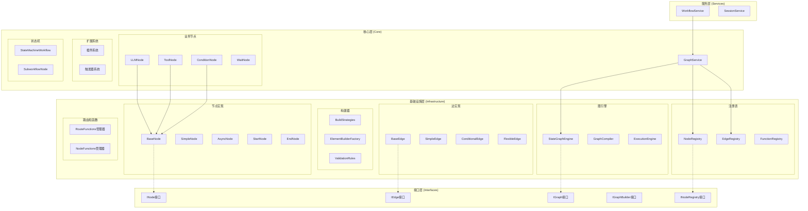

# Core Graph 组件迁移到基础设施层分析报告

## 概述

本文档分析了 `src/core/workflow/graph` 目录中的组件，确定了哪些应该迁移到基础设施层，以实现更清晰的分层架构。

## 当前架构分析

### Core 层图组件结构

```
src/core/workflow/graph/
├── __init__.py
├── decorators.py
├── graph.py              # 图的核心实现
├── service.py            # 图服务（业务逻辑）
├── builder/              # 构建器组件
│   ├── build_strategies.py
│   ├── element_builder_factory.py
│   └── validation_rules.py
├── edges/                # 边实现
│   ├── base.py
│   ├── conditional_edge.py
│   ├── flexible_edge.py
│   └── simple_edge.py
├── extensions/           # 扩展系统
│   ├── plugins/
│   └── triggers/
├── node_functions/       # 节点函数管理
├── nodes/                # 节点实现
│   ├── base.py
│   ├── async_node.py
│   ├── condition_node.py
│   ├── end_node.py
│   ├── llm_node.py
│   ├── simple_node.py
│   ├── start_node.py
│   ├── sync_node.py
│   ├── tool_node.py
│   ├── wait_node.py
│   └── state_machine/
├── registry/             # 注册表
│   ├── edge_registry.py
│   ├── function_registry.py
│   └── node_registry.py
└── route_functions/      # 路由函数
```

### 基础设施层现有图组件

```
src/infrastructure/graph/
├── engine/               # 图引擎
│   ├── state_graph.py
│   ├── compiler.py
│   ├── node_builder.py
│   └── edge_builder.py
├── execution/            # 执行引擎
│   ├── engine.py
│   ├── scheduler.py
│   ├── state_manager.py
│   └── stream_processor.py
├── hooks/                # Hook系统
├── builders/             # 构建器
├── channels/             # 通道
├── conditions/           # 条件评估
├── messaging/            # 消息处理
├── optimization/         # 优化组件
└── types/                # 类型定义
```

## 迁移分析

### 应该迁移到基础设施层的组件

#### 1. 图核心实现
- **文件**: `graph.py`
- **原因**: 包含图的底层实现逻辑，属于基础设施功能
- **目标位置**: `src/infrastructure/graph/core/graph.py`
- **说明**: 与现有的 `StateGraphEngine` 整合，提供统一的图实现

#### 2. 节点基础实现
- **文件**: `nodes/base.py`
- **原因**: 节点的基础抽象实现，属于基础设施层
- **目标位置**: `src/infrastructure/graph/nodes/base.py`
- **依赖**: 只依赖 `src/interfaces.workflow.graph.INode`

#### 3. 边基础实现
- **文件**: `edges/base.py`
- **原因**: 边的基础抽象实现，属于基础设施层
- **目标位置**: `src/infrastructure/graph/edges/base.py`
- **依赖**: 只依赖 `src.interfaces.workflow.graph.IEdge`

#### 4. 简单节点和边实现
- **文件**: 
  - `nodes/simple_node.py`
  - `nodes/async_node.py`
  - `nodes/start_node.py`
  - `nodes/end_node.py`
  - `edges/simple_edge.py`
  - `edges/conditional_edge.py`
  - `edges/flexible_edge.py`
- **原因**: 这些是基础的技术实现，不包含业务逻辑
- **目标位置**: `src/infrastructure/graph/nodes/` 和 `src/infrastructure/graph/edges/`

#### 5. 构建器组件
- **目录**: `builder/`
- **原因**: 构建器是技术组件，属于基础设施层
- **目标位置**: `src/infrastructure/graph/builders/`
- **组件**:
  - `build_strategies.py` → `src/infrastructure/graph/builders/strategies.py`
  - `element_builder_factory.py` → `src/infrastructure/graph/builders/factory.py`
  - `validation_rules.py` → `src/infrastructure/graph/builders/validation.py`

#### 6. 注册表实现
- **目录**: `registry/`
- **原因**: 注册表是技术组件，属于基础设施层
- **目标位置**: `src/infrastructure/graph/registry/`
- **组件**:
  - `node_registry.py` → `src/infrastructure/graph/registry/node_registry.py`
  - `edge_registry.py` → `src/infrastructure/graph/registry/edge_registry.py`
  - `function_registry.py` → `src/infrastructure/graph/registry/function_registry.py`

#### 7. 路由和节点函数
- **目录**: `route_functions/` 和 `node_functions/`
- **原因**: 这些是技术组件，提供基础功能
- **目标位置**: `src/infrastructure/graph/functions/`
- **组件**:
  - `route_functions/` → `src/infrastructure/graph/functions/routing/`
  - `node_functions/` → `src/infrastructure/graph/functions/nodes/`

### 应该保留在核心层的组件

#### 1. 图服务
- **文件**: `service.py`
- **原因**: 包含业务逻辑和协调功能
- **位置**: 保留在 `src/core/workflow/graph/service.py`
- **职责**: 协调各组件，提供高级业务服务

#### 2. 业务节点
- **文件**: 
  - `nodes/llm_node.py`
  - `nodes/tool_node.py`
  - `nodes/condition_node.py`
  - `nodes/wait_node.py`
- **原因**: 包含特定业务逻辑
- **位置**: 保留在 `src/core/workflow/graph/nodes/`
- **依赖**: 继承自基础设施层的基础节点

#### 3. 扩展系统
- **目录**: `extensions/`
- **原因**: 插件和触发器系统是业务扩展机制
- **位置**: 保留在 `src/core/workflow/graph/extensions/`
- **职责**: 提供业务扩展能力

#### 4. 状态机工作流
- **目录**: `nodes/state_machine/`
- **原因**: 状态机是业务逻辑
- **位置**: 保留在 `src/core/workflow/graph/nodes/state_machine/`
- **职责**: 实现状态机工作流

## 迁移策略

### 第一阶段：基础组件迁移

1. **迁移节点和边的基础实现**
   ```bash
   # 创建目标目录
   mkdir -p src/infrastructure/graph/nodes
   mkdir -p src/infrastructure/graph/edges
   
   # 迁移文件
   mv src/core/workflow/graph/nodes/base.py src/infrastructure/graph/nodes/
   mv src/core/workflow/graph/edges/base.py src/infrastructure/graph/edges/
   ```

2. **迁移简单节点和边实现**
   ```bash
   # 迁移简单实现
   mv src/core/workflow/graph/nodes/simple_node.py src/infrastructure/graph/nodes/
   mv src/core/workflow/graph/nodes/async_node.py src/infrastructure/graph/nodes/
   mv src/core/workflow/graph/nodes/start_node.py src/infrastructure/graph/nodes/
   mv src/core/workflow/graph/nodes/end_node.py src/infrastructure/graph/nodes/
   
   mv src/core/workflow/graph/edges/simple_edge.py src/infrastructure/graph/edges/
   mv src/core/workflow/graph/edges/conditional_edge.py src/infrastructure/graph/edges/
   mv src/core/workflow/graph/edges/flexible_edge.py src/infrastructure/graph/edges/
   ```

3. **更新导入语句**
   - 修改核心层组件的导入路径
   - 确保只依赖接口层

### 第二阶段：构建器和注册表迁移

1. **迁移构建器组件**
   ```bash
   mkdir -p src/infrastructure/graph/builders
   mv src/core/workflow/graph/builder/* src/infrastructure/graph/builders/
   ```

2. **迁移注册表组件**
   ```bash
   mkdir -p src/infrastructure/graph/registry
   mv src/core/workflow/graph/registry/* src/infrastructure/graph/registry/
   ```

3. **迁移函数管理组件**
   ```bash
   mkdir -p src/infrastructure/graph/functions/routing
   mkdir -p src/infrastructure/graph/functions/nodes
   mv src/core/workflow/graph/route_functions/* src/infrastructure/graph/functions/routing/
   mv src/core/workflow/graph/node_functions/* src/infrastructure/graph/functions/nodes/
   ```

### 第三阶段：图引擎整合

1. **整合图实现**
   - 将 `graph.py` 的功能与现有的 `StateGraphEngine` 整合
   - 提供统一的图执行接口
   - 保持向后兼容性

2. **更新服务层**
   - 修改 `service.py` 使用整合后的图引擎
   - 确保业务逻辑不受影响

## 迁移后的架构

### 分层架构图



### 目录结构

```
src/
├── interfaces/
│   └── workflow/
│       └── graph.py          # 图相关接口定义
├── infrastructure/
│   └── graph/
│       ├── core/
│       │   └── graph.py      # 图核心实现（迁移自 core）
│       ├── nodes/
│       │   ├── base.py       # 节点基类（迁移自 core）
│       │   ├── simple_node.py
│       │   ├── async_node.py
│       │   ├── start_node.py
│       │   └── end_node.py
│       ├── edges/
│       │   ├── base.py       # 边基类（迁移自 core）
│       │   ├── simple_edge.py
│       │   ├── conditional_edge.py
│       │   └── flexible_edge.py
│       ├── builders/
│       │   ├── strategies.py
│       │   ├── factory.py
│       │   └── validation.py
│       ├── registry/
│       │   ├── node_registry.py
│       │   ├── edge_registry.py
│       │   └── function_registry.py
│       ├── functions/
│       │   ├── routing/
│       │   └── nodes/
│       ├── engine/
│       └── execution/
└── core/
    └── workflow/
        └── graph/
            ├── service.py    # 图服务（保留）
            ├── nodes/
            │   ├── llm_node.py
            │   ├── tool_node.py
            │   ├── condition_node.py
            │   ├── wait_node.py
            │   └── state_machine/
            ├── extensions/
            │   ├── plugins/
            │   └── triggers/
            └── decorators.py
```

## 迁移收益

### 1. 清晰的职责分离
- **基础设施层**：负责底层技术实现
- **核心层**：负责业务逻辑
- **服务层**：提供高级业务服务

### 2. 更好的可测试性
- 基础设施组件可以独立测试
- 业务逻辑与技术实现解耦
- 更容易进行单元测试和集成测试

### 3. 更高的可重用性
- 基础设施组件可以被其他模块重用
- 减少代码重复
- 提高开发效率

### 4. 符合SOLID原则
- **单一职责原则**：每个组件有明确的职责
- **开闭原则**：对扩展开放，对修改关闭
- **依赖倒置原则**：高层模块不依赖低层模块，都依赖抽象

## 风险评估

### 高风险项
1. **图引擎整合**：可能引入复杂性
   - 缓解策略：分阶段整合，保持兼容性

2. **接口变更**：可能影响现有代码
   - 缓解策略：使用适配器模式保持向后兼容

### 中风险项
1. **注册表迁移**：可能影响组件注册
   - 缓解策略：保持接口不变，只迁移实现

2. **构建器迁移**：可能影响图构建流程
   - 缓解策略：提供迁移指南和示例

## 验证清单

- [ ] 所有迁移的组件都有对应的单元测试
- [ ] 接口层定义保持稳定
- [ ] 核心层的业务逻辑不受影响
- [ ] 服务层的功能正常工作
- [ ] 性能测试通过
- [ ] 文档更新完成
- [ ] 代码审查通过
- [ ] 集成测试通过

## 后续优化建议

1. **统一图执行引擎**：整合图实现，提供统一接口
2. **优化注册表机制**：实现更高效的组件注册和查找
3. **增强构建器功能**：提供更灵活的图构建策略
4. **改进扩展系统**：使插件和触发器系统更加模块化

## 结论

通过将 `src/core/workflow/graph` 目录中的基础组件迁移到基础设施层，我们可以实现更清晰的分层架构，提高代码的可维护性、可测试性和可重用性。这种架构符合现代软件设计的最佳实践，为系统的长期发展奠定了良好的基础。