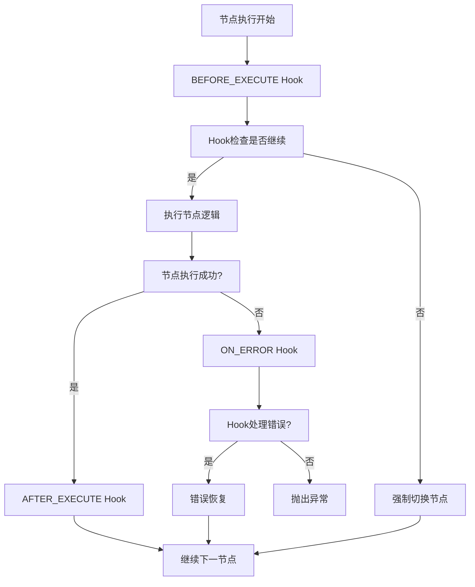
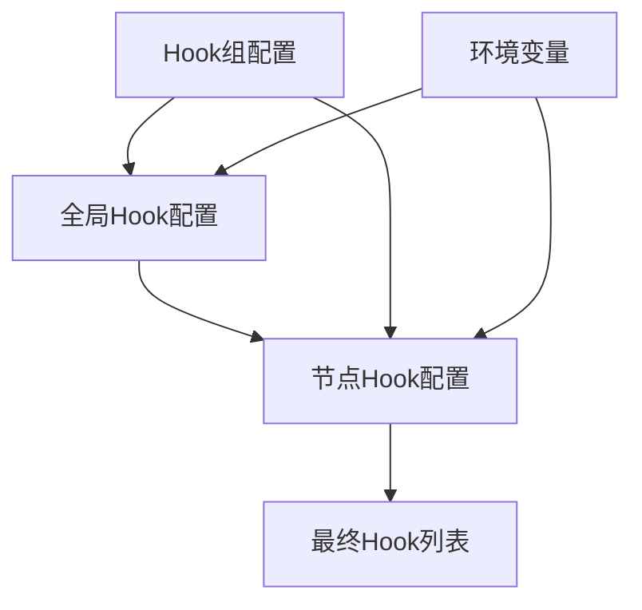

# Graph Hook系统

## 概述

Graph Hook系统是一个为LangGraph节点设计的灵活监控和干预机制。它允许用户通过配置文件为图节点添加各种检查、监控和恢复功能，弥补了LangGraph条件边在节点内部状态监控方面的不足。

## 特性

- 🔧 **配置化**：通过YAML配置文件灵活管理Hook
- 🎯 **细粒度控制**：支持节点级和全局级Hook配置
- 🔄 **生命周期管理**：在节点执行前、执行后、错误时触发Hook
- 📊 **内置Hook**：提供死循环检测、性能监控、错误恢复等常用Hook
- 🔌 **可扩展**：支持自定义Hook实现
- 📈 **性能监控**：内置性能指标收集和分析
- 🛡️ **错误隔离**：Hook错误不影响主流程执行

## 快速开始

### 1. 基本使用

```python
from src.infrastructure.config_loader import YamlConfigLoader
from src.infrastructure.graph.hooks import (
    NodeHookManager, 
    HookAwareGraphBuilder,
    create_hook_aware_builder
)

# 创建配置加载器
config_loader = YamlConfigLoader()

# 创建Hook管理器
hook_manager = NodeHookManager(config_loader)

# 加载Hook配置
hook_manager.load_hooks_from_config()

# 创建Hook感知的Graph构建器
builder = create_hook_aware_builder(
    hook_manager=hook_manager,
    config_loader=config_loader
)

# 构建图
graph = builder.build_from_yaml("configs/graphs/my_workflow.yaml")
```

### 2. 配置Hook

创建 `configs/hooks/global_hooks.yaml`：

```yaml
global_hooks:
  - type: "logging"
    enabled: true
    config:
      log_level: "INFO"
      structured_logging: true
  
  - type: "performance_monitoring"
    enabled: true
    config:
      timeout_threshold: 30.0
      slow_execution_threshold: 10.0
```

创建 `configs/hooks/agent_execution_node_hooks.yaml`：

```yaml
agent_execution_node:
  inherit_global: true
  hooks:
    - type: "dead_loop_detection"
      enabled: true
      config:
        max_iterations: 15
        fallback_node: "agent_dead_loop_handler"
    
    - type: "error_recovery"
      enabled: true
      config:
        max_retries: 2
        fallback_node: "agent_error_handler"
```

## 内置Hook类型

### 🔍 死循环检测 (DeadLoopDetectionHook)

监控节点执行次数，防止无限循环。

**配置参数：**
- `max_iterations`: 最大允许迭代次数
- `fallback_node`: 检测到死循环时的回退节点
- `log_level`: 日志级别
- `check_interval`: 检查间隔
- `reset_on_success`: 成功时是否重置计数

### ⚡ 性能监控 (PerformanceMonitoringHook)

监控节点执行性能，检测超时和慢执行。

**配置参数：**
- `timeout_threshold`: 超时阈值（秒）
- `slow_execution_threshold`: 慢执行阈值（秒）
- `log_slow_executions`: 是否记录慢执行
- `metrics_collection`: 是否收集性能指标
- `enable_profiling`: 是否启用性能分析

### 🔄 错误恢复 (ErrorRecoveryHook)

提供自动重试和错误恢复机制。

**配置参数：**
- `max_retries`: 最大重试次数
- `fallback_node`: 重试失败后的回退节点
- `retry_delay`: 重试延迟（秒）
- `exponential_backoff`: 是否使用指数退避
- `retry_on_exceptions`: 需要重试的异常类型

### 📝 日志记录 (LoggingHook)

记录节点执行的详细日志。

**配置参数：**
- `log_level`: 日志级别
- `structured_logging`: 是否使用结构化日志
- `log_execution_time`: 是否记录执行时间
- `log_state_changes`: 是否记录状态变化
- `log_format`: 日志格式（json/text）

### 📊 指标收集 (MetricsCollectionHook)

收集节点执行的各种指标。

**配置参数：**
- `enable_performance_metrics`: 是否启用性能指标
- `enable_business_metrics`: 是否启用业务指标
- `enable_system_metrics`: 是否启用系统指标
- `metrics_endpoint`: 指标推送端点
- `collection_interval`: 收集间隔

## 自定义Hook

### 创建自定义Hook

```python
from src.infrastructure.graph.hooks.interfaces import INodeHook, HookContext, HookExecutionResult

class CustomValidationHook(INodeHook):
    def __init__(self, hook_config):
        super().__init__(hook_config)
        self.validation_rules = hook_config.get("validation_rules", {})
    
    @property
    def hook_type(self) -> str:
        return "custom_validation"
    
    def before_execute(self, context: HookContext) -> HookExecutionResult:
        # 实现验证逻辑
        required_fields = self.validation_rules.get("required_fields", [])
        
        for field in required_fields:
            if not hasattr(context.state, field) or getattr(context.state, field) is None:
                return HookExecutionResult(
                    should_continue=False,
                    force_next_node="validation_error_handler",
                    metadata={"validation_failed": True, "missing_field": field}
                )
        
        return HookExecutionResult(should_continue=True)
    
    def after_execute(self, context: HookContext) -> HookExecutionResult:
        return HookExecutionResult(should_continue=True)
    
    def on_error(self, context: HookContext) -> HookExecutionResult:
        return HookExecutionResult(should_continue=True)
```

### 注册自定义Hook

```python
# 创建自定义Hook
custom_hook = CustomValidationHook({
    "validation_rules": {
        "required_fields": ["input", "messages"],
        "max_input_length": 1000
    }
})

# 注册到Hook管理器
hook_manager.register_hook(custom_hook, ["analysis_node", "llm_node"])
```

## 架构设计

### Hook执行流程



### 配置继承关系



## 文档结构

```
docs/hooks/
├── README.md                 # 本文档
├── user_guide.md            # 用户指南
├── api_reference.md         # API参考
├── configuration_feasibility_analysis.md  # 配置可行性分析
├── hook_conditional_edge_relationship.md   # Hook与条件边关系
└── implementation_recommendations.md       # 实施建议
```

## 示例项目

查看 `examples/hooks_usage_example.py` 获取完整的使用示例。

## 测试

运行测试：

```bash
# 单元测试
pytest tests/unit/infrastructure/graph/hooks/

# 集成测试
pytest tests/integration/infrastructure/graph/hooks/

# 所有测试
pytest tests/ -k "hooks"
```

## 最佳实践

### 1. Hook配置原则

- **全局Hook**用于通用功能（日志、性能监控）
- **节点特定Hook**用于节点特定逻辑（死循环检测、错误恢复）
- **优先级设置**：关键Hook设置高优先级
- **继承策略**：节点配置优先于全局配置

### 2. 性能考虑

- 避免在Hook中执行耗时操作
- 使用异步Hook处理IO密集型任务
- 合理设置Hook执行超时
- 定期清理Hook收集的指标数据

### 3. 错误处理

- Hook错误不应影响主流程
- 使用错误隔离机制
- 提供降级处理逻辑
- 记录Hook执行错误日志

## 故障排除

### 常见问题

1. **Hook不执行**
   - 检查Hook是否已正确注册
   - 验证Hook配置是否正确
   - 确认Hook是否启用

2. **Hook执行失败**
   - 查看Hook错误日志
   - 验证Hook配置参数
   - 检查Hook依赖的服务

3. **性能问题**
   - 检查Hook执行时间
   - 优化Hook逻辑
   - 调整Hook优先级

### 调试工具

```python
# 获取Hook统计信息
stats = builder.get_hook_statistics()
print(f"Hook统计: {stats}")

# 获取性能统计
perf_stats = hook_manager.get_performance_stats("node_type")
print(f"性能统计: {perf_stats}")

# 获取指标数据
if hasattr(metrics_hook, 'get_metrics'):
    metrics = metrics_hook.get_metrics()
    print(f"指标数据: {metrics}")
```

## 贡献指南

欢迎贡献代码和文档！请遵循以下步骤：

1. Fork 项目
2. 创建功能分支
3. 提交更改
4. 推送到分支
5. 创建 Pull Request

## 许可证

本项目采用 MIT 许可证。

## 更新日志

### v1.0.0 (2024-01-01)

- 🎉 初始版本发布
- ✨ 支持死循环检测、性能监控、错误恢复、日志记录、指标收集
- 🔧 配置化Hook管理
- 📚 完整的文档和示例

---

如有问题或建议，请提交 Issue 或联系开发团队。