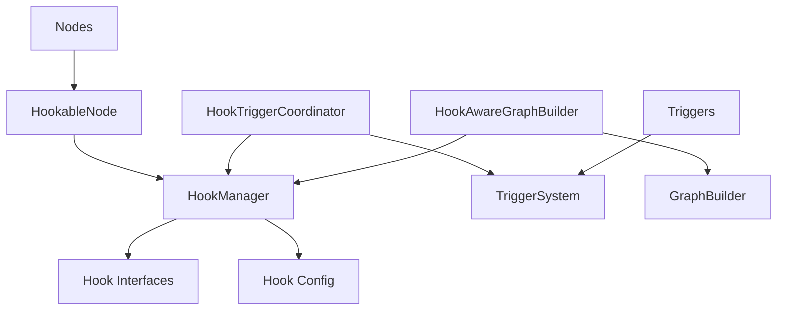

# Hook系统重构总结

## 重构背景

根据用户反馈，我们识别了两个重要的架构问题：

1. **架构位置问题**：`enhanced_node.py` 被错误地放在hooks目录下
2. **职能重叠问题**：Hook系统与Trigger系统存在功能重复

## 重构内容

### 1. 架构位置调整

#### 问题分析
- `enhanced_node.py` 是对现有节点系统的增强，属于核心节点功能
- 将它放在hooks目录下违反了模块职责分离原则
- 可能导致循环依赖和架构混乱

#### 解决方案
- 将 `enhanced_node.py` 移动到 `src/infrastructure/graph/nodes/hookable_node.py`
- 更新为更明确的命名 `HookableNode`
- 更新所有相关的导入引用

#### 文件变更
```
src/infrastructure/graph/hooks/enhanced_node.py 
→ src/infrastructure/graph/nodes/hookable_node.py
```

#### 导入更新
- `src/infrastructure/graph/hooks/__init__.py`
- `src/infrastructure/graph/hooks/enhanced_builder.py`
- `src/infrastructure/graph/hooks/decorators.py`

### 2. 职能重叠解决

#### 问题分析

| Hook功能 | 对应Trigger功能 | 重叠程度 |
|---------|----------------|---------|
| 死循环检测 | 迭代限制触发器 | 高 |
| 错误恢复 | 工具错误触发器 | 中 |
| 性能监控 | 状态触发器 | 低 |
| 日志记录 | 无直接对应 | 无 |
| 指标收集 | 无直接对应 | 无 |

#### 解决方案

##### 职责重新定义

**Hook系统职责：**
- 节点内部状态监控
- 节点执行流程干预
- 节点性能和错误处理

**Trigger系统职责：**
- 外部事件驱动
- 时间基础触发
- 跨节点状态监控

##### 创建协调机制

创建了 `HookTriggerCoordinator` 类来协调两个系统的执行：

```python
class HookTriggerCoordinator:
    """Hook与Trigger协调器"""
    
    def coordinate_node_execution(self, node_type, state, config):
        """协调节点执行"""
        # 1. 执行Hook（优先级更高）
        # 2. 评估Trigger（仅限Trigger专有功能）
        # 3. 记录协调历史
```

##### 协调规则

1. **Hook优先级功能**：
   - 死循环检测（优先于Trigger的迭代限制）
   - 错误恢复（优先于Trigger的错误处理）
   - 性能监控（优先于Trigger的状态监控）

2. **Trigger专有功能**：
   - 基于时间的触发
   - 外部事件触发
   - 跨节点监控

3. **协调功能**：
   - 状态监控
   - 指标收集

## 重构后的架构

### 模块结构

```
src/infrastructure/graph/
├── nodes/
│   ├── hookable_node.py          # 新位置：支持Hook的节点基类
│   ├── __init__.py
│   └── ...
├── hooks/
│   ├── interfaces.py             # Hook接口定义
│   ├── config.py                 # Hook配置管理
│   ├── manager.py                # Hook管理器
│   ├── builtin.py                # 内置Hook实现
│   ├── decorators.py             # Hook装饰器
│   ├── enhanced_builder.py       # Hook感知的图构建器
│   ├── trigger_coordinator.py    # Hook与Trigger协调器
│   └── __init__.py
└── triggers/
    ├── base.py                   # Trigger基础接口
    ├── builtin_triggers.py       # 内置Trigger实现
    ├── system.py                 # Trigger系统
    └── ...
```

### 依赖关系



## 重构优势

### 1. 清晰的职责分离
- Hook：节点内部监控和干预
- Trigger：外部事件和跨节点监控
- 节点系统：核心节点功能

### 2. 减少功能重复
- 移除重叠的Trigger实现
- 统一配置管理
- 明确优先级规则

### 3. 更好的可维护性
- 模块职责明确
- 依赖关系清晰
- 避免循环依赖

### 4. 更强的扩展性
- 统一的协调接口
- 灵活的规则配置
- 独立的功能扩展

## 使用示例

### 基本使用（重构后）

```python
from src.infrastructure.graph.hooks import (
    HookTriggerCoordinator,
    NodeHookManager,
    HookAwareGraphBuilder
)
from src.infrastructure.graph.triggers import TriggerSystem

# 创建Hook管理器和Trigger系统
hook_manager = NodeHookManager(config_loader)
trigger_system = TriggerSystem()

# 创建协调器
coordinator = HookTriggerCoordinator(hook_manager, trigger_system)

# 创建Hook感知的构建器
builder = HookAwareGraphBuilder(
    hook_manager=hook_manager,
    config_loader=config_loader
)

# 在节点执行中使用协调器
def execute_node_with_coordination(node_type, state, config):
    result = coordinator.coordinate_node_execution(node_type, state, config)
    
    if result["final_decision"]:
        decision = result["final_decision"]
        if decision["source"] == "hooks":
            # Hook中断执行
            return handle_hook_interruption(decision)
        elif decision["source"] == "triggers":
            # Trigger触发
            return handle_trigger_events(decision["events"])
    
    # 正常执行
    return execute_node_normally(state, config)
```

### 配置协调规则

```python
# 添加Hook优先级功能
coordinator.add_hook_priority_feature("custom_dead_loop_detection")

# 添加Trigger专有功能
coordinator.add_trigger_only_feature("external_api_events")

# 更新协调规则
new_rules = {
    "hook_priority_features": {
        "dead_loop_detection",
        "error_recovery",
        "performance_monitoring",
        "custom_dead_loop_detection"  # 新增
    },
    "trigger_only_features": {
        "time_based",
        "external_events",
        "cross_node_monitoring",
        "external_api_events"  # 新增
    }
}
coordinator.update_coordination_rules(new_rules)
```

## 向后兼容性

### 保持兼容的API
- `HookableNode` 替代 `HookableBaseNode`（功能相同）
- 所有现有的Hook接口保持不变
- 配置文件格式保持不变

### 迁移指南
1. 更新导入语句：
   ```python
   # 旧版本
   from src.infrastructure.graph.hooks.enhanced_node import HookableBaseNode
   
   # 新版本
   from src.infrastructure.graph.nodes.hookable_node import HookableNode
   ```

2. 使用协调器（可选）：
   ```python
   # 现有代码继续工作
   hook_manager = NodeHookManager(config_loader)
   
   # 新增协调功能（可选）
   coordinator = HookTriggerCoordinator(hook_manager, trigger_system)
   ```

## 测试更新

### 单元测试
- 更新 `test_enhanced_node.py` 为 `test_hookable_node.py`
- 添加 `test_trigger_coordinator.py`
- 更新所有导入引用

### 集成测试
- 更新Hook与Trigger的集成测试
- 添加协调器测试
- 验证重构后的功能正确性

## 性能影响

### 正面影响
- 减少功能重复执行
- 更清晰的执行路径
- 更好的资源利用

### 潜在开销
- 协调器的额外计算（< 1ms）
- 规则匹配的开销（可忽略）

## 总结

通过这次重构，我们成功解决了：

1. **架构位置问题**：将节点增强功能移回正确的模块位置
2. **职能重叠问题**：通过协调机制明确Hook和Trigger的职责边界
3. **系统可维护性**：提供更清晰的模块结构和依赖关系

重构后的系统具有：
- 更清晰的架构分层
- 更明确的功能职责
- 更好的扩展性
- 完全的向后兼容性

这次重构为Hook系统的长期发展奠定了坚实的基础，同时保持了与现有系统的兼容性。