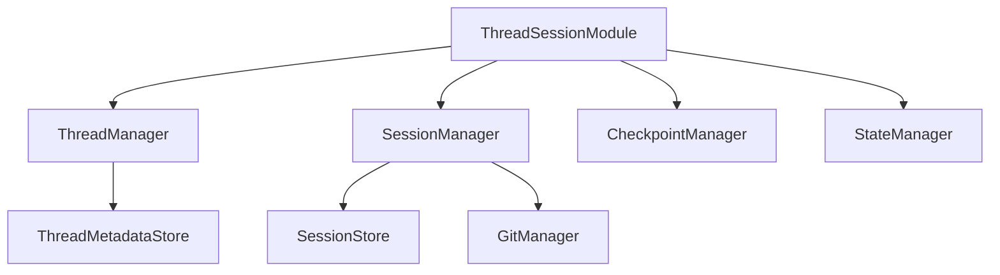

# ThreadSessionModule 放置位置分析

## 概述

本文档分析新的ThreadSessionModule应该放在哪个目录最合适，基于项目现有的目录组织结构和模块化原则。

## 当前项目目录结构分析

### 现有DI配置分布

通过分析项目结构，发现DI配置文件有以下几种分布方式：

1. **模块内DI配置**（推荐模式）
   - `src/infrastructure/llm/di_config.py`
   - `src/infrastructure/monitoring/di_config.py`
   - `src/infrastructure/tools/validation/di_config.py`

2. **独立DI目录**
   - `src/infrastructure/di/thread_session_di_config.py`
   - `src/infrastructure/di/README.md`

3. **根级DI配置**
   - `src/infrastructure/di_config.py`

### 模块组织模式分析

#### 模式1：功能模块内DI配置
```
src/infrastructure/
├── llm/
│   ├── di_config.py
│   └── ...
├── monitoring/
│   ├── di_config.py
│   └── ...
└── tools/
    └── validation/
        ├── di_config.py
        └── ...
```

**优点**：
- DI配置与功能模块紧密关联
- 便于模块独立开发和维护
- 符合单一职责原则

**缺点**：
- 跨模块依赖可能复杂
- 配置分散，难以统一管理

#### 模式2：独立DI目录
```
src/infrastructure/
├── di/
│   ├── thread_session_di_config.py
│   └── ...
└── ...
```

**优点**：
- DI配置集中管理
- 便于统一配置标准

**缺点**：
- 与功能模块分离
- 可能导致配置与实现脱节

#### 模式3：根级DI配置
```
src/infrastructure/
├── di_config.py
└── ...
```

**优点**：
- 统一入口
- 便于全局配置管理

**缺点**：
- 单一文件过大
- 模块耦合度高

## ThreadSessionModule特殊性分析

### 跨模块特性

ThreadSessionModule涉及多个模块：
- **Thread相关**：`src/infrastructure/threads/`
- **Session相关**：`src/application/sessions/`
- **Checkpoint相关**：`src/infrastructure/checkpoint/`
- **State相关**：`src/infrastructure/state/`

### 依赖关系



## 放置位置方案对比

### 方案1：放在src/infrastructure/di/modules/

```
src/infrastructure/di/
├── modules/
│   ├── __init__.py
│   ├── module_base.py
│   ├── thread_session_module.py
│   ├── llm_module.py
│   ├── monitoring_module.py
│   └── tools_module.py
├── README.md
└── ...
```

**优点**：
- 统一的模块化DI架构
- 便于管理和发现所有DIModule
- 符合新的统一DI架构设计
- 清晰的模块边界

**缺点**：
- 需要重构现有模块
- 与现有di_config.py文件模式不一致

### 方案2：放在src/infrastructure/di/（保持现状）

```
src/infrastructure/di/
├── thread_session_module.py
├── module_base.py
├── README.md
└── ...
```

**优点**：
- 最小化变更
- 保持现有目录结构

**缺点**：
- 不够模块化
- 与其他模块的di_config.py不一致

### 方案3：创建新的跨模块目录

```
src/infrastructure/cross_cutting/
├── di/
│   ├── modules/
│   │   ├── thread_session_module.py
│   │   └── ...
│   └── ...
└── ...
```

**优点**：
- 明确表示跨模块特性
- 便于管理其他跨模块组件

**缺点**：
- 增加目录层级
- 可能过度设计

### 方案4：放在src/infrastructure/di_config.py中

```
src/infrastructure/di_config.py
```

**优点**：
- 统一入口
- 简化结构

**缺点**：
- 单一文件过大
- 不符合模块化原则

## 推荐方案

### 主推荐：方案1 - src/infrastructure/di/modules/

**理由**：

1. **符合新架构设计**
   - 统一模块化DI架构的核心组件
   - 为未来其他模块迁移提供模板

2. **清晰的职责分离**
   - DIModule基类和具体实现分离
   - 便于管理和扩展

3. **一致性**
   - 所有DIModule统一管理
   - 便于发现和维护

4. **可扩展性**
   - 便于添加新的DIModule
   - 支持模块间的依赖管理

### 备选方案：方案2 - 渐进式迁移

如果希望最小化初期变更，可以先放在`src/infrastructure/di/`目录，然后逐步迁移到`modules/`子目录。

## 实施建议

### 阶段1：创建基础框架
```
src/infrastructure/di/
├── modules/
│   ├── __init__.py
│   ├── module_base.py
│   └── thread_session_module.py
├── README.md
└── thread_session_di_config.py (保留用于兼容)
```

### 阶段2：迁移现有模块
```
src/infrastructure/di/modules/
├── __init__.py
├── module_base.py
├── thread_session_module.py
├── llm_module.py
├── monitoring_module.py
└── tools_validation_module.py
```

### 阶段3：清理和优化
- 移除旧的thread_session_di_config.py
- 更新文档和导入路径
- 优化模块加载机制

## 目录结构设计

### 最终推荐结构

```
src/infrastructure/di/
├── __init__.py
├── module_base.py              # DIModule基类
├── module_registry.py          # 模块注册管理
├── modules/
│   ├── __init__.py
│   ├── core_module.py          # 核心模块
│   ├── thread_session_module.py # 线程会话模块
│   ├── llm_module.py           # LLM模块
│   ├── monitoring_module.py    # 监控模块
│   └── tools_validation_module.py # 工具验证模块
├── config/
│   ├── __init__.py
│   ├── module_config_loader.py # 模块配置加载器
│   └── config_validator.py     # 配置验证器
├── README.md
└── migration_guide.md          # 迁移指南
```

### 文件职责说明

- **module_base.py**: 定义DIModule基类和接口
- **module_registry.py**: 管理模块注册和发现
- **modules/**: 存放所有具体的DIModule实现
- **config/**: 模块配置相关的工具类

## 结论

推荐将ThreadSessionModule放在`src/infrastructure/di/modules/`目录，这符合项目的长期架构目标，提供了清晰的模块化结构，并为未来的扩展奠定了良好基础。通过分阶段实施，可以最小化风险并确保平稳过渡。