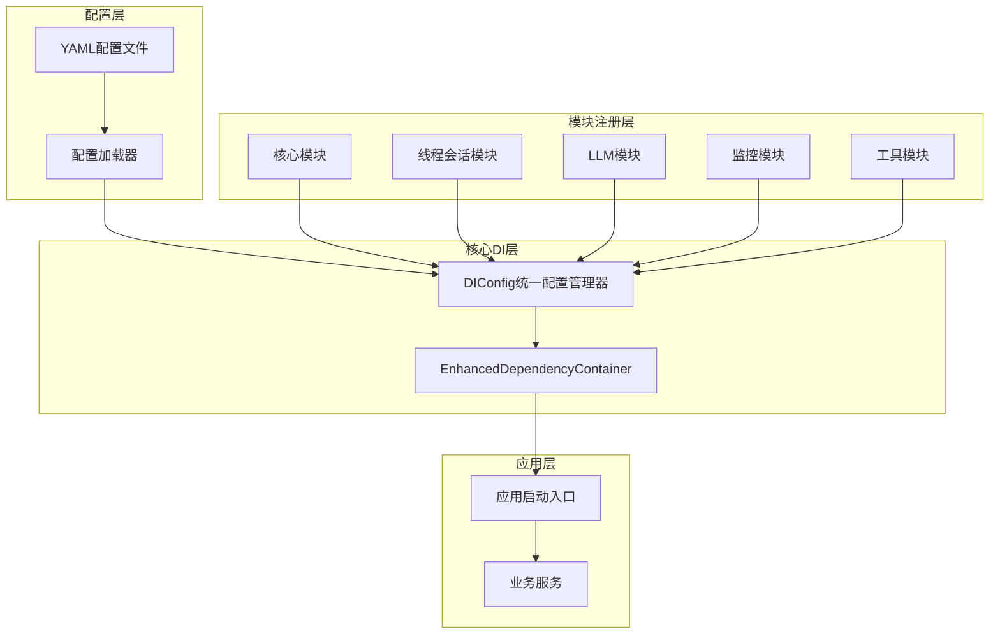

# 统一模块化DI架构改进方案

## 概述

本文档提出针对项目DI系统的统一模块化架构改进方案，解决当前DI系统架构不一致、配置分散、维护成本高等问题。

## 当前DI系统架构分析

### 现有组件

1. **核心容器层**
   - `IDependencyContainer` - DI容器接口
   - `BaseDependencyContainer` - 基础实现
   - `EnhancedDependencyContainer` - 增强实现

2. **配置管理层**
   - `DIConfig` - 统一DI配置管理
   - `ComponentAssembler` - 组件组装器
   - `ThreadSessionDIConfig` - 线程会话配置（独立实现）

3. **模块注册层**
   - `MonitoringModule` - 监控模块
   - `LLMModule` - LLM模块
   - `ToolValidationModule` - 工具验证模块

### 架构问题

1. **配置方式不统一**
   - 多种配置方式并存，增加学习成本
   - 缺乏统一的配置标准

2. **功能重复**
   - `DIConfig`、`ComponentAssembler`、`ThreadSessionDIConfig`功能重叠
   - 重复的组件创建逻辑

3. **一致性问题**
   - `thread_session_di_config.py`独立于主DI系统
   - 全局状态管理不一致

## 推荐架构：统一模块化DI架构

### 设计原则

1. **单一配置入口**：统一使用`DIConfig`作为唯一配置入口
2. **模块化注册**：每个模块负责自己的服务注册
3. **配置驱动**：所有配置通过YAML文件驱动，支持环境变量注入
4. **生命周期统一**：所有服务通过容器管理生命周期

### 架构图



### 核心组件设计

#### 1. DIModule基类

```python
# src/infrastructure/di/module_base.py
from abc import ABC, abstractmethod
from typing import Dict, Any
from ..container_interfaces import IDependencyContainer

class DIModule(ABC):
    """DI模块基类"""
    
    def __init__(self, config: Dict[str, Any]):
        self.config = config
    
    @abstractmethod
    def register_services(self, container: IDependencyContainer) -> None:
        """注册模块服务"""
        pass
    
    def is_enabled(self) -> bool:
        """检查模块是否启用"""
        return self.config.get("enabled", True)
    
    def get_module_name(self) -> str:
        """获取模块名称"""
        return self.__class__.__name__.replace("Module", "").lower()
```

#### 2. 统一配置管理器

```python
# src/infrastructure/di_config.py (重构后)
class DIConfig:
    """统一的DI配置管理器"""
    
    def __init__(self, container: Optional[IDependencyContainer] = None):
        self.container = container or EnhancedDependencyContainer()
        self._modules: Dict[str, DIModule] = {}
        self._config_loader: Optional[IConfigLoader] = None
    
    def configure_from_yaml(self, config_path: str, environment: str = "default") -> IDependencyContainer:
        """从YAML配置文件配置DI容器"""
        # 加载配置
        self._config_loader = FileConfigLoader(config_path)
        modules_config = self._config_loader.load("di/modules.yaml")
        env_config = self._config_loader.load(f"di/environments/{environment}.yaml")
        
        # 合并配置
        merged_config = self._merge_configs(modules_config, env_config)
        
        # 注册模块
        self._register_modules(merged_config)
        
        return self.container
    
    def _register_modules(self, config: Dict[str, Any]) -> None:
        """注册所有启用的模块"""
        for module_name, module_config in config.get("modules", {}).items():
            if not module_config.get("enabled", True):
                continue
                
            module_class = self._get_module_class(module_name)
            if module_class:
                module = module_class(module_config)
                module.register_services(self.container)
                self._modules[module_name] = module
```

#### 3. ThreadSessionModule

```python
# src/infrastructure/di/modules/thread_session_module.py
from ..module_base import DIModule
from ...domain.threads.manager import ThreadManager
from ...application.sessions.manager import SessionManager

class ThreadSessionModule(DIModule):
    """线程会话模块"""
    
    def register_services(self, container: IDependencyContainer) -> None:
        """注册线程会话相关服务"""
        if not self.is_enabled():
            return
            
        # 注册Thread元数据存储
        storage_type = self.config.get("storage_type", "file")
        if storage_type == "memory":
            container.register(IThreadMetadataStore, MemoryThreadMetadataStore)
        else:
            storage_path = Path(self.config.get("storage_path", "./storage"))
            container.register_instance(
                IThreadMetadataStore,
                FileThreadMetadataStore(storage_path / "threads")
            )
        
        # 注册Thread管理器
        container.register(IThreadManager, ThreadManager, lifetime=ServiceLifetime.SINGLETON)
        
        # 注册Session管理器
        container.register(ISessionManager, SessionManager, lifetime=ServiceLifetime.SINGLETON)
```

### 配置文件设计

#### 模块配置

```yaml
# configs/di/modules.yaml
modules:
  core:
    enabled: true
    services:
      - name: config_loader
        interface: IConfigLoader
        implementation: FileConfigLoader
        lifetime: singleton
  
  thread_session:
    enabled: true
    storage_path: "${STORAGE_PATH:./storage}"
    storage_type: "file"  # file or memory
    use_git: true
    use_mock_git: false
    services:
      - name: thread_manager
        interface: IThreadManager
        implementation: ThreadManager
        lifetime: singleton
      - name: session_manager
        interface: ISessionManager
        implementation: SessionManager
        lifetime: singleton
  
  llm:
    enabled: true
    default_provider: "openai"
    services:
      - name: llm_factory
        interface: ILLMFactory
        implementation: LLMFactory
        lifetime: singleton
```

#### 环境配置

```yaml
# configs/di/environments/development.yaml
thread_session:
  use_memory_storage: false
  use_git: true
  use_mock_git: false

# configs/di/environments/testing.yaml
thread_session:
  use_memory_storage: true
  use_git: false
  use_mock_git: true

# configs/di/environments/production.yaml
thread_session:
  use_memory_storage: false
  use_git: true
  use_mock_git: false
  storage_path: "${STORAGE_PATH:/data/storage}"
```

## 实施计划

### 阶段一：基础重构（1-2周）

1. **创建模块化DI基础框架**
   - 创建`DIModule`基类和接口
   - 重构`DIConfig`以支持模块化注册
   - 创建配置文件模板

2. **重构thread_session_di_config.py**
   - 将`ThreadSessionDIConfig`转换为`ThreadSessionModule`
   - 移除工厂模式和全局状态
   - 实现标准模块接口

### 阶段二：模块迁移（2-3周）

1. **迁移现有模块**
   - 重构LLM模块为标准DIModule
   - 重构监控模块为标准DIModule
   - 重构工具验证模块为标准DIModule

2. **统一配置文件**
   - 创建统一的模块配置文件结构
   - 迁移现有配置到新格式
   - 实现环境特定配置支持

### 阶段三：整合优化（1-2周）

1. **整合ComponentAssembler**
   - 将组装器功能整合到DIConfig中
   - 移除重复的配置逻辑

2. **优化和测试**
   - 性能优化
   - 全面测试
   - 文档更新

## 预期收益

1. **降低复杂度**
   - 统一的配置方式减少学习成本
   - 清晰的模块边界和职责

2. **提高可维护性**
   - 模块化设计便于维护和扩展
   - 统一的代码风格和架构

3. **增强一致性**
   - 统一的架构和配置标准
   - 一致的生命周期管理

4. **改善测试性**
   - 标准化的模块接口便于单元测试
   - 更好的依赖隔离

## 风险评估与缓解

### 风险

1. **兼容性风险**
   - 现有代码可能依赖旧的配置方式
   - API变更可能影响现有功能

2. **迁移复杂性**
   - 需要迁移多个模块
   - 配置文件格式变更

3. **性能影响**
   - 新架构可能影响启动性能
   - 配置加载时间增加

### 缓解措施

1. **向后兼容**
   - 保留旧API的适配器
   - 逐步迁移，不破坏现有功能

2. **分阶段实施**
   - 按模块逐步迁移
   - 充分测试每个阶段

3. **性能优化**
   - 实施性能基准测试
   - 优化配置加载过程

## 结论

统一模块化DI架构将显著改善项目的DI系统，提供更好的可维护性、一致性和扩展性。通过分阶段实施，可以最小化风险并确保平稳过渡。