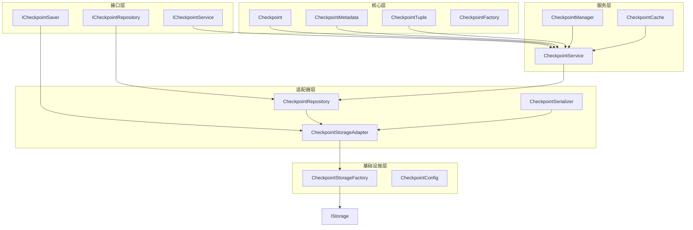

现在让我提出重构建议和架构改进方案：

## 重构建议和架构改进方案

### 1. 整体重构架构



### 2. 分层重构方案

#### A. 接口层重构

**新增文件**:
- `src/interfaces/checkpoint/service.py` - 定义检查点服务接口
- `src/interfaces/checkpoint/repository.py` - 定义检查点仓库接口
- `src/interfaces/checkpoint/saver.py` - 定义检查点保存器接口

**接口定义示例**:
```python
# src/interfaces/checkpoint/service.py
from abc import ABC, abstractmethod
from typing import Optional, List, Dict, Any
from src.core.checkpoint.models import Checkpoint, CheckpointMetadata

class ICheckpointService(ABC):
    @abstractmethod
    async def save_checkpoint(self, checkpoint: Checkpoint, metadata: CheckpointMetadata) -> str:
        pass
    
    @abstractmethod
    async def load_checkpoint(self, checkpoint_id: str) -> Optional[Checkpoint]:
        pass
    
    @abstractmethod
    async def list_checkpoints(self, filters: Dict[str, Any]) -> List[Checkpoint]:
        pass
```

#### B. 核心层重构

**新增文件**:
- `src/core/checkpoint/models.py` - 检查点数据模型
- `src/core/checkpoint/factory.py` - 检查点工厂
- `src/core/checkpoint/validators.py` - 检查点验证器

**数据模型示例**:
```python
# src/core/checkpoint/models.py
from typing import Optional, Dict, Any
from datetime import datetime

class Checkpoint:
    def __init__(self, id: str, channel_values: Dict[str, Any], 
                 channel_versions: Dict[str, Any], versions_seen: Dict[str, Any]):
        self.id = id
        self.channel_values = channel_values
        self.channel_versions = channel_versions
        self.versions_seen = versions_seen
        self.ts = datetime.now().isoformat()
```

#### C. 服务层重构

**新增文件**:
- `src/services/checkpoint/service.py` - 检查点服务实现
- `src/services/checkpoint/manager.py` - 检查点管理器
- `src/services/checkpoint/cache.py` - 检查点缓存

**服务实现示例**:
```python
# src/services/checkpoint/service.py
from src.interfaces.checkpoint.service import ICheckpointService
from src.interfaces.checkpoint.repository import ICheckpointRepository
from src.core.checkpoint.models import Checkpoint, CheckpointMetadata
from src.services.checkpoint.cache import CheckpointCache

class CheckpointService(ICheckpointService):
    def __init__(self, repository: ICheckpointRepository, cache: CheckpointCache):
        self.repository = repository
        self.cache = cache
    
    async def save_checkpoint(self, checkpoint: Checkpoint, metadata: CheckpointMetadata) -> str:
        # 业务逻辑实现
        checkpoint_id = await self.repository.save(checkpoint, metadata)
        await self.cache.set(checkpoint_id, checkpoint)
        return checkpoint_id
```

#### D. 适配器层重构

**新增文件**:
- `src/adapters/storage/checkpoint_repository.py` - 检查点仓库实现
- `src/adapters/storage/checkpoint_adapter.py` - 检查点存储适配器
- `src/adapters/storage/checkpoint_serializer.py` - 检查点序列化器

**仓库实现示例**:
```python
# src/adapters/storage/checkpoint_repository.py
from src.interfaces.checkpoint.repository import ICheckpointRepository
from src.interfaces.storage.base import IStorage
from src.core.checkpoint.models import Checkpoint, CheckpointMetadata
from src.adapters.storage.checkpoint_serializer import CheckpointSerializer

class CheckpointRepository(ICheckpointRepository):
    def __init__(self, storage: IStorage, serializer: CheckpointSerializer):
        self.storage = storage
        self.serializer = serializer
    
    async def save(self, checkpoint: Checkpoint, metadata: CheckpointMetadata) -> str:
        data = self.serializer.serialize(checkpoint, metadata)
        return await self.storage.save(data)
```

#### E. 基础设施层重构

**保留文件**:
- `src/infrastructure/graph/checkpoint/storage_factory.py` - 检查点存储工厂
- `src/infrastructure/graph/checkpoint/config.py` - 检查点配置

**存储工厂示例**:
```python
# src/infrastructure/graph/checkpoint/storage_factory.py
from src.interfaces.storage.base import IStorageFactory
from src.adapters.storage.checkpoint_adapter import CheckpointStorageAdapter

class CheckpointStorageFactory:
    def __init__(self, storage_factory: IStorageFactory):
        self.storage_factory = storage_factory
    
    def create_adapter(self, storage_type: str, config: Dict[str, Any]) -> CheckpointStorageAdapter:
        storage = self.storage_factory.create_storage(storage_type, config)
        return CheckpointStorageAdapter(storage)
```

### 3. 存储集成改进

#### A. 统一存储接口使用
- 所有检查点存储操作通过 `IStorage` 接口
- 利用存储模块的高级功能（缓存、事务、监控）
- 支持多种存储后端（SQLite、PostgreSQL、Redis等）

#### B. 配置驱动
- 通过配置文件选择存储类型
- 支持存储参数动态配置
- 支持存储热切换

#### C. 性能优化
- 利用存储模块的缓存机制
- 支持批量操作
- 支持异步操作

### 4. 迁移策略

#### A. 渐进式迁移
1. 先创建新的接口和核心模型
2. 实现新的服务层
3. 创建适配器层
4. 逐步迁移现有代码
5. 最后清理旧代码

#### B. 兼容性保证
- 保持现有API的兼容性
- 提供适配器模式过渡
- 逐步废弃旧接口
