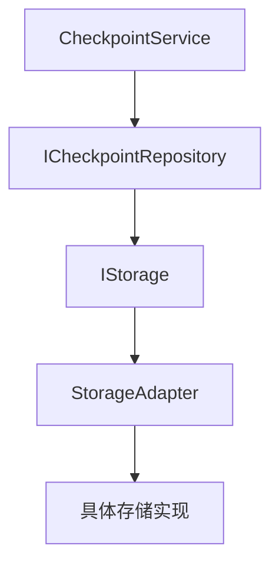

现在让我分析checkpoint与存储模块的集成方式：

## Checkpoint与存储模块的集成分析

### 1. 当前集成方式的问题

#### A. 直接存储实现
- **问题**: checkpoint模块直接实现了存储逻辑，而不是使用统一的存储接口
- **具体表现**:
  - [`MemoryCheckpointSaver`](src/infrastructure/graph/checkpoint/memory.py:20) 直接使用内存存储
  - [`SqliteCheckpointSaver`](src/infrastructure/graph/checkpoint/sqlite.py:22) 直接使用SQLite
  - 没有利用 [`IStorage`](src/interfaces/storage/base.py:12) 接口

#### B. 功能重复
- **问题**: checkpoint存储实现与 [`BaseStorage`](src/infrastructure/storage/base_storage.py:14) 功能重复
- **重复功能**:
  - 数据序列化/反序列化
  - 缓存管理
  - 元数据处理
  - 事务支持

#### C. 缺乏统一性
- **问题**: checkpoint存储没有遵循统一的存储模式
- **缺失功能**:
  - 统一的错误处理
  - 统一的健康检查
  - 统一的性能监控
  - 统一的生命周期管理

### 2. 理想的集成方式

#### A. 基于接口的集成

#### B. 分层集成架构
1. **接口层**: 定义检查点存储接口
2. **核心层**: 实现检查点数据模型
3. **服务层**: 实现检查点业务逻辑
4. **适配器层**: 实现检查点到存储的适配
5. **基础设施层**: 提供具体存储实现

### 3. 集成改进方案

#### A. 检查点存储适配器
- **位置**: `src/adapters/storage/checkpoint_adapter.py`
- **功能**: 将检查点操作适配到统一存储接口
- **实现**: 
  - 实现检查点特定的数据转换
  - 处理检查点特定的查询逻辑
  - 利用存储模块的高级功能

#### B. 检查点存储仓库
- **位置**: `src/adapters/storage/checkpoint_repository.py`
- **功能**: 提供检查点特定的存储操作
- **实现**:
  - 封装存储接口
  - 提供检查点特定的查询方法
  - 处理检查点特定的数据结构

#### C. 存储配置集成
- **位置**: `configs/storage/checkpoint_storage.yaml`
- **功能**: 配置检查点存储参数
- **内容**:
  - 存储类型选择
  - 性能参数配置
  - 缓存策略配置
  - 备份策略配置

### 4. 集成优势

#### A. 统一性
- 使用统一的存储接口
- 统一的错误处理和监控
- 统一的性能优化

#### B. 可扩展性
- 可以轻松切换存储后端
- 支持多种存储类型
- 支持存储插件

#### C. 可维护性
- 减少代码重复
- 集中存储逻辑
- 简化测试和调试
