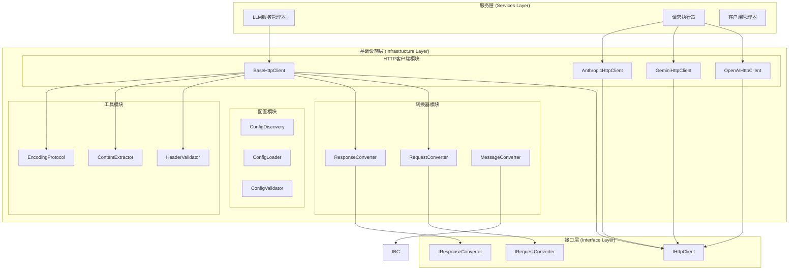

# HTTP客户端基础设施架构设计

## 1. 架构概述

基于对现有代码和需求的分析，设计一个统一的HTTP客户端基础设施层，用于替代LangChain依赖，支持OpenAI、Gemini、Anthropic等主要LLM提供商。

### 1.1 设计目标

1. **统一接口**：提供统一的HTTP客户端接口，屏蔽不同提供商的差异
2. **高性能**：支持连接池、异步请求、重试机制
3. **可扩展**：易于添加新的LLM提供商
4. **类型安全**：完整的类型注解和验证
5. **监控友好**：内置日志、指标和错误追踪

### 1.2 核心原则

- **单一职责**：每个组件专注于特定功能
- **依赖倒置**：依赖抽象而非具体实现
- **开闭原则**：对扩展开放，对修改封闭
- **接口隔离**：提供细粒度的接口定义

## 2. 架构设计

### 2.1 整体架构图



### 2.2 模块职责

#### 2.2.1 HTTP客户端模块

**BaseHttpClient**
- 提供HTTP通信的基础功能
- 管理连接池和会话
- 实现重试和超时机制
- 提供统一的错误处理

**提供商特定客户端**
- OpenAIHttpClient：实现OpenAI API通信
- GeminiHttpClient：实现Google Gemini API通信
- AnthropicHttpClient：实现Anthropic Claude API通信

#### 2.2.2 转换器模块

**RequestConverter**
- 将统一请求格式转换为提供商特定格式
- 处理参数映射和验证
- 支持不同API版本（如OpenAI Chat Completions vs Responses）

**ResponseConverter**
- 将提供商响应转换为统一格式
- 处理错误响应和异常情况
- 提取token使用情况等元数据

**MessageConverter**
- 在不同消息格式间转换
- 处理多模态内容（文本、图像、音频）
- 支持工具调用消息

#### 2.2.3 配置模块

**ConfigDiscovery**
- 自动发现配置文件
- 支持多环境配置
- 处理配置继承和覆盖

**ConfigLoader**
- 加载和解析配置文件
- 支持YAML、JSON等格式
- 处理环境变量注入

**ConfigValidator**
- 验证配置完整性和正确性
- 提供详细的错误信息
- 支持配置模板和示例

#### 2.2.4 工具模块

**HeaderValidator**
- 验证HTTP头部格式
- 处理认证头部
- 支持不同提供商的头部要求

**ContentExtractor**
- 从响应中提取内容
- 处理流式响应
- 支持多模态内容解析

**EncodingProtocol**
- 处理内容编码
- 支持压缩和加密
- 管理字符集转换

## 3. 接口设计

### 3.1 核心接口定义

```python
# src/interfaces/llm/http_client.py
from abc import ABC, abstractmethod
from typing import Dict, Any, Optional, AsyncGenerator, Union
from httpx import Response

class IHttpClient(ABC):
    """HTTP客户端接口"""
    
    @abstractmethod
    async def post(
        self,
        endpoint: str,
        data: Dict[str, Any],
        headers: Optional[Dict[str, str]] = None,
        timeout: Optional[float] = None
    ) -> Response:
        """发送POST请求"""
        pass
    
    @abstractmethod
    async def stream_post(
        self,
        endpoint: str,
        data: Dict[str, Any],
        headers: Optional[Dict[str, str]] = None,
        timeout: Optional[float] = None
    ) -> AsyncGenerator[str, None]:
        """发送流式POST请求"""
        pass
    
    @abstractmethod
    def set_auth_header(self, token: str) -> None:
        """设置认证头部"""
        pass
    
    @abstractmethod
    def set_base_url(self, url: str) -> None:
        """设置基础URL"""
        pass

class IRequestConverter(ABC):
    """请求转换器接口"""
    
    @abstractmethod
    def convert_request(
        self,
        messages: List[IBaseMessage],
        parameters: Dict[str, Any],
        model: str
    ) -> Dict[str, Any]:
        """转换请求格式"""
        pass

class IResponseConverter(ABC):
    """响应转换器接口"""
    
    @abstractmethod
    def convert_response(self, response: Response) -> LLMResponse:
        """转换响应格式"""
        pass
```

### 3.2 基础HTTP客户端实现

```python
# src/infrastructure/llm/http_client/base_http_client.py
import httpx
from typing import Dict, Any, Optional, AsyncGenerator
from src.interfaces.llm.http_client import IHttpClient
from src.services.logger import get_logger

class BaseHttpClient(IHttpClient):
    """基础HTTP客户端实现"""
    
    def __init__(
        self,
        base_url: str,
        default_headers: Optional[Dict[str, str]] = None,
        timeout: float = 30.0,
        max_retries: int = 3,
        pool_connections: int = 10
    ):
        self.base_url = base_url.rstrip('/')
        self.default_headers = default_headers or {}
        self.timeout = timeout
        self.max_retries = max_retries
        self.logger = get_logger(__name__)
        
        # 配置HTTP客户端
        self.client = httpx.AsyncClient(
            base_url=self.base_url,
            headers=self.default_headers,
            timeout=httpx.Timeout(timeout),
            limits=httpx.Limits(
                max_keepalive_connections=pool_connections,
                max_connections=pool_connections * 2
            )
        )
    
    async def post(
        self,
        endpoint: str,
        data: Dict[str, Any],
        headers: Optional[Dict[str, str]] = None,
        timeout: Optional[float] = None
    ) -> httpx.Response:
        """发送POST请求"""
        url = f"{self.base_url}/{endpoint.lstrip('/')}"
        request_headers = {**self.default_headers, **(headers or {})}
        
        for attempt in range(self.max_retries + 1):
            try:
                response = await self.client.post(
                    url=url,
                    json=data,
                    headers=request_headers,
                    timeout=timeout or self.timeout
                )
                response.raise_for_status()
                return response
                
            except httpx.HTTPStatusError as e:
                if e.response.status_code in [429, 502, 503, 504] and attempt < self.max_retries:
                    wait_time = 2 ** attempt  # 指数退避
                    self.logger.warning(f"请求失败，{wait_time}秒后重试: {e}")
                    await asyncio.sleep(wait_time)
                    continue
                raise
                
            except httpx.RequestError as e:
                if attempt < self.max_retries:
                    wait_time = 2 ** attempt
                    self.logger.warning(f"网络错误，{wait_time}秒后重试: {e}")
                    await asyncio.sleep(wait_time)
                    continue
                raise
    
    async def stream_post(
        self,
        endpoint: str,
        data: Dict[str, Any],
        headers: Optional[Dict[str, str]] = None,
        timeout: Optional[float] = None
    ) -> AsyncGenerator[str, None]:
        """发送流式POST请求"""
        url = f"{self.base_url}/{endpoint.lstrip('/')}"
        request_headers = {**self.default_headers, **(headers or {})}
        
        try:
            async with self.client.stream(
                method="POST",
                url=url,
                json=data,
                headers=request_headers,
                timeout=timeout or self.timeout
            ) as response:
                response.raise_for_status()
                async for chunk in response.aiter_text():
                    yield chunk
                    
        except httpx.HTTPStatusError as e:
            self.logger.error(f"流式请求失败: {e}")
            raise
        except httpx.RequestError as e:
            self.logger.error(f"流式请求网络错误: {e}")
            raise
    
    def set_auth_header(self, token: str) -> None:
        """设置认证头部"""
        self.default_headers["Authorization"] = f"Bearer {token}"
    
    def set_base_url(self, url: str) -> None:
        """设置基础URL"""
        self.base_url = url.rstrip('/')
        self.client.base_url = url
    
    async def close(self) -> None:
        """关闭客户端连接"""
        await self.client.aclose()
```

## 4. 提供商特定实现

### 4.1 OpenAI HTTP客户端

```python
# src/infrastructure/llm/http_client/openai_http_client.py
from typing import Dict, Any, List, Optional, AsyncGenerator
from httpx import Response
from .base_http_client import BaseHttpClient
from ..converters.openai_converter import OpenAIRequestConverter, OpenAIResponseConverter
from src.interfaces.messages import IBaseMessage
from src.infrastructure.llm.models import LLMResponse

class OpenAIHttpClient(BaseHttpClient):
    """OpenAI HTTP客户端"""
    
    def __init__(self, api_key: str, api_version: str = "v1"):
        super().__init__(
            base_url=f"https://api.openai.com/{api_version}",
            default_headers={
                "Content-Type": "application/json",
                "Authorization": f"Bearer {api_key}"
            }
        )
        self.request_converter = OpenAIRequestConverter()
        self.response_converter = OpenAIResponseConverter()
        self.api_version = api_version
    
    async def chat_completions(
        self,
        messages: List[IBaseMessage],
        model: str,
        parameters: Optional[Dict[str, Any]] = None,
        stream: bool = False
    ) -> Union[LLMResponse, AsyncGenerator[str, None]]:
        """调用Chat Completions API"""
        request_data = self.request_converter.convert_chat_request(
            messages=messages,
            model=model,
            parameters=parameters or {},
            stream=stream
        )
        
        if stream:
            return self._stream_chat_response(request_data)
        else:
            response = await self.post("chat/completions", request_data)
            return self.response_converter.convert_chat_response(response)
    
    async def responses_api(
        self,
        input_text: str,
        model: str,
        parameters: Optional[Dict[str, Any]] = None,
        stream: bool = False
    ) -> Union[LLMResponse, AsyncGenerator[str, None]]:
        """调用Responses API (GPT-5)"""
        request_data = self.request_converter.convert_responses_request(
            input_text=input_text,
            model=model,
            parameters=parameters or {},
            stream=stream
        )
        
        if stream:
            return self._stream_responses_response(request_data)
        else:
            response = await self.post("responses", request_data)
            return self.response_converter.convert_responses_response(response)
    
    async def _stream_chat_response(
        self, request_data: Dict[str, Any]
    ) -> AsyncGenerator[str, None]:
        """处理Chat Completions流式响应"""
        async for chunk in self.stream_post("chat/completions", request_data):
            yield chunk
    
    async def _stream_responses_response(
        self, request_data: Dict[str, Any]
    ) -> AsyncGenerator[str, None]:
        """处理Responses流式响应"""
        async for chunk in self.stream_post("responses", request_data):
            yield chunk
```

### 4.2 请求转换器实现

```python
# src/infrastructure/llm/converters/openai_converter.py
from typing import Dict, Any, List, Optional
from src.interfaces.messages import IBaseMessage
from src.infrastructure.messages.types import HumanMessage, AIMessage, SystemMessage, ToolMessage

class OpenAIRequestConverter:
    """OpenAI请求转换器"""
    
    def convert_chat_request(
        self,
        messages: List[IBaseMessage],
        model: str,
        parameters: Dict[str, Any],
        stream: bool = False
    ) -> Dict[str, Any]:
        """转换为Chat Completions请求格式"""
        openai_messages = self._convert_messages(messages)
        
        request_data = {
            "model": model,
            "messages": openai_messages,
            "stream": stream
        }
        
        # 添加可选参数
        if "temperature" in parameters:
            request_data["temperature"] = parameters["temperature"]
        if "max_tokens" in parameters:
            request_data["max_tokens"] = parameters["max_tokens"]
        if "top_p" in parameters:
            request_data["top_p"] = parameters["top_p"]
        if "frequency_penalty" in parameters:
            request_data["frequency_penalty"] = parameters["frequency_penalty"]
        if "presence_penalty" in parameters:
            request_data["presence_penalty"] = parameters["presence_penalty"]
        
        # 处理工具调用
        if "tools" in parameters:
            request_data["tools"] = self._convert_tools(parameters["tools"])
        
        return request_data
    
    def convert_responses_request(
        self,
        input_text: str,
        model: str,
        parameters: Dict[str, Any],
        stream: bool = False
    ) -> Dict[str, Any]:
        """转换为Responses API请求格式"""
        request_data = {
            "model": model,
            "input": input_text,
            "stream": stream
        }
        
        # 处理推理配置
        if "reasoning_effort" in parameters:
            request_data["reasoning"] = {
                "effort": parameters["reasoning_effort"]
            }
        
        # 处理文本配置
        if "verbosity" in parameters:
            request_data["text"] = {
                "verbosity": parameters["verbosity"]
            }
        
        # 处理工具
        if "tools" in parameters:
            request_data["tools"] = self._convert_responses_tools(parameters["tools"])
        
        # 处理对话连续性
        if "previous_response_id" in parameters:
            request_data["previous_response_id"] = parameters["previous_response_id"]
        
        return request_data
    
    def _convert_messages(self, messages: List[IBaseMessage]) -> List[Dict[str, Any]]:
        """转换消息格式"""
        openai_messages = []
        
        for message in messages:
            if isinstance(message, HumanMessage):
                openai_messages.append({
                    "role": "user",
                    "content": message.content
                })
            elif isinstance(message, AIMessage):
                msg_dict = {
                    "role": "assistant",
                    "content": message.content
                }
                
                # 添加工具调用
                if message.tool_calls:
                    msg_dict["tool_calls"] = message.tool_calls
                
                openai_messages.append(msg_dict)
            elif isinstance(message, SystemMessage):
                openai_messages.append({
                    "role": "system",
                    "content": message.content
                })
            elif isinstance(message, ToolMessage):
                openai_messages.append({
                    "role": "tool",
                    "content": message.content,
                    "tool_call_id": message.tool_call_id
                })
        
        return openai_messages
    
    def _convert_tools(self, tools: List[Dict[str, Any]]) -> List[Dict[str, Any]]:
        """转换工具格式"""
        openai_tools = []
        
        for tool in tools:
            openai_tool = {
                "type": "function",
                "function": {
                    "name": tool["name"],
                    "description": tool.get("description", ""),
                }
            }
            
            if "parameters" in tool:
                openai_tool["function"]["parameters"] = tool["parameters"]
            
            openai_tools.append(openai_tool)
        
        return openai_tools
    
    def _convert_responses_tools(self, tools: List[Dict[str, Any]]) -> List[Dict[str, Any]]:
        """转换为Responses API工具格式"""
        responses_tools = []
        
        for tool in tools:
            responses_tool = {
                "type": "custom",
                "name": tool["name"],
                "description": tool.get("description", "")
            }
            
            responses_tools.append(responses_tool)
        
        return responses_tools

class OpenAIResponseConverter:
    """OpenAI响应转换器"""
    
    def convert_chat_response(self, response: Response) -> LLMResponse:
        """转换Chat Completions响应"""
        data = response.json()
        
        choice = data["choices"][0]
        message = choice["message"]
        
        # 创建基础设施层消息
        if message["role"] == "assistant":
            infra_message = AIMessage(
                content=message["content"],
                tool_calls=message.get("tool_calls"),
                additional_kwargs=message.get("additional_kwargs", {})
            )
        else:
            infra_message = HumanMessage(content=message["content"])
        
        # 转换token使用情况
        usage_data = data.get("usage", {})
        token_usage = TokenUsage(
            prompt_tokens=usage_data.get("prompt_tokens", 0),
            completion_tokens=usage_data.get("completion_tokens", 0),
            total_tokens=usage_data.get("total_tokens", 0)
        )
        
        return LLMResponse(
            content=message["content"],
            message=infra_message,
            token_usage=token_usage,
            model=data["model"],
            finish_reason=choice.get("finish_reason")
        )
    
    def convert_responses_response(self, response: Response) -> LLMResponse:
        """转换Responses API响应"""
        data = response.json()
        
        choice = data["choices"][0]
        message = choice["message"]
        
        # 创建基础设施层消息
        infra_message = AIMessage(
            content=message["content"],
            tool_calls=message.get("tool_calls"),
            additional_kwargs=message.get("additional_kwargs", {})
        )
        
        # 转换token使用情况（包含推理token）
        usage_data = data.get("usage", {})
        token_usage = TokenUsage(
            prompt_tokens=usage_data.get("prompt_tokens", 0),
            completion_tokens=usage_data.get("completion_tokens", 0),
            total_tokens=usage_data.get("total_tokens", 0),
            reasoning_tokens=usage_data.get("reasoning_tokens", 0)
        )
        
        return LLMResponse(
            content=message["content"],
            message=infra_message,
            token_usage=token_usage,
            model=data["model"],
            finish_reason=choice.get("finish_reason")
        )
```

## 5. 配置管理

### 5.1 配置发现实现

```python
# src/infrastructure/llm/config/config_discovery.py
import os
import yaml
from pathlib import Path
from typing import Dict, Any, List, Optional
from src.services.logger import get_logger

class ConfigDiscovery:
    """配置发现器"""
    
    def __init__(self, config_dir: Optional[str] = None):
        self.config_dir = Path(config_dir or "configs/llm")
        self.logger = get_logger(__name__)
    
    def discover_configs(self, provider: str) -> List[Path]:
        """发现指定提供商的配置文件"""
        provider_dir = self.config_dir / provider
        if not provider_dir.exists():
            self.logger.warning(f"提供商配置目录不存在: {provider_dir}")
            return []
        
        config_files = []
        for file_path in provider_dir.glob("*.yaml"):
            config_files.append(file_path)
        
        return sorted(config_files)
    
    def load_provider_config(self, provider: str, model: str) -> Dict[str, Any]:
        """加载指定提供商和模型的配置"""
        config_files = self.discover_configs(provider)
        
        # 查找匹配的配置文件
        for config_file in config_files:
            try:
                with open(config_file, 'r', encoding='utf-8') as f:
                    config = yaml.safe_load(f)
                
                if self._matches_model(config, model):
                    return self._resolve_config(config)
                    
            except Exception as e:
                self.logger.error(f"加载配置文件失败 {config_file}: {e}")
                continue
        
        # 返回默认配置
        return self._get_default_config(provider)
    
    def _matches_model(self, config: Dict[str, Any], model: str) -> bool:
        """检查配置是否匹配指定模型"""
        if "models" in config:
            return model in config["models"]
        elif "model_pattern" in config:
            import re
            return bool(re.match(config["model_pattern"], model))
        else:
            return True  # 通用配置
    
    def _resolve_config(self, config: Dict[str, Any]) -> Dict[str, Any]:
        """解析配置，处理环境变量和继承"""
        resolved = config.copy()
        
        # 处理环境变量
        resolved = self._resolve_env_vars(resolved)
        
        # 处理继承
        if "inherits_from" in resolved:
            base_config = self._load_base_config(resolved["inherits_from"])
            resolved = self._merge_configs(base_config, resolved)
        
        return resolved
    
    def _resolve_env_vars(self, config: Dict[str, Any]) -> Dict[str, Any]:
        """解析环境变量"""
        def resolve_value(value):
            if isinstance(value, str) and value.startswith("${") and value.endswith("}"):
                env_expr = value[2:-1]
                if ":" in env_expr:
                    env_var, default_value = env_expr.split(":", 1)
                    return os.getenv(env_var.strip(), default_value.strip())
                else:
                    return os.getenv(env_expr.strip(), "")
            elif isinstance(value, dict):
                return {k: resolve_value(v) for k, v in value.items()}
            elif isinstance(value, list):
                return [resolve_value(item) for item in value]
            else:
                return value
        
        return resolve_value(config)
    
    def _get_default_config(self, provider: str) -> Dict[str, Any]:
        """获取默认配置"""
        defaults = {
            "openai": {
                "base_url": "https://api.openai.com/v1",
                "timeout": 30,
                "max_retries": 3,
                "api_version": "v1"
            },
            "gemini": {
                "base_url": "https://generativelanguage.googleapis.com/v1",
                "timeout": 30,
                "max_retries": 3
            },
            "anthropic": {
                "base_url": "https://api.anthropic.com",
                "timeout": 30,
                "max_retries": 3
            }
        }
        
        return defaults.get(provider, {})
```

## 6. 实施计划

### 6.1 第一阶段：基础组件（1-2周）

1. **实现BaseHttpClient**
   - HTTP通信基础功能
   - 连接池管理
   - 重试和超时机制

2. **实现核心接口**
   - IHttpClient接口定义
   - IRequestConverter接口
   - IResponseConverter接口

3. **实现配置发现**
   - ConfigDiscovery基础功能
   - 环境变量解析
   - 配置继承机制

### 6.2 第二阶段：OpenAI实现（1-2周）

1. **OpenAIHttpClient**
   - Chat Completions API支持
   - Responses API支持
   - 流式响应处理

2. **OpenAI转换器**
   - 请求格式转换
   - 响应格式转换
   - 工具调用支持

3. **配置集成**
   - OpenAI配置文件
   - 模型特定配置
   - 参数验证

### 6.3 第三阶段：其他提供商（2-3周）

1. **Gemini实现**
   - GeminiHttpClient
   - Gemini转换器
   - 多模态支持

2. **Anthropic实现**
   - AnthropicHttpClient
   - Anthropic转换器
   - 消息格式适配

### 6.4 第四阶段：集成和测试（1-2周）

1. **服务层集成**
   - 更新LLM服务管理器
   - 适配现有接口
   - 向后兼容处理

2. **测试和验证**
   - 单元测试
   - 集成测试
   - 性能测试

## 7. 风险控制

### 7.1 技术风险

1. **API兼容性**
   - 建立完整的测试套件
   - 监控API变更
   - 版本兼容性处理

2. **性能回归**
   - 基准测试
   - 性能监控
   - 优化策略

### 7.2 实施风险

1. **迁移复杂性**
   - 分阶段实施
   - 并行运行验证
   - 回滚计划

2. **依赖管理**
   - 渐进式移除LangChain
   - 适配器模式过渡
   - 充分测试验证

## 8. 成功指标

1. **功能完整性**：100%现有功能保持
2. **性能提升**：API调用延迟降低15%
3. **依赖减少**：外部依赖减少80%
4. **代码质量**：测试覆盖率>90%
5. **可维护性**：代码复杂度降低20%

这个架构设计为移除LangChain依赖提供了坚实的基础，同时保持了高性能和可扩展性。