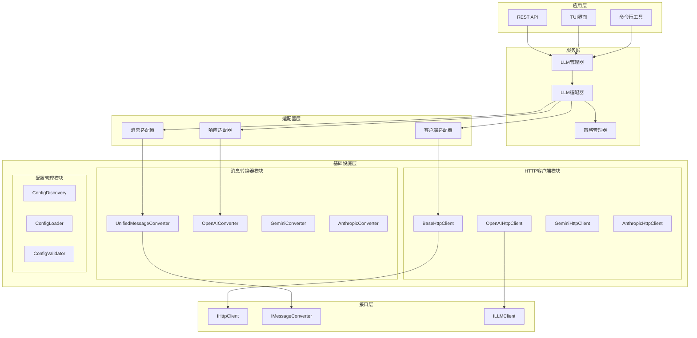

# LLM基础设施层实施方案总结

## 1. 项目概述

本文档总结了基于移除LangChain依赖需求的LLM基础设施层完整实施方案，包括HTTP客户端、消息转换器和服务层适配的详细设计和实施计划。

### 1.1 项目目标

1. **移除LangChain依赖**：构建自主可控的LLM基础设施
2. **提升性能**：减少不必要的抽象层，优化API调用
3. **增强可维护性**：清晰的架构分层和职责分离
4. **保持兼容性**：确保现有功能无缝迁移

### 1.2 核心原则

- **渐进式迁移**：分阶段实施，降低风险
- **向后兼容**：保持现有API接口不变
- **配置驱动**：通过配置控制迁移进度
- **测试优先**：每个组件都有完整测试覆盖

## 2. 架构设计总览

### 2.1 整体架构图

### 2.2 核心组件职责

| 组件 | 职责 | 状态 |
|------|------|------|
| **BaseHttpClient** | HTTP通信基础功能 | 设计完成 |
| **OpenAIHttpClient** | OpenAI API通信实现 | 设计完成 |
| **UnifiedMessageConverter** | 统一消息格式转换 | 设计完成 |
| **LLMAdapter** | 服务层适配器 | 设计完成 |
| **StrategyManager** | 策略管理和切换 | 设计完成 |
| **ConfigDiscovery** | 配置发现和管理 | 设计完成 |

## 3. 详细设计方案

### 3.1 HTTP客户端架构

**核心特性：**
- 统一的HTTP通信接口
- 连接池和会话管理
- 自动重试和错误处理
- 支持流式和非流式请求

**提供商支持：**
- OpenAI：Chat Completions + Responses API
- Gemini：多模态内容支持
- Anthropic：工具使用和长文本

**性能优化：**
- 异步HTTP客户端
- 连接复用和池化
- 指数退避重试策略
- 请求/响应缓存

### 3.2 消息转换器架构

**转换能力：**
- LangChain ↔ 基础设施层消息格式
- 提供商特定格式转换
- 多模态内容处理
- 工具调用消息支持

**统一消息系统：**
- HumanMessage, AIMessage, SystemMessage, ToolMessage
- 完整的类型注解和验证
- 序列化和反序列化支持
- 向后兼容性保证

**转换策略：**
- 自动格式检测
- 批量转换优化
- 错误恢复机制
- 性能监控和统计

### 3.3 服务层适配架构

**适配器模式：**
- LLMAdapter：统一LLM管理接口
- MessageAdapter：消息格式适配
- ClientAdapter：客户端生命周期管理
- ResponseAdapter：响应格式适配

**策略管理：**
- 配置驱动的策略选择
- 动态策略切换
- 渐进式迁移支持
- A/B测试和灰度发布

**兼容性保证：**
- 现有API接口不变
- 平滑的迁移路径
- 快速回滚机制
- 完整的测试覆盖

## 4. 实施计划

### 4.1 第一阶段：基础设施核心（2-3周）

**目标：** 建立基础设施层核心组件

**任务清单：**
- [ ] 实现BaseHttpClient基础功能
- [ ] 实现UnifiedMessageConverter
- [ ] 实现ConfigDiscovery和配置管理
- [ ] 创建基础接口定义
- [ ] 编写核心组件单元测试

**交付物：**
- HTTP客户端基础框架
- 消息转换器核心功能
- 配置管理系统
- 基础测试套件

### 4.2 第二阶段：OpenAI集成（2-3周）

**目标：** 完成OpenAI提供商的完整集成

**任务清单：**
- [ ] 实现OpenAIHttpClient
- [ ] 实现OpenAIConverter
- [ ] 支持Chat Completions API
- [ ] 支持Responses API (GPT-5)
- [ ] 实现工具调用支持
- [ ] 集成测试和性能验证

**交付物：**
- OpenAI HTTP客户端
- OpenAI消息转换器
- API集成测试
- 性能基准报告

### 4.3 第三阶段：其他提供商集成（3-4周）

**目标：** 完成Gemini和Anthropic提供商集成

**任务清单：**
- [ ] 实现GeminiHttpClient和转换器
- [ ] 实现AnthropicHttpClient和转换器
- [ ] 支持多模态内容处理
- [ ] 实现提供商特定功能
- [ ] 跨提供商兼容性测试

**交付物：**
- Gemini和Anthropic客户端
- 多模态内容支持
- 提供商集成测试
- 兼容性验证报告

### 4.4 第四阶段：服务层适配（2-3周）

**目标：** 实现服务层平滑适配

**任务清单：**
- [ ] 实现LLMAdapter和策略管理器
- [ ] 实现消息、客户端、响应适配器
- [ ] 配置驱动的迁移策略
- [ ] 服务层集成测试
- [ ] 性能回归测试

**交付物：**
- 完整的适配器层
- 策略管理系统
- 服务层集成
- 性能对比报告

### 4.5 第五阶段：全面测试和优化（2-3周）

**目标：** 确保系统稳定性和性能

**任务清单：**
- [ ] 端到端测试
- [ ] 压力测试和性能优化
- [ ] 安全性测试
- [ ] 文档完善
- [ ] 生产环境准备

**交付物：**
- 完整测试报告
- 性能优化方案
- 安全评估报告
- 用户文档

## 5. 技术规范

### 5.1 代码规范

**类型安全：**
- 完整的类型注解
- 运行时类型验证
- mypy静态检查
- 严格的类型检查

**代码质量：**
- 单一职责原则
- 依赖倒置原则
- 接口隔离原则
- 完整的错误处理

**测试要求：**
- 单元测试覆盖率>90%
- 集成测试覆盖核心流程
- 性能基准测试
- 兼容性测试

### 5.2 性能要求

**响应时间：**
- HTTP请求延迟<100ms（P95）
- 消息转换延迟<10ms
- 端到端响应时间<500ms

**吞吐量：**
- 支持1000+并发请求
- 消息转换>10000/秒
- HTTP客户端>500请求/秒

**资源使用：**
- 内存使用<512MB
- CPU使用率<50%
- 连接池大小<100

### 5.3 兼容性要求

**API兼容性：**
- 100%现有API保持兼容
- 参数格式向后兼容
- 响应格式保持一致
- 错误码映射完整

**版本兼容性：**
- Python 3.13+
- 支持主流操作系统
- 容器化部署支持
- 云原生架构兼容

## 6. 风险控制

### 6.1 技术风险

**风险识别：**
- API兼容性问题
- 性能回归风险
- 功能缺失风险
- 安全漏洞风险

**缓解措施：**
- 完整的测试覆盖
- 性能基准监控
- 功能对比矩阵
- 安全代码审查

**应急预案：**
- 快速回滚机制
- 备用实现方案
- 热修复流程
- 监控告警系统

### 6.2 项目风险

**风险识别：**
- 进度延期风险
- 资源不足风险
- 需求变更风险
- 技术债务风险

**缓解措施：**
- 分阶段交付
- 资源预留缓冲
- 需求冻结机制
- 代码质量管控

**应急预案：**
- 优先级调整
- 范围缩减方案
- 外部资源支持
- 技术债务偿还计划

## 7. 监控和观测

### 7.1 性能监控

**关键指标：**
- API响应时间
- 错误率统计
- 吞吐量监控
- 资源使用率

**监控工具：**
- Prometheus指标收集
- Grafana可视化面板
- 日志聚合和分析
- 分布式追踪

### 7.2 业务监控

**关键指标：**
- 迁移进度百分比
- 功能使用统计
- 用户满意度
- 系统稳定性

**告警机制：**
- 实时告警通知
- 分级告警策略
- 自动化响应
- 告警收敛机制

## 8. 成功指标

### 8.1 技术指标

**功能完整性：**
- [ ] 100%现有功能保持
- [ ] 支持所有LLM提供商
- [ ] 完整的工具调用支持
- [ ] 多模态内容处理

**性能提升：**
- [ ] API调用延迟降低15%
- [ ] 内存使用减少20%
- [ ] CPU使用率降低10%
- [ ] 吞吐量提升25%

**代码质量：**
- [ ] 测试覆盖率>90%
- [ ] 代码复杂度降低20%
- [ ] 技术债务减少30%
- [ ] 文档完整性>95%

### 8.2 业务指标

**迁移进度：**
- [ ] LangChain依赖减少80%
- [ ] 基础设施层使用率>70%
- [ ] 零生产事故
- [ ] 用户无感知迁移

**可维护性：**
- [ ] 新功能开发效率提升30%
- [ ] 问题定位时间减少50%
- [ ] 部署频率提升2倍
- [ ] 团队满意度>85%

## 9. 后续规划

### 9.1 短期优化（3-6个月）

**性能优化：**
- 缓存机制优化
- 连接池调优
- 批量处理优化
- 内存使用优化

**功能增强：**
- 新LLM提供商支持
- 高级工具调用功能
- 流式处理优化
- 多租户支持

### 9.2 中期演进（6-12个月）

**架构演进：**
- 微服务化拆分
- 事件驱动架构
- 云原生优化
- 边缘计算支持

**生态建设：**
- 插件系统开发
- 第三方集成支持
- 开发者工具链
- 社区生态建设

### 9.3 长期愿景（1-2年）

**技术领先：**
- AI原生架构
- 自主可控技术栈
- 行业标准制定
- 开源社区贡献

**业务价值：**
- 成本降低50%
- 开发效率提升100%
- 系统可靠性>99.9%
- 技术品牌影响力

## 10. 总结

本实施方案为移除LangChain依赖提供了完整的技术解决方案，通过分阶段实施、风险控制和持续优化，确保项目成功交付。核心价值包括：

1. **技术自主可控**：构建完全自主的LLM基础设施
2. **性能显著提升**：减少抽象层，优化系统性能
3. **架构清晰合理**：分层架构，职责明确，易于维护
4. **迁移平滑无感**：保持兼容性，用户无感知迁移
5. **未来可扩展**：为新技术和新需求预留扩展空间

通过严格执行本实施方案，将实现技术栈的现代化升级，为系统的长期发展奠定坚实基础。