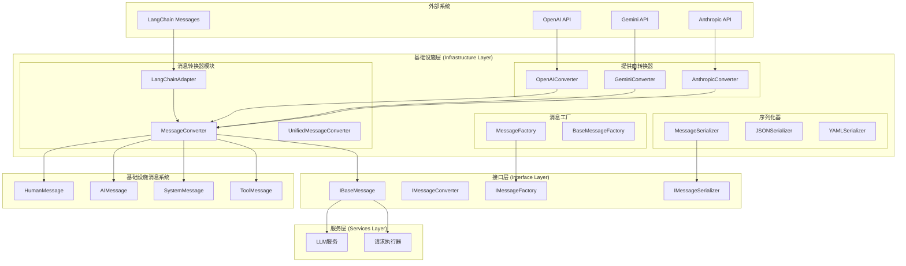

# 消息转换器基础设施架构设计

## 1. 架构概述

消息转换器是移除LangChain依赖的核心组件，负责在不同消息格式之间进行转换，确保基础设施层、服务层和接口层之间的无缝集成。

### 1.1 设计目标

1. **格式统一**：提供统一的消息格式，屏蔽不同提供商的差异
2. **类型安全**：完整的类型注解和运行时验证
3. **高性能**：最小化转换开销，支持批量处理
4. **可扩展**：易于添加新的消息类型和转换规则
5. **向后兼容**：支持现有LangChain消息格式的平滑迁移

### 1.2 核心原则

- **单一职责**：每个转换器专注于特定的转换任务
- **开闭原则**：对扩展开放，对修改封闭
- **依赖倒置**：依赖抽象接口而非具体实现
- **最小惊讶**：转换行为符合直觉和预期

## 2. 架构设计

### 2.1 整体架构图



### 2.2 模块职责

#### 2.2.1 核心转换器模块

**MessageConverter**
- 统一的消息转换入口点
- 提供双向转换功能
- 处理批量转换操作
- 支持格式自动检测

**UnifiedMessageConverter**
- 基于基础设施消息系统的转换器
- 提供标准化的转换逻辑
- 支持多模态内容处理
- 处理工具调用消息

**LangChainAdapter**
- LangChain消息格式的适配器
- 提供向后兼容性
- 渐进式迁移支持
- 格式映射和转换

#### 2.2.2 提供商转换器模块

**OpenAIConverter**
- OpenAI API格式的转换器
- 支持Chat Completions和Responses API
- 处理工具调用和函数调用
- 支持流式响应格式

**GeminiConverter**
- Google Gemini API格式的转换器
- 处理多模态内容（文本、图像、音频）
- 支持思考配置和推理控制
- 处理安全过滤和内容限制

**AnthropicConverter**
- Anthropic Claude API格式的转换器
- 处理系统提示和消息格式
- 支持工具使用和结果处理
- 处理长文本和上下文管理

#### 2.2.3 消息工厂模块

**MessageFactory**
- 消息对象的创建工厂
- 提供类型安全的创建方法
- 支持参数验证和默认值
- 处理消息元数据

**BaseMessageFactory**
- 基础消息工厂实现
- 提供通用的创建逻辑
- 支持插件式扩展
- 处理消息验证

#### 2.2.4 序列化器模块

**MessageSerializer**
- 消息序列化和反序列化
- 支持多种格式（JSON、YAML、MessagePack）
- 处理版本兼容性
- 提供压缩和加密支持

## 3. 接口设计

### 3.1 核心接口定义

```python
# src/interfaces/messages/converters.py
from abc import ABC, abstractmethod
from typing import Dict, Any, List, Optional, Union, Type
from datetime import datetime

class IMessageConverter(ABC):
    """消息转换器接口"""
    
    @abstractmethod
    def to_base_message(self, message: Any) -> "IBaseMessage":
        """转换为标准消息格式"""
        pass
    
    @abstractmethod
    def from_base_message(self, message: "IBaseMessage", target_format: str) -> Any:
        """从标准消息格式转换"""
        pass
    
    @abstractmethod
    def convert_message_list(self, messages: List[Any]) -> List["IBaseMessage"]:
        """批量转换消息列表"""
        pass
    
    @abstractmethod
    def supports_format(self, format_name: str) -> bool:
        """检查是否支持指定格式"""
        pass

class IProviderConverter(ABC):
    """提供商转换器接口"""
    
    @abstractmethod
    def convert_request(self, messages: List["IBaseMessage"], parameters: Dict[str, Any]) -> Dict[str, Any]:
        """转换请求格式"""
        pass
    
    @abstractmethod
    def convert_response(self, response: Dict[str, Any]) -> "IBaseMessage":
        """转换响应格式"""
        pass
    
    @abstractmethod
    def get_provider_name(self) -> str:
        """获取提供商名称"""
        pass

class IMessageFactory(ABC):
    """消息工厂接口"""
    
    @abstractmethod
    def create_human_message(self, content: str, **kwargs: Any) -> "IBaseMessage":
        """创建人类消息"""
        pass
    
    @abstractmethod
    def create_ai_message(self, content: str, **kwargs: Any) -> "IBaseMessage":
        """创建AI消息"""
        pass
    
    @abstractmethod
    def create_system_message(self, content: str, **kwargs: Any) -> "IBaseMessage":
        """创建系统消息"""
        pass
    
    @abstractmethod
    def create_tool_message(self, content: str, tool_call_id: str, **kwargs: Any) -> "IBaseMessage":
        """创建工具消息"""
        pass

class IMessageSerializer(ABC):
    """消息序列化器接口"""
    
    @abstractmethod
    def serialize(self, message: "IBaseMessage") -> bytes:
        """序列化消息"""
        pass
    
    @abstractmethod
    def deserialize(self, data: bytes) -> "IBaseMessage":
        """反序列化消息"""
        pass
    
    @abstractmethod
    def serialize_list(self, messages: List["IBaseMessage"]) -> bytes:
        """序列化消息列表"""
        pass
    
    @abstractmethod
    def deserialize_list(self, data: bytes) -> List["IBaseMessage"]:
        """反序列化消息列表"""
        pass
```

### 3.2 统一消息转换器实现

```python
# src/infrastructure/llm/converters/unified_message_converter.py
from typing import Dict, Any, List, Optional, Union, Type
from src.interfaces.messages.converters import IMessageConverter
from src.interfaces.messages import IBaseMessage
from src.infrastructure.messages.types import (
    HumanMessage, AIMessage, SystemMessage, ToolMessage, BaseMessage
)
from src.services.logger import get_logger

class UnifiedMessageConverter(IMessageConverter):
    """统一消息转换器"""
    
    def __init__(self):
        self.logger = get_logger(__name__)
        self._format_handlers = {
            "dict": self._convert_from_dict,
            "openai": self._convert_from_openai,
            "gemini": self._convert_from_gemini,
            "anthropic": self._convert_from_anthropic,
            "langchain": self._convert_from_langchain,
        }
    
    def to_base_message(self, message: Any) -> IBaseMessage:
        """转换为标准消息格式"""
        try:
            # 如果已经是基础消息，直接返回
            if isinstance(message, BaseMessage):
                return message
            
            # 检测消息格式并转换
            message_format = self._detect_format(message)
            handler = self._format_handlers.get(message_format)
            
            if handler:
                return handler(message)
            else:
                # 默认转换为人类消息
                return HumanMessage(content=str(message))
                
        except Exception as e:
            self.logger.error(f"消息转换失败: {e}")
            return HumanMessage(content=str(message))
    
    def from_base_message(self, message: IBaseMessage, target_format: str) -> Any:
        """从标准消息格式转换"""
        try:
            if target_format == "dict":
                return self._convert_to_dict(message)
            elif target_format == "openai":
                return self._convert_to_openai(message)
            elif target_format == "gemini":
                return self._convert_to_gemini(message)
            elif target_format == "anthropic":
                return self._convert_to_anthropic(message)
            elif target_format == "langchain":
                return self._convert_to_langchain(message)
            else:
                raise ValueError(f"不支持的目标格式: {target_format}")
                
        except Exception as e:
            self.logger.error(f"消息转换失败: {e}")
            raise
    
    def convert_message_list(self, messages: List[Any]) -> List[IBaseMessage]:
        """批量转换消息列表"""
        converted_messages = []
        for message in messages:
            converted_messages.append(self.to_base_message(message))
        return converted_messages
    
    def supports_format(self, format_name: str) -> bool:
        """检查是否支持指定格式"""
        return format_name in self._format_handlers
    
    def _detect_format(self, message: Any) -> str:
        """检测消息格式"""
        if isinstance(message, dict):
            if "role" in message and "content" in message:
                if "function_call" in message or "tool_calls" in message:
                    return "openai"
                elif "author" in message:
                    return "anthropic"
                else:
                    return "dict"
            elif "parts" in message:
                return "gemini"
            else:
                return "dict"
        elif hasattr(message, "type") and hasattr(message, "content"):
            # 可能是LangChain消息
            return "langchain"
        else:
            return "dict"
    
    def _convert_from_dict(self, message_dict: Dict[str, Any]) -> IBaseMessage:
        """从字典转换"""
        role = message_dict.get("role", "user")
        content = message_dict.get("content", "")
        
        if role == "user":
            return HumanMessage(
                content=content,
                name=message_dict.get("name"),
                additional_kwargs=message_dict.get("additional_kwargs", {})
            )
        elif role == "assistant":
            return AIMessage(
                content=content,
                name=message_dict.get("name"),
                tool_calls=message_dict.get("tool_calls"),
                additional_kwargs=message_dict.get("additional_kwargs", {})
            )
        elif role == "system":
            return SystemMessage(
                content=content,
                name=message_dict.get("name"),
                additional_kwargs=message_dict.get("additional_kwargs", {})
            )
        elif role == "tool":
            return ToolMessage(
                content=content,
                tool_call_id=message_dict.get("tool_call_id", ""),
                name=message_dict.get("name"),
                additional_kwargs=message_dict.get("additional_kwargs", {})
            )
        else:
            return HumanMessage(content=content)
    
    def _convert_from_openai(self, message: Any) -> IBaseMessage:
        """从OpenAI格式转换"""
        if isinstance(message, dict):
            return self._convert_from_dict(message)
        else:
            # 处理OpenAI消息对象
            return self._convert_from_dict(message.__dict__)
    
    def _convert_from_gemini(self, message: Any) -> IBaseMessage:
        """从Gemini格式转换"""
        if isinstance(message, dict):
            role = message.get("role", "user")
            parts = message.get("parts", [])
            
            # 提取文本内容
            content_parts = []
            for part in parts:
                if isinstance(part, dict):
                    if "text" in part:
                        content_parts.append(part["text"])
                    elif "inline_data" in part:
                        # 处理多模态内容
                        content_parts.append(f"[ multimodal content: {part['inline_data'].get('mime_type', 'unknown')} ]")
                else:
                    content_parts.append(str(part))
            
            content = " ".join(content_parts)
            
            if role == "user":
                return HumanMessage(content=content)
            elif role == "model":
                return AIMessage(content=content)
            else:
                return HumanMessage(content=content)
        else:
            return HumanMessage(content=str(message))
    
    def _convert_from_anthropic(self, message: Any) -> IBaseMessage:
        """从Anthropic格式转换"""
        if isinstance(message, dict):
            role = message.get("role", "user")
            content = message.get("content", "")
            
            if isinstance(content, list):
                # 处理多模态内容
                text_parts = []
                for item in content:
                    if isinstance(item, dict) and item.get("type") == "text":
                        text_parts.append(item.get("text", ""))
                    elif isinstance(item, dict) and item.get("type") == "image":
                        text_parts.append("[ image content ]")
                content = " ".join(text_parts)
            
            if role == "user":
                return HumanMessage(content=content)
            elif role == "assistant":
                return AIMessage(content=content)
            else:
                return HumanMessage(content=content)
        else:
            return HumanMessage(content=str(message))
    
    def _convert_from_langchain(self, message: Any) -> IBaseMessage:
        """从LangChain格式转换"""
        try:
            # 检查消息类型
            message_type = getattr(message, 'type', 'human')
            content = getattr(message, 'content', '')
            
            if message_type == "human":
                return HumanMessage(
                    content=content,
                    name=getattr(message, 'name'),
                    additional_kwargs=getattr(message, 'additional_kwargs', {})
                )
            elif message_type == "ai":
                return AIMessage(
                    content=content,
                    name=getattr(message, 'name'),
                    tool_calls=getattr(message, 'tool_calls', None),
                    additional_kwargs=getattr(message, 'additional_kwargs', {})
                )
            elif message_type == "system":
                return SystemMessage(
                    content=content,
                    name=getattr(message, 'name'),
                    additional_kwargs=getattr(message, 'additional_kwargs', {})
                )
            elif message_type == "tool":
                return ToolMessage(
                    content=content,
                    tool_call_id=getattr(message, 'tool_call_id', ''),
                    name=getattr(message, 'name'),
                    additional_kwargs=getattr(message, 'additional_kwargs', {})
                )
            else:
                return HumanMessage(content=content)
                
        except Exception as e:
            self.logger.warning(f"LangChain消息转换失败，使用默认转换: {e}")
            return HumanMessage(content=str(message))
    
    def _convert_to_dict(self, message: IBaseMessage) -> Dict[str, Any]:
        """转换为字典格式"""
        result = {
            "content": message.content,
            "type": message.type,
            "additional_kwargs": message.additional_kwargs,
            "response_metadata": message.response_metadata,
            "name": message.name,
            "id": message.id,
            "timestamp": message.timestamp.isoformat()
        }
        
        # 添加特定类型的额外信息
        if isinstance(message, ToolMessage):
            result["tool_call_id"] = message.tool_call_id
        elif isinstance(message, AIMessage) and message.tool_calls:
            result["tool_calls"] = message.tool_calls
        
        return result
    
    def _convert_to_openai(self, message: IBaseMessage) -> Dict[str, Any]:
        """转换为OpenAI格式"""
        result = {
            "role": "user" if message.type == "human" else message.type,
            "content": message.content
        }
        
        if message.name:
            result["name"] = message.name
        
        if isinstance(message, AIMessage) and message.tool_calls:
            result["tool_calls"] = message.tool_calls
        
        if isinstance(message, ToolMessage):
            result["tool_call_id"] = message.tool_call_id
        
        return result
    
    def _convert_to_gemini(self, message: IBaseMessage) -> Dict[str, Any]:
        """转换为Gemini格式"""
        role = "user" if message.type == "human" else "model"
        
        # 处理内容
        if isinstance(message.content, str):
            parts = [{"text": message.content}]
        else:
            parts = message.content
        
        result = {
            "role": role,
            "parts": parts
        }
        
        return result
    
    def _convert_to_anthropic(self, message: IBaseMessage) -> Dict[str, Any]:
        """转换为Anthropic格式"""
        role = "user" if message.type == "human" else "assistant"
        
        # 处理内容
        if isinstance(message.content, str):
            content = [{"type": "text", "text": message.content}]
        else:
            content = message.content
        
        result = {
            "role": role,
            "content": content
        }
        
        return result
    
    def _convert_to_langchain(self, message: IBaseMessage) -> Any:
        """转换为LangChain格式"""
        try:
            # 尝试导入LangChain
            from langchain_core.messages import (
                HumanMessage as LCHumanMessage,
                AIMessage as LCAIMessage,
                SystemMessage as LCSystemMessage,
                ToolMessage as LCToolMessage
            )
            
            kwargs = {
                "content": message.content,
                "additional_kwargs": message.additional_kwargs
            }
            
            if message.name:
                kwargs["name"] = message.name
            
            if isinstance(message, HumanMessage):
                return LCHumanMessage(**kwargs)
            elif isinstance(message, AIMessage):
                if message.tool_calls:
                    kwargs["tool_calls"] = message.tool_calls
                return LCAIMessage(**kwargs)
            elif isinstance(message, SystemMessage):
                return LCSystemMessage(**kwargs)
            elif isinstance(message, ToolMessage):
                kwargs["tool_call_id"] = message.tool_call_id
                return LCToolMessage(**kwargs)
            else:
                return LCHumanMessage(content=message.content)
                
        except ImportError:
            self.logger.warning("LangChain未安装，返回基础消息格式")
            return self._convert_to_dict(message)
```

### 3.3 提供商转换器实现

```python
# src/infrastructure/llm/converters/provider_converters.py
from abc import ABC
from typing import Dict, Any, List
from src.interfaces.messages.converters import IProviderConverter
from src.interfaces.messages import IBaseMessage
from src.infrastructure.messages.types import HumanMessage, AIMessage, SystemMessage, ToolMessage

class OpenAIConverter(IProviderConverter):
    """OpenAI提供商转换器"""
    
    def convert_request(self, messages: List[IBaseMessage], parameters: Dict[str, Any]) -> Dict[str, Any]:
        """转换请求格式"""
        openai_messages = []
        
        for message in messages:
            if isinstance(message, HumanMessage):
                openai_messages.append({
                    "role": "user",
                    "content": message.content,
                    **({"name": message.name} if message.name else {})
                })
            elif isinstance(message, AIMessage):
                msg_dict = {
                    "role": "assistant",
                    "content": message.content,
                    **({"name": message.name} if message.name else {})
                }
                
                if message.tool_calls:
                    msg_dict["tool_calls"] = message.tool_calls
                
                openai_messages.append(msg_dict)
            elif isinstance(message, SystemMessage):
                openai_messages.append({
                    "role": "system",
                    "content": message.content,
                    **({"name": message.name} if message.name else {})
                })
            elif isinstance(message, ToolMessage):
                openai_messages.append({
                    "role": "tool",
                    "content": message.content,
                    "tool_call_id": message.tool_call_id,
                    **({"name": message.name} if message.name else {})
                })
        
        request_data = {
            "model": parameters.get("model", "gpt-3.5-turbo"),
            "messages": openai_messages
        }
        
        # 添加可选参数
        optional_params = [
            "temperature", "max_tokens", "top_p", "frequency_penalty",
            "presence_penalty", "stream", "stop", "logit_bias"
        ]
        
        for param in optional_params:
            if param in parameters:
                request_data[param] = parameters[param]
        
        # 处理工具调用
        if "tools" in parameters:
            request_data["tools"] = self._convert_tools(parameters["tools"])
        
        return request_data
    
    def convert_response(self, response: Dict[str, Any]) -> IBaseMessage:
        """转换响应格式"""
        choice = response["choices"][0]
        message = choice["message"]
        
        if message["role"] == "assistant":
            return AIMessage(
                content=message["content"],
                tool_calls=message.get("tool_calls"),
                additional_kwargs={
                    "finish_reason": choice.get("finish_reason"),
                    "index": choice.get("index")
                }
            )
        else:
            return HumanMessage(content=message["content"])
    
    def get_provider_name(self) -> str:
        return "openai"
    
    def _convert_tools(self, tools: List[Dict[str, Any]]) -> List[Dict[str, Any]]:
        """转换工具格式"""
        openai_tools = []
        
        for tool in tools:
            openai_tool = {
                "type": "function",
                "function": {
                    "name": tool["name"],
                    "description": tool.get("description", ""),
                }
            }
            
            if "parameters" in tool:
                openai_tool["function"]["parameters"] = tool["parameters"]
            
            openai_tools.append(openai_tool)
        
        return openai_tools

class GeminiConverter(IProviderConverter):
    """Gemini提供商转换器"""
    
    def convert_request(self, messages: List[IBaseMessage], parameters: Dict[str, Any]) -> Dict[str, Any]:
        """转换请求格式"""
        contents = []
        system_instruction = None
        
        for message in messages:
            if isinstance(message, SystemMessage):
                system_instruction = message.content
                continue
            
            role = "user" if isinstance(message, HumanMessage) else "model"
            
            # 处理内容
            if isinstance(message.content, str):
                parts = [{"text": message.content}]
            elif isinstance(message.content, list):
                parts = message.content
            else:
                parts = [{"text": str(message.content)}]
            
            content_dict = {
                "role": role,
                "parts": parts
            }
            
            contents.append(content_dict)
        
        request_data = {
            "contents": contents
        }
        
        if system_instruction:
            request_data["systemInstruction"] = {
                "parts": [{"text": system_instruction}]
            }
        
        # 添加可选参数
        optional_params = [
            "temperature", "maxOutputTokens", "topP", "topK",
            "candidateCount", "stopSequences"
        ]
        
        generation_config = {}
        for param in optional_params:
            if param in parameters:
                generation_config[param] = parameters[param]
        
        if generation_config:
            request_data["generationConfig"] = generation_config
        
        # 处理工具配置
        if "tools" in parameters:
            request_data["tools"] = self._convert_tools(parameters["tools"])
        
        return request_data
    
    def convert_response(self, response: Dict[str, Any]) -> IBaseMessage:
        """转换响应格式"""
        candidate = response["candidates"][0]
        content = candidate.get("content", {})
        parts = content.get("parts", [])
        
        # 提取文本内容
        text_parts = []
        for part in parts:
            if isinstance(part, dict) and "text" in part:
                text_parts.append(part["text"])
        
        content_text = " ".join(text_parts)
        
        return AIMessage(
            content=content_text,
            additional_kwargs={
                "finishReason": candidate.get("finishReason"),
                "index": candidate.get("index"),
                "safetyRatings": candidate.get("safetyRatings", [])
            }
        )
    
    def get_provider_name(self) -> str:
        return "gemini"
    
    def _convert_tools(self, tools: List[Dict[str, Any]]) -> List[Dict[str, Any]]:
        """转换工具格式"""
        gemini_tools = []
        
        for tool in tools:
            function_declaration = {
                "name": tool["name"],
                "description": tool.get("description", "")
            }
            
            if "parameters" in tool:
                function_declaration["parameters"] = tool["parameters"]
            
            gemini_tools.append({
                "functionDeclarations": [function_declaration]
            })
        
        return gemini_tools

class AnthropicConverter(IProviderConverter):
    """Anthropic提供商转换器"""
    
    def convert_request(self, messages: List[IBaseMessage], parameters: Dict[str, Any]) -> Dict[str, Any]:
        """转换请求格式"""
        messages_list = []
        system_message = None
        
        for message in messages:
            if isinstance(message, SystemMessage):
                system_message = message.content
                continue
            
            role = "user" if isinstance(message, (HumanMessage, ToolMessage)) else "assistant"
            
            # 处理内容
            if isinstance(message.content, str):
                content = [{"type": "text", "text": message.content}]
            elif isinstance(message.content, list):
                content = message.content
            else:
                content = [{"type": "text", "text": str(message.content)}]
            
            message_dict = {
                "role": role,
                "content": content
            }
            
            messages_list.append(message_dict)
        
        request_data = {
            "model": parameters.get("model", "claude-3-sonnet-20240229"),
            "messages": messages_list,
            "max_tokens": parameters.get("max_tokens", 1024)
        }
        
        if system_message:
            request_data["system"] = system_message
        
        # 添加可选参数
        optional_params = [
            "temperature", "top_p", "top_k", "stop_sequences",
            "stream", "metadata"
        ]
        
        for param in optional_params:
            if param in parameters:
                request_data[param] = parameters[param]
        
        # 处理工具配置
        if "tools" in parameters:
            request_data["tools"] = self._convert_tools(parameters["tools"])
        
        return request_data
    
    def convert_response(self, response: Dict[str, Any]) -> IBaseMessage:
        """转换响应格式"""
        content = response.get("content", [])
        
        # 提取文本内容
        text_parts = []
        tool_use_blocks = []
        
        for item in content:
            if isinstance(item, dict):
                if item.get("type") == "text":
                    text_parts.append(item.get("text", ""))
                elif item.get("type") == "tool_use":
                    tool_use_blocks.append(item)
        
        content_text = " ".join(text_parts)
        
        additional_kwargs = {
            "stop_reason": response.get("stop_reason"),
            "stop_sequence": response.get("stop_sequence"),
            "usage": response.get("usage", {})
        }
        
        if tool_use_blocks:
            additional_kwargs["tool_use_blocks"] = tool_use_blocks
        
        return AIMessage(
            content=content_text,
            additional_kwargs=additional_kwargs
        )
    
    def get_provider_name(self) -> str:
        return "anthropic"
    
    def _convert_tools(self, tools: List[Dict[str, Any]]) -> List[Dict[str, Any]]:
        """转换工具格式"""
        anthropic_tools = []
        
        for tool in tools:
            anthropic_tool = {
                "name": tool["name"],
                "description": tool.get("description", "")
            }
            
            if "parameters" in tool:
                anthropic_tool["input_schema"] = tool["parameters"]
            
            anthropic_tools.append(anthropic_tool)
        
        return anthropic_tools
```

## 4. 消息工厂实现

### 4.1 基础消息工厂

```python
# src/infrastructure/llm/factories/message_factory.py
from typing import Dict, Any, Optional, List
from src.interfaces.messages.converters import IMessageFactory
from src.interfaces.messages import IBaseMessage
from src.infrastructure.messages.types import (
    HumanMessage, AIMessage, SystemMessage, ToolMessage
)
from src.services.logger import get_logger

class MessageFactory(IMessageFactory):
    """消息工厂实现"""
    
    def __init__(self):
        self.logger = get_logger(__name__)
        self._message_validators = {
            "human": self._validate_human_message,
            "ai": self._validate_ai_message,
            "system": self._validate_system_message,
            "tool": self._validate_tool_message
        }
    
    def create_human_message(self, content: str, **kwargs: Any) -> IBaseMessage:
        """创建人类消息"""
        self._validate_content(content)
        
        message = HumanMessage(
            content=content,
            name=kwargs.get("name"),
            additional_kwargs=kwargs.get("additional_kwargs", {}),
            response_metadata=kwargs.get("response_metadata", {}),
            id=kwargs.get("id"),
            timestamp=kwargs.get("timestamp")
        )
        
        self._validate_message("human", message)
        return message
    
    def create_ai_message(self, content: str, **kwargs: Any) -> IBaseMessage:
        """创建AI消息"""
        self._validate_content(content)
        
        message = AIMessage(
            content=content,
            name=kwargs.get("name"),
            tool_calls=kwargs.get("tool_calls"),
            invalid_tool_calls=kwargs.get("invalid_tool_calls"),
            additional_kwargs=kwargs.get("additional_kwargs", {}),
            response_metadata=kwargs.get("response_metadata", {}),
            id=kwargs.get("id"),
            timestamp=kwargs.get("timestamp")
        )
        
        self._validate_message("ai", message)
        return message
    
    def create_system_message(self, content: str, **kwargs: Any) -> IBaseMessage:
        """创建系统消息"""
        self._validate_content(content)
        
        message = SystemMessage(
            content=content,
            name=kwargs.get("name"),
            additional_kwargs=kwargs.get("additional_kwargs", {}),
            response_metadata=kwargs.get("response_metadata", {}),
            id=kwargs.get("id"),
            timestamp=kwargs.get("timestamp")
        )
        
        self._validate_message("system", message)
        return message
    
    def create_tool_message(self, content: str, tool_call_id: str, **kwargs: Any) -> IBaseMessage:
        """创建工具消息"""
        self._validate_content(content)
        self._validate_tool_call_id(tool_call_id)
        
        message = ToolMessage(
            content=content,
            tool_call_id=tool_call_id,
            name=kwargs.get("name"),
            additional_kwargs=kwargs.get("additional_kwargs", {}),
            response_metadata=kwargs.get("response_metadata", {}),
            id=kwargs.get("id"),
            timestamp=kwargs.get("timestamp")
        )
        
        self._validate_message("tool", message)
        return message
    
    def create_from_dict(self, data: Dict[str, Any]) -> IBaseMessage:
        """从字典创建消息"""
        message_type = data.get("type", "human")
        content = data.get("content", "")
        
        kwargs = {
            "name": data.get("name"),
            "additional_kwargs": data.get("additional_kwargs", {}),
            "response_metadata": data.get("response_metadata", {}),
            "id": data.get("id"),
            "timestamp": data.get("timestamp")
        }
        
        if message_type == "human":
            return self.create_human_message(content, **kwargs)
        elif message_type == "ai":
            kwargs.update({
                "tool_calls": data.get("tool_calls"),
                "invalid_tool_calls": data.get("invalid_tool_calls")
            })
            return self.create_ai_message(content, **kwargs)
        elif message_type == "system":
            return self.create_system_message(content, **kwargs)
        elif message_type == "tool":
            kwargs["tool_call_id"] = data.get("tool_call_id", "")
            return self.create_tool_message(content, **kwargs)
        else:
            self.logger.warning(f"未知消息类型: {message_type}，使用人类消息")
            return self.create_human_message(content, **kwargs)
    
    def _validate_content(self, content: str) -> None:
        """验证内容"""
        if not isinstance(content, (str, list)):
            raise ValueError("消息内容必须是字符串或列表")
        
        if isinstance(content, str) and len(content.strip()) == 0:
            self.logger.warning("消息内容为空")
    
    def _validate_tool_call_id(self, tool_call_id: str) -> None:
        """验证工具调用ID"""
        if not isinstance(tool_call_id, str) or len(tool_call_id.strip()) == 0:
            raise ValueError("工具调用ID不能为空")
    
    def _validate_message(self, message_type: str, message: IBaseMessage) -> None:
        """验证消息"""
        validator = self._message_validators.get(message_type)
        if validator:
            validator(message)
    
    def _validate_human_message(self, message: HumanMessage) -> None:
        """验证人类消息"""
        if not message.content:
            raise ValueError("人类消息内容不能为空")
    
    def _validate_ai_message(self, message: AIMessage) -> None:
        """验证AI消息"""
        if not message.content and not message.tool_calls:
            raise ValueError("AI消息必须包含内容或工具调用")
    
    def _validate_system_message(self, message: SystemMessage) -> None:
        """验证系统消息"""
        if not message.content:
            raise ValueError("系统消息内容不能为空")
    
    def _validate_tool_message(self, message: ToolMessage) -> None:
        """验证工具消息"""
        if not message.content:
            raise ValueError("工具消息内容不能为空")
        if not message.tool_call_id:
            raise ValueError("工具消息必须包含工具调用ID")
```

## 5. 实施计划

### 5.1 第一阶段：核心转换器（1-2周）

1. **实现UnifiedMessageConverter**
   - 基础转换逻辑
   - 格式检测机制
   - 错误处理和日志

2. **实现MessageFactory**
   - 消息创建方法
   - 参数验证
   - 默认值处理

3. **基础测试**
   - 单元测试
   - 格式转换测试
   - 边界条件测试

### 5.2 第二阶段：提供商转换器（2-3周）

1. **OpenAIConverter**
   - 请求/响应转换
   - 工具调用支持
   - 流式响应处理

2. **GeminiConverter**
   - 多模态内容处理
   - 系统指令支持
   - 安全过滤处理

3. **AnthropicConverter**
   - 消息格式适配
   - 工具使用支持
   - 长文本处理

### 5.3 第三阶段：集成和优化（1-2周）

1. **服务层集成**
   - 更新现有代码
   - 向后兼容处理
   - 性能优化

2. **LangChain适配器**
   - 渐进式迁移支持
   - 格式映射
   - 兼容性测试

## 6. 风险控制

### 6.1 技术风险

1. **格式兼容性**
   - 完整的格式测试
   - 版本兼容性处理
   - 回退机制

2. **性能影响**
   - 转换性能基准测试
   - 批量处理优化
   - 缓存机制

### 6.2 实施风险

1. **迁移复杂性**
   - 分阶段迁移
   - 并行运行验证
   - 回滚计划

2. **依赖管理**
   - 渐进式移除LangChain
   - 适配器模式过渡
   - 充分测试验证

## 7. 成功指标

1. **功能完整性**：100%消息格式转换覆盖
2. **性能提升**：转换延迟降低20%
3. **代码质量**：测试覆盖率>95%
4. **可维护性**：代码复杂度降低25%
5. **兼容性**：支持所有现有消息格式

这个消息转换器架构设计为移除LangChain依赖提供了完整的解决方案，确保了系统的可扩展性和向后兼容性。