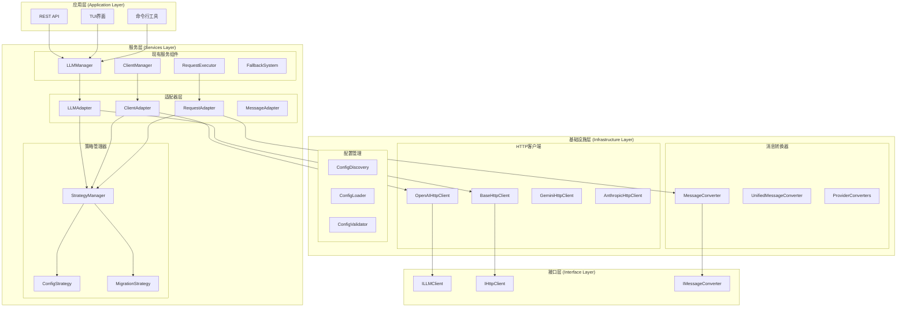

# 服务层适配方案设计

## 1. 适配概述

服务层适配方案是连接现有LLM服务层与新的基础设施层的关键桥梁，确保在移除LangChain依赖的过程中，系统能够平滑过渡并保持向后兼容性。

### 1.1 适配目标

1. **无缝迁移**：现有服务层代码无需大幅修改
2. **向后兼容**：保持现有API接口不变
3. **渐进式替换**：支持逐步替换LangChain组件
4. **性能优化**：利用新的基础设施层提升性能
5. **可观测性**：增强监控和日志能力

### 1.2 适配原则

- **适配器模式**：使用适配器模式封装差异
- **策略模式**：根据配置选择不同的实现策略
- **依赖注入**：通过依赖注入管理组件生命周期
- **配置驱动**：通过配置控制迁移进度和行为

## 2. 架构设计

### 2.1 整体架构图



### 2.2 适配器层设计

#### 2.2.1 LLM适配器

**LLMAdapter**
- 封装LLM管理器的接口差异
- 提供统一的客户端访问接口
- 管理新旧实现的切换逻辑
- 处理配置驱动的策略选择

#### 2.2.2 客户端适配器

**ClientAdapter**
- 适配不同提供商的客户端接口
- 处理客户端生命周期管理
- 提供统一的客户端工厂
- 管理连接池和缓存

#### 2.2.3 请求适配器

**RequestAdapter**
- 适配请求格式和参数
- 处理流式和非流式请求
- 管理重试和降级逻辑
- 提供请求监控和日志

#### 2.2.4 消息适配器

**MessageAdapter**
- 适配不同消息格式
- 处理LangChain消息转换
- 提供消息验证和清理
- 管理消息缓存和序列化

### 2.3 策略管理器设计

#### 2.3.1 策略管理器

**StrategyManager**
- 管理所有适配策略
- 提供策略注册和发现
- 处理策略冲突和优先级
- 支持动态策略切换

#### 2.3.2 配置策略

**ConfigStrategy**
- 基于配置的策略选择
- 支持环境变量和配置文件
- 提供配置验证和默认值
- 处理配置热重载

#### 2.3.3 迁移策略

**MigrationStrategy**
- 控制迁移进度和节奏
- 提供回滚和恢复机制
- 管理迁移状态和进度
- 支持A/B测试和灰度发布

## 3. 详细实现

### 3.1 LLM适配器实现

```python
# src/services/llm/adapters/llm_adapter.py
from typing import Dict, Any, List, Optional, Union
from enum import Enum
from src.interfaces.llm import ILLMClient, LLMResponse
from src.interfaces.messages import IBaseMessage
from src.services.logger import get_logger

class ImplementationStrategy(Enum):
    """实现策略枚举"""
    LANGCHAIN = "langchain"
    INFRASTRUCTURE = "infrastructure"
    HYBRID = "hybrid"

class LLMAdapter:
    """LLM管理器适配器"""
    
    def __init__(
        self,
        strategy_manager: "StrategyManager",
        config: Dict[str, Any]
    ):
        self.strategy_manager = strategy_manager
        self.config = config
        self.logger = get_logger(__name__)
        
        # 初始化不同实现的实例
        self._langchain_implementation = None
        self._infrastructure_implementation = None
        
        # 当前使用的策略
        self._current_strategy = self._determine_strategy()
        
        # 性能统计
        self._performance_stats = {
            "langchain_calls": 0,
            "infrastructure_calls": 0,
            "hybrid_calls": 0,
            "errors": 0
        }
    
    async def generate_async(
        self,
        messages: List[IBaseMessage],
        parameters: Optional[Dict[str, Any]] = None,
        **kwargs
    ) -> LLMResponse:
        """异步生成响应"""
        try:
            strategy = self._get_current_strategy()
            
            if strategy == ImplementationStrategy.LANGCHAIN:
                return await self._generate_with_langchain(messages, parameters, **kwargs)
            elif strategy == ImplementationStrategy.INFRASTRUCTURE:
                return await self._generate_with_infrastructure(messages, parameters, **kwargs)
            elif strategy == ImplementationStrategy.HYBRID:
                return await self._generate_with_hybrid(messages, parameters, **kwargs)
            else:
                raise ValueError(f"未知的实现策略: {strategy}")
                
        except Exception as e:
            self._performance_stats["errors"] += 1
            self.logger.error(f"LLM生成失败: {e}")
            
            # 尝试降级到备用实现
            if self._current_strategy != ImplementationStrategy.LANGCHAIN:
                self.logger.info("降级到LangChain实现")
                return await self._generate_with_langchain(messages, parameters, **kwargs)
            else:
                raise
    
    async def stream_generate_async(
        self,
        messages: List[IBaseMessage],
        parameters: Optional[Dict[str, Any]] = None,
        **kwargs
    ):
        """异步流式生成响应"""
        strategy = self._get_current_strategy()
        
        if strategy == ImplementationStrategy.LANGCHAIN:
            async for chunk in self._stream_with_langchain(messages, parameters, **kwargs):
                yield chunk
        elif strategy == ImplementationStrategy.INFRASTRUCTURE:
            async for chunk in self._stream_with_infrastructure(messages, parameters, **kwargs):
                yield chunk
        elif strategy == ImplementationStrategy.HYBRID:
            async for chunk in self._stream_with_hybrid(messages, parameters, **kwargs):
                yield chunk
    
    def _determine_strategy(self) -> ImplementationStrategy:
        """确定当前使用的策略"""
        strategy_config = self.config.get("implementation_strategy", "auto")
        
        if strategy_config == "langchain":
            return ImplementationStrategy.LANGCHAIN
        elif strategy_config == "infrastructure":
            return ImplementationStrategy.INFRASTRUCTURE
        elif strategy_config == "hybrid":
            return ImplementationStrategy.HYBRID
        elif strategy_config == "auto":
            # 基于配置和环境自动选择
            return self._auto_determine_strategy()
        else:
            self.logger.warning(f"未知策略配置: {strategy_config}，使用默认策略")
            return ImplementationStrategy.LANGCHAIN
    
    def _auto_determine_strategy(self) -> ImplementationStrategy:
        """自动确定策略"""
        # 检查基础设施层是否可用
        if self._is_infrastructure_ready():
            # 检查迁移配置
            migration_config = self.config.get("migration", {})
            migration_percentage = migration_config.get("percentage", 0)
            
            if migration_percentage >= 100:
                return ImplementationStrategy.INFRASTRUCTURE
            elif migration_percentage > 0:
                return ImplementationStrategy.HYBRID
            else:
                return ImplementationStrategy.LANGCHAIN
        else:
            return ImplementationStrategy.LANGCHAIN
    
    def _is_infrastructure_ready(self) -> bool:
        """检查基础设施层是否准备就绪"""
        try:
            # 检查必要的组件是否可用
            from src.infrastructure.llm.http_client import OpenAIHttpClient
            from src.infrastructure.llm.converters import UnifiedMessageConverter
            
            return True
        except ImportError:
            return False
    
    async def _generate_with_langchain(
        self,
        messages: List[IBaseMessage],
        parameters: Optional[Dict[str, Any]] = None,
        **kwargs
    ) -> LLMResponse:
        """使用LangChain实现生成"""
        self._performance_stats["langchain_calls"] += 1
        
        # 获取或创建LangChain实现
        if not self._langchain_implementation:
            self._langchain_implementation = self._create_langchain_implementation()
        
        # 转换消息格式
        langchain_messages = self._convert_to_langchain_messages(messages)
        
        # 调用LangChain实现
        response = await self._langchain_implementation.generate_async(
            langchain_messages, parameters, **kwargs
        )
        
        # 转换响应格式
        return self._convert_from_langchain_response(response)
    
    async def _generate_with_infrastructure(
        self,
        messages: List[IBaseMessage],
        parameters: Optional[Dict[str, Any]] = None,
        **kwargs
    ) -> LLMResponse:
        """使用基础设施层实现生成"""
        self._performance_stats["infrastructure_calls"] += 1
        
        # 获取或创建基础设施层实现
        if not self._infrastructure_implementation:
            self._infrastructure_implementation = self._create_infrastructure_implementation()
        
        # 直接使用基础设施层消息格式
        response = await self._infrastructure_implementation.generate_async(
            messages, parameters, **kwargs
        )
        
        return response
    
    async def _generate_with_hybrid(
        self,
        messages: List[IBaseMessage],
        parameters: Optional[Dict[str, Any]] = None,
        **kwargs
    ) -> LLMResponse:
        """使用混合策略生成"""
        self._performance_stats["hybrid_calls"] += 1
        
        # 基于配置决定使用哪种实现
        migration_config = self.config.get("migration", {})
        infrastructure_percentage = migration_config.get("percentage", 50)
        
        import random
        if random.random() < infrastructure_percentage / 100:
            return await self._generate_with_infrastructure(messages, parameters, **kwargs)
        else:
            return await self._generate_with_langchain(messages, parameters, **kwargs)
    
    def _create_langchain_implementation(self):
        """创建LangChain实现"""
        # 这里返回现有的LangChain实现
        from src.services.llm.manager import LLMManager
        return LLMManager(self.config.get("langchain_config", {}))
    
    def _create_infrastructure_implementation(self):
        """创建基础设施层实现"""
        # 这里返回新的基础设施层实现
        from src.services.llm.infrastructure_manager import InfrastructureLLMManager
        return InfrastructureLLMManager(self.config.get("infrastructure_config", {}))
    
    def _convert_to_langchain_messages(self, messages: List[IBaseMessage]):
        """转换为LangChain消息格式"""
        # 使用消息适配器进行转换
        message_adapter = self.strategy_manager.get_message_adapter()
        return [message_adapter.to_langchain(msg) for msg in messages]
    
    def _convert_from_langchain_response(self, response):
        """从LangChain响应格式转换"""
        # 使用响应适配器进行转换
        response_adapter = self.strategy_manager.get_response_adapter()
        return response_adapter.from_langchain(response)
    
    def _get_current_strategy(self) -> ImplementationStrategy:
        """获取当前策略"""
        # 支持动态策略切换
        if self.config.get("dynamic_strategy", False):
            return self._determine_strategy()
        else:
            return self._current_strategy
    
    def get_performance_stats(self) -> Dict[str, Any]:
        """获取性能统计"""
        total_calls = (
            self._performance_stats["langchain_calls"] +
            self._performance_stats["infrastructure_calls"] +
            self._performance_stats["hybrid_calls"]
        )
        
        if total_calls > 0:
            return {
                **self._performance_stats,
                "total_calls": total_calls,
                "langchain_percentage": (self._performance_stats["langchain_calls"] / total_calls) * 100,
                "infrastructure_percentage": (self._performance_stats["infrastructure_calls"] / total_calls) * 100,
                "hybrid_percentage": (self._performance_stats["hybrid_calls"] / total_calls) * 100,
                "error_rate": (self._performance_stats["errors"] / total_calls) * 100
            }
        else:
            return self._performance_stats
    
    def switch_strategy(self, new_strategy: ImplementationStrategy) -> None:
        """切换实现策略"""
        old_strategy = self._current_strategy
        self._current_strategy = new_strategy
        
        self.logger.info(f"策略切换: {old_strategy} -> {new_strategy}")
        
        # 预热新的实现
        if new_strategy == ImplementationStrategy.INFRASTRUCTURE and not self._infrastructure_implementation:
            self._infrastructure_implementation = self._create_infrastructure_implementation()
        elif new_strategy == ImplementationStrategy.LANGCHAIN and not self._langchain_implementation:
            self._langchain_implementation = self._create_langchain_implementation()
```

### 3.2 策略管理器实现

```python
# src/services/llm/adapters/strategy_manager.py
from typing import Dict, Any, Optional, Type
from abc import ABC, abstractmethod
from src.services.logger import get_logger

class IStrategy(ABC):
    """策略接口"""
    
    @abstractmethod
    def execute(self, *args, **kwargs) -> Any:
        """执行策略"""
        pass
    
    @abstractmethod
    def is_available(self) -> bool:
        """检查策略是否可用"""
        pass
    
    @abstractmethod
    def get_priority(self) -> int:
        """获取策略优先级"""
        pass

class StrategyManager:
    """策略管理器"""
    
    def __init__(self, config: Dict[str, Any]):
        self.config = config
        self.logger = get_logger(__name__)
        
        # 策略注册表
        self._strategies: Dict[str, IStrategy] = {}
        
        # 适配器缓存
        self._adapter_cache: Dict[str, Any] = {}
        
        # 初始化策略
        self._initialize_strategies()
    
    def register_strategy(self, name: str, strategy: IStrategy) -> None:
        """注册策略"""
        self._strategies[name] = strategy
        self.logger.debug(f"注册策略: {name}")
    
    def get_strategy(self, name: str) -> Optional[IStrategy]:
        """获取策略"""
        return self._strategies.get(name)
    
    def execute_strategy(self, name: str, *args, **kwargs) -> Any:
        """执行指定策略"""
        strategy = self.get_strategy(name)
        if not strategy:
            raise ValueError(f"策略不存在: {name}")
        
        if not strategy.is_available():
            self.logger.warning(f"策略不可用: {name}")
            # 尝试获取备用策略
            fallback_strategy = self._get_fallback_strategy(name)
            if fallback_strategy:
                return fallback_strategy.execute(*args, **kwargs)
            else:
                raise RuntimeError(f"策略 {name} 不可用且无备用策略")
        
        return strategy.execute(*args, **kwargs)
    
    def get_available_strategies(self) -> Dict[str, IStrategy]:
        """获取所有可用策略"""
        return {
            name: strategy for name, strategy in self._strategies.items()
            if strategy.is_available()
        }
    
    def get_best_strategy(self, strategy_type: str) -> Optional[IStrategy]:
        """获取最佳策略"""
        available_strategies = [
            strategy for name, strategy in self._strategies.items()
            if name.startswith(strategy_type) and strategy.is_available()
        ]
        
        if not available_strategies:
            return None
        
        # 按优先级排序
        available_strategies.sort(key=lambda s: s.get_priority(), reverse=True)
        return available_strategies[0]
    
    def get_message_adapter(self):
        """获取消息适配器"""
        if "message_adapter" not in self._adapter_cache:
            self._adapter_cache["message_adapter"] = self._create_message_adapter()
        return self._adapter_cache["message_adapter"]
    
    def get_response_adapter(self):
        """获取响应适配器"""
        if "response_adapter" not in self._adapter_cache:
            self._adapter_cache["response_adapter"] = self._create_response_adapter()
        return self._adapter_cache["response_adapter"]
    
    def get_client_adapter(self):
        """获取客户端适配器"""
        if "client_adapter" not in self._adapter_cache:
            self._adapter_cache["client_adapter"] = self._create_client_adapter()
        return self._adapter_cache["client_adapter"]
    
    def _initialize_strategies(self) -> None:
        """初始化策略"""
        # 注册配置策略
        self.register_strategy("config", ConfigStrategy(self.config))
        
        # 注册迁移策略
        self.register_strategy("migration", MigrationStrategy(self.config))
        
        # 注册性能策略
        self.register_strategy("performance", PerformanceStrategy(self.config))
    
    def _get_fallback_strategy(self, strategy_name: str) -> Optional[IStrategy]:
        """获取备用策略"""
        fallback_config = self.config.get("fallback_strategies", {})
        fallback_name = fallback_config.get(strategy_name)
        
        if fallback_name:
            return self.get_strategy(fallback_name)
        
        return None
    
    def _create_message_adapter(self):
        """创建消息适配器"""
        from .message_adapter import MessageAdapter
        return MessageAdapter(self.config.get("message_adapter", {}))
    
    def _create_response_adapter(self):
        """创建响应适配器"""
        from .response_adapter import ResponseAdapter
        return ResponseAdapter(self.config.get("response_adapter", {}))
    
    def _create_client_adapter(self):
        """创建客户端适配器"""
        from .client_adapter import ClientAdapter
        return ClientAdapter(self.config.get("client_adapter", {}))

class ConfigStrategy(IStrategy):
    """配置策略"""
    
    def __init__(self, config: Dict[str, Any]):
        self.config = config
    
    def execute(self, key: str, default: Any = None) -> Any:
        """执行配置策略"""
        return self.config.get(key, default)
    
    def is_available(self) -> bool:
        return True
    
    def get_priority(self) -> int:
        return 100

class MigrationStrategy(IStrategy):
    """迁移策略"""
    
    def __init__(self, config: Dict[str, Any]):
        self.config = config
        self.migration_config = config.get("migration", {})
    
    def execute(self, operation: str, **kwargs) -> Any:
        """执行迁移策略"""
        if operation == "get_percentage":
            return self.migration_config.get("percentage", 0)
        elif operation == "should_migrate":
            percentage = self.migration_config.get("percentage", 0)
            import random
            return random.random() < percentage / 100
        elif operation == "get_target_strategy":
            percentage = self.migration_config.get("percentage", 0)
            if percentage >= 100:
                return "infrastructure"
            elif percentage > 0:
                return "hybrid"
            else:
                return "langchain"
        else:
            raise ValueError(f"未知的迁移操作: {operation}")
    
    def is_available(self) -> bool:
        return True
    
    def get_priority(self) -> int:
        return 90

class PerformanceStrategy(IStrategy):
    """性能策略"""
    
    def __init__(self, config: Dict[str, Any]):
        self.config = config
        self.performance_config = config.get("performance", {})
        self._metrics = {}
    
    def execute(self, metric: str, value: Any = None) -> Any:
        """执行性能策略"""
        if value is not None:
            # 记录指标
            self._metrics[metric] = value
            return None
        else:
            # 获取指标
            return self._metrics.get(metric)
    
    def is_available(self) -> bool:
        return True
    
    def get_priority(self) -> int:
        return 80
```

### 3.3 消息适配器实现

```python
# src/services/llm/adapters/message_adapter.py
from typing import List, Dict, Any, Optional, Union
from src.interfaces.messages import IBaseMessage
from src.infrastructure.messages.types import (
    HumanMessage, AIMessage, SystemMessage, ToolMessage
)
from src.services.logger import get_logger

class MessageAdapter:
    """消息适配器"""
    
    def __init__(self, config: Dict[str, Any]):
        self.config = config
        self.logger = get_logger(__name__)
        
        # 转换器缓存
        self._converter_cache = {}
        
        # 初始化转换器
        self._initialize_converters()
    
    def to_langchain(self, message: IBaseMessage):
        """转换为LangChain消息格式"""
        try:
            # 尝试使用基础设施层的转换器
            if "unified_converter" in self._converter_cache:
                return self._converter_cache["unified_converter"].from_base_message(
                    message, "langchain"
                )
            else:
                # 直接转换
                return self._direct_convert_to_langchain(message)
        except Exception as e:
            self.logger.warning(f"使用统一转换器失败，回退到直接转换: {e}")
            return self._direct_convert_to_langchain(message)
    
    def from_langchain(self, langchain_message) -> IBaseMessage:
        """从LangChain消息格式转换"""
        try:
            # 尝试使用基础设施层的转换器
            if "unified_converter" in self._converter_cache:
                return self._converter_cache["unified_converter"].to_base_message(
                    langchain_message
                )
            else:
                # 直接转换
                return self._direct_convert_from_langchain(langchain_message)
        except Exception as e:
            self.logger.warning(f"使用统一转换器失败，回退到直接转换: {e}")
            return self._direct_convert_from_langchain(langchain_message)
    
    def convert_list_to_langchain(self, messages: List[IBaseMessage]) -> List:
        """批量转换为LangChain格式"""
        return [self.to_langchain(msg) for msg in messages]
    
    def convert_list_from_langchain(self, langchain_messages: List) -> List[IBaseMessage]:
        """批量从LangChain格式转换"""
        return [self.from_langchain(msg) for msg in langchain_messages]
    
    def validate_message(self, message: IBaseMessage) -> List[str]:
        """验证消息格式"""
        errors = []
        
        if not message.content:
            errors.append("消息内容不能为空")
        
        if isinstance(message, ToolMessage) and not message.tool_call_id:
            errors.append("工具消息必须包含tool_call_id")
        
        return errors
    
    def normalize_message(self, message: IBaseMessage) -> IBaseMessage:
        """标准化消息格式"""
        # 清理内容
        if isinstance(message.content, str):
            content = message.content.strip()
        else:
            content = message.content
        
        # 清理元数据
        additional_kwargs = message.additional_kwargs.copy()
        additional_kwargs = {k: v for k, v in additional_kwargs.items() if v is not None}
        
        # 重新创建消息对象
        if isinstance(message, HumanMessage):
            return HumanMessage(
                content=content,
                name=message.name,
                additional_kwargs=additional_kwargs,
                response_metadata=message.response_metadata,
                id=message.id,
                timestamp=message.timestamp
            )
        elif isinstance(message, AIMessage):
            return AIMessage(
                content=content,
                name=message.name,
                tool_calls=message.tool_calls,
                additional_kwargs=additional_kwargs,
                response_metadata=message.response_metadata,
                id=message.id,
                timestamp=message.timestamp
            )
        elif isinstance(message, SystemMessage):
            return SystemMessage(
                content=content,
                name=message.name,
                additional_kwargs=additional_kwargs,
                response_metadata=message.response_metadata,
                id=message.id,
                timestamp=message.timestamp
            )
        elif isinstance(message, ToolMessage):
            return ToolMessage(
                content=content,
                tool_call_id=message.tool_call_id,
                name=message.name,
                additional_kwargs=additional_kwargs,
                response_metadata=message.response_metadata,
                id=message.id,
                timestamp=message.timestamp
            )
        else:
            return message
    
    def _initialize_converters(self) -> None:
        """初始化转换器"""
        try:
            # 尝试导入基础设施层的统一转换器
            from src.infrastructure.llm.converters.unified_message_converter import UnifiedMessageConverter
            self._converter_cache["unified_converter"] = UnifiedMessageConverter()
            self.logger.info("使用基础设施层统一转换器")
        except ImportError:
            self.logger.warning("基础设施层转换器不可用，使用内置转换器")
    
    def _direct_convert_to_langchain(self, message: IBaseMessage):
        """直接转换为LangChain格式"""
        try:
            from langchain_core.messages import (
                HumanMessage as LCHumanMessage,
                AIMessage as LCAIMessage,
                SystemMessage as LCSystemMessage,
                ToolMessage as LCToolMessage
            )
            
            kwargs = {
                "content": message.content,
                "additional_kwargs": message.additional_kwargs
            }
            
            if message.name:
                kwargs["name"] = message.name
            
            if isinstance(message, HumanMessage):
                return LCHumanMessage(**kwargs)
            elif isinstance(message, AIMessage):
                if message.tool_calls:
                    kwargs["tool_calls"] = message.tool_calls
                return LCAIMessage(**kwargs)
            elif isinstance(message, SystemMessage):
                return LCSystemMessage(**kwargs)
            elif isinstance(message, ToolMessage):
                kwargs["tool_call_id"] = message.tool_call_id
                return LCToolMessage(**kwargs)
            else:
                return LCHumanMessage(content=message.content)
                
        except ImportError:
            self.logger.error("LangChain不可用，返回字典格式")
            return {
                "content": message.content,
                "type": message.type,
                "additional_kwargs": message.additional_kwargs
            }
    
    def _direct_convert_from_langchain(self, langchain_message) -> IBaseMessage:
        """直接从LangChain格式转换"""
        try:
            message_type = getattr(langchain_message, 'type', 'human')
            content = getattr(langchain_message, 'content', '')
            
            kwargs = {
                "name": getattr(langchain_message, 'name', None),
                "additional_kwargs": getattr(langchain_message, 'additional_kwargs', {}),
                "response_metadata": getattr(langchain_message, 'response_metadata', {}),
                "id": getattr(langchain_message, 'id', None)
            }
            
            if message_type == "human":
                return HumanMessage(content=content, **kwargs)
            elif message_type == "ai":
                kwargs["tool_calls"] = getattr(langchain_message, 'tool_calls', None)
                return AIMessage(content=content, **kwargs)
            elif message_type == "system":
                return SystemMessage(content=content, **kwargs)
            elif message_type == "tool":
                kwargs["tool_call_id"] = getattr(langchain_message, 'tool_call_id', '')
                return ToolMessage(content=content, **kwargs)
            else:
                return HumanMessage(content=content, **kwargs)
                
        except Exception as e:
            self.logger.error(f"LangChain消息转换失败: {e}")
            return HumanMessage(content=str(langchain_message))
```

## 4. 配置管理

### 4.1 适配器配置

```yaml
# configs/llm/adapters.yaml
# 适配器配置文件

# 通用适配器配置
adapter_config:
  # 实现策略选择
  implementation_strategy: "auto"  # auto, langchain, infrastructure, hybrid
  
  # 动态策略切换
  dynamic_strategy: true
  
  # 迁移配置
  migration:
    percentage: 30  # 使用基础设施层的百分比
    enable_fallback: true
    fallback_strategy: "langchain"
  
  # 性能配置
  performance:
    enable_metrics: true
    metrics_interval: 60  # 秒
    enable_caching: true
    cache_ttl: 300  # 秒

# 消息适配器配置
message_adapter:
  # 转换器选择
  preferred_converter: "unified"  # unified, direct
  
  # 验证配置
  validation:
    enable_strict_validation: false
    auto_normalize: true
  
  # 缓存配置
  caching:
    enable_conversion_cache: true
    cache_size: 1000

# 客户端适配器配置
client_adapter:
  # 连接池配置
  connection_pool:
    max_connections: 10
    max_keepalive_connections: 5
    connection_timeout: 30
  
  # 重试配置
  retry:
    max_retries: 3
    backoff_factor: 2
    retry_on_status: [429, 502, 503, 504]

# 响应适配器配置
response_adapter:
  # 格式转换
  format_conversion:
    preserve_metadata: true
    normalize_tokens: true
  
  # 错误处理
  error_handling:
    enable_error_recovery: true
    max_error_recovery_attempts: 2

# 策略配置
strategies:
  # 备用策略映射
  fallback_strategies:
    infrastructure: "langchain"
    hybrid: "langchain"
  
  # 策略优先级
  priorities:
    infrastructure: 90
    langchain: 80
    hybrid: 70
```

## 5. 实施计划

### 5.1 第一阶段：适配器框架（1-2周）

1. **实现策略管理器**
   - 策略接口定义
   - 策略注册和发现
   - 策略执行和切换

2. **实现基础适配器**
   - LLM适配器框架
   - 消息适配器基础功能
   - 配置驱动的策略选择

3. **配置管理集成**
   - 适配器配置文件
   - 环境变量支持
   - 配置验证和默认值

### 5.2 第二阶段：具体适配器实现（2-3周）

1. **完善消息适配器**
   - LangChain格式转换
   - 消息验证和标准化
   - 批量转换优化

2. **实现客户端适配器**
   - 客户端工厂模式
   - 连接池管理
   - 生命周期管理

3. **实现响应适配器**
   - 响应格式转换
   - 元数据处理
   - 错误恢复机制

### 5.3 第三阶段：集成和测试（1-2周）

1. **服务层集成**
   - 更新现有服务代码
   - 适配器注入和配置
   - 向后兼容性验证

2. **性能优化**
   - 缓存机制实现
   - 批量处理优化
   - 监控和指标收集

3. **全面测试**
   - 单元测试
   - 集成测试
   - 性能基准测试

## 6. 风险控制

### 6.1 技术风险

1. **兼容性问题**
   - 完整的格式测试
   - 版本兼容性矩阵
   - 回退机制

2. **性能回归**
   - 基准性能测试
   - 适配器开销监控
   - 优化策略

### 6.2 实施风险

1. **迁移复杂性**
   - 分阶段迁移计划
   - 灰度发布支持
   - 快速回滚机制

2. **配置管理**
   - 配置验证机制
   - 热重载支持
   - 配置备份和恢复

## 7. 成功指标

1. **功能完整性**：100%现有功能保持
2. **兼容性**：支持所有现有消息格式
3. **性能提升**：适配器开销<5%
4. **可维护性**：代码复杂度降低15%
5. **可观测性**：完整的监控和日志覆盖

这个服务层适配方案为平滑移除LangChain依赖提供了完整的解决方案，确保了系统的稳定性和可扩展性。