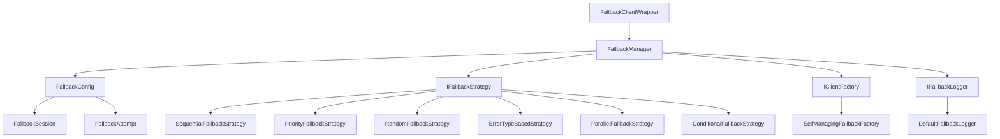

# LLM降级系统使用指南

## 概述

LLM降级系统是一个强大的容错机制，当主LLM客户端调用失败时，能够自动切换到备用模型，确保服务的连续性和可靠性。系统支持多种降级策略、详细的配置选项和完整的监控功能。

## 架构设计

### 核心组件

```
fallback_system/
├── __init__.py              # 模块导出和工厂函数
├── interfaces.py            # 接口定义
├── fallback_config.py       # 配置管理
├── fallback_manager.py      # 降级管理器
└── strategies.py            # 降级策略实现
```

### 架构图



## 降级策略详解

### 1. 顺序降级策略 (SequentialFallbackStrategy)

**描述**：按照预定义的顺序依次尝试降级模型。

**适用场景**：
- 有明确的模型优先级
- 成本控制（优先使用更便宜的模型）
- 性能要求（优先使用更快的模型）

**配置示例**：
```python
config = FallbackConfig(
    strategy_type="sequential",
    fallback_models=["gpt-3.5-turbo", "claude-instant", "gemini-pro"]
)
```

### 2. 优先级降级策略 (PriorityFallbackStrategy)

**描述**：根据错误类型选择最适合的降级模型。

**适用场景**：
- 不同模型对不同错误类型的处理能力不同
- 需要智能错误恢复

**配置示例**：
```python
priority_map = {
    "RateLimitError": ["claude-instant", "gemini-pro"],
    "TimeoutError": ["gpt-3.5-turbo", "claude-instant"],
    "AuthenticationError": ["gemini-pro", "claude-instant"]
}

strategy = PriorityFallbackStrategy(config, priority_map)
```

### 3. 随机降级策略 (RandomFallbackStrategy)

**描述**：从可用模型中随机选择进行降级。

**适用场景**：
- 负载均衡
- 避免单一模型过载
- 测试环境

**配置示例**：
```python
config = FallbackConfig(
    strategy_type="random",
    fallback_models=["gpt-3.5-turbo", "claude-instant", "gemini-pro"]
)
```

### 4. 基于错误类型的降级策略 (ErrorTypeBasedStrategy)

**描述**：根据具体的错误类型选择对应的降级模型。

**适用场景**：
- 复杂的错误处理逻辑
- 需要精细化的降级控制

**配置示例**：
```python
error_model_mapping = {
    "RateLimitError": ["claude-instant", "gemini-pro"],
    "TimeoutError": ["gpt-3.5-turbo"],
    "ServiceUnavailableError": ["gemini-pro", "claude-instant"]
}

strategy = ErrorTypeBasedStrategy(config, error_model_mapping)
```

### 5. 并行降级策略 (ParallelFallbackStrategy)

**描述**：同时调用多个降级模型，使用第一个返回的结果。

**适用场景**：
- 对响应时间要求极高
- 可以接受额外的资源消耗
- 需要最大化成功率

**配置示例**：
```python
config = FallbackConfig(
    strategy_type="parallel",
    fallback_models=["gpt-3.5-turbo", "claude-instant"],
    max_attempts=3
)

strategy = ParallelFallbackStrategy(config, timeout=30.0)
```

### 6. 条件降级策略 (ConditionalFallbackStrategy)

**描述**：基于自定义条件函数决定是否进行降级。

**适用场景**：
- 复杂的业务逻辑
- 需要动态判断降级条件

**配置示例**：
```python
from src.infrastructure.llm.fallback_system import ConditionalFallback

conditions = [
    ConditionalFallback.on_timeout,
    ConditionalFallback.on_rate_limit,
    ConditionalFallback.on_service_unavailable,
    lambda error: "overloaded" in str(error).lower()
]

strategy = ConditionalFallbackStrategy(config, conditions)
```

## 配置详解

### FallbackConfig 参数

| 参数 | 类型 | 默认值 | 描述 |
|------|------|--------|------|
| `enabled` | bool | True | 是否启用降级 |
| `max_attempts` | int | 3 | 最大尝试次数 |
| `fallback_models` | List[str] | [] | 降级模型列表 |
| `strategy_type` | str | "sequential" | 降级策略类型 |
| `error_mappings` | Dict[str, List[str]] | {} | 错误类型映射 |
| `base_delay` | float | 1.0 | 基础延迟时间（秒） |
| `max_delay` | float | 60.0 | 最大延迟时间（秒） |
| `exponential_base` | float | 2.0 | 指数退避基数 |
| `jitter` | bool | True | 是否添加随机抖动 |
| `fallback_on_status_codes` | List[int] | [429, 500, 502, 503, 504] | 触发降级的HTTP状态码 |
| `fallback_on_errors` | List[str] | ["timeout", "rate_limit", "service_unavailable", "overloaded_error"] | 触发降级的错误类型 |
| `provider_config` | Dict[str, Any] | {} | 提供商特定配置 |

### 配置示例

#### 基础配置
```python
from src.infrastructure.llm.fallback_system import FallbackConfig

config = FallbackConfig(
    enabled=True,
    fallback_models=["gpt-3.5-turbo", "claude-instant"],
    strategy_type="sequential",
    max_attempts=3
)
```

#### 高级配置
```python
config = FallbackConfig(
    enabled=True,
    fallback_models=["gpt-3.5-turbo", "claude-instant", "gemini-pro"],
    strategy_type="priority",
    max_attempts=5,
    base_delay=0.5,
    max_delay=30.0,
    exponential_base=1.5,
    jitter=True,
    fallback_on_status_codes=[429, 500, 502, 503, 504],
    fallback_on_errors=[
        "timeout", "rate_limit", "service_unavailable", 
        "overloaded_error", "authentication_error"
    ],
    error_mappings={
        "RateLimitError": ["claude-instant", "gemini-pro"],
        "TimeoutError": ["gpt-3.5-turbo"]
    }
)
```

## 使用方法

### 1. 基础使用

```python
from src.infrastructure.llm.fallback_client import FallbackClientWrapper
from src.infrastructure.llm.clients.openai_client import OpenAIClient

# 创建主客户端
primary_client = OpenAIClient(config)

# 创建降级包装器
fallback_wrapper = FallbackClientWrapper(
    primary_client=primary_client,
    fallback_models=["gpt-3.5-turbo", "claude-instant"],
    strategy_type="sequential",
    max_attempts=3
)

# 使用降级客户端
response = fallback_wrapper.generate(messages)
```

### 2. 高级使用

```python
from src.infrastructure.llm.fallback_system import (
    FallbackConfig, 
    create_fallback_manager,
    PriorityFallbackStrategy
)

# 创建自定义配置
config = FallbackConfig(
    enabled=True,
    fallback_models=["gpt-3.5-turbo", "claude-instant"],
    strategy_type="priority",
    max_attempts=4,
    base_delay=0.5,
    max_delay=20.0
)

# 创建优先级映射
priority_map = {
    "RateLimitError": ["claude-instant", "gemini-pro"],
    "TimeoutError": ["gpt-3.5-turbo"],
    "ServiceUnavailableError": ["gemini-pro"]
}

# 创建降级管理器
fallback_manager = create_fallback_manager(config)
fallback_manager._strategy = PriorityFallbackStrategy(config, priority_map)

# 使用降级管理器
response = await fallback_manager.generate_with_fallback_async(
    messages, 
    parameters={}, 
    primary_model="gpt-4"
)
```

### 3. 自定义客户端工厂

```python
from src.infrastructure.llm.fallback_system import IClientFactory, FallbackManager

class CustomClientFactory(IClientFactory):
    def __init__(self):
        self.clients = {}
    
    def create_client(self, model_name: str):
        if model_name not in self.clients:
            # 根据模型名称创建对应的客户端
            if "gpt" in model_name.lower():
                self.clients[model_name] = OpenAIClient(create_openai_config(model_name))
            elif "claude" in model_name.lower():
                self.clients[model_name] = AnthropicClient(create_anthropic_config(model_name))
            elif "gemini" in model_name.lower():
                self.clients[model_name] = GeminiClient(create_gemini_config(model_name))
            else:
                self.clients[model_name] = MockClient(model_name)
        
        return self.clients[model_name]
    
    def get_available_models(self) -> List[str]:
        return ["gpt-4", "gpt-3.5-turbo", "claude-instant", "gemini-pro"]

# 使用自定义工厂
factory = CustomClientFactory()
fallback_manager = FallbackManager(config, factory)
```

## 监控和统计

### 获取统计信息

```python
# 获取降级统计
stats = fallback_wrapper.get_fallback_stats()
print(f"总会话数: {stats['total_sessions']}")
print(f"成功率: {stats['success_rate']:.2%}")
print(f"降级使用率: {stats['fallback_rate']:.2%}")
print(f"平均尝试次数: {stats['average_attempts']:.1f}")
```

### 获取会话历史

```python
# 获取最近的降级会话
sessions = fallback_wrapper.get_fallback_sessions(limit=10)

for session in sessions:
    print(f"主模型: {session.primary_model}")
    print(f"成功: {session.success}")
    print(f"总尝试次数: {session.get_total_attempts()}")
    print(f"持续时间: {session.get_total_duration():.2f}秒")
    
    # 获取成功的尝试
    successful_attempt = session.get_successful_attempt()
    if successful_attempt:
        print(f"成功模型: {successful_attempt.fallback_model}")
```

### 重置统计信息

```python
# 重置降级统计
fallback_wrapper.reset_fallback_stats()
```

## 条件降级详解

### 内置条件函数

```python
from src.infrastructure.llm.fallback_system import ConditionalFallback

# 超时条件
ConditionalFallback.on_timeout(error)

# 频率限制条件
ConditionalFallback.on_rate_limit(error)

# 服务不可用条件
ConditionalFallback.on_service_unavailable(error)

# 认证错误条件
ConditionalFallback.on_authentication_error(error)

# 模型未找到条件
ConditionalFallback.on_model_not_found(error)

# Token限制条件
ConditionalFallback.on_token_limit(error)

# 内容过滤条件
ConditionalFallback.on_content_filter(error)

# 无效请求条件
ConditionalFallback.on_invalid_request(error)

# 任意错误条件
ConditionalFallback.on_any_error(error)

# 可重试错误条件
ConditionalFallback.on_retryable_error(error)
```

### 自定义条件函数

```python
def custom_condition(error: Exception) -> bool:
    """自定义条件函数"""
    error_str = str(error).lower()
    
    # 检查特定错误模式
    if "quota exceeded" in error_str:
        return True
    
    # 检查错误类型
    if isinstance(error, ConnectionError):
        return True
    
    # 检查状态码
    if hasattr(error, 'response') and error.response.status_code == 429:
        return True
    
    return False

# 使用自定义条件
conditions = [
    ConditionalFallback.on_timeout,
    custom_condition
]

strategy = ConditionalFallbackStrategy(config, conditions)
```

## 最佳实践

### 1. 模型选择策略

- **成本优先**：将更便宜的模型放在前面
- **性能优先**：将更快的模型放在前面
- **质量优先**：将质量更高的模型放在前面
- **混合策略**：根据不同场景选择不同模型

### 2. 错误处理

```python
try:
    response = fallback_wrapper.generate(messages)
except LLMFallbackError as e:
    # 所有降级都失败
    logger.error(f"所有LLM模型都不可用: {e}")
    # 实现备用逻辑，如缓存响应或返回默认响应
    return get_cached_or_default_response()
except Exception as e:
    # 其他错误
    logger.error(f"LLM调用发生意外错误: {e}")
    raise
```

### 3. 配置管理

```python
# 生产环境配置
production_config = FallbackConfig(
    enabled=True,
    fallback_models=["gpt-3.5-turbo", "claude-instant"],
    strategy_type="sequential",
    max_attempts=3,
    base_delay=1.0,
    max_delay=60.0
)

# 测试环境配置
test_config = FallbackConfig(
    enabled=True,
    fallback_models=["mock-model"],
    strategy_type="sequential",
    max_attempts=1,
    base_delay=0.1,
    max_delay=1.0
)

# 开发环境配置
development_config = FallbackConfig(
    enabled=False,  # 开发时可以关闭降级以便调试
    fallback_models=[],
    strategy_type="sequential",
    max_attempts=1
)
```

### 4. 监控和告警

```python
import time
from typing import Dict, Any

class FallbackMonitor:
    def __init__(self, fallback_wrapper):
        self.fallback_wrapper = fallback_wrapper
        self.last_check_time = time.time()
    
    def check_and_alert(self):
        """检查降级状态并发送告警"""
        stats = self.fallback_wrapper.get_fallback_stats()
        
        # 检查降级率
        if stats['fallback_rate'] > 0.5:  # 降级率超过50%
            self.send_alert(f"LLM降级率过高: {stats['fallback_rate']:.2%}")
        
        # 检查成功率
        if stats['success_rate'] < 0.9:  # 成功率低于90%
            self.send_alert(f"LLM成功率过低: {stats['success_rate']:.2%}")
        
        # 检查平均尝试次数
        if stats['average_attempts'] > 2.0:  # 平均尝试次数超过2次
            self.send_alert(f"LLM平均尝试次数过高: {stats['average_attempts']:.1f}")
    
    def send_alert(self, message: str):
        """发送告警"""
        # 实现告警逻辑，如发送邮件、短信或推送到监控系统
        print(f"ALERT: {message}")
        # logger.warning(f"LLM Fallback Alert: {message}")

# 使用监控器
monitor = FallbackMonitor(fallback_wrapper)
monitor.check_and_alert()
```

## 性能优化

### 1. 客户端缓存

```python
class CachedClientFactory(IClientFactory):
    def __init__(self):
        self._client_cache = {}
    
    def create_client(self, model_name: str):
        if model_name not in self._client_cache:
            self._client_cache[model_name] = self._create_new_client(model_name)
        return self._client_cache[model_name]
```

### 2. 连接池配置

```python
# 为不同的LLM提供商配置连接池
connection_pools = {
    "openai": HTTPConnectionPool(max_connections=10, max_keepalive=5),
    "anthropic": HTTPConnectionPool(max_connections=5, max_keepalive=3),
    "gemini": HTTPConnectionPool(max_connections=8, max_keepalive=4)
}
```

### 3. 异步优化

```python
# 使用异步策略提高并发性能
config = FallbackConfig(
    strategy_type="parallel",  # 并行策略
    fallback_models=["gpt-3.5-turbo", "claude-instant"],
    max_attempts=2
)

strategy = ParallelFallbackStrategy(config, timeout=10.0)  # 设置合理的超时时间
```

## 故障排除

### 常见问题

1. **降级不生效**
   - 检查 `enabled` 是否为 `True`
   - 检查 `fallback_models` 是否为空
   - 检查错误类型是否在 `fallback_on_errors` 中

2. **降级性能差**
   - 考虑使用并行策略
   - 优化客户端缓存
   - 调整延迟配置

3. **统计信息不准确**
   - 确保正确调用 `reset_fallback_stats()`
   - 检查会话记录是否正确保存

### 调试技巧

```python
# 启用详细日志
import logging
logging.getLogger('src.infrastructure.llm.fallback_system').setLevel(logging.DEBUG)

# 检查配置
print(fallback_wrapper.fallback_config.to_dict())

# 查看最近的会话
sessions = fallback_wrapper.get_fallback_sessions(limit=5)
for session in sessions:
    print(session.to_dict())
```

## 总结

LLM降级系统提供了强大而灵活的容错机制，通过合理的配置和策略选择，可以显著提高系统的可靠性和可用性。建议根据具体的业务需求和场景选择合适的降级策略，并建立完善的监控和告警机制。