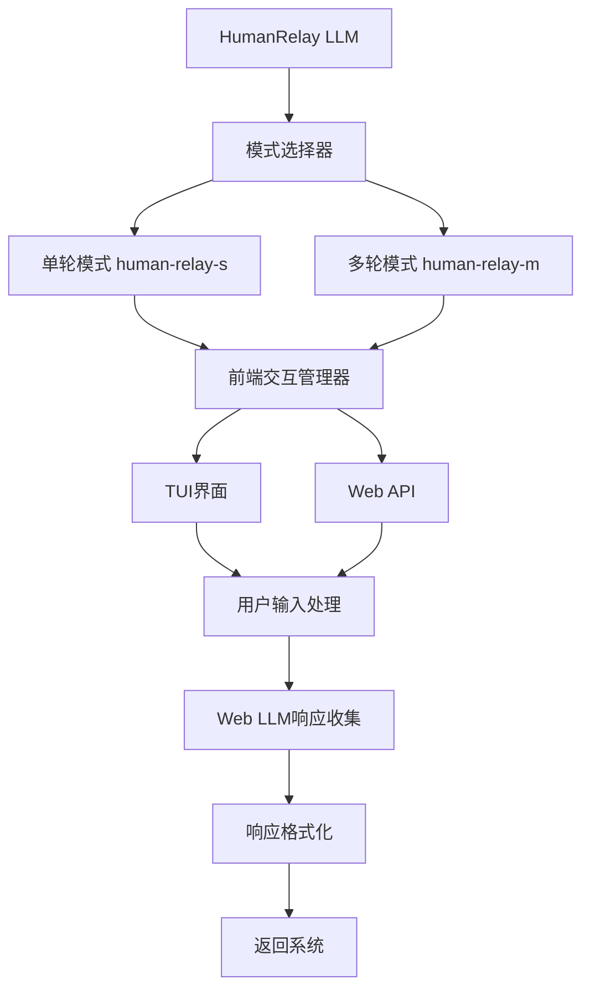

# HumanRelay LLM 实现方案

## 概述

HumanRelay LLM 是一个特殊的LLM客户端，它不直接调用API，而是通过前端界面与用户交互，让用户手动将提示词输入到Web端的LLM中，然后将回复粘贴回系统。这种设计适用于需要人工介入或无法直接访问API的场景。

## 架构设计

### 核心组件



### 接口兼容性

HumanRelay LLM 完全兼容现有的 [`ILLMClient`](src/infrastructure/llm/interfaces.py:22) 接口，可以无缝替换其他LLM提供商。

## 实现细节

### 1. HumanRelay客户端类

**文件位置**: `src/infrastructure/llm/clients/human_relay.py`

```python
from typing import List, Dict, Any, Optional, AsyncGenerator, Generator
from langchain_core.messages import BaseMessage

from .base import BaseLLMClient
from ..config import HumanRelayConfig
from ..models import LLMResponse, TokenUsage
from ..frontend_interface import FrontendInterface

class HumanRelayClient(BaseLLMClient):
    """HumanRelay LLM客户端实现"""
    
    def __init__(self, config: HumanRelayConfig):
        super().__init__(config)
        self.mode = config.mode  # "single" 或 "multi"
        self.frontend_interface = FrontendInterface(config.frontend_config)
        self.conversation_history: List[BaseMessage] = []
        self.max_history_length = config.max_history_length
        
    async def _do_generate_async(self, messages: List[BaseMessage], 
                               parameters: Dict[str, Any], **kwargs) -> LLMResponse:
        """异步生成实现"""
        if self.mode == "single":
            return await self._single_turn_generate(messages, parameters, **kwargs)
        else:
            return await self._multi_turn_generate(messages, parameters, **kwargs)
    
    async def _single_turn_generate(self, messages: List[BaseMessage],
                                  parameters: Dict[str, Any], **kwargs) -> LLMResponse:
        """单轮对话模式"""
        # 构建完整提示词
        full_prompt = self._build_full_prompt(messages)
        
        # 通过前端交互
        user_response = await self.frontend_interface.prompt_user(
            prompt=full_prompt,
            mode="single",
            parameters=parameters,
            timeout=parameters.get('frontend_timeout', 300)
        )
        
        # 创建响应
        return self._create_human_relay_response(user_response, messages)
    
    async def _multi_turn_generate(self, messages: List[BaseMessage],
                                 parameters: Dict[str, Any], **kwargs) -> LLMResponse:
        """多轮对话模式"""
        # 更新对话历史
        self._update_conversation_history(messages)
        
        # 构建增量提示词
        incremental_prompt = self._build_incremental_prompt(messages)
        
        # 通过前端交互
        user_response = await self.frontend_interface.prompt_user(
            prompt=incremental_prompt,
            mode="multi",
            conversation_history=self.conversation_history,
            parameters=parameters,
            timeout=parameters.get('frontend_timeout', 300)
        )
        
        # 创建响应
        return self._create_human_relay_response(user_response, messages)
```

### 2. 前端交互接口

**文件位置**: `src/infrastructure/llm/frontend_interface.py`

```python
import asyncio
from typing import Dict, Any, List, Optional
from langchain_core.messages import BaseMessage

class FrontendInterface:
    """前端交互抽象接口"""
    
    def __init__(self, config: Dict[str, Any]):
        self.config = config
        self.interface_type = config.get('interface_type', 'tui')  # tui 或 web
        
    async def prompt_user(self, prompt: str, mode: str, **kwargs) -> str:
        """显示提示词并等待用户输入"""
        if self.interface_type == 'tui':
            return await self._tui_prompt(prompt, mode, **kwargs)
        else:
            return await self._web_prompt(prompt, mode, **kwargs)
    
    async def _tui_prompt(self, prompt: str, mode: str, **kwargs) -> str:
        """TUI前端交互实现"""
        from src.presentation.tui.components.human_relay_panel import HumanRelayPanel
        
        panel = HumanRelayPanel()
        return await panel.show_prompt(prompt, mode, **kwargs)
    
    async def _web_prompt(self, prompt: str, mode: str, **kwargs) -> str:
        """Web前端交互实现"""
        # 通过WebSocket或HTTP与前端通信
        # 这里需要与前端框架集成
        raise NotImplementedError("Web前端交互暂未实现")
```

### 3. 配置系统

#### 基础配置类

**文件位置**: `src/infrastructure/llm/config.py`

```python
@dataclass
class HumanRelayConfig(LLMClientConfig):
    """HumanRelay特定配置"""
    
    mode: str = "single"  # single 或 multi
    frontend_config: Dict[str, Any] = field(default_factory=dict)
    max_history_length: int = 50
    prompt_template: str = field(default_factory=lambda: 
        "请将以下提示词输入到Web LLM中，并将回复粘贴回来：\n\n{prompt}\n\n回复：")
    incremental_prompt_template: str = field(default_factory=lambda:
        "请继续对话，将以下提示词输入到Web LLM中：\n\n{incremental_prompt}\n\n对话历史：\n{conversation_history}\n\n回复：")
    
    def __post_init__(self):
        if self.model_type != "human_relay":
            raise ValueError("HumanRelayConfig的model_type必须为'human_relay'")
```

#### YAML配置文件

**文件位置**: `configs/llms/provider/human_relay/common.yaml`

```yaml
# HumanRelay通用配置
model_type: human_relay
base_url: null  # 不使用API端点

parameters:
  mode: "single"  # single 或 multi
  frontend_timeout: 300  # 前端等待超时时间（秒）
  max_history_length: 50  # 多轮对话最大历史长度

# HumanRelay特定配置
human_relay_config:
  prompt_template: |
    请将以下提示词输入到Web LLM中，并将回复粘贴回来：
    
    {prompt}
    
    回复：
  incremental_prompt_template: |
    请继续对话，将以下提示词输入到Web LLM中：
    
    {incremental_prompt}
    
    对话历史：
    {conversation_history}
    
    回复：
  frontend_interface:
    interface_type: "tui"  # tui 或 web
    tui_config:
      prompt_style: "highlight"
      input_area_height: 10
    web_config:
      endpoint: "/api/human-relay"
      websocket: true

# 元数据
metadata:
  provider: human_relay
  version: "1.0"
  description: "HumanRelay LLM - 通过前端与Web LLM交互"
  capabilities:
    - human_interaction
    - web_llm_integration
    - configurable_modes
```

### 4. 工厂注册

**修改文件**: `src/infrastructure/llm/factory.py`

```python
def _register_default_clients(self):
    """注册默认客户端类型"""
    # ... 现有注册代码 ...
    
    try:
        from .clients.human_relay import HumanRelayClient
        self._client_types["human_relay"] = HumanRelayClient
        self._client_types["human-relay-s"] = HumanRelayClient  # 单轮模式别名
        self._client_types["human-relay-m"] = HumanRelayClient  # 多轮模式别名
    except ImportError:
        pass
```

## 使用示例

### 配置示例

#### 单轮模式配置
```yaml
# configs/llms/provider/human_relay/human-relay-s.yaml
inherits_from: "../common.yaml"
model_name: human-relay-s

parameters:
  mode: "single"

metadata:
  description: "HumanRelay单轮对话模式"
  capabilities:
    - human_interaction
    - web_llm_integration
```

#### 多轮模式配置
```yaml
# configs/llms/provider/human_relay/human-relay-m.yaml
inherits_from: "../common.yaml"
model_name: human-relay-m

parameters:
  mode: "multi"
  max_history_length: 100  # 扩展历史长度

metadata:
  description: "HumanRelay多轮对话模式"
  capabilities:
    - human_interaction
    - web_llm_integration
    - conversation_history
```

### 代码使用示例

```python
from src.infrastructure.llm.factory import create_client

# 创建HumanRelay客户端
config = {
    "model_type": "human-relay-s",  # 或 "human-relay-m"
    "model_name": "human-relay-s",
    "parameters": {
        "mode": "single",
        "frontend_timeout": 300
    }
}

client = create_client(config)

# 使用方式与其他LLM客户端完全相同
messages = [
    {"role": "user", "content": "请帮我分析这个代码..."}
]

response = await client.generate_async(messages)
print(response.content)
```

## 前端集成

### TUI集成

**文件位置**: `src/presentation/tui/components/human_relay_panel.py`

```python
class HumanRelayPanel:
    """HumanRelay专用TUI面板"""
    
    async def show_prompt(self, prompt: str, mode: str, **kwargs) -> str:
        """显示提示词并等待用户输入"""
        # 使用blessed库创建交互界面
        # 显示清晰的提示词区域
        # 提供文本输入区域
        # 支持超时和取消操作
        # 返回用户输入的Web LLM回复
        pass
```

### API集成

**文件位置**: `src/presentation/api/routers/human_relay.py`

```python
from fastapi import APIRouter, WebSocket

router = APIRouter(prefix="/human-relay", tags=["human-relay"])

@router.websocket("/ws")
async def human_relay_websocket(websocket: WebSocket):
    """HumanRelay WebSocket端点"""
    await websocket.accept()
    
    while True:
        data = await websocket.receive_json()
        # 处理前端交互
```

## 测试策略

### 单元测试

**文件位置**: `tests/unit/infrastructure/llm/test_human_relay.py`

```python
import pytest
from src.infrastructure.llm.clients.human_relay import HumanRelayClient

class TestHumanRelayClient:
    def test_single_turn_mode(self):
        """测试单轮对话模式"""
        pass
    
    def test_multi_turn_mode(self):
        """测试多轮对话模式"""
        pass
    
    def test_conversation_history_management(self):
        """测试对话历史管理"""
        pass
```

### 集成测试

**文件位置**: `tests/integration/test_human_relay_integration.py`

```python
class TestHumanRelayIntegration:
    def test_factory_registration(self):
        """测试工厂注册"""
        pass
    
    def test_config_loading(self):
        """测试配置加载"""
        pass
    
    def test_end_to_end_workflow(self):
        """测试端到端工作流"""
        pass
```

## 性能考虑

1. **前端响应时间**: 设置合理的超时时间（默认300秒）
2. **历史管理**: 多轮模式下的内存使用优化
3. **并发处理**: 支持多个HumanRelay实例并行运行
4. **错误处理**: 完善的超时和取消机制

## 扩展性设计

1. **插件化前端**: 支持不同的前端实现（TUI、Web、桌面应用等）
2. **模板系统**: 可配置的提示词模板
3. **历史存储**: 支持对话历史持久化
4. **监控指标**: 集成到现有的监控系统

## 总结

HumanRelay LLM 提供了一个创新的解决方案，通过人工介入的方式集成Web端LLM。它完全兼容现有架构，支持灵活的配置和扩展，为特殊使用场景提供了有价值的工具。

该实现遵循了项目的架构规范，使用了依赖注入、配置驱动等最佳实践，确保了代码的可维护性和可扩展性。