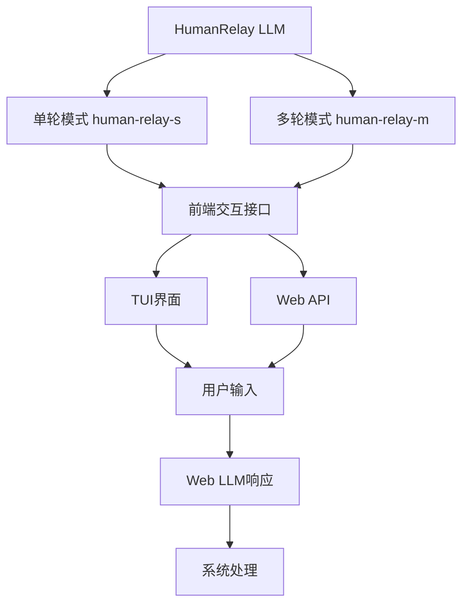

基于对现有代码库的深入分析，我现在为您提供一个详细的HumanRelay LLM实现方案。

## 现有架构分析

通过分析代码，我了解到：

1. **LLM架构**：项目使用标准的接口设计模式，有[`ILLMClient`](src/infrastructure/llm/interfaces.py:22)接口和[`BaseLLMClient`](src/infrastructure/llm/clients/base.py:24)基类
2. **配置系统**：支持YAML配置继承，如[`configs/llms/_group.yaml`](configs/llms/_group.yaml:1)和[`configs/llms/mock.yaml`](configs/llms/mock.yaml:1)
3. **工厂模式**：[`LLMFactory`](src/infrastructure/llm/factory.py:11)负责客户端创建和注册
4. **前端接口**：有TUI和API两种前端，TUI在[`src/presentation/tui/`](src/presentation/tui/)目录

## HumanRelay LLM实现方案

### 架构设计



### 核心实现组件

#### 1. HumanRelay客户端实现

```python
# src/infrastructure/llm/clients/human_relay.py
class HumanRelayClient(BaseLLMClient):
    """HumanRelay LLM客户端 - 通过前端与Web LLM交互"""
    
    def __init__(self, config: HumanRelayConfig):
        super().__init__(config)
        self.mode = config.mode  # "single" 或 "multi"
        self.frontend_interface = config.frontend_interface
        self.conversation_history = []  # 多轮对话历史
        
    async def _do_generate_async(self, messages, parameters):
        if self.mode == "single":
            return await self._single_turn_generate(messages, parameters)
        else:
            return await self._multi_turn_generate(messages, parameters)
```

#### 2. 单轮对话模式 (human-relay-s)

```python
async def _single_turn_generate(self, messages, parameters):
    """单轮对话模式 - 每次显示完整提示词"""
    # 构建完整提示词
    full_prompt = self._build_full_prompt(messages)
    
    # 通过前端接口显示提示词并等待用户输入
    user_response = await self.frontend_interface.prompt_user(
        prompt=full_prompt,
        mode="single",
        parameters=parameters
    )
    
    return self._create_response(user_response, messages)
```

#### 3. 多轮对话模式 (human-relay-m)

```python
async def _multi_turn_generate(self, messages, parameters):
    """多轮对话模式 - 增量提示词，保留历史"""
    # 构建增量提示词（仅最新消息）
    incremental_prompt = self._build_incremental_prompt(messages)
    
    # 更新对话历史
    self.conversation_history.extend(messages)
    
    # 通过前端接口显示增量提示词
    user_response = await self.frontend_interface.prompt_user(
        prompt=incremental_prompt,
        mode="multi",
        conversation_history=self.conversation_history,
        parameters=parameters
    )
    
    return self._create_response(user_response, messages)
```

#### 4. 前端交互接口

```python
# src/infrastructure/llm/frontend_interface.py
class FrontendInterface:
    """前端交互接口抽象类"""
    
    async def prompt_user(self, prompt: str, mode: str, **kwargs) -> str:
        """在前端显示提示词并等待用户输入"""
        if self._is_tui_mode():
            return await self._tui_prompt(prompt, mode, **kwargs)
        else:
            return await self._web_prompt(prompt, mode, **kwargs)
    
    async def _tui_prompt(self, prompt: str, mode: str, **kwargs) -> str:
        """TUI前端交互"""
        # 使用现有的TUI组件显示提示词
        from src.presentation.tui.components.input_panel import InputPanel
        panel = InputPanel()
        return await panel.show_human_relay_prompt(prompt, mode, **kwargs)
    
    async def _web_prompt(self, prompt: str, mode: str, **kwargs) -> str:
        """Web前端交互"""
        # 通过WebSocket或HTTP API与前端交互
        return await self._send_web_prompt(prompt, mode, **kwargs)
```

### 配置系统集成

#### 1. 配置文件模板

```yaml
# configs/llms/provider/human_relay/common.yaml
model_type: human_relay
base_url: null  # HumanRelay不使用API端点
headers: {}

parameters:
  mode: "single"  # single 或 multi
  frontend_timeout: 300  # 前端等待超时时间（秒）
  max_history_length: 50  # 多轮对话最大历史长度
  
# HumanRelay特定配置
human_relay_config:
  prompt_template: |
    请将以下提示词输入到Web LLM中，并将回复粘贴回来：
    
    {prompt}
    
    回复：
  incremental_prompt_template: |
    请继续对话，将以下提示词输入到Web LLM中：
    
    {incremental_prompt}
    
    对话历史：
    {conversation_history}
    
    回复：
```

#### 2. 具体配置示例

```yaml
# configs/llms/provider/human_relay/human-relay-s.yaml
inherits_from: "../common.yaml"
model_name: human-relay-s
parameters:
  mode: "single"

metadata:
  description: "HumanRelay单轮对话模式"
  capabilities:
    - human_interaction
    - web_llm_integration
```

```yaml
# configs/llms/provider/human_relay/human-relay-m.yaml  
inherits_from: "../common.yaml"
model_name: human-relay-m
parameters:
  mode: "multi"

metadata:
  description: "HumanRelay多轮对话模式"
  capabilities:
    - human_interaction
    - web_llm_integration
    - conversation_history
```

### 工厂注册

```python
# 在LLMFactory中注册
def _register_default_clients(self):
    # ... 现有注册代码 ...
    
    try:
        from .clients.human_relay import HumanRelayClient
        self._client_types["human_relay"] = HumanRelayClient
        self._client_types["human-relay-s"] = HumanRelayClient
        self._client_types["human-relay-m"] = HumanRelayClient
    except ImportError:
        pass
```

### 前端集成方案

#### TUI集成

```python
# src/presentation/tui/components/human_relay_panel.py
class HumanRelayPanel:
    """HumanRelay专用面板"""
    
    async def show_prompt(self, prompt: str, mode: str, **kwargs):
        """在TUI中显示HumanRelay提示词"""
        # 使用现有TUI组件显示提示词区域
        # 提供输入区域供用户粘贴Web LLM回复
        # 支持超时和取消操作
```

#### API集成

```python
# src/presentation/api/routers/human_relay.py
@router.post("/human-relay/prompt")
async def create_human_relay_prompt(request: HumanRelayRequest):
    """创建HumanRelay提示词"""
    return {
        "prompt": request.prompt,
        "mode": request.mode,
        "conversation_history": request.conversation_history
    }

@router.post("/human-relay/response")  
async def submit_human_relay_response(response: HumanRelayResponse):
    """提交HumanRelay响应"""
    # 处理用户提交的Web LLM回复
```

### 优势与特点

1. **无缝集成**：完全兼容现有LLM接口，无需修改现有代码
2. **灵活模式**：支持单轮和多轮两种交互模式
3. **前端友好**：提供TUI和Web两种前端交互方式
4. **配置驱动**：通过YAML配置灵活调整行为
5. **历史管理**：多轮模式自动维护对话历史