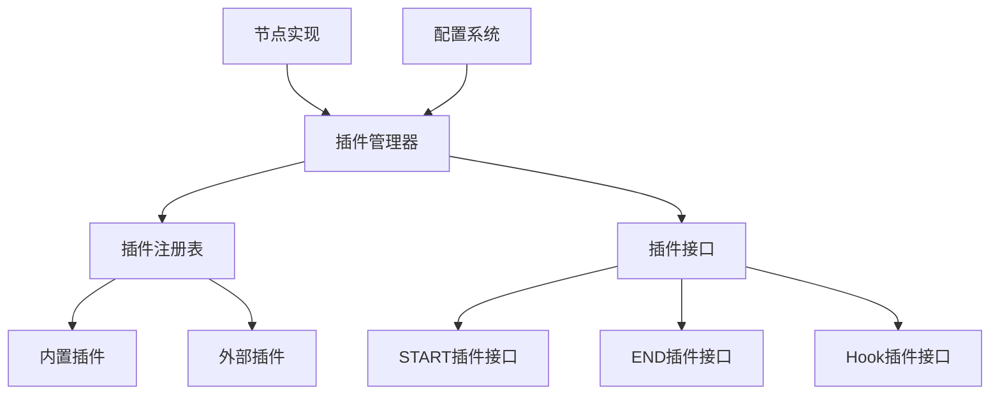

# 节点插件自定义指南

## 概述

本指南详细说明如何为Modular Agent Framework中的各种节点自定义插件，提供通用的插件开发框架和方法论。通过本指南，您将学会如何为任何节点类型创建、配置和集成自定义插件。

## 插件系统架构回顾

### 核心组件



### 插件类型

1. **START插件** - 在工作流开始时执行
2. **END插件** - 在工作流结束时执行
3. **Hook插件** - 在节点执行过程中拦截和增强

## 通用节点插件自定义框架

### 1. 插件接口选择

根据您的需求选择合适的插件接口：

#### IStartPlugin - 适用于初始化场景
```python
from infrastructure.graph.plugins.interfaces import IStartPlugin, PluginMetadata, PluginType

class CustomStartPlugin(IStartPlugin):
    @property
    def metadata(self) -> PluginMetadata:
        return PluginMetadata(
            name="custom_start",
            version="1.0.0",
            description="自定义START插件",
            author="developer",
            plugin_type=PluginType.START
        )
```

#### IEndPlugin - 适用于清理和总结场景
```python
from infrastructure.graph.plugins.interfaces import IEndPlugin, PluginMetadata, PluginType

class CustomEndPlugin(IEndPlugin):
    @property
    def metadata(self) -> PluginMetadata:
        return PluginMetadata(
            name="custom_end",
            version="1.0.0",
            description="自定义END插件",
            author="developer",
            plugin_type=PluginType.END
        )
```

#### IHookPlugin - 适用于节点执行过程中的增强
```python
from infrastructure.graph.plugins.interfaces import IHookPlugin, PluginMetadata, PluginType, HookPoint

class CustomHookPlugin(IHookPlugin):
    @property
    def metadata(self) -> PluginMetadata:
        return PluginMetadata(
            name="custom_hook",
            version="1.0.0",
            description="自定义Hook插件",
            author="developer",
            plugin_type=PluginType.HOOK,
            supported_hook_points=[HookPoint.BEFORE_EXECUTE, HookPoint.AFTER_EXECUTE]
        )
```

### 2. 插件开发模板

#### 基础插件模板
```python
"""自定义插件模板

复制此模板来创建新的插件。
"""

import logging
from typing import Dict, Any, Optional
from infrastructure.graph.plugins.interfaces import (
    IPlugin, IStartPlugin, IEndPlugin, IHookPlugin,
    PluginMetadata, PluginType, PluginContext, HookContext,
    HookPoint, HookExecutionResult
)

logger = logging.getLogger(__name__)


class CustomPluginTemplate(IPlugin):
    """自定义插件模板
    
    根据需要继承 IStartPlugin、IEndPlugin 或 IHookPlugin
    """
    
    def __init__(self):
        """初始化插件"""
        self._config = {}
        self._initialized = False
    
    @property
    def metadata(self) -> PluginMetadata:
        """获取插件元数据"""
        return PluginMetadata(
            name="custom_plugin",
            version="1.0.0",
            description="插件描述",
            author="开发者名称",
            plugin_type=PluginType.GENERIC,  # 根据实际类型修改
            dependencies=[],  # 依赖的其他插件
            config_schema={
                "type": "object",
                "properties": {
                    "custom_option": {
                        "type": "string",
                        "description": "自定义选项",
                        "default": "default_value"
                    }
                },
                "required": []
            }
        )
    
    def initialize(self, config: Dict[str, Any]) -> bool:
        """初始化插件
        
        Args:
            config: 插件配置
            
        Returns:
            bool: 初始化是否成功
        """
        try:
            self._config = {
                "custom_option": config.get("custom_option", "default_value")
            }
            
            # 执行初始化逻辑
            self._perform_initialization()
            
            self._initialized = True
            logger.debug(f"插件 {self.metadata.name} 初始化完成")
            return True
            
        except Exception as e:
            logger.error(f"插件 {self.metadata.name} 初始化失败: {e}")
            return False
    
    def execute(self, state: Dict[str, Any], context: PluginContext) -> Dict[str, Any]:
        """执行插件逻辑
        
        Args:
            state: 当前工作流状态
            context: 执行上下文
            
        Returns:
            Dict[str, Any]: 更新后的状态
        """
        if not self._initialized:
            logger.warning(f"插件 {self.metadata.name} 未初始化")
            return state
        
        try:
            # 执行插件逻辑
            updated_state = self._perform_execution(state, context)
            
            logger.debug(f"插件 {self.metadata.name} 执行完成")
            return updated_state
            
        except Exception as e:
            logger.error(f"插件 {self.metadata.name} 执行失败: {e}")
            # 根据策略决定是否抛出异常或返回原状态
            return state
    
    def cleanup(self) -> bool:
        """清理插件资源
        
        Returns:
            bool: 清理是否成功
        """
        try:
            # 执行清理逻辑
            self._perform_cleanup()
            
            self._config.clear()
            self._initialized = False
            logger.debug(f"插件 {self.metadata.name} 清理完成")
            return True
            
        except Exception as e:
            logger.error(f"插件 {self.metadata.name} 清理失败: {e}")
            return False
    
    def _perform_initialization(self) -> None:
        """执行初始化逻辑（子类重写）"""
        pass
    
    def _perform_execution(self, state: Dict[str, Any], context: PluginContext) -> Dict[str, Any]:
        """执行插件逻辑（子类重写）
        
        Args:
            state: 当前状态
            context: 执行上下文
            
        Returns:
            Dict[str, Any]: 更新后的状态
        """
        # 示例：添加自定义数据到状态
        state["custom_plugin_data"] = {
            "executed": True,
            "config": self._config,
            "timestamp": context.execution_start_time
        }
        return state
    
    def _perform_cleanup(self) -> None:
        """执行清理逻辑（子类重写）"""
        pass


class CustomHookPluginTemplate(IHookPlugin):
    """自定义Hook插件模板"""
    
    def __init__(self):
        """初始化Hook插件"""
        super().__init__()
        self._config = {}
        self._execution_service = None
    
    @property
    def metadata(self) -> PluginMetadata:
        """获取插件元数据"""
        return PluginMetadata(
            name="custom_hook_plugin",
            version="1.0.0",
            description="自定义Hook插件",
            author="开发者名称",
            plugin_type=PluginType.HOOK,
            supported_hook_points=[
                HookPoint.BEFORE_EXECUTE,
                HookPoint.AFTER_EXECUTE,
                HookPoint.ON_ERROR
            ],
            config_schema={
                "type": "object",
                "properties": {
                    "enabled": {
                        "type": "boolean",
                        "description": "是否启用插件",
                        "default": True
                    },
                    "intercept_errors": {
                        "type": "boolean",
                        "description": "是否拦截错误",
                        "default": False
                    }
                },
                "required": []
            }
        )
    
    def initialize(self, config: Dict[str, Any]) -> bool:
        """初始化Hook插件"""
        try:
            self._config = {
                "enabled": config.get("enabled", True),
                "intercept_errors": config.get("intercept_errors", False)
            }
            
            logger.debug(f"Hook插件 {self.metadata.name} 初始化完成")
            return True
            
        except Exception as e:
            logger.error(f"Hook插件 {self.metadata.name} 初始化失败: {e}")
            return False
    
    def execute(self, state: Dict[str, Any], context: PluginContext) -> Dict[str, Any]:
        """Hook插件通常不使用此方法"""
        return state
    
    def before_execute(self, context: HookContext) -> HookExecutionResult:
        """节点执行前Hook"""
        if not self._config.get("enabled", True):
            return HookExecutionResult(should_continue=True)
        
        try:
            # 执行前置逻辑
            result = self._perform_before_execute(context)
            
            logger.debug(f"Hook插件 {self.metadata.name} before_execute 完成")
            return result
            
        except Exception as e:
            logger.error(f"Hook插件 {self.metadata.name} before_execute 失败: {e}")
            return HookExecutionResult(should_continue=True)
    
    def after_execute(self, context: HookContext) -> HookExecutionResult:
        """节点执行后Hook"""
        if not self._config.get("enabled", True):
            return HookExecutionResult(should_continue=True)
        
        try:
            # 执行后置逻辑
            result = self._perform_after_execute(context)
            
            logger.debug(f"Hook插件 {self.metadata.name} after_execute 完成")
            return result
            
        except Exception as e:
            logger.error(f"Hook插件 {self.metadata.name} after_execute 失败: {e}")
            return HookExecutionResult(should_continue=True)
    
    def on_error(self, context: HookContext) -> HookExecutionResult:
        """错误处理Hook"""
        if not self._config.get("enabled", True):
            return HookExecutionResult(should_continue=True)
        
        try:
            # 执行错误处理逻辑
            result = self._perform_on_error(context)
            
            logger.debug(f"Hook插件 {self.metadata.name} on_error 完成")
            return result
            
        except Exception as e:
            logger.error(f"Hook插件 {self.metadata.name} on_error 失败: {e}")
            return HookExecutionResult(should_continue=True)
    
    def cleanup(self) -> bool:
        """清理Hook插件资源"""
        try:
            self._config.clear()
            self._execution_service = None
            logger.debug(f"Hook插件 {self.metadata.name} 清理完成")
            return True
            
        except Exception as e:
            logger.error(f"Hook插件 {self.metadata.name} 清理失败: {e}")
            return False
    
    def set_execution_service(self, service) -> None:
        """设置执行服务"""
        self._execution_service = service
    
    def _perform_before_execute(self, context: HookContext) -> HookExecutionResult:
        """执行前置逻辑（子类重写）"""
        # 示例：记录执行开始时间
        if not context.metadata:
            context.metadata = {}
        context.metadata["custom_hook_start_time"] = context.execution_start_time
        
        return HookExecutionResult(should_continue=True)
    
    def _perform_after_execute(self, context: HookContext) -> HookExecutionResult:
        """执行后置逻辑（子类重写）"""
        # 示例：记录执行结束时间
        if not context.metadata:
            context.metadata = {}
        context.metadata["custom_hook_end_time"] = context.execution_start_time
        
        return HookExecutionResult(should_continue=True)
    
    def _perform_on_error(self, context: HookContext) -> HookExecutionResult:
        """执行错误处理逻辑（子类重写）"""
        if self._config.get("intercept_errors", False):
            # 拦截错误并尝试恢复
            return HookExecutionResult(
                should_continue=True,
                metadata={"error_intercepted": True}
            )
        
        return HookExecutionResult(should_continue=True)
```

### 3. 节点插件集成方法

#### 方法一：直接集成（适用于START/END节点）
```python
from infrastructure.graph.plugins.manager import PluginManager
from infrastructure.graph.plugins.interfaces import PluginType, PluginContext

class CustomNode(BaseNode):
    """自定义节点 - 直接集成插件"""
    
    def __init__(self, plugin_config_path: str = None):
        self.plugin_manager = PluginManager(plugin_config_path)
        self._initialized = False
    
    def execute(self, state: WorkflowState, config: Dict[str, Any]) -> NodeExecutionResult:
        """执行节点逻辑"""
        self._ensure_initialized()
        
        # 创建插件上下文
        context = PluginContext(
            workflow_id=state.get('workflow_id', 'unknown'),
            thread_id=state.get('thread_id'),
            session_id=state.get('session_id'),
            execution_start_time=time.time(),
            metadata=config.get('context_metadata', {})
        )
        
        # 执行插件
        updated_state = self.plugin_manager.execute_plugins(
            PluginType.START,  # 或 PluginType.END
            state,
            context
        )
        
        # 执行节点核心逻辑
        result = self._execute_core_logic(updated_state, config)
        
        return result
    
    def _ensure_initialized(self) -> None:
        """确保插件管理器已初始化"""
        if not self._initialized:
            if not self.plugin_manager.initialize():
                raise RuntimeError("插件管理器初始化失败")
            self._initialized = True
    
    def _execute_core_logic(self, state: WorkflowState, config: Dict[str, Any]) -> NodeExecutionResult:
        """执行核心逻辑（子类重写）"""
        # 实现节点的核心业务逻辑
        return NodeExecutionResult(state=state, next_node=None)
```

#### 方法二：Hook集成（适用于任何节点）
```python
from infrastructure.graph.plugins.manager import PluginManager
from infrastructure.graph.plugins.interfaces import HookContext, HookPoint

class CustomNodeWithHooks(BaseNode):
    """自定义节点 - Hook集成"""
    
    def __init__(self, plugin_config_path: str = None):
        self.plugin_manager = PluginManager(plugin_config_path)
        self._initialized = False
    
    def execute(self, state: WorkflowState, config: Dict[str, Any]) -> NodeExecutionResult:
        """执行节点逻辑（带Hook支持）"""
        self._ensure_initialized()
        
        # 使用统一的Hook执行接口
        return self.plugin_manager.execute_with_hooks(
            node_type=self.node_type,
            state=state,
            config=config,
            node_executor_func=self._execute_core_logic
        )
    
    def _execute_core_logic(self, state: WorkflowState, config: Dict[str, Any]) -> NodeExecutionResult:
        """执行核心逻辑（子类重写）"""
        # 实现节点的核心业务逻辑
        # 这个方法会被Hook包装器调用
        return NodeExecutionResult(state=state, next_node=None)
```

#### 方法三：选择性集成（适用于现有节点改造）
```python
class ExistingNodeEnhanced(BaseNode):
    """现有节点增强版 - 选择性集成插件"""
    
    def __init__(self, original_node, plugin_config_path: str = None):
        """包装现有节点"""
        self.original_node = original_node
        self.plugin_manager = PluginManager(plugin_config_path) if plugin_config_path else None
        self._initialized = False
    
    @property
    def node_type(self) -> str:
        return self.original_node.node_type
    
    def execute(self, state: WorkflowState, config: Dict[str, Any]) -> NodeExecutionResult:
        """执行增强的节点逻辑"""
        if self.plugin_manager:
            # 使用插件增强
            return self.plugin_manager.execute_with_hooks(
                node_type=self.node_type,
                state=state,
                config=config,
                node_executor_func=self.original_node.execute
            )
        else:
            # 使用原始逻辑
            return self.original_node.execute(state, config)
```

### 4. 插件配置管理

#### 配置文件结构
```yaml
# custom_plugin_config.yaml
start_plugins:
  builtin:
    - name: "context_summary"
      enabled: true
      priority: 10
      config:
        max_summary_length: 1000
  
  external:
    - name: "custom_data_collector"
      enabled: true
      priority: 15
      module: "my_plugins.custom"
      class: "CustomDataCollectorPlugin"
      config:
        data_sources: ["database", "api", "file"]
        cache_enabled: true

end_plugins:
  builtin:
    - name: "result_summary"
      enabled: true
      priority: 10
      config:
        output_format: "json"
  
  external:
    - name: "custom_report_generator"
      enabled: true
      priority: 5
      module: "my_plugins.reports"
      class: "CustomReportGeneratorPlugin"
      config:
        template_path: "./templates/report.html"
        output_directory: "./output"

hook_plugins:
  global:
    - name: "performance_monitoring"
      enabled: true
      priority: 10
      config:
        timeout_threshold: 30.0
    
    - name: "custom_audit_logger"
      enabled: true
      priority: 20
      module: "my_plugins.audit"
      class: "AuditLoggerPlugin"
      config:
        log_level: "INFO"
        log_file: "./audit.log"
  
  node_specific:
    llm_node:
      - name: "custom_prompt_enhancer"
        enabled: true
        priority: 5
        module: "my_plugins.llm"
        class: "PromptEnhancerPlugin"
        config:
          enhancement_rules: ["add_context", "format_output"]
    
    tool_node:
      - name: "custom_tool_validator"
        enabled: true
        priority: 10
        module: "my_plugins.tools"
        class: "ToolValidatorPlugin"
        config:
          validation_rules: ["check_permissions", "validate_args"]

execution:
  parallel_execution: false
  max_parallel_plugins: 3
  error_handling:
    continue_on_error: true
    log_errors: true
    fail_on_critical_error: false
  timeout:
    default_timeout: 30
    per_plugin_timeout: 60
```

#### 动态配置加载
```python
class ConfigurablePluginNode(BaseNode):
    """可配置插件节点"""
    
    def __init__(self, config_source: str = None):
        """
        Args:
            config_source: 配置来源，可以是文件路径、字典或配置加载器
        """
        self.config_source = config_source
        self.plugin_manager = None
        self._initialized = False
    
    def _load_plugin_config(self) -> Dict[str, Any]:
        """加载插件配置"""
        if isinstance(self.config_source, str):
            # 从文件加载
            import yaml
            with open(self.config_source, 'r', encoding='utf-8') as f:
                return yaml.safe_load(f)
        elif isinstance(self.config_source, dict):
            # 直接使用字典
            return self.config_source
        elif hasattr(self.config_source, 'load_config'):
            # 使用配置加载器
            return self.config_source.load_config()
        else:
            # 使用默认配置
            return self._get_default_plugin_config()
    
    def _get_default_plugin_config(self) -> Dict[str, Any]:
        """获取默认插件配置"""
        return {
            "start_plugins": {"builtin": [], "external": []},
            "end_plugins": {"builtin": [], "external": []},
            "hook_plugins": {"global": [], "node_specific": {}},
            "execution": {
                "parallel_execution": False,
                "error_handling": {"continue_on_error": True}
            }
        }
```

### 5. 插件开发最佳实践

#### 5.1 错误处理策略
```python
class RobustPlugin(IPlugin):
    """健壮的插件实现"""
    
    def execute(self, state: Dict[str, Any], context: PluginContext) -> Dict[str, Any]:
        """带错误处理的执行"""
        try:
            # 验证输入
            self._validate_inputs(state, context)
            
            # 执行核心逻辑
            result = self._execute_with_fallback(state, context)
            
            # 验证输出
            self._validate_outputs(result)
            
            return result
            
        except ValidationError as e:
            logger.error(f"插件 {self.metadata.name} 验证失败: {e}")
            return self._handle_validation_error(state, context, e)
        except ExecutionError as e:
            logger.error(f"插件 {self.metadata.name} 执行失败: {e}")
            return self._handle_execution_error(state, context, e)
        except Exception as e:
            logger.error(f"插件 {self.metadata.name} 未知错误: {e}")
            return self._handle_unknown_error(state, context, e)
    
    def _validate_inputs(self, state: Dict[str, Any], context: PluginContext) -> None:
        """验证输入参数"""
        required_fields = self.metadata.config_schema.get("required", [])
        for field in required_fields:
            if field not in state:
                raise ValidationError(f"缺少必需字段: {field}")
    
    def _execute_with_fallback(self, state: Dict[str, Any], context: PluginContext) -> Dict[str, Any]:
        """带回退机制的执行"""
        try:
            return self._execute_primary_logic(state, context)
        except Exception as e:
            logger.warning(f"主要逻辑失败，尝试回退逻辑: {e}")
            return self._execute_fallback_logic(state, context)
    
    def _execute_primary_logic(self, state: Dict[str, Any], context: PluginContext) -> Dict[str, Any]:
        """主要执行逻辑"""
        # 实现主要逻辑
        pass
    
    def _execute_fallback_logic(self, state: Dict[str, Any], context: PluginContext) -> Dict[str, Any]:
        """回退执行逻辑"""
        # 实现回退逻辑
        pass
```

#### 5.2 性能优化
```python
class OptimizedPlugin(IPlugin):
    """性能优化的插件"""
    
    def __init__(self):
        super().__init__()
        self._cache = {}
        self._performance_metrics = {}
    
    def execute(self, state: Dict[str, Any], context: PluginContext) -> Dict[str, Any]:
        """性能优化的执行"""
        start_time = time.time()
        
        # 检查缓存
        cache_key = self._generate_cache_key(state, context)
        if cache_key in self._cache:
            logger.debug(f"使用缓存结果: {cache_key}")
            return self._cache[cache_key]
        
        # 执行逻辑
        result = self._execute_optimized(state, context)
        
        # 缓存结果
        if self._should_cache(result):
            self._cache[cache_key] = result
        
        # 记录性能指标
        execution_time = time.time() - start_time
        self._record_performance_metrics(execution_time)
        
        return result
    
    def _generate_cache_key(self, state: Dict[str, Any], context: PluginContext) -> str:
        """生成缓存键"""
        import hashlib
        import json
        
        # 创建状态和上下文的哈希
        data = {
            "state_hash": hashlib.md5(json.dumps(state, sort_keys=True).encode()).hexdigest(),
            "context_hash": hashlib.md5(json.dumps(context.__dict__, sort_keys=True).encode()).hexdigest()
        }
        return hashlib.md5(json.dumps(data).encode()).hexdigest()
    
    def _should_cache(self, result: Dict[str, Any]) -> bool:
        """判断是否应该缓存结果"""
        # 实现缓存策略
        return True
    
    def _record_performance_metrics(self, execution_time: float) -> None:
        """记录性能指标"""
        plugin_name = self.metadata.name
        if plugin_name not in self._performance_metrics:
            self._performance_metrics[plugin_name] = {
                "total_executions": 0,
                "total_time": 0.0,
                "min_time": float('inf'),
                "max_time": 0.0
            }
        
        metrics = self._performance_metrics[plugin_name]
        metrics["total_executions"] += 1
        metrics["total_time"] += execution_time
        metrics["min_time"] = min(metrics["min_time"], execution_time)
        metrics["max_time"] = max(metrics["max_time"], execution_time)
```

#### 5.3 资源管理
```python
class ResourceManagedPlugin(IPlugin):
    """资源管理的插件"""
    
    def __init__(self):
        super().__init__()
        self._resources = {}
        self._cleanup_registered = False
    
    def initialize(self, config: Dict[str, Any]) -> bool:
        """初始化并注册资源"""
        try:
            # 分配资源
            self._allocate_resources(config)
            
            # 注册清理函数
            if not self._cleanup_registered:
                import atexit
                atexit.register(self.cleanup)
                self._cleanup_registered = True
            
            return True
            
        except Exception as e:
            logger.error(f"插件初始化失败: {e}")
            self._cleanup_resources()
            return False
    
    def _allocate_resources(self, config: Dict[str, Any]) -> None:
        """分配资源"""
        # 示例：分配数据库连接
        if config.get("database_enabled", False):
            self._resources["db_connection"] = self._create_database_connection(config)
        
        # 示例：分配文件句柄
        if config.get("file_logging", False):
            self._resources["log_file"] = open(config.get("log_file_path", "plugin.log"), "a")
    
    def cleanup(self) -> bool:
        """清理资源"""
        try:
            self._cleanup_resources()
            return True
        except Exception as e:
            logger.error(f"资源清理失败: {e}")
            return False
    
    def _cleanup_resources(self) -> None:
        """清理所有资源"""
        for resource_name, resource in self._resources.items():
            try:
                if hasattr(resource, 'close'):
                    resource.close()
                elif hasattr(resource, 'cleanup'):
                    resource.cleanup()
                logger.debug(f"资源 {resource_name} 清理完成")
            except Exception as e:
                logger.error(f"清理资源 {resource_name} 失败: {e}")
        
        self._resources.clear()
```

### 6. 插件测试框架

#### 单元测试模板
```python
import unittest
from unittest.mock import Mock, patch
from infrastructure.graph.plugins.interfaces import PluginContext, HookContext, HookPoint

class CustomPluginTest(unittest.TestCase):
    """自定义插件测试"""
    
    def setUp(self):
        """测试设置"""
        self.plugin = CustomPlugin()
        self.test_config = {
            "custom_option": "test_value"
        }
        self.test_state = {
            "test_data": "sample"
        }
        self.test_context = PluginContext(
            workflow_id="test_workflow",
            thread_id="test_thread",
            session_id="test_session"
        )
    
    def test_plugin_initialization(self):
        """测试插件初始化"""
        result = self.plugin.initialize(self.test_config)
        self.assertTrue(result)
        self.assertEqual(self.plugin._config["custom_option"], "test_value")
    
    def test_plugin_execution(self):
        """测试插件执行"""
        self.plugin.initialize(self.test_config)
        result = self.plugin.execute(self.test_state, self.test_context)
        
        self.assertIn("custom_plugin_data", result)
        self.assertTrue(result["custom_plugin_data"]["executed"])
    
    def test_plugin_cleanup(self):
        """测试插件清理"""
        self.plugin.initialize(self.test_config)
        result = self.plugin.cleanup()
        self.assertTrue(result)
        self.assertFalse(self.plugin._initialized)
    
    def test_error_handling(self):
        """测试错误处理"""
        # 测试无效配置
        invalid_config = {"invalid_key": "value"}
        result = self.plugin.initialize(invalid_config)
        # 根据插件逻辑断言结果
    
    def test_performance(self):
        """测试性能"""
        import time
        
        self.plugin.initialize(self.test_config)
        
        start_time = time.time()
        for _ in range(1000):
            self.plugin.execute(self.test_state, self.test_context)
        execution_time = time.time() - start_time
        
        # 断言性能要求
        self.assertLess(execution_time, 1.0)  # 1000次执行应在1秒内完成


class CustomHookPluginTest(unittest.TestCase):
    """自定义Hook插件测试"""
    
    def setUp(self):
        """测试设置"""
        self.plugin = CustomHookPlugin()
        self.test_config = {
            "enabled": True,
            "intercept_errors": False
        }
        self.test_state = {
            "test_data": "sample"
        }
        self.test_hook_context = HookContext(
            node_type="test_node",
            state=self.test_state,
            config={},
            hook_point=HookPoint.BEFORE_EXECUTE
        )
    
    def test_before_execute_hook(self):
        """测试前置执行Hook"""
        self.plugin.initialize(self.test_config)
        result = self.plugin.before_execute(self.test_hook_context)
        
        self.assertTrue(result.should_continue)
        self.assertIn("custom_hook_start_time", self.test_hook_context.metadata)
    
    def test_after_execute_hook(self):
        """测试后置执行Hook"""
        self.plugin.initialize(self.test_config)
        result = self.plugin.after_execute(self.test_hook_context)
        
        self.assertTrue(result.should_continue)
        self.assertIn("custom_hook_end_time", self.test_hook_context.metadata)
    
    def test_on_error_hook(self):
        """测试错误处理Hook"""
        self.plugin.initialize(self.test_config)
        self.test_hook_context.error = Exception("Test error")
        
        result = self.plugin.on_error(self.test_hook_context)
        self.assertTrue(result.should_continue)
    
    def test_hook_disabled(self):
        """测试Hook禁用状态"""
        disabled_config = {"enabled": False}
        self.plugin.initialize(disabled_config)
        
        result = self.plugin.before_execute(self.test_hook_context)
        self.assertTrue(result.should_continue)
        # 验证没有执行Hook逻辑
```

#### 集成测试模板
```python
class PluginIntegrationTest(unittest.TestCase):
    """插件集成测试"""
    
    def setUp(self):
        """测试设置"""
        self.plugin_manager = PluginManager()
        self.test_config = {
            "start_plugins": {
                "builtin": [
                    {"name": "context_summary", "enabled": True, "priority": 10}
                ],
                "external": [
                    {
                        "name": "custom_test_plugin",
                        "enabled": True,
                        "priority": 20,
                        "module": "test_plugins.custom",
                        "class": "TestCustomPlugin",
                        "config": {"test_option": "test_value"}
                    }
                ]
            }
        }
        self.plugin_manager.plugin_configs = self.test_config
    
    def test_plugin_loading(self):
        """测试插件加载"""
        result = self.plugin_manager.initialize()
        self.assertTrue(result)
        
        # 验证插件已加载
        plugins = self.plugin_manager.get_enabled_plugins(PluginType.START)
        self.assertGreater(len(plugins), 0)
    
    def test_plugin_execution(self):
        """测试插件执行"""
        self.plugin_manager.initialize()
        
        test_state = {"test_data": "sample"}
        test_context = PluginContext(workflow_id="test_workflow")
        
        result = self.plugin_manager.execute_plugins(
            PluginType.START,
            test_state,
            test_context
        )
        
        # 验证执行结果
        self.assertIn("context_summary", result)
        self.assertIn("custom_test_plugin_data", result)
    
    def test_hook_execution(self):
        """测试Hook执行"""
        self.plugin_manager.initialize()
        
        test_state = {"test_data": "sample"}
        test_context = HookContext(
            node_type="test_node",
            state=test_state,
            config={},
            hook_point=HookPoint.BEFORE_EXECUTE
        )
        
        result = self.plugin_manager.execute_hooks(
            HookPoint.BEFORE_EXECUTE,
            test_context
        )
        
        self.assertTrue(result.should_continue)
```

### 7. 插件部署和分发

#### 7.1 插件包结构
```
my_plugin_package/
├── __init__.py
├── setup.py
├── README.md
├── requirements.txt
├── my_plugin_package/
│   ├── __init__.py
│   ├── plugins/
│   │   ├── __init__.py
│   │   ├── custom_plugin.py
│   │   └── hook_plugin.py
│   ├── config/
│   │   ├── __init__.py
│   │   └── default_config.yaml
│   └── utils/
│       ├── __init__.py
│       └── helpers.py
└── tests/
    ├── __init__.py
    ├── test_custom_plugin.py
    └── test_hook_plugin.py
```

#### 7.2 setup.py 配置
```python
from setuptools import setup, find_packages

setup(
    name="my-plugin-package",
    version="1.0.0",
    description="自定义插件包",
    author="开发者名称",
    author_email="developer@example.com",
    packages=find_packages(),
    install_requires=[
        "modular-agent-framework>=1.0.0",
        "pyyaml>=6.0",
        "requests>=2.25.0"
    ],
    extras_require={
        "dev": [
            "pytest>=6.0",
            "pytest-cov>=2.0",
            "black>=21.0",
            "mypy>=0.800"
        ]
    },
    entry_points={
        "modular_agent.plugins": [
            "custom_plugin = my_plugin_package.plugins.custom_plugin:CustomPlugin",
            "hook_plugin = my_plugin_package.plugins.hook_plugin:CustomHookPlugin"
        ]
    },
    classifiers=[
        "Development Status :: 4 - Beta",
        "Intended Audience :: Developers",
        "License :: OSI Approved :: MIT License",
        "Programming Language :: Python :: 3.8",
        "Programming Language :: Python :: 3.9",
        "Programming Language :: Python :: 3.10"
    ]
)
```

#### 7.3 插件注册脚本
```python
#!/usr/bin/env python3
"""插件注册脚本"""

import sys
import argparse
from pathlib import Path

def register_plugin(plugin_name: str, module_path: str, class_name: str, config_file: str = None):
    """注册插件到系统"""
    try:
        # 导入插件管理器
        from infrastructure.graph.plugins.manager import PluginManager
        from infrastructure.graph.plugins.registry import PluginRegistry
        
        # 动态导入插件
        import importlib
        module = importlib.import_module(module_path)
        plugin_class = getattr(module, class_name)
        plugin = plugin_class()
        
        # 注册插件
        registry = PluginRegistry()
        success = registry.register_plugin(plugin)
        
        if success:
            print(f"插件 {plugin_name} 注册成功")
            
            # 如果提供了配置文件，更新配置
            if config_file and Path(config_file).exists():
                update_plugin_config(plugin_name, config_file)
        else:
            print(f"插件 {plugin_name} 注册失败")
            sys.exit(1)
            
    except Exception as e:
        print(f"注册插件时发生错误: {e}")
        sys.exit(1)

def update_plugin_config(plugin_name: str, config_file: str):
    """更新插件配置"""
    import yaml
    
    try:
        with open(config_file, 'r', encoding='utf-8') as f:
            config = yaml.safe_load(f)
        
        # 更新配置（示例逻辑）
        if "external" not in config.get("start_plugins", {}):
            config["start_plugins"]["external"] = []
        
        config["start_plugins"]["external"].append({
            "name": plugin_name,
            "enabled": True,
            "module": plugin_name,
            "class": plugin_name.capitalize(),
            "config": {}
        })
        
        with open(config_file, 'w', encoding='utf-8') as f:
            yaml.dump(config, f, default_flow_style=False, allow_unicode=True)
        
        print(f"插件配置已更新: {config_file}")
        
    except Exception as e:
        print(f"更新配置时发生错误: {e}")

def main():
    """主函数"""
    parser = argparse.ArgumentParser(description="插件注册工具")
    parser.add_argument("plugin_name", help="插件名称")
    parser.add_argument("module_path", help="插件模块路径")
    parser.add_argument("class_name", help="插件类名")
    parser.add_argument("--config", help="配置文件路径")
    
    args = parser.parse_args()
    
    register_plugin(args.plugin_name, args.module_path, args.class_name, args.config)

if __name__ == "__main__":
    main()
```

## 总结

通过本指南，您应该能够：

1. **理解插件系统架构** - 掌握插件管理器、注册表和接口的关系
2. **选择合适的插件类型** - 根据需求选择START、END或Hook插件
3. **开发自定义插件** - 使用提供的模板和最佳实践
4. **集成插件到节点** - 通过多种方法将插件集成到现有节点
5. **管理插件配置** - 使用灵活的配置系统
6. **测试和部署插件** - 确保插件质量和可维护性

### 关键要点

- **模块化设计** - 每个插件应该专注于单一职责
- **错误处理** - 实现健壮的错误处理和回退机制
- **性能考虑** - 使用缓存和资源管理优化性能
- **配置驱动** - 通过配置文件控制插件行为
- **测试覆盖** - 编写全面的单元测试和集成测试
- **文档完善** - 提供清晰的插件文档和使用示例

通过遵循这些指南和最佳实践，您可以创建高质量、可维护的插件，为Modular Agent Framework添加强大的扩展功能。