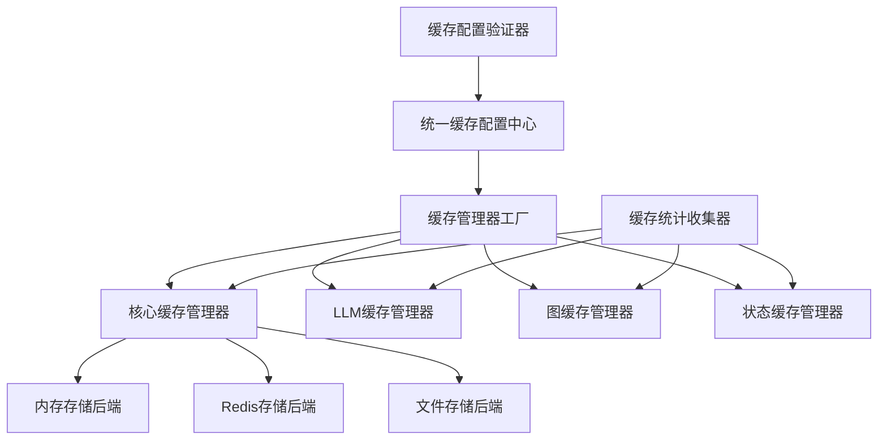

# 项目缓存配置分析报告

## 执行摘要

本报告分析了当前项目中分散的缓存配置，并提出了如何复原core/common目录提供的缓存功能的详细方案。通过深入分析，我们发现了多个独立的缓存实现，存在功能重复、配置分散和维护困难等问题。

## 1. 当前项目中分散的缓存配置分析

### 1.1 缓存配置分布情况

通过分析项目代码和配置文件，我们发现缓存配置分散在以下位置：

#### 配置文件中的缓存设置：
- **configs/state_management.yaml**: 状态管理缓存配置
- **configs/application.yaml**: 应用程序级缓存配置
- **configs/llms/provider/gemini/common.yaml**: Gemini LLM缓存配置
- **configs/llms/provider/anthropic/common.yaml**: Anthropic LLM缓存配置
- **configs/llms/tokens_counter/_group.yaml**: Token计数器缓存配置
- **configs/prompts.yaml**: 提示词缓存配置
- **configs/history/replay.yaml**: 历史回放缓存配置
- **configs/storage.yaml**: 存储缓存配置

#### 代码中的缓存实现：
- **src/core/common/cache.py**: 核心缓存管理器
- **src/core/llm/cache/cache_manager.py**: LLM专用缓存管理器
- **src/core/state/utils/state_cache_adapter.py**: 状态缓存适配器
- **src/core/workflow/registry/graph_cache.py**: 图缓存管理器
- **src/services/prompts/config_processor.py**: 提示词配置处理器

### 1.2 缓存配置类型分析

#### 1.2.1 基础缓存配置
```yaml
cache:
  enabled: true
  max_size: 1000
  ttl: 300
  eviction_policy: "lru"
  enable_serialization: false
  serialization_format: "json"
```

#### 1.2.2 LLM缓存配置
```yaml
cache_config:
  enabled: true
  ttl_seconds: 3600
  max_size: 1000
  cache_type: "content_cache"
  
cache_parameters:
  content_cache:
    enabled: true
    ttl: "3600s"
    display_name: null
    system_instruction: null
```

#### 1.2.3 提示词缓存配置
```yaml
loading:
  cache_enabled: true
  cache_ttl: 3600
```

## 2. core/common目录提供的缓存功能识别

### 2.1 核心缓存管理器 (CacheManager)

**位置**: `src/core/common/cache.py`

**主要功能**:
- 统一的缓存存储机制
- 支持多种缓存策略 (TTL, LRU)
- 异步和同步接口支持
- 序列化和压缩支持
- 统计信息收集
- 后台清理任务

**核心特性**:
```python
class CacheManager:
    def __init__(self, max_size=1000, default_ttl=3600, 
                 enable_serialization=False, serialization_format="json")
    
    async def get(self, key: str, cache_name: str = 'default') -> Optional[Any]
    async def set(self, key: str, value: Any, ttl: Optional[int] = None, 
                 cache_name: str = 'default')
    async def delete(self, key: str, cache_name: str = 'default') -> bool
    async def clear(self, cache_name: Optional[str] = None)
    async def get_stats(self, cache_name: str = 'default') -> Dict[str, Any]
```

### 2.2 专用缓存类

#### 2.2.1 ConfigCache
- 配置专用缓存
- 默认TTL: 7200秒
- 同步接口封装

#### 2.2.2 LLMCache
- LLM专用缓存
- 默认TTL: 3600秒
- 同步接口封装

#### 2.2.3 GraphCache
- 图实例专用缓存
- 默认TTL: 1800秒
- 同步接口封装

### 2.3 缓存装饰器

- `config_cached()`: 配置函数缓存装饰器
- `llm_cached()`: LLM函数缓存装饰器
- `graph_cached()`: 图函数缓存装饰器
- `simple_cached()`: 简单缓存装饰器

## 3. 各缓存实现之间的差异和重复分析

### 3.1 功能重复问题

#### 3.1.1 缓存存储机制重复
- **core/common/cache.py**: 使用OrderedDict存储CacheEntry
- **core/llm/cache/cache_manager.py**: 使用MemoryCacheProvider
- **core/workflow/registry/graph_cache.py**: 使用OrderedDict存储CacheEntry

#### 3.1.2 配置管理重复
- 多个地方定义了相似的缓存配置结构
- TTL、max_size、enabled等参数在多处重复定义
- 缺乏统一的配置验证机制

#### 3.1.3 统计信息收集重复
- 每个缓存实现都有自己的统计信息收集机制
- 统计信息格式不统一
- 缺乏全局统计信息聚合

### 3.2 接口差异问题

#### 3.2.1 同步/异步接口不一致
- core/common/cache.py: 主要提供异步接口，同步接口通过asyncio.run封装
- core/llm/cache/cache_manager.py: 同时提供同步和异步接口
- core/workflow/registry/graph_cache.py: 只提供同步接口

#### 3.2.2 键值管理差异
- core/common/cache.py: 支持多缓存名称 (cache_name)
- core/llm/cache/cache_manager.py: 单一缓存实例
- core/workflow/registry/graph_cache.py: 基于配置哈希的键管理

### 3.3 配置格式差异

#### 3.3.1 TTL格式不统一
- core/common/cache.py: 使用秒数 (int)
- core/llm/cache/cache_manager.py: 使用秒数 (int) 和字符串格式 ("3600s")
- 配置文件中混合使用两种格式

#### 3.3.2 策略配置差异
- core/common/cache.py: 内置LRU策略
- core/workflow/registry/graph_cache.py: 支持LRU、LFU、TTL策略
- core/llm/cache/cache_manager.py: 支持client、server、hybrid策略

## 4. 统一的缓存配置架构设计

### 4.1 架构原则

1. **统一性**: 所有缓存使用统一的配置格式和接口
2. **可扩展性**: 支持新的缓存策略和存储后端
3. **性能**: 最小化缓存操作的性能开销
4. **可维护性**: 集中化配置管理，减少重复代码

### 4.2 架构设计



### 4.3 统一配置格式

```yaml
# configs/cache/unified_cache_config.yaml
unified_cache:
  # 全局默认配置
  defaults:
    enabled: true
    ttl_seconds: 3600
    max_size: 1000
    eviction_policy: "lru"
    enable_serialization: false
    serialization_format: "json"
    
  # 缓存类型特定配置
  types:
    config:
      ttl_seconds: 7200
      max_size: 500
      
    llm:
      ttl_seconds: 3600
      max_size: 1000
      strategy: "client"  # client, server, hybrid
      server_cache_enabled: false
      large_content_threshold: 1048576
      
    graph:
      ttl_seconds: 1800
      max_size: 100
      eviction_policy: "lru"
      enable_compression: true
      
    state:
      ttl_seconds: 300
      max_size: 1000
      enable_serialization: true
      
    prompt:
      ttl_seconds: 3600
      max_size: 1000
      cache_scope: "state"  # state, thread, session, none
      
  # 存储后端配置
  backends:
    memory:
      type: "memory"
      
    redis:
      type: "redis"
      host: "${REDIS_HOST:localhost}"
      port: "${REDIS_PORT:6379}"
      db: 0
      
    file:
      type: "file"
      base_path: "data/cache"
      
  # 统计和监控
  monitoring:
    enabled: true
    stats_interval: 60
    performance_tracking: true
```

## 5. 缓存功能复原方案

### 5.1 复原策略

#### 5.1.1 渐进式复原
1. **第一阶段**: 复原core/common/cache.py的核心功能
2. **第二阶段**: 整合各专用缓存实现
3. **第三阶段**: 统一配置管理
4. **第四阶段**: 优化性能和监控

#### 5.1.2 兼容性保证
- 保持现有API接口不变
- 提供适配器模式支持旧接口
- 逐步迁移，避免破坏性变更

### 5.2 具体复原步骤

#### 5.2.1 增强核心缓存管理器

```python
# src/core/common/cache.py - 增强版本
class EnhancedCacheManager:
    """增强的缓存管理器，支持多种存储后端和策略"""
    
    def __init__(self, config: UnifiedCacheConfig):
        self.config = config
        self._backends = {}
        self._stats_collector = CacheStatsCollector()
        self._initialize_backends()
    
    def _initialize_backends(self):
        """初始化存储后端"""
        for backend_name, backend_config in self.config.backends.items():
            self._backends[backend_name] = self._create_backend(backend_config)
    
    def get_backend(self, cache_type: str) -> ICacheBackend:
        """获取指定类型的缓存后端"""
        backend_name = self.config.types[cache_type].backend
        return self._backends[backend_name]
```

#### 5.2.2 统一配置模型

```python
# src/core/config/models/unified_cache_config.py
@dataclass
class UnifiedCacheConfig:
    """统一缓存配置"""
    defaults: CacheDefaults
    types: Dict[str, CacheTypeConfig]
    backends: Dict[str, BackendConfig]
    monitoring: MonitoringConfig
    
    @classmethod
    def from_file(cls, config_path: str) -> "UnifiedCacheConfig":
        """从配置文件加载"""
        # 实现配置加载逻辑
        pass
    
    def validate(self) -> List[str]:
        """验证配置有效性"""
        # 实现配置验证逻辑
        pass
```

#### 5.2.3 缓存工厂模式

```python
# src/core/common/cache_factory.py
class CacheFactory:
    """缓存工厂，负责创建和管理缓存实例"""
    
    def __init__(self, config: UnifiedCacheConfig):
        self.config = config
        self._instances = {}
    
    def get_cache(self, cache_type: str) -> ICacheManager:
        """获取指定类型的缓存实例"""
        if cache_type not in self._instances:
            self._instances[cache_type] = self._create_cache(cache_type)
        return self._instances[cache_type]
    
    def _create_cache(self, cache_type: str) -> ICacheManager:
        """创建缓存实例"""
        type_config = self.config.types[cache_type]
        backend = self._get_backend(type_config.backend)
        
        if cache_type == "llm":
            return LLMCacheManager(type_config, backend)
        elif cache_type == "graph":
            return GraphCacheManager(type_config, backend)
        elif cache_type == "state":
            return StateCacheManager(type_config, backend)
        else:
            return GenericCacheManager(type_config, backend)
```

## 6. 缓存配置整合计划

### 6.1 配置文件整合

#### 6.1.1 创建统一缓存配置文件
```
configs/
├── cache/
│   ├── unified_cache_config.yaml      # 统一缓存配置
│   ├── cache_defaults.yaml            # 默认配置
│   ├── backends/
│   │   ├── memory.yaml                # 内存后端配置
│   │   ├── redis.yaml                 # Redis后端配置
│   │   └── file.yaml                  # 文件后端配置
│   └── types/
│       ├── config_cache.yaml          # 配置缓存配置
│       ├── llm_cache.yaml             # LLM缓存配置
│       ├── graph_cache.yaml           # 图缓存配置
│       └── state_cache.yaml           # 状态缓存配置
```

#### 6.1.2 配置迁移映射
| 原配置位置 | 新配置位置 | 迁移策略 |
|-----------|-----------|---------|
| configs/state_management.yaml | configs/cache/types/state_cache.yaml | 直接迁移 |
| configs/llms/provider/gemini/common.yaml | configs/cache/types/llm_cache.yaml | 合并迁移 |
| configs/application.yaml | configs/cache/unified_cache_config.yaml | 提取迁移 |

### 6.2 代码整合

#### 6.2.1 接口统一
```python
# src/interfaces/cache/interfaces.py
class ICacheManager(ABC):
    """统一缓存管理器接口"""
    
    @abstractmethod
    async def get(self, key: str, cache_name: str = 'default') -> Optional[Any]:
        pass
    
    @abstractmethod
    async def set(self, key: str, value: Any, ttl: Optional[int] = None, 
                 cache_name: str = 'default') -> None:
        pass
    
    @abstractmethod
    async def delete(self, key: str, cache_name: str = 'default') -> bool:
        pass
    
    @abstractmethod
    async def clear(self, cache_name: Optional[str] = None) -> None:
        pass
    
    @abstractmethod
    async def get_stats(self, cache_name: str = 'default') -> Dict[str, Any]:
        pass
```

#### 6.2.2 适配器模式
```python
# src/core/common/adapters/legacy_cache_adapter.py
class LegacyCacheAdapter:
    """遗留缓存适配器，保持向后兼容"""
    
    def __init__(self, new_cache_manager: ICacheManager):
        self._cache_manager = new_cache_manager
    
    def get(self, key: str) -> Optional[Any]:
        """兼容旧的同步接口"""
        return asyncio.run(self._cache_manager.get(key))
    
    def put(self, key: str, value: Any, ttl: Optional[int] = None) -> None:
        """兼容旧的同步接口"""
        asyncio.run(self._cache_manager.set(key, value, ttl))
```

## 7. 实施建议和迁移策略

### 7.1 实施优先级

#### 7.1.1 高优先级 (立即实施)
1. **创建统一配置文件结构**
2. **增强core/common/cache.py功能**
3. **实现缓存工厂模式**
4. **添加配置验证机制**

#### 7.1.2 中优先级 (2-4周内实施)
1. **整合LLM缓存实现**
2. **迁移状态缓存配置**
3. **实现统一统计收集**
4. **添加性能监控**

#### 7.1.3 低优先级 (1-2个月内实施)
1. **迁移图缓存实现**
2. **优化缓存性能**
3. **添加高级缓存策略**
4. **完善文档和测试**

### 7.2 迁移策略

#### 7.2.1 零停机迁移
```python
# 迁移期间的兼容性处理
class MigrationCacheManager:
    """迁移期间的缓存管理器"""
    
    def __init__(self):
        self._old_manager = OldCacheManager()
        self._new_manager = NewCacheManager()
        self._migration_mode = True
    
    async def get(self, key: str, cache_name: str = 'default') -> Optional[Any]:
        # 先从新缓存获取
        value = await self._new_manager.get(key, cache_name)
        if value is not None:
            return value
        
        # 新缓存未命中，从旧缓存获取并迁移
        old_value = await self._old_manager.get(key, cache_name)
        if old_value is not None:
            await self._new_manager.set(key, old_value, cache_name=cache_name)
        
        return old_value
```

#### 7.2.2 渐进式配置迁移
1. **第一阶段**: 保持原有配置，添加新配置文件
2. **第二阶段**: 实现配置读取器，优先读取新配置
3. **第三阶段**: 逐步迁移各模块使用新配置
4. **第四阶段**: 删除旧配置文件

### 7.3 风险控制

#### 7.3.1 回滚机制
- 保留原有缓存实现作为备份
- 实现配置版本控制
- 提供快速回滚开关

#### 7.3.2 测试策略
- 单元测试覆盖所有缓存操作
- 集成测试验证配置加载
- 性能测试确保无性能回归
- 压力测试验证高并发场景

### 7.4 监控和验证

#### 7.4.1 关键指标监控
- 缓存命中率
- 缓存响应时间
- 内存使用情况
- 配置加载时间

#### 7.4.2 验证检查点
- 配置文件格式正确性
- 缓存接口兼容性
- 性能基准对比
- 功能完整性验证

## 8. 结论和建议

### 8.1 主要发现

1. **配置分散**: 缓存配置分散在多个文件中，缺乏统一管理
2. **功能重复**: 多个缓存实现存在功能重复，维护成本高
3. **接口不统一**: 同步/异步接口不一致，使用复杂
4. **缺乏统一标准**: TTL格式、策略配置等缺乏统一标准

### 8.2 核心建议

1. **立即实施统一缓存配置架构**
2. **优先复原core/common/cache.py的核心功能**
3. **采用渐进式迁移策略，确保系统稳定性**
4. **建立完善的测试和监控机制**

### 8.3 预期收益

1. **维护成本降低**: 统一配置管理，减少重复代码
2. **性能提升**: 优化缓存策略，提高缓存命中率
3. **开发效率**: 统一接口，降低学习成本
4. **系统稳定性**: 集中化管理，减少配置错误

### 8.4 下一步行动

1. **组建专项团队**: 负责缓存系统重构
2. **制定详细时间表**: 明确各阶段里程碑
3. **建立沟通机制**: 定期汇报进展和风险
4. **准备回滚方案**: 确保系统安全

通过实施本报告提出的方案，项目将获得一个统一、高效、可维护的缓存系统，为后续的功能扩展和性能优化奠定坚实基础。