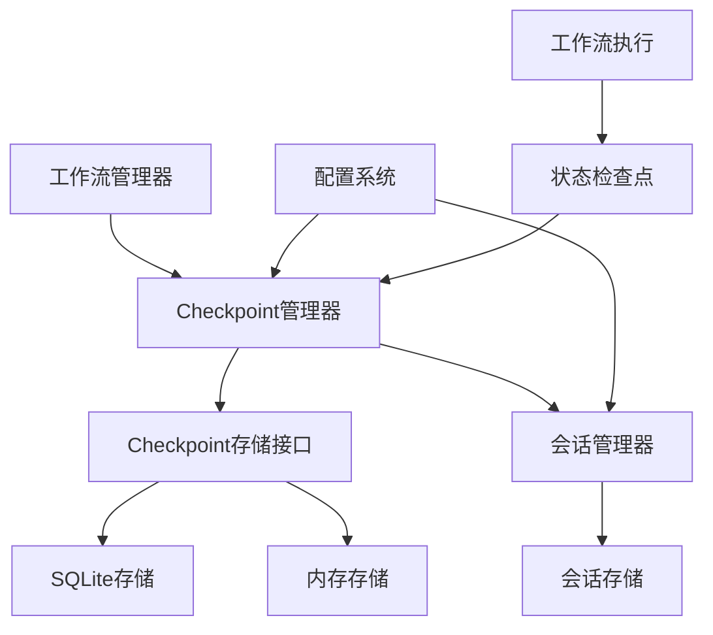

# LangGraph Checkpoint 集成方案

## 1. 项目现状分析

### 1.1 当前架构
- **项目已包含** `langgraph-checkpoint-sqlite>=2.0.11` 依赖
- **工作流系统**：基于LangGraph的配置驱动架构
- **会话管理**：支持会话创建、恢复、持久化
- **存储系统**：文件存储和内存存储两种实现

### 1.2 现有会话管理机制
- 会话管理器 (`SessionManager`) 负责工作流会话的生命周期
- 会话存储 (`ISessionStore`) 提供持久化功能
- 支持Git集成用于版本控制
- 支持会话恢复和回放

### 1.3 当前局限性
- 缺乏LangGraph原生的checkpoint机制
- 会话恢复基于配置文件重新加载，不是真正的状态恢复
- 不支持工作流执行过程中的断点续传

## 2. Checkpoint 系统设计

### 2.1 架构目标
- **会话级别管理**：单个会话中可能使用多个workflow
- **测试/生产分离**：测试使用内存存储，生产使用SQLite存储
- **无缝集成**：与现有工作流系统无缝集成
- **配置驱动**：通过配置文件控制checkpoint行为

### 2.2 系统架构图



### 2.3 核心组件设计

#### 2.3.1 Checkpoint 管理器 (`ICheckpointManager`)
```python
class ICheckpointManager(ABC):
    """Checkpoint管理器接口"""
    
    @abstractmethod
    def create_checkpoint(self, session_id: str, workflow_id: str, state: Any) -> str
    @abstractmethod
    def get_checkpoint(self, session_id: str, checkpoint_id: str) -> Optional[Dict]
    @abstractmethod
    def list_checkpoints(self, session_id: str) -> List[Dict]
    @abstractmethod
    def delete_checkpoint(self, session_id: str, checkpoint_id: str) -> bool
    @abstractmethod
    def get_latest_checkpoint(self, session_id: str) -> Optional[Dict]
```

#### 2.3.2 Checkpoint 存储接口 (`ICheckpointStore`)
```python
class ICheckpointStore(ABC):
    """Checkpoint存储接口"""
    
    @abstractmethod
    def save(self, checkpoint_data: Dict) -> bool
    @abstractmethod
    def load(self, checkpoint_id: str) -> Optional[Dict]
    @abstractmethod
    def list_by_session(self, session_id: str) -> List[Dict]
    @abstractmethod
    def delete(self, checkpoint_id: str) -> bool
```

#### 2.3.3 SQLite 存储实现 (`SQLiteCheckpointStore`)
- 使用 `aiosqlite` 进行异步操作
- 支持事务和并发访问
- 自动创建数据库和表结构

#### 2.3.4 内存存储实现 (`MemoryCheckpointStore`)
- 用于测试环境
- 线程安全的字典存储
- 支持快速清理和重置

## 3. 集成方案

### 3.1 工作流管理器集成
```python
class EnhancedWorkflowManager(IWorkflowManager):
    """增强的工作流管理器，支持checkpoint"""
    
    def __init__(self, checkpoint_manager: Optional[ICheckpointManager] = None):
        self.checkpoint_manager = checkpoint_manager
    
    def run_workflow_with_checkpoint(self, session_id: str, workflow_id: str, 
                                   checkpoint_id: Optional[str] = None) -> WorkflowState:
        """带checkpoint的工作流执行"""
        if checkpoint_id:
            # 从checkpoint恢复
            checkpoint = self.checkpoint_manager.get_checkpoint(session_id, checkpoint_id)
            initial_state = self._deserialize_checkpoint_state(checkpoint)
        else:
            # 全新执行
            initial_state = WorkflowState()
        
        # 执行工作流，支持checkpoint保存
        return self._execute_with_checkpoint_support(session_id, workflow_id, initial_state)
```

### 3.2 会话管理器扩展
```python
class EnhancedSessionManager(ISessionManager):
    """增强的会话管理器，支持checkpoint管理"""
    
    def create_session_with_checkpoint(self, workflow_config_path: str, 
                                     checkpoint_config: Dict) -> str:
        """创建支持checkpoint的会话"""
        session_id = self.create_session(workflow_config_path)
        
        # 配置checkpoint策略
        self._setup_checkpoint_policy(session_id, checkpoint_config)
        return session_id
    
    def restore_from_checkpoint(self, session_id: str, checkpoint_id: str) -> Tuple[Any, AgentState]:
        """从指定checkpoint恢复会话"""
        checkpoint_data = self.checkpoint_manager.get_checkpoint(session_id, checkpoint_id)
        return self._restore_workflow_from_checkpoint(checkpoint_data)
```

## 4. 配置系统设计

### 4.1 Checkpoint 配置结构
```yaml
# configs/checkpoints/_group.yaml
default:
  enabled: true
  storage_type: "sqlite"  # "sqlite" | "memory"
  auto_save: true
  save_interval: 5  # 每5步保存一次
  max_checkpoints: 100
  retention_days: 30

test:
  storage_type: "memory"
  auto_save: false
  max_checkpoints: 10

production:
  storage_type: "sqlite"
  auto_save: true
  save_interval: 3
  max_checkpoints: 1000
  retention_days: 90
```

### 4.2 工作流配置扩展
```yaml
# 在工作流配置中添加checkpoint支持
name: react_workflow
description: ReAct工作流模式
version: 1.0

checkpoint:
  enabled: true
  strategy: "step_based"  # "step_based" | "state_change" | "manual"
  trigger_conditions:
    - "tool_call"
    - "state_change"
    - "error"
  
nodes:
  # ... 现有节点配置
```

## 5. 实现计划

### 5.1 第一阶段：基础架构
1. **实现Checkpoint存储接口**
   - `ICheckpointStore` 接口定义
   - `SQLiteCheckpointStore` 实现
   - `MemoryCheckpointStore` 实现

2. **实现Checkpoint管理器**
   - `ICheckpointManager` 接口定义
   - `CheckpointManager` 实现类

### 5.2 第二阶段：集成与扩展
3. **工作流管理器集成**
   - 修改 `WorkflowManager` 支持checkpoint
   - 实现checkpoint保存和恢复逻辑

4. **会话管理器扩展**
   - 扩展 `SessionManager` 支持checkpoint管理
   - 实现会话级别的checkpoint策略

### 5.3 第三阶段：配置与测试
5. **配置系统支持**
   - 添加checkpoint配置加载
   - 实现配置验证和默认值处理

6. **测试用例编写**
   - 单元测试：存储层、管理器层
   - 集成测试：完整工作流checkpoint流程
   - 性能测试：大量checkpoint操作

## 6. 技术细节

### 6.1 数据序列化
- 使用JSON序列化工作流状态
- 支持自定义序列化器扩展
- 处理循环引用和复杂对象

### 6.2 性能优化
- 异步保存checkpoint避免阻塞
- 批量操作支持
- 内存缓存机制

### 6.3 错误处理
- Checkpoint保存失败时的回退策略
- 数据损坏时的恢复机制
- 详细的错误日志和监控

## 7. 风险评估与缓解

### 7.1 技术风险
- **风险**：LangGraph版本兼容性问题
- **缓解**：严格版本约束，充分测试

- **风险**：性能影响
- **缓解**：异步操作，配置化控制保存频率

### 7.2 数据风险
- **风险**：Checkpoint数据一致性
- **缓解**：事务支持，数据验证

## 8. 后续扩展

### 8.1 功能扩展
- 分布式checkpoint存储
- Checkpoint压缩和归档
- 增量checkpoint支持

### 8.2 监控与运维
- Checkpoint性能监控
- 存储空间管理
- 自动清理策略

这个方案提供了完整的LangGraph checkpoint集成计划，确保与现有架构的无缝集成，同时满足测试和生产环境的不同需求。