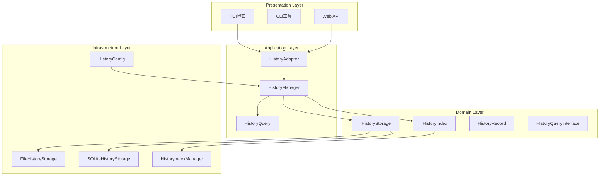
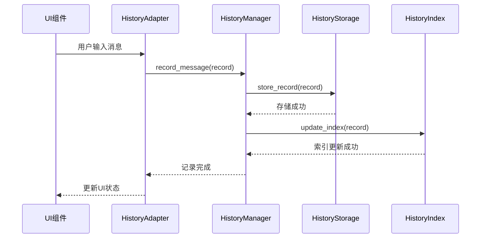
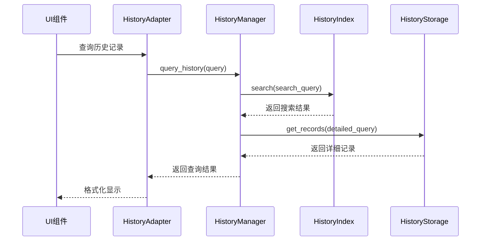
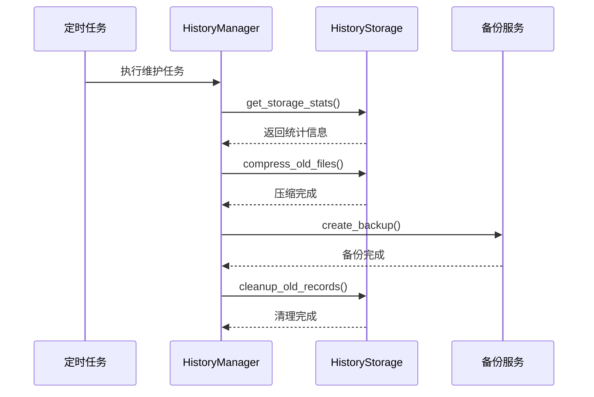

# 独立历史存储架构细化方案

## 1. 现有架构分析总结

### 1.1 当前架构模式
基于对现有代码的分析，项目采用以下架构模式：
- **分层架构**: Domain → Application → Infrastructure → Presentation
- **依赖注入**: 使用 [`DependencyContainer`](src/infrastructure/container.py:74) 管理服务生命周期
- **接口驱动**: 大量使用抽象接口（如 [`ISessionManager`](src/application/sessions/manager.py:21)、[`ISessionStore`](src/domain/sessions/store.py:14)）
- **配置驱动**: YAML配置文件系统，支持环境变量注入和热重载

### 1.2 当前历史存储问题
- **TUI耦合**: [`StateManager`](src/presentation/tui/state_manager.py:8) 直接管理消息历史
- **存储限制**: [`FileSessionStore`](src/domain/sessions/store.py:76) 仅支持基本会话数据
- **查询能力弱**: 缺乏专门的索引和查询机制
- **扩展性差**: 难以支持新的历史记录类型

## 2. History模块核心架构设计

### 2.1 整体架构图



### 2.2 核心组件设计

#### 2.2.1 HistoryManager (历史管理器)
```python
class IHistoryManager(ABC):
    """历史管理器接口"""
    
    @abstractmethod
    def record_message(self, record: MessageRecord) -> None:
        """记录消息"""
        pass
    
    @abstractmethod
    def record_tool_call(self, record: ToolCallRecord) -> None:
        """记录工具调用"""
        pass
    
    @abstractmethod
    def record_llm_request(self, record: LLMRequestRecord) -> None:
        """记录LLM请求"""
        pass
    
    @abstractmethod
    def record_workflow_event(self, record: WorkflowEventRecord) -> None:
        """记录工作流事件"""
        pass
    
    @abstractmethod
    def query_history(self, query: HistoryQuery) -> HistoryResult:
        """查询历史记录"""
        pass
    
    @abstractmethod
    def get_session_timeline(self, session_id: str) -> List[HistoryRecord]:
        """获取会话时间线"""
        pass

class HistoryManager(IHistoryManager):
    """历史管理器实现"""
    
    def __init__(
        self,
        storage: IHistoryStorage,
        index_manager: IHistoryIndex,
        config: HistoryConfig,
        logger: Optional[ILogger] = None
    ):
        self.storage = storage
        self.index_manager = index_manager
        self.config = config
        self.logger = logger
        self._event_handlers: List[Callable[[HistoryRecord], None]] = []
    
    def record_message(self, record: MessageRecord) -> None:
        """记录消息"""
        try:
            # 异步存储
            self._async_store_record(record)
            # 更新索引
            self.index_manager.update_index(record)
            # 触发事件处理器
            self._trigger_event_handlers(record)
        except Exception as e:
            if self.logger:
                self.logger.error(f"记录消息失败: {e}")
            raise HistoryStorageError(f"记录消息失败: {e}")
```

#### 2.2.2 存储接口设计
```python
class IHistoryStorage(ABC):
    """历史存储接口"""
    
    @abstractmethod
    def store_record(self, record: HistoryRecord) -> bool:
        """存储记录"""
        pass
    
    @abstractmethod
    def get_records(self, query: HistoryQuery) -> List[HistoryRecord]:
        """获取记录"""
        pass
    
    @abstractmethod
    def get_session_records(self, session_id: str, record_types: Optional[List[str]] = None) -> List[HistoryRecord]:
        """获取会话记录"""
        pass
    
    @abstractmethod
    def delete_session(self, session_id: str) -> bool:
        """删除会话记录"""
        pass
    
    @abstractmethod
    def get_storage_stats(self) -> Dict[str, Any]:
        """获取存储统计"""
        pass

class IHistoryIndex(ABC):
    """历史索引接口"""
    
    @abstractmethod
    def build_index(self, records: List[HistoryRecord]) -> None:
        """构建索引"""
        pass
    
    @abstractmethod
    def search(self, query: SearchQuery) -> List[SearchResult]:
        """搜索"""
        pass
    
    @abstractmethod
    def update_index(self, record: HistoryRecord) -> None:
        """更新索引"""
        pass
    
    @abstractmethod
    def get_suggestions(self, prefix: str, limit: int = 10) -> List[str]:
        """获取搜索建议"""
        pass
```

## 3. 数据模型和记录结构

### 3.1 基础记录模型
```python
@dataclass
class HistoryRecord:
    """历史记录基类"""
    record_id: str
    session_id: str
    timestamp: datetime
    record_type: str
    metadata: Dict[str, Any]
    
    def to_dict(self) -> Dict[str, Any]:
        """转换为字典"""
        return asdict(self)
    
    @classmethod
    def from_dict(cls, data: Dict[str, Any]) -> 'HistoryRecord':
        """从字典创建"""
        # 子类实现具体逻辑
        pass

@dataclass
class MessageRecord(HistoryRecord):
    """消息记录"""
    message_type: MessageType  # user, assistant, system
    content: str
    token_count: Optional[int] = None
    model_name: Optional[str] = None
    parent_message_id: Optional[str] = None
    response_time_ms: Optional[int] = None

@dataclass
class ToolCallRecord(HistoryRecord):
    """工具调用记录"""
    tool_name: str
    tool_type: str  # native, mcp, builtin
    parameters: Dict[str, Any]
    result: Any
    success: bool
    error: Optional[str] = None
    duration_ms: int = 0
    related_message_id: Optional[str] = None

@dataclass
class LLMRequestRecord(HistoryRecord):
    """LLM请求记录"""
    model_name: str
    request_payload: Dict[str, Any]
    response_payload: Dict[str, Any]
    request_time_ms: int
    token_usage: Dict[str, int]  # prompt, completion, total
    cost_estimate: Optional[float] = None
    error: Optional[str] = None

@dataclass
class WorkflowEventRecord(HistoryRecord):
    """工作流事件记录"""
    event_type: WorkflowEventType  # node_start, node_end, error, etc.
    node_id: Optional[str] = None
    node_type: Optional[str] = None
    event_data: Dict[str, Any] = field(default_factory=dict)
```

### 3.2 查询模型
```python
@dataclass
class HistoryQuery:
    """历史查询"""
    session_id: Optional[str] = None
    record_types: Optional[List[str]] = None
    start_time: Optional[datetime] = None
    end_time: Optional[datetime] = None
    keywords: Optional[List[str]] = None
    limit: int = 100
    offset: int = 0
    order_by: str = "timestamp"
    order_desc: bool = True

@dataclass
class SearchQuery:
    """搜索查询"""
    query: str
    session_id: Optional[str] = None
    record_types: Optional[List[str]] = None
    fuzzy: bool = True
    limit: int = 50

@dataclass
class SearchResult:
    """搜索结果"""
    record: HistoryRecord
    score: float
    highlights: List[str]
```

## 4. 存储后端实现策略

### 4.1 文件存储后端
```python
class FileHistoryStorage(IHistoryStorage):
    """基于文件的历史存储"""
    
    def __init__(self, base_path: Path, config: FileStorageConfig):
        self.base_path = base_path
        self.config = config
        self._session_files: Dict[str, Path] = {}
        self._lock = threading.RLock()
        
        # 创建目录结构
        self.base_path.mkdir(parents=True, exist_ok=True)
        (self.base_path / "sessions").mkdir(exist_ok=True)
        (self.base_path / "indexes").mkdir(exist_ok=True)
        (self.base_path / "backups").mkdir(exist_ok=True)
    
    def _get_session_file(self, session_id: str) -> Path:
        """获取会话文件路径"""
        if session_id not in self._session_files:
            # 按日期分组存储
            date_prefix = datetime.now().strftime("%Y%m")
            session_dir = self.base_path / "sessions" / date_prefix
            session_dir.mkdir(exist_ok=True)
            self._session_files[session_id] = session_dir / f"{session_id}.jsonl"
        return self._session_files[session_id]
    
    def store_record(self, record: HistoryRecord) -> bool:
        """存储记录"""
        try:
            with self._lock:
                session_file = self._get_session_file(record.session_id)
                
                # 追加写入JSONL格式
                with open(session_file, 'a', encoding='utf-8') as f:
                    json.dump(record.to_dict(), f, ensure_ascii=False, default=str)
                    f.write('\n')
                
                # 定期压缩旧文件
                if self.config.auto_compress and self._should_compress(session_file):
                    self._compress_file(session_file)
                
                return True
        except Exception as e:
            raise HistoryStorageError(f"存储记录失败: {e}")
```

### 4.2 SQLite存储后端
```python
class SQLiteHistoryStorage(IHistoryStorage):
    """基于SQLite的历史存储"""
    
    def __init__(self, db_path: Path, config: SQLiteStorageConfig):
        self.db_path = db_path
        self.config = config
        self._connection_pool = sqlite3.connect(str(db_path), check_same_thread=False)
        self._lock = threading.RLock()
        
        # 初始化数据库
        self._init_database()
    
    def _init_database(self):
        """初始化数据库表"""
        with self._lock:
            cursor = self._connection_pool.cursor()
            
            # 创建主记录表
            cursor.execute('''
                CREATE TABLE IF NOT EXISTS history_records (
                    record_id TEXT PRIMARY KEY,
                    session_id TEXT NOT NULL,
                    timestamp DATETIME NOT NULL,
                    record_type TEXT NOT NULL,
                    data JSON NOT NULL,
                    created_at DATETIME DEFAULT CURRENT_TIMESTAMP
                )
            ''')
            
            # 创建索引
            cursor.execute('''
                CREATE INDEX IF NOT EXISTS idx_session_timestamp 
                ON history_records(session_id, timestamp)
            ''')
            
            cursor.execute('''
                CREATE INDEX IF NOT EXISTS idx_record_type 
                ON history_records(record_type)
            ''')
            
            # 创建全文搜索表
            if self.config.enable_fts:
                cursor.execute('''
                    CREATE VIRTUAL TABLE IF NOT EXISTS history_fts 
                    USING fts5(record_id, content, session_id, record_type)
                ''')
            
            self._connection_pool.commit()
    
    def store_record(self, record: HistoryRecord) -> bool:
        """存储记录"""
        try:
            with self._lock:
                cursor = self._connection_pool.cursor()
                
                # 插入主记录
                cursor.execute('''
                    INSERT OR REPLACE INTO history_records 
                    (record_id, session_id, timestamp, record_type, data)
                    VALUES (?, ?, ?, ?, ?)
                ''', (
                    record.record_id,
                    record.session_id,
                    record.timestamp,
                    record.record_type,
                    json.dumps(record.to_dict(), default=str)
                ))
                
                # 更新全文搜索索引
                if self.config.enable_fts and isinstance(record, MessageRecord):
                    cursor.execute('''
                        INSERT OR REPLACE INTO history_fts 
                        (record_id, content, session_id, record_type)
                        VALUES (?, ?, ?, ?)
                    ''', (
                        record.record_id,
                        record.content,
                        record.session_id,
                        record.record_type
                    ))
                
                self._connection_pool.commit()
                return True
        except Exception as e:
            self._connection_pool.rollback()
            raise HistoryStorageError(f"存储记录失败: {e}")
```

## 5. 索引和查询系统

### 5.1 索引管理器
```python
class HistoryIndexManager(IHistoryIndex):
    """历史索引管理器"""
    
    def __init__(self, index_path: Path, config: IndexConfig):
        self.index_path = index_path
        self.config = config
        self._message_index = whoosh.index.open_dir(
            str(index_path / "messages"), 
            schema=self._get_message_schema()
        ) if (index_path / "messages").exists() else self._create_message_index()
        
        self._tool_index = whoosh.index.open_dir(
            str(index_path / "tools"),
            schema=self._get_tool_schema()
        ) if (index_path / "tools").exists() else self._create_tool_index()
    
    def _get_message_schema(self) -> whoosh.fields.Schema:
        """获取消息索引模式"""
        return whoosh.fields.Schema(
            record_id=whoosh.fields.ID(stored=True),
            session_id=whoosh.fields.ID(stored=True),
            content=whoosh.fields.TEXT(stored=True, analyzer=whoosh.analysis.StemmingAnalyzer()),
            message_type=whoosh.fields.ID(stored=True),
            timestamp=whoosh.fields.DATETIME(stored=True),
            model_name=whoosh.fields.ID(stored=True)
        )
    
    def search(self, query: SearchQuery) -> List[SearchResult]:
        """搜索记录"""
        results = []
        
        # 选择合适的索引
        if not query.record_types or "message" in query.record_types:
            results.extend(self._search_messages(query))
        
        if not query.record_types or "tool_call" in query.record_types:
            results.extend(self._search_tools(query))
        
        # 按相关性排序
        results.sort(key=lambda x: x.score, reverse=True)
        return results[:query.limit]
    
    def _search_messages(self, query: SearchQuery) -> List[SearchResult]:
        """搜索消息"""
        with self._message_index.searcher() as searcher:
            # 构建查询
            query_parser = whoosh.qparser.QueryParser(
                "content", 
                self._message_index.schema,
                whoosh.qparser.MultifieldParser(["content", "model_name"])
            )
            
            if query.fuzzy:
                query_obj = query_parser.parse(f"{query.query}~")
            else:
                query_obj = query_parser.parse(query.query)
            
            # 添加过滤器
            if query.session_id:
                query_obj = whoosh.query.And([
                    query_obj,
                    whoosh.query.Term("session_id", query.session_id)
                ])
            
            # 执行搜索
            hits = searcher.search(query_obj, limit=query.limit)
            
            results = []
            for hit in hits:
                highlights = hit.highlights("content")
                results.append(SearchResult(
                    record=self._get_record_by_id(hit["record_id"]),
                    score=hit.score,
                    highlights=highlights.split("...") if highlights else []
                ))
            
            return results
```

## 6. 文件结构和目录组织

### 6.1 模块目录结构
```
src/
├── domain/
│   └── history/
│       ├── __init__.py
│       ├── models.py              # 数据模型
│       ├── interfaces.py          # 接口定义
│       └── exceptions.py          # 异常定义
├── application/
│   └── history/
│       ├── __init__.py
│       ├── manager.py             # HistoryManager
│       ├── query.py               # 查询处理器
│       ├── adapters/
│       │   ├── __init__.py
│       │   ├── tui_adapter.py     # TUI适配器
│       │   └── cli_adapter.py     # CLI适配器
│       └── services/
│           ├── __init__.py
│           ├── export_service.py  # 导出服务
│           └── analytics_service.py # 分析服务
├── infrastructure/
│   └── history/
│       ├── __init__.py
│       ├── storage/
│       │   ├── __init__.py
│       │   ├── file_storage.py    # 文件存储
│       │   ├── sqlite_storage.py  # SQLite存储
│       │   └── storage_factory.py # 存储工厂
│       ├── index/
│       │   ├── __init__.py
│       │   ├── whoosh_index.py    # Whoosh全文索引
│       │   └── memory_index.py    # 内存索引
│       └── config/
│           ├── __init__.py
│           └── history_config.py  # 配置模型
└── presentation/
    └── history/
        ├── __init__.py
        └── components/            # UI组件（可选）
            └── history_viewer.py
```

### 6.2 数据存储结构
```
history/
├── sessions/                     # 会话数据
│   ├── 202410/                  # 按月分组
│   │   ├── session-1.jsonl
│   │   └── session-2.jsonl
│   └── 202411/
│       └── session-3.jsonl
├── indexes/                     # 索引文件
│   ├── messages/
│   │   ├── _main.toc
│   │   ├── segments_000
│   │   └── ...
│   └── tools/
│       └── ...
├── database/                    # SQLite数据库（可选）
│   └── history.db
├── backups/                     # 备份文件
│   ├── 20241001_backup.tar.gz
│   └── 20241101_backup.tar.gz
└── config/                      # 配置文件
    └── history.yaml
```

## 7. 与TUI的集成适配器

### 7.1 TUI适配器设计
```python
class TUIHistoryAdapter:
    """TUI历史适配器"""
    
    def __init__(self, history_manager: IHistoryManager, state_manager: StateManager):
        self.history_manager = history_manager
        self.state_manager = state_manager
        self._recording_enabled = True
    
    def enable_recording(self) -> None:
        """启用记录"""
        self._recording_enabled = True
    
    def disable_recording(self) -> None:
        """禁用记录"""
        self._recording_enabled = False
    
    def on_user_message(self, content: str) -> None:
        """处理用户消息"""
        if not self._recording_enabled or not self.state_manager.session_id:
            return
        
        record = MessageRecord(
            record_id=str(uuid.uuid4()),
            session_id=self.state_manager.session_id,
            timestamp=datetime.now(),
            record_type="message",
            message_type=MessageType.USER,
            content=content,
            metadata={}
        )
        
        self.history_manager.record_message(record)
    
    def on_assistant_message(self, content: str, model_name: str, response_time_ms: int) -> None:
        """处理助手消息"""
        if not self._recording_enabled or not self.state_manager.session_id:
            return
        
        record = MessageRecord(
            record_id=str(uuid.uuid4()),
            session_id=self.state_manager.session_id,
            timestamp=datetime.now(),
            record_type="message",
            message_type=MessageType.ASSISTANT,
            content=content,
            model_name=model_name,
            response_time_ms=response_time_ms,
            metadata={}
        )
        
        self.history_manager.record_message(record)
    
    def on_tool_call(self, tool_name: str, parameters: Dict[str, Any], 
                    result: Any, success: bool, duration_ms: int) -> None:
        """处理工具调用"""
        if not self._recording_enabled or not self.state_manager.session_id:
            return
        
        record = ToolCallRecord(
            record_id=str(uuid.uuid4()),
            session_id=self.state_manager.session_id,
            timestamp=datetime.now(),
            record_type="tool_call",
            tool_name=tool_name,
            tool_type=self._detect_tool_type(tool_name),
            parameters=parameters,
            result=result,
            success=success,
            duration_ms=duration_ms,
            metadata={}
        )
        
        self.history_manager.record_tool_call(record)
    
    def get_conversation_history(self, limit: int = 50) -> List[Dict[str, Any]]:
        """获取对话历史（适配TUI格式）"""
        if not self.state_manager.session_id:
            return []
        
        query = HistoryQuery(
            session_id=self.state_manager.session_id,
            record_types=["message"],
            limit=limit
        )
        
        result = self.history_manager.query_history(query)
        
        # 转换为TUI格式
        tui_history = []
        for record in result.records:
            if isinstance(record, MessageRecord):
                tui_history.append({
                    "type": record.message_type.value,
                    "content": record.content,
                    "timestamp": record.timestamp.isoformat(),
                    "model_name": record.model_name,
                    "response_time_ms": record.response_time_ms
                })
        
        return tui_history
```

## 8. 配置系统集成方案

### 8.1 历史配置模型
```python
@dataclass
class HistoryConfig:
    """历史存储配置"""
    enabled: bool = True
    storage_type: str = "file"  # file, sqlite
    storage_path: str = "./history"
    index_enabled: bool = True
    index_path: str = "./history/indexes"
    auto_compress: bool = True
    compress_threshold_days: int = 7
    backup_enabled: bool = True
    backup_interval_days: int = 1
    backup_retention_days: int = 30
    max_records_per_session: int = 10000
    retention_days: int = 90

@dataclass
class FileStorageConfig:
    """文件存储配置"""
    compression: bool = True
    compression_format: str = "gzip"  # gzip, lz4, zstd
    file_rotation: bool = True
    max_file_size_mb: int = 100
    batch_size: int = 100

@dataclass
class SQLiteStorageConfig:
    """SQLite存储配置"""
    enable_fts: bool = True
    wal_mode: bool = True
    cache_size_mb: int = 64
    journal_mode: str = "WAL"
    synchronous: str = "NORMAL"
```

### 8.2 配置文件结构
```yaml
# configs/history.yaml
history:
  enabled: true
  storage_type: "file"
  storage_path: "${HISTORY_PATH:./history}"
  index_enabled: true
  index_path: "${HISTORY_PATH:./history}/indexes"
  
  storage:
    file:
      compression: true
      compression_format: "gzip"
      file_rotation: true
      max_file_size_mb: 100
      batch_size: 100
    
    sqlite:
      enable_fts: true
      wal_mode: true
      cache_size_mb: 64
      journal_mode: "WAL"
      synchronous: "NORMAL"
  
  maintenance:
    auto_compress: true
    compress_threshold_days: 7
    backup_enabled: true
    backup_interval_days: 1
    backup_retention_days: 30
    retention_days: 90
  
  limits:
    max_records_per_session: 10000
    query_limit: 1000
    index_update_interval: 5  # seconds
```

## 9. 数据迁移策略

### 9.1 迁移工具设计
```python
class DataMigrationTool:
    """数据迁移工具"""
    
    def __init__(self, old_session_store: ISessionStore, new_history_manager: IHistoryManager):
        self.old_store = old_session_store
        self.new_manager = new_history_manager
        self.migration_log: List[Dict[str, Any]] = []
    
    def migrate_all_sessions(self, progress_callback: Optional[Callable[[int, int], None]] = None) -> bool:
        """迁移所有会话"""
        try:
            sessions = self.old_store.list_sessions()
            total = len(sessions)
            
            for i, session_info in enumerate(sessions):
                session_id = session_info["session_id"]
                success = self.migrate_session(session_id)
                
                self.migration_log.append({
                    "session_id": session_id,
                    "success": success,
                    "timestamp": datetime.now().isoformat()
                })
                
                if progress_callback:
                    progress_callback(i + 1, total)
            
            return True
        except Exception as e:
            self.migration_log.append({
                "error": str(e),
                "timestamp": datetime.now().isoformat()
            })
            return False
    
    def migrate_session(self, session_id: str) -> bool:
        """迁移单个会话"""
        try:
            # 获取旧会话数据
            session_data = self.old_store.get_session(session_id)
            if not session_data:
                return False
            
            # 迁移消息
            self._migrate_messages(session_id, session_data)
            
            # 迁移工具结果
            self._migrate_tool_results(session_id, session_data)
            
            # 迁移元数据
            self._migrate_metadata(session_id, session_data)
            
            return True
        except Exception as e:
            logger.error(f"迁移会话 {session_id} 失败: {e}")
            return False
    
    def _migrate_messages(self, session_id: str, session_data: Dict[str, Any]) -> None:
        """迁移消息"""
        state_data = session_data.get("state", {})
        messages = state_data.get("messages", [])
        
        for msg_data in messages:
            message_type = self._detect_message_type(msg_data.get("type", "BaseMessage"))
            
            record = MessageRecord(
                record_id=str(uuid.uuid4()),
                session_id=session_id,
                timestamp=datetime.fromisoformat(msg_data.get("timestamp", datetime.now().isoformat())),
                record_type="message",
                message_type=message_type,
                content=msg_data.get("content", ""),
                metadata={"migrated": True, "original_type": msg_data.get("type")}
            )
            
            self.new_manager.record_message(record)
    
    def generate_migration_report(self) -> str:
        """生成迁移报告"""
        successful = sum(1 for log in self.migration_log if log.get("success", False))
        failed = sum(1 for log in self.migration_log if not log.get("success", False))
        
        report = f"""
# 数据迁移报告

## 总体统计
- 总会话数: {len(self.migration_log)}
- 成功迁移: {successful}
- 失败迁移: {failed}
- 成功率: {successful/len(self.migration_log)*100:.1f}%

## 失败详情
"""
        
        for log in self.migration_log:
            if not log.get("success", False):
                report += f"- 会话 {log.get('session_id', 'unknown')}: {log.get('error', 'unknown error')}\n"
        
        return report
```

## 10. 详细工作流程

### 10.1 记录创建流程


### 10.2 查询处理流程


### 10.3 数据维护流程


## 11. 实施计划和优先级

### 11.1 第一阶段（核心架构）- 1-2周
**优先级：高**
- [ ] 实现基础数据模型和接口定义
- [ ] 创建HistoryManager核心逻辑
- [ ] 实现文件存储后端
- [ ] 基础配置系统集成
- [ ] 单元测试覆盖

### 11.2 第二阶段（存储和索引）- 2-3周
**优先级：高**
- [ ] SQLite存储后端实现
- [ ] 基础索引系统（Whoosh）
- [ ] 查询处理器实现
- [ ] 性能优化
- [ ] 集成测试

### 11.3 第三阶段（TUI集成）- 2-3周
**优先级：中**
- [ ] TUI适配器实现
- [ ] 渐进式迁移现有代码
- [ ] 兼容性测试
- [ ] UI组件更新

### 11.4 第四阶段（高级功能）- 2-3周
**优先级：中**
- [ ] 数据迁移工具
- [ ] 高级查询功能
- [ ] 分析和统计功能
- [ ] 备份和恢复机制

### 11.5 第五阶段（优化和完善）- 1-2周
**优先级：低**
- [ ] 性能调优
- [ ] 错误处理完善
- [ ] 文档完善
- [ ] 部署和监控

## 12. 关键技术决策

### 12.1 存储技术选择
- **文件存储**: 使用JSONL格式，支持流式读写，易于压缩和备份
- **SQLite存储**: 支持复杂查询和事务，适合大规模数据
- **索引技术**: 使用Whoosh全文索引，支持中文分词和模糊搜索

### 12.2 性能优化策略
- **异步写入**: 使用后台线程处理存储操作
- **批量操作**: 支持批量写入和索引更新
- **缓存机制**: 内存缓存热点数据
- **压缩存储**: 自动压缩历史数据

### 12.3 扩展性设计
- **插件化存储**: 支持多种存储后端
- **事件驱动**: 支持自定义事件处理器
- **配置驱动**: 通过配置文件控制行为
- **API接口**: 为未来Web UI提供支持

## 13. 风险评估和缓解策略

### 13.1 主要风险
1. **数据丢失风险**: 通过备份机制和事务处理缓解
2. **性能影响**: 通过异步处理和缓存缓解
3. **迁移复杂性**: 通过渐进式迁移和回滚机制缓解
4. **存储空间**: 通过压缩和清理策略缓解

### 13.2 缓解措施
- 完善的错误处理和恢复机制
- 全面的测试覆盖
- 详细的迁移文档和工具
- 监控和告警机制

## 14. 总结

本方案设计了一个完全独立于TUI的历史存储系统，具有以下核心优势：

1. **完全解耦**: 历史存储独立于任何UI组件，支持多种访问方式
2. **高性能**: 异步操作、索引机制和缓存策略
3. **高扩展性**: 插件化架构，支持多种存储后端
4. **数据安全**: 备份恢复机制和事务处理
5. **易于维护**: 清晰的分层架构和配置驱动

该方案遵循项目现有的架构模式，与依赖注入系统和配置系统无缝集成，为系统的长期演进奠定了坚实基础。