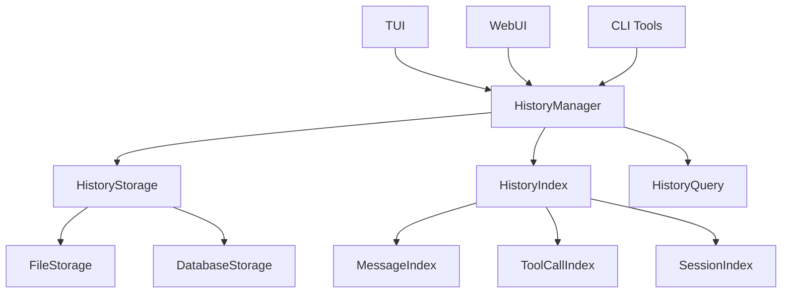

# 独立于TUI的历史会话存储及持久化设计文档

## 1. 当前TUI依赖的历史存储机制分析

### 1.1 现有架构分析

**当前存储机制：**
- **TUI状态管理器** ([`StateManager`](src/presentation/tui/state_manager.py:8)) 中维护消息历史
- **会话管理器** ([`SessionManager`](src/application/sessions/manager.py:139)) 负责持久化存储
- **文件系统存储** ([`FileSessionStore`](src/domain/sessions/store.py:76)) 保存到JSON文件

**数据流向：**
```
用户输入 → TUI StateManager → SessionManager → FileSessionStore → JSON文件
```

### 1.2 当前实现的问题

**TUI依赖性问题：**
1. **紧耦合** - 历史记录与TUI界面紧密绑定
2. **生命周期限制** - TUI关闭时，历史记录可能丢失
3. **性能影响** - 大量历史记录影响TUI响应性能
4. **访问限制** - 只有通过TUI界面才能访问历史记录

## 2. 独立历史存储的必要性评估

### 2.1 必要性分析

**高必要性原因：**

✅ **解耦需求**
- 历史记录不应依赖于特定UI界面
- 支持多种访问方式（CLI、Web UI、API等）

✅ **持久性需求**
- 确保历史数据在应用重启后仍然可用
- 防止因TUI崩溃导致数据丢失

✅ **扩展性需求**
- 支持更复杂的历史查询和分析功能
- 为未来的多端同步做准备

✅ **性能需求**
- 独立存储不影响TUI实时性能
- 支持异步写入和批量操作

### 2.2 业务场景需求

1. **多界面访问** - TUI、Web UI、CLI工具都需要访问历史
2. **离线分析** - 需要在不运行TUI的情况下分析历史数据
3. **数据迁移** - 支持版本升级时的数据迁移
4. **备份恢复** - 独立的数据备份和恢复机制

## 3. 独立历史存储架构设计

### 3.1 核心架构图



### 3.2 核心组件设计

#### 3.2.1 历史管理器 (HistoryManager)
```python
class HistoryManager:
    """独立历史管理器，不依赖任何UI组件"""
    
    def __init__(self, storage_backend: IHistoryStorage):
        self.storage = storage_backend
        self.index_manager = HistoryIndexManager()
    
    def record_message(self, session_id: str, message: MessageRecord) -> None:
        """记录消息"""
    
    def record_tool_call(self, session_id: str, tool_call: ToolCallRecord) -> None:
        """记录工具调用"""
    
    def query_history(self, query: HistoryQuery) -> HistoryResult:
        """查询历史记录"""
```

#### 3.2.2 存储接口 (IHistoryStorage)
```python
class IHistoryStorage(ABC):
    """历史存储接口"""
    
    @abstractmethod
    def save_session(self, session_data: SessionRecord) -> bool:
        """保存会话数据"""
    
    @abstractmethod
    def load_session(self, session_id: str) -> Optional[SessionRecord]:
        """加载会话数据"""
    
    @abstractmethod
    def list_sessions(self, filters: Optional[SessionFilters] = None) -> List[SessionInfo]:
        """列出会话"""
```

#### 3.2.3 数据记录模型
```python
@dataclass
class MessageRecord:
    """消息记录"""
    session_id: str
    message_id: str
    message_type: MessageType
    content: str
    timestamp: datetime
    metadata: Dict[str, Any]
    parent_message_id: Optional[str] = None

@dataclass
class ToolCallRecord:
    """工具调用记录"""
    session_id: str
    call_id: str
    tool_name: str
    parameters: Dict[str, Any]
    result: Any
    success: bool
    error: Optional[str]
    duration_ms: int
    timestamp: datetime
    related_message_id: str
```

### 3.3 存储后端实现

#### 3.3.1 文件存储后端
```python
class FileHistoryStorage(IHistoryStorage):
    """基于文件的历史存储"""
    
    def __init__(self, base_path: Path, compression: bool = True):
        self.base_path = base_path
        self.compression = compression
        
    def _get_session_path(self, session_id: str) -> Path:
        """获取会话文件路径"""
        return self.base_path / "sessions" / f"{session_id}.json"
```

#### 3.3.2 数据库存储后端
```python
class SQLiteHistoryStorage(IHistoryStorage):
    """基于SQLite的历史存储"""
    
    def __init__(self, db_path: Path):
        self.db_path = db_path
        self._init_database()
    
    def _init_database(self):
        """初始化数据库表结构"""
        # 创建sessions, messages, tool_calls表
```

### 3.4 索引和查询系统

#### 3.4.1 历史索引管理器
```python
class HistoryIndexManager:
    """历史索引管理器"""
    
    def __init__(self, index_path: Path):
        self.index_path = index_path
        self.message_index = {}
        self.tool_call_index = {}
    
    def build_index(self, sessions: List[SessionRecord]):
        """构建索引"""
    
    def search_by_keyword(self, keyword: str) -> List[SearchResult]:
        """关键词搜索"""
    
    def search_by_date_range(self, start: datetime, end: datetime) -> List[SearchResult]:
        """日期范围搜索"""
```

## 4. 与TUI的集成方案

### 4.1 适配器模式
```python
class TUIHistoryAdapter:
    """TUI历史适配器"""
    
    def __init__(self, history_manager: HistoryManager):
        self.history_manager = history_manager
    
    def get_conversation_history(self, session_id: str, limit: int = 50) -> List[Dict[str, Any]]:
        """获取对话历史（适配TUI格式）"""
        
    def add_message(self, session_id: str, content: str, message_type: str) -> None:
        """添加消息（适配TUI接口）"""
```

### 4.2 渐进式迁移策略
1. **第一阶段** - 实现独立历史管理器
2. **第二阶段** - 创建TUI适配器
3. **第三阶段** - 逐步替换TUI中的直接存储调用
4. **第四阶段** - 移除TUI中的历史存储逻辑

## 5. 实现优先级和时间规划

### 5.1 第一阶段（1-2周）- 核心架构
- 实现HistoryManager和基础接口
- 创建文件存储后端
- 基础数据模型定义

### 5.2 第二阶段（2-3周）- 存储实现
- SQLite存储后端实现
- 索引管理系统
- 基础查询功能

### 5.3 第三阶段（3-4周）- TUI集成
- TUI适配器实现
- 渐进式迁移现有代码
- 兼容性测试

### 5.4 第四阶段（4-5周）- 功能完善
- 高级查询功能
- 性能优化
- 错误恢复机制

## 6. 数据迁移方案

### 6.1 现有数据迁移
```python
class DataMigration:
    """数据迁移工具"""
    
    def migrate_from_tui_format(self, old_session_path: Path) -> SessionRecord:
        """从TUI格式迁移到新格式"""
        
    def batch_migrate(self, source_dir: Path, target_manager: HistoryManager):
        """批量迁移会话数据"""
```

### 6.2 版本兼容性
- 支持旧版本格式读取
- 自动数据格式升级
- 回滚机制

## 7. 总结和建议

### 7.1 核心优势
1. **完全解耦** - 历史存储独立于任何UI组件
2. **高扩展性** - 支持多种存储后端和查询方式
3. **性能优化** - 异步操作和索引机制
4. **数据安全** - 独立备份和恢复机制

### 7.2 实施建议
1. **优先实现文件存储后端** - 保持与现有系统的兼容性
2. **渐进式迁移** - 避免一次性大规模重构
3. **保持向后兼容** - 确保现有数据不会丢失
4. **完善测试覆盖** - 确保数据迁移的可靠性

**结论：** 独立历史存储机制是系统架构演进的重要步骤，建议按照上述规划逐步实施。