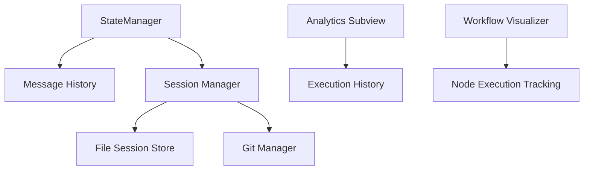

# 历史记录机制技术改进方案

## 1. 当前记录完整性分析

### 1.1 消息记录完整性
✅ **基础消息类型支持**
- 用户消息 (HumanMessage)
- 助手消息 (AssistantMessage)
- 系统消息 (SystemMessage)
- 工具调用结果 (ToolResult)

### 1.2 工具调用记录完整性
✅ **工具执行状态跟踪**
- 成功/失败状态记录
- 执行结果和错误信息保存

### 1.3 执行历史记录完整性
✅ **工作流执行路径跟踪**
- 节点状态变更记录
- 执行时间统计

## 2. 当前机制架构分析

### 2.1 核心组件架构图



### 2.2 数据流分析

**输入 → 处理 → 存储 → 显示** 流程基本完整

## 3. 具体技术改进建议

### 3.1 存储层改进

#### 3.1.1 容量管理策略
```python
# 建议实现智能归档机制
class SmartHistoryManager:
    def archive_old_messages(self):
        """自动归档旧消息"""
        if len(self.message_history) > self.max_messages:
            # 将旧消息归档到单独文件
            # 保持当前活跃消息在内存中
```

#### 3.1.2 数据压缩优化
```python
# 对大文本内容进行压缩存储
class CompressedSessionStore:
    def compress_data(self, data: Dict[str, Any]) -> Dict[str, Any]:
        """压缩会话数据"""
        # 实现文本压缩算法
        # 支持选择性压缩
```

### 3.2 显示层改进

#### 3.2.1 富文本渲染器
```python
class RichTextRenderer:
    def render_json(self, json_data: Dict[str, Any]) -> str:
        """渲染JSON数据为格式化文本"""
```

#### 3.2.2 搜索和过滤功能
```python
class HistorySearchEngine:
    def search_by_keyword(self, keyword: str) -> List[Dict[str, Any]]:
        """实现关键词搜索功能"""
```

## 4. 实现优先级规划

### 4.1 立即实施（1-2周）
1. **配置系统扩展**
   - 在 [`TUIConfig`](src/presentation/tui/config.py:76)) 中添加：
   - `max_message_history: int = 1000` (从50提升)
2. **虚拟滚动实现** - 提升大量消息时的性能

### 4.2 短期目标（2-4周）
1. **富文本渲染器** - 支持JSON、表格等复杂格式

### 4.3 中期目标（1-2个月）
1. **完整搜索功能** - 支持多条件复合搜索
2. **错误重试机制** - 为工具调用失败提供重试功能

## 5. 具体实现细节

### 5.1 配置扩展实现
```python
# 在 BehaviorConfig 中添加
history_retention_policy: str = "auto_archive"  # auto_archive, keep_all, delete_old

### 5.2 性能优化策略
```python
class VirtualScrollManager:
    def render_visible_range(self, start_index: int, end_index: int):
    """实现虚拟滚动以提升性能"""
```

### 5.3 数据持久化改进
```python
# 增强的会话存储
class EnhancedSessionStore(ISessionStore):
    def __init__(self, storage_path: Path, compression_enabled: bool = True):
    """支持数据压缩和智能存储"""
```

## 6. 总结与建议

当前历史记录机制在架构设计上表现良好，具备良好的扩展性。建议按照以下顺序实施改进：

1. **配置系统扩展** - 最紧急，影响用户体验
2. **性能优化** - 影响系统稳定性
3. **功能增强** - 提升产品竞争力

建议在下一个开发周期中优先处理容量配置和性能优化问题。