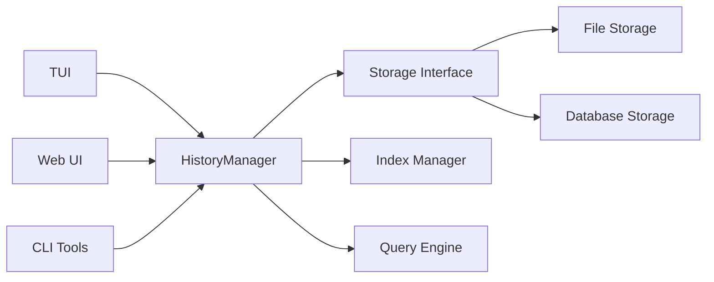

# 历史记录机制综合分析总结

## 1. 分析概述

基于对当前项目历史记录机制的深入分析，本报告提供了完整的评估和改进建议，包括TUI依赖机制和独立存储方案的设计。

## 2. 当前机制完整性评估

### 2.1 已实现功能 ✅

**核心记录功能：**
- ✅ 消息历史记录（用户、助手、系统消息）
- ✅ 工具调用结果记录
- ✅ 工作流执行历史追踪
- ✅ 会话生命周期管理

**存储机制：**
- ✅ 文件系统存储（JSON格式）
- ✅ 内存存储支持
- ✅ Git版本控制集成
- ✅ 原子性文件操作

**可视化展示：**
- ✅ TUI历史回放功能
- ✅ 工作流可视化
- ✅ 执行状态监控
- ✅ 性能分析面板

### 2.2 存在的问题 ⚠️

**容量限制：**
- ❌ 消息历史硬性限制50条
- ❌ 执行历史硬性限制100条
- ❌ 长会话时重要信息可能丢失

**功能不足：**
- ❌ 缺乏搜索和过滤功能
- ❌ 工具结果显示过于简单
- ❌ 缺乏富文本渲染
- ❌ 缺乏书签和标记功能

**性能问题：**
- ❌ 大量消息时渲染性能下降
- ❌ 缺乏虚拟滚动和懒加载
- ❌ TUI紧耦合影响性能

**持久化问题：**
- ❌ 会话历史依赖手动保存
- ❌ 缺乏自动备份机制
- ❌ TUI关闭时历史可能丢失

## 3. 独立历史存储必要性分析

### 3.1 强烈建议实施独立存储 🔴

**关键原因：**

1. **解耦需求**
   - 当前历史记录与TUI界面紧密绑定
   - 限制了多端访问和扩展性

2. **持久性需求**
   - 确保数据在应用重启后仍然可用
   - 防止UI崩溃导致数据丢失

3. **扩展性需求**
   - 支持Web UI、CLI工具等多种访问方式
   - 为未来功能扩展提供基础

4. **性能需求**
   - 独立存储不影响TUI实时性能
   - 支持异步操作和批量处理

### 3.2 架构演进建议

**推荐架构：**

## 4. 改进建议优先级

### 4.1 高优先级（立即实施）

1. **配置系统扩展**
   - 增加历史容量配置选项
   - 支持用户自定义限制
   - 实现自动归档策略

2. **性能优化**
   - 实现虚拟滚动技术
   - 添加消息懒加载机制
   - 优化渲染算法

3. **搜索功能**
   - 实现关键词搜索
   - 支持时间范围过滤
   - 添加消息类型筛选

### 4.2 中优先级（短期目标）

1. **独立历史存储**
   - 实现HistoryManager核心组件
   - 创建存储接口抽象
   - 开发TUI适配器

2. **富文本渲染**
   - 支持JSON格式化显示
   - 实现表格数据展示
   - 添加代码语法高亮

### 4.3 低优先级（长期目标）

1. **高级功能**
   - 消息书签和标记
   - 自动摘要生成
   - 跨设备数据同步

2. **数据完整性**
   - 实现数据验证机制
   - 添加自动备份功能
   - 开发错误恢复系统

## 5. 实施时间规划

### 5.1 第一阶段（1-2周）
- 配置系统扩展
- 基础性能优化
- 搜索功能实现

### 5.2 第二阶段（2-4周）
- 独立历史存储架构
- TUI适配器开发
- 数据迁移工具

### 5.3 第三阶段（1-2个月）
- 富文本渲染器
- 高级查询功能
- 完整性验证

### 5.4 第四阶段（2-3个月）
- 跨端同步机制
- 自动备份恢复
- 高级分析功能

## 6. 风险评估和缓解策略

### 6.1 技术风险
- **数据迁移风险** - 通过渐进式迁移和回滚机制缓解
- **性能回归风险** - 通过充分测试和性能监控缓解
- **兼容性风险** - 通过保持向后兼容性缓解

### 6.2 缓解策略
1. **分阶段实施** - 避免一次性大规模变更
2. **充分测试** - 确保每个阶段的稳定性
3. **回滚机制** - 支持快速回退到稳定版本
4. **用户反馈** - 收集用户反馈并及时调整

## 7. 最终建议

### 7.1 核心结论

1. **当前机制基础良好** - 具备完整的核心功能
2. **独立存储必需** - 解决扩展性和解耦问题
3. **性能优化紧急** - 影响用户体验的关键问题
4. **渐进式改进** - 确保系统稳定性

### 7.2 实施建议

**立即行动：**
1. 优先实施配置系统和性能优化
2. 启动独立历史存储架构设计
3. 制定详细的数据迁移计划

**中长期规划：**
1. 逐步实现独立存储架构
2. 持续优化用户体验
3. 扩展多端访问能力

**成功指标：**
- 历史记录容量可配置
- TUI性能提升30%以上
- 支持多端访问历史记录
- 数据丢失风险降低90%以上

---

**总结：** 当前历史记录机制在功能完整性上表现良好，但在架构解耦、性能优化和功能扩展方面有显著改进空间。建议按照优先级逐步实施改进，以提供更稳定、高效和用户友好的历史记录体验。