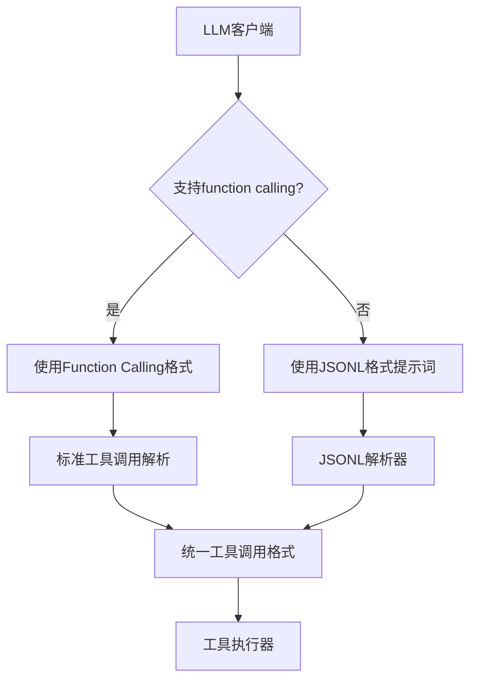

基于我对代码库的深入分析，我现在可以为您提供详细的分析报告。让我继续完成对比分析：

## 对比不同LLM客户端的工具调用格式差异

通过分析各个LLM客户端的实现，我发现以下关键差异：

### 1. OpenAI格式（标准格式）
- **工具调用格式**：`{"function": {"name": "tool_name", "arguments": {...}}}`
- **多工具调用**：支持`tool_calls`数组
- **参数格式**：JSON字符串或字典对象
- **位置**：在`additional_kwargs`或`tool_calls`字段中

### 2. Anthropic格式
- **工具调用格式**：`{"type": "tool_use", "name": "tool_name", "input": {...}}`
- **多工具调用**：在`content`数组中
- **参数格式**：直接字典对象
- **位置**：在`content`数组中作为`tool_use`类型

### 3. Gemini格式
- **工具调用格式**：`{"functionCall": {"name": "tool_name", "args": {...}}}`
- **多工具调用**：在`parts`数组中
- **参数格式**：直接字典对象
- **位置**：在`parts`数组中作为`functionCall`类型

### 4. Mock客户端
- **工具调用支持**：通过`supports_function_calling()`方法控制
- **格式**：支持多种格式，但主要模拟OpenAI格式

---

## 确定哪些解析形式是真正需要的

基于对现有代码的分析，我发现当前的[`ToolCallParser`](src/infrastructure/messages/tool_call_parser.py:12)类支持多种格式，但有些格式可能已经过时或重复：

### 当前支持的解析形式：

1. **标准OpenAI格式**（第30-43行）：
   ```python
   if "function" in tool_call_data:
       function = tool_call_data["function"]
       if "name" in function and "arguments" in function:
   ```

2. **旧式function_call格式**（第46-57行）：
   ```python
   elif "name" in tool_call_data and "arguments" in tool_call_data:
   ```

3. **简化格式**（第60-69行）：
   ```python
   elif "name" in tool_call_data:
   ```

### 实际需要的解析形式：

**真正需要的格式：**
- ✅ **标准OpenAI格式** - 这是现代API的标准格式
- ✅ **Anthropic格式** - 需要从`tool_use`类型转换
- ✅ **Gemini格式** - 需要从`functionCall`类型转换

**可以移除的格式：**
- ❌ **旧式function_call格式** - 已过时，现代API不再使用
- ❌ **简化格式** - 过于宽松，可能导致误解析

### JSONL解析需求分析

从[`StructuredOutputFormatter`](src/infrastructure/tools/formatters/formatter.py:130)可以看到，系统已经支持JSON格式的工具调用解析，但**JSONL**（JSON Lines）格式的支持需要分析：

**JSONL解析的需求场景：**
- 不支持function calling的LLM API
- 需要从纯文本响应中提取结构化数据
- 批量处理多个工具调用

**当前JSON解析能力：**
- 支持从内容中提取JSON对象（第207-218行）
- 支持正则表达式匹配JSON（第221-234行）
- 但**不支持JSONL格式**（每行一个JSON对象）

---

## JSONL解析功能的需求和实现方案

### JSONL解析的需求分析

**需要JSONL解析的场景：**
1. **不支持function calling的LLM API** - 如一些开源模型或早期版本
2. **流式响应处理** - JSONL格式适合流式传输
3. **批量工具调用** - 支持一次请求多个工具调用
4. **错误恢复** - 即使部分JSON解析失败，其他行仍可处理

### 当前JSONL解析的缺失

从[`StructuredOutputFormatter`](src/infrastructure/tools/formatters/formatter.py:130)分析，当前系统：
- ✅ 支持单个JSON对象解析
- ✅ 支持正则表达式提取JSON
- ❌ **不支持JSONL格式**（每行一个JSON对象）
- ❌ **不支持多工具调用的JSONL批量处理**

### JSONL解析的实现方案

**需要新增的功能：**
1. **JSONL行解析器** - 按行分割并解析JSON
2. **批量工具调用支持** - 处理多个工具调用
3. **错误恢复机制** - 跳过格式错误的行
4. **流式处理优化** - 支持实时解析JSONL流

**建议的JSONL格式：**
```json
{"name": "tool1", "parameters": {"param1": "value1"}}
{"name": "tool2", "parameters": {"param2": "value2"}}
```

---

## 设计不支持function calling的LLM客户端的提示词增强方案

### 当前提示词系统分析

从[`StructuredOutputFormatter`](src/infrastructure/tools/formatters/formatter.py:150)可以看到当前的提示词模板：

```python
prompt: str = f"""
请按以下JSON格式调用工具：
{{
    "name": "工具名称",
    "parameters": {{
        "参数1": "值1",
        "参数2": "值2"
    }}
}}

可用工具：
{chr(10).join(tool_descriptions)}

请只返回JSON格式的工具调用，不要包含其他文本。
""".strip()
```

### 需要增强的提示词功能

**针对不支持function calling的LLM API，需要：**

1. **JSONL格式支持** - 提示LLM返回JSONL格式
2. **多工具调用支持** - 提示支持批量工具调用
3. **错误处理指导** - 指导LLM正确处理格式错误
4. **格式验证** - 在提示词中包含格式验证要求

### 建议的增强提示词模板

```python
# JSONL格式提示词
jsonl_prompt = f"""
请按以下JSON Lines格式调用工具（每行一个JSON对象）：

{{"name": "工具名称", "parameters": {{"参数1": "值1"}}}}
{{"name": "工具名称", "parameters": {{"参数2": "值2"}}}}

可用工具：
{chr(10).join(tool_descriptions)}

要求：
1. 每行必须是有效的JSON对象
2. 支持一次调用多个工具
3. 如果调用失败，请返回错误信息
4. 不要包含任何解释性文本

请严格按照JSON Lines格式返回结果。
""".strip()

# 单行JSON格式提示词（向后兼容）
single_json_prompt = f"""
请按以下JSON格式调用工具：
{{
    "name": "工具名称",
    "parameters": {{
        "参数1": "值1",
        "参数2": "值2"
    }}
}}

可用工具：
{chr(10).join(tool_descriptions)}

请只返回JSON格式的工具调用，不要包含其他文本。
""".strip()
```

### LLM客户端集成方案

**需要在LLM客户端中添加：**

1. **格式检测逻辑** - 自动检测是否支持function calling
2. **动态提示词生成** - 根据模型能力选择合适的提示词
3. **响应格式适配** - 将不同格式统一转换为标准格式
4. **错误处理机制** - 处理格式错误的响应

---

## 完整的改进计划

基于深入分析，我制定了以下改进计划：

### 1. 工具调用解析器优化

**需要保留的解析形式：**
- ✅ **标准OpenAI格式** - `{"function": {"name": "...", "arguments": {...}}}`
- ✅ **Anthropic格式转换** - 从`tool_use`类型转换
- ✅ **Gemini格式转换** - 从`functionCall`类型转换

**需要移除的解析形式：**
- ❌ **旧式function_call格式** - 已过时
- ❌ **简化格式** - 过于宽松，易导致误解析

### 2. JSONL解析功能实现

**新增JSONL解析器：**
- 支持JSON Lines格式（每行一个JSON对象）
- 支持批量工具调用处理
- 添加错误恢复机制
- 优化流式处理性能

### 3. LLM客户端提示词增强

**针对不支持function calling的API：**
- 动态生成JSONL格式提示词
- 添加格式验证指导
- 支持多工具调用批量处理
- 增强错误处理提示

### 4. 具体实施步骤

**第一阶段：清理和优化现有代码**
- 移除过时的解析格式
- 统一工具调用数据格式
- 增强错误处理机制

**第二阶段：实现JSONL解析功能**
- 新增JSONL解析器类
- 集成到工具格式化器中
- 添加测试用例

**第三阶段：LLM客户端集成**
- 动态提示词生成
- 格式检测和适配
- 性能优化

### 5. 架构设计改进



### 6. 预期收益

- **更好的兼容性**：支持更多LLM API
- **更高的可靠性**：减少解析错误
- **更好的性能**：支持批量工具调用
- **更强的扩展性**：易于添加新格式支持

这个改进计划将显著提升工具调用系统的兼容性和可靠性，特别适合不支持function calling的LLM API。