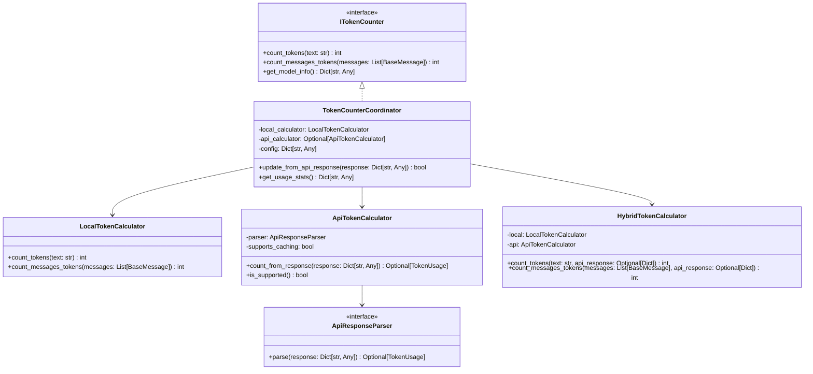

# LLM API Token Usage 集成方案 v2

## 概述

基于新的需求，重新设计token计数器架构，将原有 [`src/llm/token_counter.py`](src/llm/token_counter.py) 作为协调器，新增基于API返回体的token计算模块，并优化多轮对话处理。

## 架构重新设计

### 文件结构

```
src/llm/
├── token_counter.py              # 协调器：管理多种计数策略
├── token_calculators/            # 具体的token计算器
│   ├── __init__.py
│   ├── base.py                   # 基础计算器接口
│   ├── local_calculator.py       # 本地估算计算器
│   ├── api_calculator.py         # API返回体解析计算器
│   └── hybrid_calculator.py      # 混合策略计算器
└── token_parsers/                # API响应解析器
    ├── __init__.py
    ├── base.py                   # 基础解析器接口
    ├── openai_parser.py          # OpenAI响应解析
    ├── gemini_parser.py          # Gemini响应解析
    └── anthropic_parser.py       # Anthropic响应解析
```

### 核心组件关系



## 核心设计变更

### 1. 文件拆分策略

**token_counter.py** - 协调器角色：
- 管理多种计算策略
- 提供统一的接口
- 处理降级逻辑
- 维护配置信息

**token_calculators/** - 具体计算实现：
- `local_calculator.py`: 纯本地估算
- `api_calculator.py`: API返回体解析
- `hybrid_calculator.py`: 混合策略（降级逻辑）

**token_parsers/** - API响应解析：
- 各提供商特定的响应格式解析

### 2. 降级策略实现

```python
class HybridTokenCalculator:
    """混合token计算器，实现降级策略"""
    
    def __init__(self, local_calculator: LocalTokenCalculator, 
                 api_calculator: ApiTokenCalculator):
        self.local = local_calculator
        self.api = api_calculator
    
    def count_tokens(self, text: str, api_response: Optional[Dict[str, Any]] = None) -> int:
        """混合token计数，实现降级策略"""
        # 如果没有API响应，使用本地计算
        if not api_response:
            return self.local.count_tokens(text)
        
        # 尝试从API响应解析token数
        api_usage = self.api.count_from_response(api_response)
        if not api_usage:
            return self.local.count_tokens(text)
        
        # 计算本地估算值
        local_count = self.local.count_tokens(text)
        
        # 降级策略：如果API token数少于本地估算的1/4，使用本地计算
        if api_usage.total_tokens < local_count / 4:
            logger.warning(
                f"API token count ({api_usage.total_tokens}) is less than 1/4 of "
                f"local estimate ({local_count}), using local calculation"
            )
            return local_count
        
        # 使用API返回的token数
        return api_usage.total_tokens
    
    def count_messages_tokens(self, messages: List[BaseMessage], 
                             api_response: Optional[Dict[str, Any]] = None) -> int:
        """混合消息token计数"""
        # 如果没有API响应，使用本地计算
        if not api_response:
            return self.local.count_messages_tokens(messages)
        
        # 尝试从API响应解析token数
        api_usage = self.api.count_from_response(api_response)
        if not api_usage:
            return self.local.count_messages_tokens(messages)
        
        # 计算本地估算值
        local_count = self.local.count_messages_tokens(messages)
        
        # 降级策略：如果API token数少于本地估算的1/4，使用本地计算
        if api_usage.total_tokens < local_count / 4:
            logger.warning(
                f"API token count ({api_usage.total_tokens}) is less than 1/4 of "
                f"local estimate ({local_count}), using local calculation"
            )
            return local_count
        
        # 使用API返回的token数
        return api_usage.total_tokens
```

### 3. 移除本地token缓存

**变更点**：
- 不再维护本地token缓存
- 直接使用API返回体中的token信息
- 仅在API解析失败或数据异常时使用本地估算

```python
class ApiTokenCalculator:
    """API返回体token计算器"""
    
    def __init__(self, parser: ApiResponseParser, supports_caching: bool = True):
        self.parser = parser
        self.supports_caching = supports_caching
        self._stats = {
            "total_requests": 0,
            "api_success": 0,
            "api_failed": 0,
            "fallback_to_local": 0
        }
    
    def count_from_response(self, response: Dict[str, Any]) -> Optional[TokenUsage]:
        """直接从API响应解析token使用信息"""
        self._stats["total_requests"] += 1
        
        try:
            usage = self.parser.parse(response)
            if usage:
                self._stats["api_success"] += 1
                return usage
            else:
                self._stats["api_failed"] += 1
                return None
        except Exception as e:
            logger.error(f"Failed to parse API response: {e}")
            self._stats["api_failed"] += 1
            return None
    
    def is_supported(self) -> bool:
        """检查是否支持API计算"""
        return self.supports_caching
```

### 4. 模型配置项：是否支持缓存

在模型配置中添加 `supports_token_caching` 配置项：

```yaml
# configs/llms/openai-gpt4.yaml
model_type: openai
model_name: gpt-4
supports_token_caching: true  # 新增配置项
base_url: "https://api.openai.com/v1"
api_key: "${OPENAI_API_KEY}"

# configs/llms/gemini-pro.yaml  
model_type: gemini
model_name: gemini-pro
supports_token_caching: false  # Gemini可能不支持或格式不同
base_url: "https://generativelanguage.googleapis.com/v1"
api_key: "${GEMINI_API_KEY}"
```

## 多轮对话token计数问题分析

### 当前问题

1. **消息格式token未正确计算**
   - 当前实现对每条消息固定添加4个token（格式token）
   - 实际API计算可能包含额外的系统消息、角色标记等

2. **上下文累积问题**
   - 多轮对话中，历史消息的token数会累积
   - 当前实现没有考虑对话历史的token消耗

3. **API响应只反映单次调用**
   - API返回的token数只包含当前请求的token
   - 无法反映整个对话历史的token消耗

### 优化方案

#### 方案1：对话上下文管理器

```python
class ConversationTokenTracker:
    """对话token跟踪器"""
    
    def __init__(self, token_counter: TokenCounterCoordinator):
        self.token_counter = token_counter
        self.conversation_history: List[Dict[str, Any]] = []
        self.total_tokens_used = 0
    
    def add_message(self, message: BaseMessage, api_response: Optional[Dict[str, Any]] = None):
        """添加消息到对话历史"""
        # 计算当前消息的token数
        if api_response:
            # 使用API返回的token数
            token_count = self.token_counter.count_messages_tokens([message], api_response)
        else:
            # 使用本地估算
            token_count = self.token_counter.count_messages_tokens([message])
        
        # 记录消息和token数
        self.conversation_history.append({
            "message": message,
            "token_count": token_count,
            "timestamp": datetime.now(),
            "source": "api" if api_response else "local"
        })
        
        self.total_tokens_used += token_count
    
    def get_conversation_tokens(self) -> int:
        """获取整个对话的token总数"""
        return self.total_tokens_used
    
    def get_recent_tokens(self, last_n: int = 10) -> int:
        """获取最近N条消息的token数"""
        recent_messages = self.conversation_history[-last_n:]
        return sum(msg["token_count"] for msg in recent_messages)
    
    def clear_history(self):
        """清空对话历史"""
        self.conversation_history.clear()
        self.total_tokens_used = 0
```

#### 方案2：智能消息截断

```python
class SmartMessageTruncator:
    """智能消息截断器"""
    
    def __init__(self, max_context_tokens: int, token_counter: TokenCounterCoordinator):
        self.max_context_tokens = max_context_tokens
        self.token_counter = token_counter
    
    def truncate_messages(self, messages: List[BaseMessage], 
                         current_prompt: str) -> List[BaseMessage]:
        """智能截断消息，确保不超过上下文限制"""
        # 计算当前prompt的token数
        prompt_tokens = self.token_counter.count_tokens(current_prompt)
        
        # 计算保留的token空间
        available_tokens = self.max_context_tokens - prompt_tokens - 100  # 预留100token
        
        # 从最新消息开始累积，直到达到限制
        truncated_messages = []
        current_tokens = 0
        
        for message in reversed(messages):
            message_tokens = self.token_counter.count_messages_tokens([message])
            
            if current_tokens + message_tokens <= available_tokens:
                truncated_messages.insert(0, message)  # 保持顺序
                current_tokens += message_tokens
            else:
                break
        
        return truncated_messages
```

#### 方案3：增量token计算

```python
class IncrementalTokenCalculator:
    """增量token计算器"""
    
    def __init__(self, token_counter: TokenCounterCoordinator):
        self.token_counter = token_counter
        self.conversation_tokens = 0
    
    def calculate_incremental_tokens(self, 
                                   new_messages: List[BaseMessage],
                                   api_response: Optional[Dict[str, Any]] = None) -> int:
        """计算增量token数"""
        # 计算新消息的token数
        if api_response:
            new_tokens = self.token_counter.count_messages_tokens(new_messages, api_response)
        else:
            new_tokens = self.token_counter.count_messages_tokens(new_messages)
        
        # 更新总token数
        self.conversation_tokens += new_tokens
        
        return new_tokens
    
    def get_total_tokens(self) -> int:
        """获取总token数"""
        return self.conversation_tokens
    
    def reset(self):
        """重置计数器"""
        self.conversation_tokens = 0
```

## 实施计划

### 阶段1：重构文件结构（1周）

1. **创建新目录结构**
   - 创建 `token_calculators/` 和 `token_parsers/` 目录
   - 实现基础接口和抽象类

2. **实现具体计算器**
   - `LocalTokenCalculator`: 移植现有本地计算逻辑
   - `ApiTokenCalculator`: 新增API响应解析
   - `HybridTokenCalculator`: 实现降级策略

3. **实现响应解析器**
   - `OpenAIParser`, `GeminiParser`, `AnthropicParser`

### 阶段2：协调器实现（3天）

1. **重构 `token_counter.py`**
   - 改为协调器模式
   - 集成多种计算策略
   - 维护配置和状态

2. **更新工厂类**
   - 支持根据配置选择计算器
   - 处理模型特定的配置

### 阶段3：多轮对话优化（3天）

1. **实现对话跟踪器**
   - `ConversationTokenTracker`
   - `SmartMessageTruncator`
   - `IncrementalTokenCalculator`

2. **集成测试**
   - 多轮对话场景测试
   - 性能基准测试
   - 准确性验证

### 阶段4：配置和监控（2天）

1. **更新模型配置**
   - 添加 `supports_token_caching` 配置项
   - 配置默认值和验证

2. **监控和日志**
   - 添加统计信息
   - 降级策略触发日志
   - 性能监控指标

## 代码实现示例

### 协调器实现

```python
# src/llm/token_counter.py
class TokenCounterCoordinator(ITokenCounter):
    """Token计数器协调器"""
    
    def __init__(self, model_type: str, model_name: str, config: Dict[str, Any] = None):
        self.model_type = model_type
        self.model_name = model_name
        self.config = config or {}
        
        # 初始化计算器
        self.local_calculator = LocalTokenCalculator(model_type, model_name)
        self.api_calculator = self._create_api_calculator()
        self.hybrid_calculator = HybridTokenCalculator(
            self.local_calculator, 
            self.api_calculator
        )
        
        # 对话跟踪器（可选）
        self.conversation_tracker = None
        if self.config.get("track_conversation", False):
            self.conversation_tracker = ConversationTokenTracker(self)
    
    def _create_api_calculator(self) -> Optional[ApiTokenCalculator]:
        """创建API计算器"""
        supports_caching = self.config.get("supports_token_caching", True)
        parser = self._create_response_parser()
        
        if parser:
            return ApiTokenCalculator(parser, supports_caching)
        return None
    
    def _create_response_parser(self) -> Optional[ApiResponseParser]:
        """创建响应解析器"""
        if self.model_type == "openai":
            return OpenAIParser()
        elif self.model_type == "gemini":
            return GeminiParser()
        elif self.model_type == "anthropic":
            return AnthropicParser()
        return None
    
    def count_tokens(self, text: str, api_response: Optional[Dict[str, Any]] = None) -> int:
        """计算token数"""
        count = self.hybrid_calculator.count_tokens(text, api_response)
        
        # 更新对话跟踪
        if self.conversation_tracker and api_response:
            # 创建临时消息用于跟踪
            from langchain_core.messages import HumanMessage
            message = HumanMessage(content=text)
            self.conversation_tracker.add_message(message, api_response)
        
        return count
    
    def count_messages_tokens(self, messages: List[BaseMessage], 
                             api_response: Optional[Dict[str, Any]] = None) -> int:
        """计算消息列表token数"""
        count = self.hybrid_calculator.count_messages_tokens(messages, api_response)
        
        # 更新对话跟踪
        if self.conversation_tracker and api_response:
            for message in messages:
                self.conversation_tracker.add_message(message, api_response)
        
        return count
    
    def update_from_api_response(self, response: Dict[str, Any]) -> bool:
        """从API响应更新（兼容性方法）"""
        # 这个方法现在主要用于统计，实际计算在count_*方法中完成
        if self.api_calculator:
            return self.api_calculator.count_from_response(response) is not None
        return False
    
    def get_model_info(self) -> Dict[str, Any]:
        """获取模型信息"""
        info = {
            "model_type": self.model_type,
            "model_name": self.model_name,
            "supports_api_calculation": self.api_calculator is not None,
            "supports_caching": self.config.get("supports_token_caching", True),
            "conversation_tracking": self.conversation_tracker is not None
        }
        
        if self.api_calculator:
            info.update(self.api_calculator.get_stats())
        
        return info
    
    def get_conversation_stats(self) -> Optional[Dict[str, Any]]:
        """获取对话统计信息"""
        if self.conversation_tracker:
            return {
                "total_tokens": self.conversation_tracker.get_total_tokens(),
                "message_count": len(self.conversation_tracker.conversation_history),
                "history": self.conversation_tracker.conversation_history
            }
        return None
```

### 工厂类更新

```python
class TokenCounterFactory:
    """Token计数器工厂"""
    
    @staticmethod
    def create_counter(model_type: str, model_name: str, 
                      config: Dict[str, Any] = None) -> TokenCounterCoordinator:
        """创建Token计数器协调器"""
        return TokenCounterCoordinator(model_type, model_name, config)
    
    @staticmethod
    def create_with_model_config(model_config: Dict[str, Any]) -> TokenCounterCoordinator:
        """根据模型配置创建计数器"""
        model_type = model_config.get("model_type", "openai")
        model_name = model_config.get("model_name", "gpt-3.5-turbo")
        
        # 从配置中提取token相关设置
        token_config = {
            "supports_token_caching": model_config.get("supports_token_caching", True),
            "track_conversation": model_config.get("track_conversation", False),
            "max_context_tokens": model_config.get("max_tokens", 2000)
        }
        
        return TokenCounterCoordinator(model_type, model_name, token_config)
```

## 配置示例

```yaml
# configs/llms/openai-gpt4-enhanced.yaml
model_type: openai
model_name: gpt-4
supports_token_caching: true
track_conversation: true
max_context_tokens: 4000
base_url: "https://api.openai.com/v1"
api_key: "${OPENAI_API_KEY}"

parameters:
  temperature: 0.7
  max_tokens: 2000

# configs/llms/gemini-pro-enhanced.yaml
model_type: gemini  
model_name: gemini-pro
supports_token_caching: false  # Gemini可能不支持token缓存
track_conversation: true
max_context_tokens: 8000
base_url: "https://generativelanguage.googleapis.com/v1"
api_key: "${GEMINI_API_KEY}"

parameters:
  temperature: 0.7
  max_tokens: 2048
```

## 总结

新的架构设计解决了以下关键问题：

1. **模块化设计**: 将功能拆分到不同文件，避免单个文件过大
2. **降级策略**: API token数异常时自动降级到本地计算
3. **配置驱动**: 支持模型级别的缓存配置
4. **多轮对话优化**: 提供对话级别的token跟踪和管理
5. **性能优化**: 移除不必要的本地缓存，直接使用API数据

这种设计既保持了向后兼容性，又提供了更好的扩展性和可维护性。