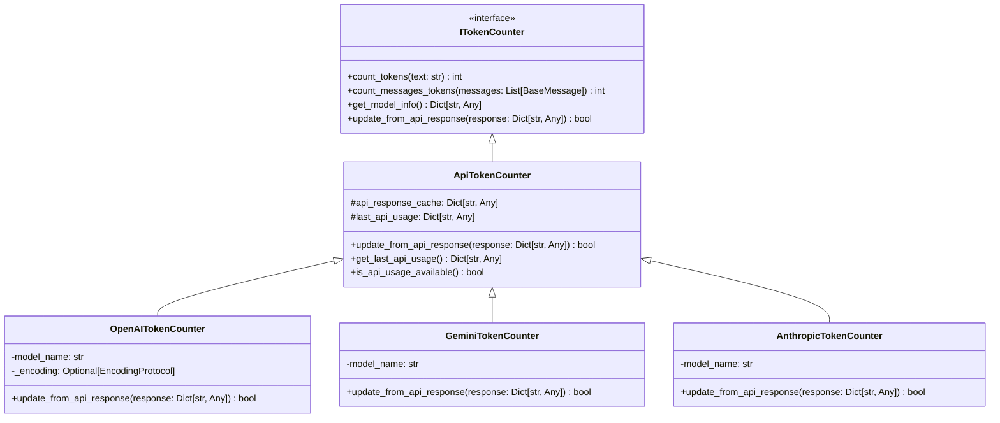

# LLM API Token Usage 集成方案

## 概述

当前 [`src/llm/token_counter.py`](src/llm/token_counter.py) 中的token计数器完全依赖本地计算，存在准确性问题。本方案旨在通过集成LLM API返回体中的token使用信息，提供更精确的token计数功能。

## 当前实现分析

### 局限性

1. **OpenAI**: 依赖 [`tiktoken`](src/llm/token_counter.py:98) 库，但存在版本兼容性问题
2. **Gemini**: 仅使用字符估算 [`len(text) // 4`](src/llm/token_counter.py:206)
3. **Anthropic**: 同样使用简单估算 [`len(text) // 4`](src/llm/token_counter.py:275)
4. **Mock**: 基于字符数的简单估算

### 问题

- 估算不准确，特别是多语言文本
- 无法反映实际的API计费token数
- 特殊格式（如代码、JSON）处理不准确

## API Token信息格式研究

### 1. OpenAI API

**响应格式**:
```json
{
  "id": "chatcmpl-123",
  "object": "chat.completion",
  "created": 1677652288,
  "model": "gpt-4o",
  "choices": [...],
  "usage": {
    "prompt_tokens": 12,
    "completion_tokens": 6,
    "total_tokens": 18
  }
}
```

**关键字段**:
- `usage.prompt_tokens`: 输入token数
- `usage.completion_tokens`: 输出token数
- `usage.total_tokens`: 总token数

### 2. Google Gemini API

**响应格式**:
```json
{
  "candidates": [...],
  "usageMetadata": {
    "promptTokenCount": 25,
    "candidatesTokenCount": 15,
    "totalTokenCount": 40,
    "thoughtsTokenCount": 8,
    "cachedContentTokenCount": 0
  }
}
```

**关键字段**:
- `usageMetadata.promptTokenCount`: 输入token数
- `usageMetadata.candidatesTokenCount`: 输出token数
- `usageMetadata.totalTokenCount`: 总token数
- `usageMetadata.thoughtsTokenCount`: 思考过程token数（新模型）
- `usageMetadata.cachedContentTokenCount`: 缓存内容token数

### 3. Anthropic Claude API

**响应格式**:
```json
{
  "id": "msg_123",
  "type": "message",
  "role": "assistant",
  "content": [...],
  "model": "claude-3-sonnet-20240229",
  "stop_reason": "end_turn",
  "usage": {
    "input_tokens": 12,
    "output_tokens": 6
  }
}
```

**关键字段**:
- `usage.input_tokens`: 输入token数
- `usage.output_tokens`: 输出token数

**高级功能**:
```json
{
  "usage": {
    "input_tokens": 12,
    "output_tokens": 6,
    "cache_creation_input_tokens": 0,
    "cache_read_input_tokens": 0
  }
}
```

### 4. 其他提供商

#### Moonshot AI
```json
{
  "usage": {
    "prompt_tokens": 12,
    "completion_tokens": 6,
    "total_tokens": 18
  }
}
```

#### DeepSeek
```json
{
  "usage": {
    "prompt_tokens": 12,
    "completion_tokens": 6,
    "total_tokens": 18,
    "prompt_tokens_details": {
      "cached_tokens": 0
    }
  }
}
```

## 设计方案

### 架构设计



### 核心功能

#### 1. API响应解析器

```python
class ApiResponseParser:
    """API响应解析器，提取token使用信息"""
    
    @staticmethod
    def parse_openai_response(response: Dict[str, Any]) -> Dict[str, Any]:
        """解析OpenAI API响应"""
        usage = response.get("usage", {})
        return {
            "prompt_tokens": usage.get("prompt_tokens", 0),
            "completion_tokens": usage.get("completion_tokens", 0),
            "total_tokens": usage.get("total_tokens", 0),
            "source": "api"
        }
    
    @staticmethod
    def parse_gemini_response(response: Dict[str, Any]) -> Dict[str, Any]:
        """解析Gemini API响应"""
        metadata = response.get("usageMetadata", {})
        return {
            "prompt_tokens": metadata.get("promptTokenCount", 0),
            "completion_tokens": metadata.get("candidatesTokenCount", 0),
            "total_tokens": metadata.get("totalTokenCount", 0),
            "thoughts_tokens": metadata.get("thoughtsTokenCount", 0),
            "cached_tokens": metadata.get("cachedContentTokenCount", 0),
            "source": "api"
        }
    
    @staticmethod
    def parse_anthropic_response(response: Dict[str, Any]) -> Dict[str, Any]:
        """解析Anthropic API响应"""
        usage = response.get("usage", {})
        return {
            "input_tokens": usage.get("input_tokens", 0),
            "output_tokens": usage.get("output_tokens", 0),
            "cache_creation_tokens": usage.get("cache_creation_input_tokens", 0),
            "cache_read_tokens": usage.get("cache_read_input_tokens", 0),
            "source": "api"
        }
```

#### 2. 混合计数策略

```python
class HybridTokenCounter:
    """混合token计数器，结合API数据和本地估算"""
    
    def __init__(self, local_counter: ITokenCounter):
        self.local_counter = local_counter
        self.api_usage_cache: Dict[str, Any] = {}
        self.fallback_threshold = 0.1  # 10%误差阈值
    
    def count_tokens(self, text: str) -> int:
        """混合token计数"""
        # 优先使用API数据
        if self._has_recent_api_usage():
            api_count = self._get_api_based_count(text)
            if api_count > 0:
                return api_count
        
        # 使用本地估算
        local_count = self.local_counter.count_tokens(text)
        
        # 如果有历史API数据，进行校准
        if self._has_calibration_data():
            calibrated_count = self._calibrate_local_count(local_count)
            return calibrated_count
        
        return local_count
    
    def update_from_api_response(self, response: Dict[str, Any], 
                                 text: str) -> bool:
        """从API响应更新token信息"""
        try:
            usage_data = self._parse_response(response)
            self.api_usage_cache[text] = usage_data
            return True
        except Exception as e:
            logger.warning(f"Failed to update from API response: {e}")
            return False
```

### 3. 缓存策略

```python
class TokenUsageCache:
    """Token使用缓存管理"""
    
    def __init__(self, ttl_seconds: int = 3600):
        self.cache: Dict[str, Dict[str, Any]] = {}
        self.timestamps: Dict[str, float] = {}
        self.ttl = ttl_seconds
    
    def set(self, key: str, usage: Dict[str, Any]):
        """设置缓存"""
        self.cache[key] = usage
        self.timestamps[key] = time.time()
    
    def get(self, key: str) -> Optional[Dict[str, Any]]:
        """获取缓存"""
        if key in self.cache:
            if time.time() - self.timestamps[key] < self.ttl:
                return self.cache[key]
            else:
                # 过期清理
                del self.cache[key]
                del self.timestamps[key]
        return None
    
    def get_stats(self) -> Dict[str, Any]:
        """获取缓存统计"""
        return {
            "cache_size": len(self.cache),
            "hit_rate": self._calculate_hit_rate(),
            "avg_age": self._calculate_avg_age()
        }
```

### 4. 校准算法

```python
class TokenCalibrator:
    """Token计数校准器"""
    
    def __init__(self):
        self.calibration_data: List[Tuple[int, int]] = []  # (local, api)
        self.calibration_factor = 1.0
    
    def add_calibration_point(self, local_count: int, api_count: int):
        """添加校准数据点"""
        self.calibration_data.append((local_count, api_count))
        self._recalculate_factor()
    
    def _recalculate_factor(self):
        """重新计算校准因子"""
        if len(self.calibration_data) >= 3:
            ratios = [api / local for local, api in self.calibration_data]
            self.calibration_factor = statistics.median(ratios)
    
    def calibrate(self, local_count: int) -> int:
        """校准本地计数"""
        return int(local_count * self.calibration_factor)
    
    def get_confidence(self) -> float:
        """获取校准置信度"""
        if len(self.calibration_data) < 3:
            return 0.0
        
        # 基于数据点数量和方差计算置信度
        ratios = [api / local for local, api in self.calibration_data]
        variance = statistics.variance(ratios)
        base_confidence = min(len(self.calibration_data) / 10, 1.0)
        variance_penalty = min(variance / 0.1, 1.0)
        
        return max(0.0, base_confidence - variance_penalty)
```

## 实施计划

### 阶段1：基础框架（1-2周）

1. **创建基础类结构**
   - 实现 [`ApiTokenCounter`](src/llm/token_counter.py) 基类
   - 添加 [`update_from_api_response()`](src/llm/token_counter.py:44) 方法
   - 实现响应解析器

2. **集成现有计数器**
   - 修改 [`OpenAITokenCounter`](src/llm/token_counter.py:81) 继承自 `ApiTokenCounter`
   - 修改 [`GeminiTokenCounter`](src/llm/token_counter.py:181) 继承自 `ApiTokenCounter`
   - 修改 [`AnthropicTokenCounter`](src/llm/token_counter.py:250) 继承自 `ApiTokenCounter`

### 阶段2：混合计数策略（1-2周）

1. **实现混合计数器**
   - 开发 [`HybridTokenCounter`](src/llm/token_counter.py) 类
   - 集成缓存机制
   - 实现校准算法

2. **缓存管理**
   - 实现 [`TokenUsageCache`](src/llm/token_counter.py) 类
   - 添加缓存统计和监控
   - 实现过期策略

### 阶段3：集成测试（1周）

1. **单元测试**
   - 测试各API响应解析器
   - 测试混合计数逻辑
   - 测试校准算法

2. **集成测试**
   - 与真实API集成测试
   - 性能基准测试
   - 准确性验证

### 阶段4：监控和优化（1周）

1. **监控指标**
   - API命中率
   - 校准准确性
   - 缓存效率

2. **优化策略**
   - 动态调整缓存TTL
   - 智能校准触发
   - 错误处理和降级

## 代码实现示例

### 增强的OpenAI计数器

```python
class EnhancedOpenAITokenCounter(OpenAITokenCounter):
    """增强的OpenAI Token计数器，支持API数据"""
    
    def __init__(self, model_name: str = "gpt-3.5-turbo"):
        super().__init__(model_name)
        self.api_usage_cache: Dict[str, Dict[str, Any]] = {}
        self.calibrator = TokenCalibrator()
        self.cache = TokenUsageCache()
    
    def update_from_api_response(self, response: Dict[str, Any]) -> bool:
        """从OpenAI API响应更新token信息"""
        try:
            usage = ApiResponseParser.parse_openai_response(response)
            
            # 提取文本内容用于缓存键
            text_content = self._extract_text_from_response(response)
            
            # 更新缓存
            self.cache.set(text_content, usage)
            
            # 更新校准器
            local_count = self.count_tokens(text_content)
            self.calibrator.add_calibration_point(local_count, usage["total_tokens"])
            
            return True
        except Exception as e:
            logger.error(f"Failed to update from OpenAI API response: {e}")
            return False
    
    def count_tokens(self, text: str) -> int:
        """增强的token计数，优先使用API数据"""
        # 检查缓存
        cached_usage = self.cache.get(text)
        if cached_usage:
            return cached_usage["total_tokens"]
        
        # 使用本地计数
        local_count = super().count_tokens(text)
        
        # 应用校准
        if self.calibrator.get_confidence() > 0.5:
            return self.calibrator.calibrate(local_count)
        
        return local_count
```

### 使用示例

```python
# 创建增强的计数器
counter = EnhancedOpenAITokenCounter("gpt-4")

# 本地计数（传统方式）
local_count = counter.count_tokens("Hello, world!")

# 从API响应更新（实际使用后）
api_response = {
    "usage": {
        "prompt_tokens": 3,
        "completion_tokens": 5,
        "total_tokens": 8
    }
}
counter.update_from_api_response(api_response)

# 后续计数将使用校准后的数据
enhanced_count = counter.count_tokens("Hello, world!")
```

## 性能考虑

### 1. 缓存策略

- **TTL设置**: 1小时默认，可配置
- **缓存大小**: LRU淘汰，最大1000条
- **内存使用**: 预估每条缓存约200字节

### 2. 校准频率

- **最小数据点**: 3个校准点才开始生效
- **最大数据点**: 保留最近100个校准点
- **置信度阈值**: 0.5以上才应用校准

### 3. 降级策略

- API解析失败时使用本地计数
- 缓存未命中时使用本地计数
- 校准置信度低时使用本地计数

## 监控和指标

### 关键指标

1. **API命中率**: `api_hits / total_requests`
2. **校准准确率**: `abs(api_count - calibrated_count) / api_count`
3. **缓存命中率**: `cache_hits / total_requests`
4. **平均误差**: 本地估算 vs API实际值的平均差异

### 日志记录

```python
logger.info(f"Token counter stats: "
           f"api_hit_rate={stats['api_hit_rate']:.2f}, "
           f"calibration_confidence={stats['confidence']:.2f}, "
           f"cache_hit_rate={stats['cache_hit_rate']:.2f}")
```

## 错误处理

### 常见错误场景

1. **API响应格式错误**
   - 降级到本地计数
   - 记录错误日志
   - 发送监控告警

2. **缓存溢出**
   - LRU淘汰策略
   - 动态调整缓存大小
   - 内存使用监控

3. **校准数据异常**
   - 异常值检测和过滤
   - 置信度动态调整
   - 自动重置校准数据

## 未来扩展

### 1. 多模型支持

- 支持更多LLM提供商
- 统一的响应解析接口
- 模型特定的优化策略

### 2. 预测功能

- 基于历史数据预测token使用量
- 成本估算和预算控制
- 智能缓存预热

### 3. 高级分析

- Token使用模式分析
- 成本优化建议
- 性能瓶颈识别

## 总结

本方案通过集成LLM API返回体中的token使用信息，显著提高了token计数的准确性。混合策略结合了API数据的精确性和本地计数的实时性，通过智能校准和缓存机制，在保证性能的同时提供最准确的token计数服务。