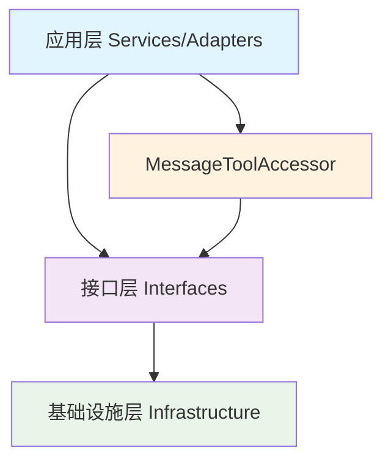

# 消息处理封装改进方案

## 项目概述

本项目旨在改进当前消息处理架构，解决类型检查失效、依赖倒置原则违反、代码重复和维护困难等问题。通过增强接口层、创建统一访问器和重构条件评估器，实现类型安全的消息处理。

## 当前架构问题分析

### 1. 主要问题

**类型检查失效**
- 上层应用直接访问消息的具体属性（如 `tool_calls`）
- 使用 `hasattr()` 和 `getattr()` 绕过类型检查
- 缺乏统一的工具调用信息访问标准

**依赖倒置原则违反**
- 高层模块（如条件评估器）依赖低层模块的具体实现
- 缺乏抽象层隔离变化

**代码重复**
- 多个地方都有类似的工具调用检查逻辑
- 工具节点、条件评估器、消息转换器等都有重复代码

**维护困难**
- 当消息格式变化时，需要修改多个地方
- LangChain 依赖移除后，相关代码仍然存在

### 2. 具体问题示例

```python
# 当前问题代码示例
if hasattr(last_message, 'tool_calls') and getattr(last_message, 'tool_calls', None):
    return True

# 直接访问具体属性，绕过了接口层
if hasattr(last_message, 'additional_kwargs') and "tool_calls" in last_message.additional_kwargs:
    return True
```

## 改进方案设计

### 1. 架构目标



### 2. 核心改进点

#### 2.1 增强接口层
在 `IBaseMessage` 接口中添加工具调用相关方法：

```python
@abstractmethod
def has_tool_calls(self) -> bool:
    """检查是否包含工具调用"""
    pass

@abstractmethod
def get_tool_calls(self) -> List[Dict[str, Any]]:
    """获取所有工具调用"""
    pass

@abstractmethod
def get_valid_tool_calls(self) -> List[Dict[str, Any]]:
    """获取有效的工具调用"""
    pass

@abstractmethod
def get_invalid_tool_calls(self) -> List[Dict[str, Any]]:
    """获取无效的工具调用"""
    pass
```

#### 2.2 创建统一访问器

```python
class MessageToolAccessor:
    """消息工具访问器 - 提供统一的工具调用信息访问方式"""
    
    @staticmethod
    def has_tool_calls(message: IBaseMessage) -> bool:
        """统一检查工具调用"""
        return message.has_tool_calls()
    
    @staticmethod
    def extract_tool_calls(message: IBaseMessage) -> List[Dict[str, Any]]:
        """统一提取工具调用"""
        return message.get_tool_calls()
    
    @staticmethod
    def is_ai_message_with_tool_calls(message: IBaseMessage) -> bool:
        """检查是否为AI消息且包含工具调用"""
        from ...infrastructure.messages.types import AIMessage
        return isinstance(message, AIMessage) and message.has_tool_calls()
```

#### 2.3 类型安全的条件评估

```python
def _has_tool_calls(self, state: IState, parameters: Dict[str, Any],
                   config: Dict[str, Any]) -> bool:
    """检查是否有工具调用（类型安全版本）"""
    messages = state.get_data("messages", [])
    if not messages:
        return False

    last_message = messages[-1]
    
    # 使用类型安全的接口方法
    if isinstance(last_message, IBaseMessage):
        return last_message.has_tool_calls()
    
    # 对于非接口消息，使用消息转换器转换为接口类型
    try:
        from ...infrastructure.messages.converters import MessageConverter
        converter = MessageConverter()
        base_message = converter.to_base_message(last_message)
        return base_message.has_tool_calls()
    except Exception:
        # 转换失败，使用后备方案
        return self._fallback_tool_call_check(last_message)
```

## 实施计划

### 阶段1：接口扩展和基础设施层实现

**目标**：扩展接口并在基础设施层实现相关方法

**任务清单：**
- [ ] 扩展 `IBaseMessage` 接口
- [ ] 在 `BaseMessage` 类中实现接口方法
- [ ] 在 `AIMessage` 类中重写工具调用相关方法
- [ ] 更新相关测试

**预计时间**：2-3天

### 阶段2：创建统一访问器

**目标**：创建 `MessageToolAccessor` 并提供统一的访问方式

**任务清单：**
- [ ] 创建 `MessageToolAccessor` 类
- [ ] 实现统一的工具调用访问方法
- [ ] 添加类型安全的工具调用检查
- [ ] 编写单元测试

**预计时间**：1-2天

### 阶段3：重构条件评估器

**目标**：重构条件评估器使用新接口

**任务清单：**
- [ ] 重构 `_has_tool_calls` 方法
- [ ] 移除 LangChain 相关的过时代码
- [ ] 更新条件评估器的测试
- [ ] 验证功能完整性

**预计时间**：2天

### 阶段4：更新工具节点

**目标**：更新工具节点使用新接口

**任务清单：**
- [ ] 重构工具调用提取逻辑
- [ ] 使用 `MessageToolAccessor` 统一访问
- [ ] 移除直接属性访问代码
- [ ] 更新相关测试

**预计时间**：2-3天

### 阶段5：更新消息转换器

**目标**：确保消息转换器正确处理工具调用信息

**任务清单：**
- [ ] 更新消息转换逻辑
- [ ] 确保工具调用信息正确传递
- [ ] 验证转换器兼容性
- [ ] 更新测试用例

**预计时间**：2天

### 阶段6：全面测试和优化

**目标**：确保所有修改都正确工作

**任务清单：**
- [ ] 运行完整的测试套件
- [ ] 性能测试和优化
- [ ] 文档更新
- [ ] 代码审查

**预计时间**：2-3天

## 风险评估与缓解策略

### 风险1：接口变更影响现有代码

**风险等级**：中
**影响**：可能需要更新多个模块
**缓解策略**：
- 保持接口向后兼容
- 分阶段实施，逐步迁移
- 充分的单元测试覆盖

### 风险2：性能影响

**风险等级**：低
**影响**：额外的接口调用可能影响性能
**缓解策略**：
- 优化实现，避免不必要的转换
- 性能测试和基准测试
- 必要时提供性能优化选项

### 风险3：测试覆盖不足

**风险等级**：中
**影响**：可能导致回归问题
**缓解策略**：
- 确保每个修改都有对应的测试
- 增加集成测试覆盖
- 代码审查和质量检查

## 预期收益

### 1. 架构改进

**类型安全**
- 所有工具调用检查都通过接口进行
- 编译时类型检查生效
- 减少运行时错误

**依赖倒置**
- 高层模块只依赖接口，不依赖具体实现
- 提高代码的可测试性和可维护性

**可维护性**
- 消息格式变化只需修改基础设施层
- 统一的访问方式减少代码重复

### 2. 开发效率提升

**代码复用**
- 统一的工具调用访问方式
- 减少重复代码

**错误减少**
- 类型安全减少运行时错误
- 统一的接口减少不一致性

### 3. 扩展性增强

**新消息类型支持**
- 新的消息类型只需实现接口即可
- 易于扩展新的工具调用格式

**协议适配**
- 易于支持不同的LLM提供商格式
- 统一的转换逻辑

## 验收标准

### 功能验收标准

1. **接口完整性**
   - `IBaseMessage` 接口包含所有必要的工具调用方法
   - 所有消息类型都正确实现接口

2. **功能正确性**
   - 条件评估器正确识别工具调用
   - 工具节点正确提取工具调用信息
   - 消息转换器正确处理工具调用

3. **性能要求**
   - 性能影响在可接受范围内（<5%）
   - 内存使用无明显增加

### 质量验收标准

1. **代码质量**
   - 通过所有静态检查（mypy, flake8）
   - 代码覆盖率 > 90%
   - 无重大代码异味

2. **文档完整性**
   - 接口文档完整
   - 使用示例清晰
   - 迁移指南完整

3. **测试覆盖**
   - 单元测试覆盖所有新功能
   - 集成测试验证端到端功能
   - 性能测试验证性能要求

## 后续优化建议

### 短期优化（1-3个月）

1. **性能优化**
   - 分析性能热点
   - 优化频繁调用的接口方法

2. **缓存策略**
   - 实现工具调用信息的缓存
   - 减少重复计算

### 中期优化（3-6个月）

1. **协议扩展**
   - 支持更多的消息格式
   - 优化跨协议兼容性

2. **监控增强**
   - 添加详细的性能监控
   - 实现使用情况统计

### 长期优化（6个月以上）

1. **架构演进**
   - 考虑消息处理流水线
   - 优化大规模消息处理

2. **生态系统集成**
   - 更好的第三方集成支持
   - 标准化工具调用格式

## 总结

本改进方案通过增强接口层、创建统一访问器和重构条件评估器，解决了当前消息处理架构的主要问题。方案具有明确的实施计划、风险评估和验收标准，能够显著提升代码的质量、可维护性和扩展性。

建议按照分阶段计划逐步实施，确保每个阶段都有充分的测试和验证。