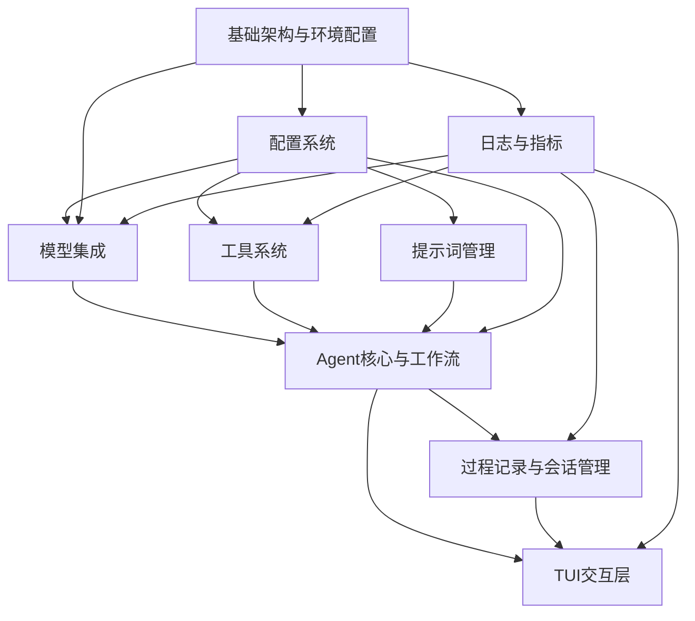
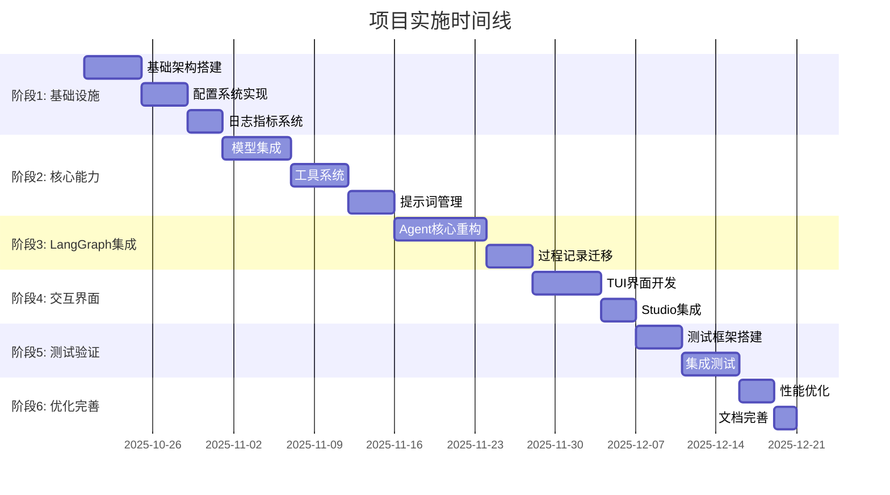

# Modular Agent Framework 整体实施计划

## 1. 项目概述

Modular Agent Framework 是一个基于 LangGraph 的多 Agent 框架，支持多模型集成、工具系统、提示词管理等核心功能。项目采用分层架构设计，确保模块间的低耦合和高内聚。

### 1.1 核心特性
- **LangGraph 集成**：使用业界标准的工作流编排框架
- **多模型支持**：OpenAI、Gemini、Anthropic 等主流 LLM
- **工具系统**：支持原生能力、MCP 工具、内置函数三类工具
- **可视化调试**：集成 LangGraph Studio 提供专业级调试体验
- **配置化管理**：支持配置分离、分组继承、环境变量注入

### 1.2 架构分层
```
用户界面层 → 应用服务层 → 领域核心层 → 基础设施层
```

## 2. 模块依赖关系分析

### 2.1 依赖层次结构


### 2.2 关键依赖说明
- **基础架构模块**：无依赖，为其他所有模块提供支撑
- **配置系统**：依赖基础架构，为其他模块提供配置管理
- **Agent 核心**：依赖最多，集成模型、工具、提示词等核心能力
- **TUI 交互**：依赖 Agent 核心和会话管理，提供用户界面

## 3. 实施阶段划分

### 3.1 总体阶段规划


### 3.2 阶段详细规划

#### 阶段1：基础设施搭建（12天）
**目标**：建立稳定可靠的基础运行环境

**任务清单**：
1. **基础架构与环境配置**（5天）
   - 实现依赖注入容器 [`IDependencyContainer`](docs/PRD/1-基础架构与环境配置.md:50)
   - 开发配置加载服务 [`IConfigLoader`](docs/PRD/1-基础架构与环境配置.md:49)
   - 构建环境检查工具 [`IEnvironmentChecker`](docs/PRD/1-基础架构与环境配置.md:51)
   - 实现架构分层检查工具
   - 支持多环境配置管理

2. **配置系统**（4天）
   - 实现配置分离与结构化存储
   - 开发分组继承机制 [`IConfigMerger`](docs/PRD/6-配置系统.md:115)
   - 构建配置验证系统 [`IConfigValidator`](docs/PRD/6-配置系统.md:116)
   - 支持环境变量注入 [`IConfigSystem`](docs/PRD/6-配置系统.md:114)
   - 实现热重载功能

3. **日志与指标**（3天）
   - 构建分级日志系统 [`ILogger`](docs/PRD/8-日志与指标.md:90)
   - 实现多目标输出（控制台、文件、JSON）
   - 开发智能脱敏功能 [`LogRedactor`](docs/PRD/8-日志与指标.md:39)
   - 建立指标收集机制 [`IMetricsCollector`](docs/PRD/8-日志与指标.md:91)
   - 实现全局错误处理 [`GlobalErrorHandler`](docs/PRD/8-日志与指标.md:72)

**交付物**：
- 完整的基础设施代码实现
- 单元测试覆盖率 ≥ 90%
- 配置文档和 API 文档

#### 阶段2：核心能力构建（15天）
**目标**：实现框架的核心功能模块

**任务清单**：
1. **模型集成**（6天）
   - 实现统一模型客户端接口 [`ILLMClient`](docs/PRD/3-模型集成.md:76)
   - 开发 OpenAI、Gemini、Anthropic 客户端
   - 构建模型工厂 [`LLMFactory`](docs/PRD/3-模型集成.md:77)
   - 支持自定义 HTTP 标头和白名单控制
   - 实现模型降级机制 [`ILLMCallHook`](docs/PRD/3-模型集成.md:78)

2. **工具系统**（5天）
   - 实现三类工具支持（原生、MCP、内置）[`BaseTool`](docs/PRD/4-工具系统.md:25)
   - 开发工具管理器 [`IToolManager`](docs/PRD/4-工具系统.md:95)
   - 构建工具集管理机制
   - 实现输出格式化策略 [`IToolFormatter`](docs/PRD/4-工具系统.md:96)
   - 开发工具执行器 [`IToolExecutor`](docs/PRD/4-工具系统.md:97)

3. **提示词管理**（4天）
   - 实现提示词资产分类管理
   - 开发提示词注册表 [`IPromptRegistry`](docs/PRD/5-提示词管理.md:93)
   - 构建提示词加载器 [`IPromptLoader`](docs/PRD/5-提示词管理.md:94)
   - 实现复合提示词合并逻辑
   - 开发提示词注入器 [`IPromptInjector`](docs/PRD/5-提示词管理.md:95)

**交付物**：
- 核心功能模块完整实现
- 各模块集成测试
- 使用示例和文档

#### 阶段3：LangGraph 集成（12天）
**目标**：基于 LangGraph 重构 Agent 核心能力

**任务清单**：
1. **Agent 核心重构**（8天）
   - 迁移到 LangGraph 工作流引擎 [`ILangGraphManager`](docs/PRD/2-Agent核心与工作流.md:96)
   - 实现 ReAct、Plan-and-Execute 等工作流模式
   - 开发 Agent 状态管理 [`AgentState`](docs/PRD/2-Agent核心与工作流.md:22)
   - 集成 LangGraph Studio 可视化 [`IWorkflowVisualizer`](docs/PRD/2-Agent核心与工作流.md:97)
   - 支持流式和非流式输出

2. **过程记录迁移**（4天）
   - 集成 LangGraph 状态追踪 [`ILangGraphEventCollector`](docs/PRD/7-过程记录与会话管理.md:86)
   - 重构会话管理系统 [`ISessionManager`](docs/PRD/7-过程记录与会话管理.md:84)
   - 实现 LangGraph Studio 回放功能 [`ISessionPlayer`](docs/PRD/7-过程记录与会话管理.md:87)
   - 支持 Git 版本管理检查点

**交付物**：
- LangGraph 集成完整实现
- 向后兼容的迁移方案
- 可视化调试功能

#### 阶段4：交互界面（9天）
**目标**：构建用户友好的交互界面

**任务清单**：
1. **TUI 界面开发**（6天）
   - 实现命令行命令体系
   - 开发主界面布局（侧边栏、主内容区、输入栏）
   - 构建 LangGraph 状态面板
   - 实现会话管理功能
   - 支持工作流控制（暂停、继续、终止）

2. **Studio 集成**（3天）
   - 集成 LangGraph Studio 服务器
   - 实现 TUI 与 Studio 联动
   - 开发可视化功能
   - 支持实时工作流调试

**交付物**：
- 完整的 TUI 交互界面
- Studio 可视化集成
- 用户体验优化

#### 阶段5：测试验证（9天）
**目标**：确保系统质量和稳定性

**任务清单**：
1. **测试框架搭建**（4天）
   - 建立测试目录结构
   - 开发单元测试 fixture
   - 实现 Mock 工具集
   - 配置 pytest 和覆盖率工具

2. **集成测试**（5天）
   - 执行单元测试（覆盖率 ≥ 90%）
   - 运行集成测试（覆盖率 ≥ 80%）
   - 进行端到端测试（覆盖率 ≥ 70%）
   - 性能测试和基准测试

**交付物**：
- 完整的测试套件
- 测试报告和覆盖率分析
- 性能基准数据

#### 阶段6：优化完善（5天）
**目标**：系统优化和文档完善

**任务清单**：
1. **性能优化**（3天）
   - 系统性能调优
   - 内存使用优化
   - 响应时间优化
   - 并发处理优化

2. **文档完善**（2天）
   - 编写用户手册
   - 完善 API 文档
   - 创建部署指南
   - 整理最佳实践

**交付物**：
- 优化后的系统
- 完整的文档体系
- 部署和运维指南

## 4. 技术栈变更处理

### 4.1 LangGraph 集成变更
根据 [`LangGraph集成技术栈更新.md`](docs/PRD/LangGraph集成技术栈更新.md:1)，主要变更包括：

**新增组件**：
- LangGraph 工作流编排
- LangGraph Studio 可视化
- LangGraph 状态追踪

**移除组件**：
- 自定义工作流引擎
- 自定义状态管理器
- 自定义工作流监控器

**迁移策略**：
1. **阶段式迁移**：保持向后兼容，逐步切换
2. **并行运行**：新旧系统同时运行，确保稳定性
3. **功能验证**：每个阶段都进行充分测试

### 4.2 依赖管理
```yaml
# 核心依赖
python: ">=3.13"
langgraph: ">=0.1.0"
langchain: ">=0.1.0"
pydantic: ">=2.0.0"
rich: ">=13.0.0"
click: ">=8.0.0"

# 可选依赖
langgraph-studio: ">=0.1.0"  # 可视化调试
prometheus-client: ">=0.19.0"  # 指标收集（未来扩展）
```

## 5. 风险控制与质量保障

### 5.1 关键风险点
1. **LangGraph 集成复杂性**：工作流引擎迁移可能引入不稳定性
2. **多模型兼容性**：不同 LLM 的 API 差异处理
3. **性能瓶颈**：大规模并发场景下的性能表现
4. **配置复杂性**：继承机制和验证规则的复杂度

### 5.2 质量保障措施
1. **代码审查**：每个模块都需要代码审查
2. **自动化测试**：单元测试、集成测试、端到端测试全覆盖
3. **性能监控**：实时监控系统性能指标
4. **文档验证**：文档与代码同步更新
5. **用户反馈**：早期用户参与测试和反馈

### 5.3 应急预案
1. **回滚机制**：每个阶段都有回滚方案
2. **降级策略**：关键功能支持降级处理
3. **故障隔离**：模块间故障隔离机制
4. **监控告警**：实时监控和自动告警

## 6. 里程碑与交付标准

### 6.1 关键里程碑
| 里程碑 | 时间点 | 交付标准 |
|--------|--------|----------|
| M1：基础设施完成 | 第12天 | 基础模块稳定运行，测试覆盖率≥90% |
| M2：核心能力就绪 | 第27天 | 模型、工具、提示词功能完整 |
| M3：LangGraph集成 | 第39天 | 工作流引擎迁移完成，可视化功能可用 |
| M4：交互界面上线 | 第48天 | TUI界面功能完整，Studio集成稳定 |
| M5：测试验证完成 | 第57天 | 所有测试通过，性能达标 |
| M6：系统发布 | 第62天 | 文档完整，系统可投产使用 |

### 6.2 验收标准
**功能性验收**：
- 所有 PRD 文档中的功能需求全部实现
- 接口定义与文档保持一致
- 错误处理机制完善

**性能验收**：
- LLM 调用延迟 ≤ 500ms（Mock环境）
- 会话加载速度 ≤ 1s（100轮历史）
- 并发工具调用无性能瓶颈

**质量验收**：
- 单元测试覆盖率 ≥ 90%
- 集成测试覆盖率 ≥ 80%
- 端到端测试覆盖率 ≥ 70%
- 代码质量评分 ≥ A级

**文档验收**：
- API 文档完整准确
- 用户手册清晰易懂
- 部署指南详细可行

## 7. 团队组织与资源需求

### 7.1 团队结构
```
项目经理 (1人)
├── 技术负责人 (1人)
├── 核心开发团队 (3-4人)
│   ├── 基础设施专家 (1人)
│   ├── 算法工程师 (1人)
│   ├── 前端/交互工程师 (1人)
│   └── 测试工程师 (1人)
└── 运维支持 (1人)
```

### 7.2 技能要求
- **Python 高级开发**：熟悉 asyncio、类型注解、设计模式
- **LLM 集成经验**：了解主流 LLM API 和最佳实践
- **LangGraph 经验**：熟悉工作流编排和状态管理
- **前端开发**：熟悉 TUI 框架和用户体验设计
- **DevOps 能力**：容器化、CI/CD、监控告警

### 7.3 硬件资源
- **开发环境**：高性能开发机（16核32G内存）
- **测试环境**：独立测试服务器（8核16G内存）
- **生产环境**：可扩展的云服务资源

## 8. 总结

本实施计划基于详细的需求分析和技术评估，采用分阶段、迭代式的开发模式。通过合理的任务分解和风险管控，确保项目能够按时高质量交付。

关键成功因素：
1. **充分的前期准备**：基础设施和配置系统的稳定性
2. **渐进式迁移**：LangGraph 集成的平滑过渡
3. **全面的测试覆盖**：确保系统质量和可靠性
4. **用户体验优先**：TUI 界面和可视化调试的专业性
5. **持续优化改进**：基于用户反馈的持续迭代

通过执行本计划，将构建一个功能完整、性能优异、易于维护的多 Agent 框架，为用户提供专业级的 AI 应用开发平台。