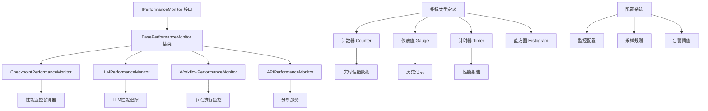

基于我对代码库的深入分析，现在我可以提供关于性能监控实现的详细评估和架构建议。

## 当前性能监控实现分析

通过搜索和阅读相关代码，我发现了以下性能监控实现：

### 1. 基础设施层性能监控
- [`src/infrastructure/checkpoint/performance.py`](src/infrastructure/checkpoint/performance.py:1) - 提供基础的性能监控装饰器和工具
- [`src/infrastructure/monitoring/performance_monitor.py`](src/infrastructure/monitoring/performance_monitor.py:1) - 完整的性能监控系统

### 2. Hook插件系统性能监控
- [`src/infrastructure/graph/plugins/builtin/hooks/performance_monitoring.py`](src/infrastructure/graph/plugins/builtin/hooks/performance_monitoring.py:1) - 节点执行性能监控
- [`src/infrastructure/graph/plugins/builtin/hooks/metrics_collection.py`](src/infrastructure/graph/plugins/builtin/hooks/metrics_collection.py:1) - 指标收集插件

### 3. LLM相关性能监控
- [`src/infrastructure/llm/hooks.py`](src/infrastructure/llm/hooks.py:1) - LLM调用性能追踪

### 4. API层性能监控
- [`src/presentation/api/services/analytics_service.py`](src/presentation/api/services/analytics_service.py:1) - 分析服务提供性能指标

## 现有问题分析

### 1. 重复实现
- 多个地方都有性能监控功能，但实现方式不一致
- [`PerformanceMonitor`](src/infrastructure/checkpoint/performance.py:14) 和 [`PerformanceMonitor`](src/infrastructure/monitoring/performance_monitor.py:78) 都提供类似功能

### 2. 功能分散
- 基础监控功能在 [`checkpoint/performance.py`](src/infrastructure/checkpoint/performance.py:1) 中提供了装饰器模式
- [`monitoring/performance_monitor.py`](src/infrastructure/monitoring/performance_monitor.py:78) 提供了更全面的监控
- Hook系统提供了节点级别的性能监控

### 3. 缺乏统一接口
- 每个模块都有自己的性能监控API
- 没有标准的指标收集和报告机制

## 架构建议

### 强烈建议创建统一的性能监控基类

**理由：**
1. **消除重复代码** - 当前至少有4个不同的性能监控实现
2. **统一监控标准** - 所有模块应该使用相同的性能指标定义
3. **简化维护** - 统一的接口和实现减少维护成本
- **提高可观测性** - 标准化的监控便于系统级性能分析

### 建议的架构设计



### 具体实现建议

1. **创建基础接口** `IPerformanceMonitor`
2. **实现抽象基类** `BasePerformanceMonitor`
3. **提供具体实现** 针对不同场景
4. **集成到DI容器** 便于统一管理

### 核心组件设计

```python
# 基础接口
class IPerformanceMonitor(ABC):
    def record_execution_time(self, operation: str, execution_time: float) -> None
    def get_metrics(self, operation: Optional[str] = None) -> Dict[str, Any]
    def generate_report(self) -> Dict[str, Any]
    def reset_metrics(self) -> None

# 抽象基类
class BasePerformanceMonitor(IPerformanceMonitor):
    def __init__(self, max_history_size: int = 1000) -> None
    def configure(self, config: Dict[str, Any]) -> None
```

## 统一性能监控基类实现方案

### 实施策略：渐进式重构
- **阶段1**：创建新的统一性能监控系统
- **阶段2**：逐步迁移现有实现
- **覆盖范围**：所有具体逻辑实现，展示层独立监控
- **配置方式**：基于现有YAML配置系统
- **数据存储**：内存存储 + 日志输出 + API访问 + Prometheus预留

### 新建/修改文件列表

#### 1. 基础接口定义
**文件路径**：`src/infrastructure/monitoring/interfaces.py`
- 定义 `IPerformanceMonitor` 接口，包含核心监控方法
- 定义指标类型枚举（计数器、仪表值、计时器、直方图）
- 提供标准的性能指标数据模型

#### 2. 抽象基类实现
**文件路径**：`src/infrastructure/monitoring/base_monitor.py`
- 实现 `BasePerformanceMonitor` 抽象类
- 提供线程安全的指标收集和统计计算
- 支持多种导出格式（JSON、Prometheus）

#### 3. 具体实现类
**文件路径**：`src/infrastructure/monitoring/implementations/`
- `CheckpointPerformanceMonitor` - 针对检查点操作的性能监控
- `LLMPerformanceMonitor` - 专门处理LLM调用的性能指标
- `WorkflowPerformanceMonitor` - 工作流节点执行监控
- `ToolPerformanceMonitor` - 工具执行性能监控

#### 4. 配置系统集成
**修改文件**：`src/infrastructure/config/` 相关文件
- 在现有YAML配置系统中添加性能监控配置组
- 支持环境变量覆盖和配置继承

#### 5. 依赖注入配置
**修改文件**：`src/infrastructure/di_config.py`
- 注册统一的性能监控服务到DI容器
- 配置生命周期管理（单例模式）

#### 6. Hook插件适配
**修改文件**：`src/infrastructure/graph/plugins/builtin/hooks/performance_monitoring.py`
- 修改为使用新的统一性能监控基类

#### 7. API服务扩展
**修改文件**：`src/presentation/api/services/analytics_service.py`
- 添加性能指标查询接口
- 支持实时性能数据访问

#### 8. 现有实现迁移
- 逐步替换 [`src/infrastructure/checkpoint/performance.py`](src/infrastructure/checkpoint/performance.py:1) 中的实现
- 保持向后兼容性，逐步废弃旧实现

### 核心设计要点

1. **接口标准化** - 所有性能监控实现遵循相同的接口规范
2. **配置驱动** - 通过YAML配置灵活调整监控行为
3. **模块化架构** - 每个具体实现专注于特定领域的监控
4. **可扩展性** - 预留Prometheus集成接口

### 实施步骤

1. **创建基础接口和抽象基类**
2. **实现具体监控器** 针对不同模块
3. **集成到DI容器** 实现服务统一管理
4. **逐步迁移** - 先在新代码中使用，然后逐步替换现有实现

### 预期成果

- **统一的监控标准** - 所有模块使用相同的性能指标定义
- **减少代码重复** - 消除多个独立的性能监控实现
- **提高可观测性** - 标准化的监控数据便于系统级分析
- **简化维护** - 统一的实现减少bug修复和功能增强工作量
- **灵活配置** - 通过现有配置系统实现多环境适配