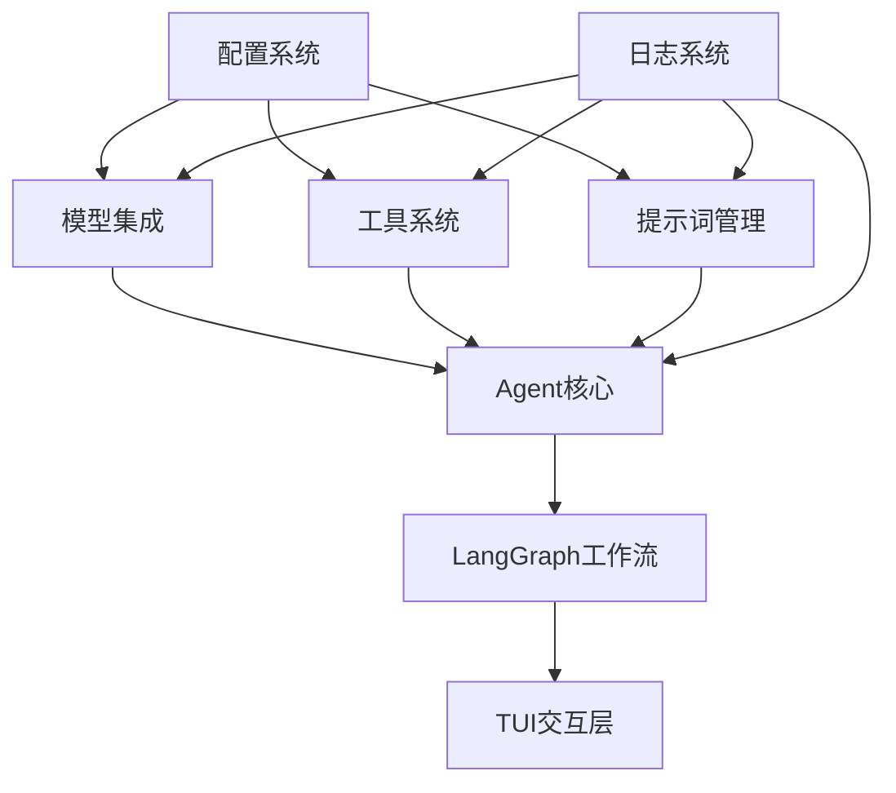

# 第二阶段：核心能力构建实施方案

## 项目概述

**阶段目标**：实现框架的核心功能模块，包括模型集成、工具系统和提示词管理三大核心模块。

**时间安排**：15天（6天模型集成 + 5天工具系统 + 4天提示词管理）

**技术栈更新**：基于LangGraph集成技术栈，使用LangGraph替代自定义工作流引擎

## 1. 当前状态分析

### 1.1 第一阶段完成情况
- ✅ 基础架构与环境配置
- ✅ 配置系统
- ✅ 日志与指标系统
- ✅ 依赖注入容器
- ✅ 架构检查器

### 1.2 现有基础设施
- 配置系统：`src/config/` 模块完整实现
- 日志系统：`src/logger/` 模块完整实现  
- 基础设施：`src/infrastructure/` 模块完整实现
- 配置目录：`configs/` 结构已建立

## 2. 模块实施方案

### 2.1 模型集成模块（6天）

#### 2.1.1 核心接口定义（1天）
```python
# src/llm/
├── interfaces.py          # ILLMClient, ILLMCallHook
├── clients/               # 具体客户端实现
│   ├── base.py           # BaseLLMClient
│   ├── openai_client.py  # OpenAIClient
│   ├── gemini_client.py  # GeminiClient
│   └── anthropic_client.py # AnthropicClient
├── factory.py            # LLMFactory
└── config.py            # LLM配置模型
```

**关键特性**：
- 统一模型客户端接口 `ILLMClient`
- 支持同步/异步调用模式
- HTTP标头白名单控制
- 模型降级机制
- Token计算和统计

#### 2.1.2 客户端实现（3天）
- **OpenAIClient**：支持OpenAI及API兼容模型
- **GeminiClient**：基于ChatGoogleGenerativeAI
- **AnthropicClient**：基于ChatAnthropic
- **MockLLMClient**：测试用模拟客户端

#### 2.1.3 工厂与钩子（2天）
- **LLMFactory**：根据配置创建客户端实例
- **LLMCallHook**：调用前后钩子，支持降级机制
- 配置验证和缓存机制

### 2.2 工具系统模块（5天）

#### 2.2.1 工具基础架构（2天）
```python
# src/tools/
├── interfaces.py          # IToolManager, IToolFormatter, IToolExecutor
├── base.py               # BaseTool抽象类
├── types/                # 工具类型
│   ├── native_tool.py    # 原生能力工具
│   ├── mcp_tool.py       # MCP工具
│   └── builtin_tool.py   # 内置工具
├── manager.py            # ToolManager
├── formatter.py          # ToolFormatter
└── executor.py           # ToolExecutor
```

**关键特性**：
- 三类工具支持：原生、MCP、内置
- 工具集管理机制
- 输出格式化策略（Function Calling vs 结构化输出）
- 并行工具调用支持

#### 2.2.2 工具实现与集成（3天）
- **工具加载器**：自动发现和注册工具
- **工具集配置**：`configs/tool-sets/` 配置管理
- **安全控制**：参数校验、超时控制、权限管理
- **LangGraph集成**：工具调用与工作流集成

### 2.3 提示词管理模块（4天）

#### 2.3.1 提示词资产架构（2天）
```python
# src/prompts/
├── interfaces.py          # IPromptRegistry, IPromptLoader, IPromptInjector
├── registry.py           # PromptRegistry
├── loader.py             # PromptLoader
├── injector.py           # PromptInjector
├── models.py             # 数据模型
└── assets/               # 提示词资产
    ├── system/           # 系统提示词
    ├── rules/            # 规则提示词
    └── user_commands/    # 用户指令
```

**关键特性**：
- 三类提示词分类管理
- 简单/复合提示词支持
- 注册表配置管理
- 缓存和合并机制

#### 2.3.2 提示词注入（2天）
- **注入时机**：工作流初始化阶段
- **注入顺序**：系统→规则→用户指令
- **LangGraph集成**：与AgentState集成
- **测试覆盖**：加载、合并、注入测试

## 3. 技术架构设计

### 3.1 模块依赖关系


### 3.2 核心接口设计

#### 模型集成接口
```python
class ILLMClient(ABC):
    def generate(self, messages: list[BaseMessage], parameters: dict) -> LLMResponse
    def generate_async(self, messages: list[BaseMessage], parameters: dict) -> LLMResponse
    def stream_generate_async(self, messages: list[BaseMessage], parameters: dict) -> AsyncGenerator[str, None]
    def get_token_count(self, text: str) -> int

class LLMFactory:
    def create_client(self, config: LLMConfig) -> ILLMClient
    def get_cached_client(self, model_name: str) -> ILLMClient
```

#### 工具系统接口
```python
class IToolManager:
    def load_tools(self) -> list[BaseTool]
    def get_tool(self, name: str) -> BaseTool
    def get_tool_set(self, name: str) -> list[BaseTool]

class IToolFormatter:
    def format(self, tool: BaseTool, parameters: dict) -> dict
    def detect_strategy(self, llm_client: ILLMClient) -> str
```

#### 提示词管理接口
```python
class IPromptRegistry:
    def get_prompt_meta(self, category: str, name: str) -> PromptMeta
    def list_prompts(self, category: str) -> list[PromptMeta]

class IPromptLoader:
    def load_prompt(self, category: str, name: str) -> str
    def clear_cache(self) -> None
```

## 4. 实施时间表

### 第1周：模型集成（6天）
- **第1天**：接口定义和基础架构
- **第2-3天**：OpenAI和Gemini客户端实现
- **第4天**：Anthropic客户端和Mock客户端
- **第5天**：工厂模式和钩子机制
- **第6天**：集成测试和文档

### 第2周：工具系统（5天）
- **第7-8天**：工具基础架构和类型实现
- **第9天**：工具管理和格式化策略
- **第10天**：工具执行器和安全控制
- **第11天**：集成测试和示例工具

### 第3周：提示词管理（4天）
- **第12-13天**：提示词资产架构和注册表
- **第14天**：提示词加载器和注入器
- **第15天**：集成测试和示例提示词

## 5. 关键依赖和集成点

### 5.1 与现有模块的集成
- **配置系统**：使用 `IConfigLoader` 加载模型、工具、提示词配置
- **日志系统**：使用 `ILogger` 记录调用日志和指标
- **依赖注入**：在 `container.py` 中注册新服务

### 5.2 LangGraph集成
- **工作流定义**：使用LangGraph StateGraph定义Agent工作流
- **状态管理**：集成AgentState与工具调用结果
- **可视化**：使用LangGraph Studio进行工作流调试

### 5.3 配置管理
```yaml
# configs/llms/openai-gpt4.yaml
model_type: openai
model_name: gpt-4-turbo
base_url: "https://api.openai.com/v1"
api_key: "${OPENAI_API_KEY}"
headers:
  User-Agent: "ModularAgent/1.0"
temperature: 0.7
max_tokens: 2000
```

## 6. 测试策略

### 6.1 单元测试
- 每个接口和类的独立测试
- Mock依赖项的隔离测试
- 边界条件和异常情况测试

### 6.2 集成测试
- 模块间集成测试
- 配置加载和验证测试
- LangGraph工作流集成测试

### 6.3 端到端测试
- 完整Agent工作流测试
- 多模型调用测试
- 工具调用链测试

## 7. 交付物清单

### 7.1 代码交付
- 完整的模型集成模块
- 完整的工具系统模块  
- 完整的提示词管理模块
- 集成测试套件
- 使用示例和文档

### 7.2 文档交付
- 模块API文档
- 配置指南
- 集成示例
- 故障排除指南

## 8. 风险与缓解

### 8.1 技术风险
- **LangGraph学习曲线**：提供详细的学习材料和示例
- **多模型兼容性**：充分的测试覆盖和降级机制
- **性能问题**：性能测试和优化策略

### 8.2 集成风险
- **模块间依赖**：清晰的接口定义和集成测试
- **配置复杂性**：配置验证和错误提示
- **向后兼容**：保持现有接口兼容性

## 9. 成功标准

### 9.1 功能标准
- ✅ 支持OpenAI、Gemini、Anthropic三大模型
- ✅ 实现三类工具（原生、MCP、内置）
- ✅ 支持简单和复合提示词
- ✅ 完整的配置管理和验证

### 9.2 质量标准
- ✅ 单元测试覆盖率 ≥ 90%
- ✅ 集成测试覆盖率 ≥ 80%
- ✅ 代码符合PEP8和类型检查
- ✅ 完整的API文档

### 9.3 性能标准
- ✅ 模型调用延迟 ≤ 500ms（Mock环境）
- ✅ 工具调用延迟 ≤ 100ms
- ✅ 提示词加载延迟 ≤ 50ms
- ✅ 内存使用稳定，无内存泄漏

---
*文档版本：V1.0*
*创建日期：2025-10-19*