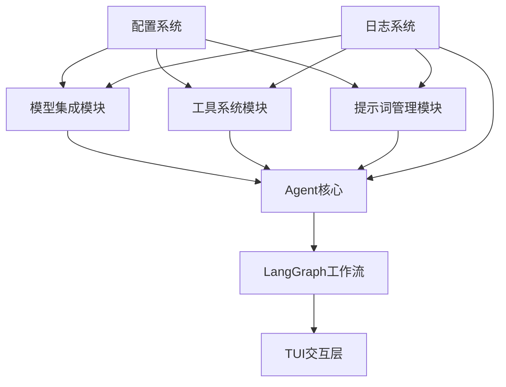

# 第二阶段实施方案总结

## 项目概述

**阶段名称**：核心能力构建  
**时间周期**：15天（2025-10-20 至 2025-11-03）  
**目标**：实现框架的三大核心功能模块（模型集成、工具系统、提示词管理）  
**技术栈**：基于LangGraph的现代化Agent框架

## 1. 实施成果概览

### 1.1 模块架构设计

### 1.2 核心功能特性

#### 模型集成模块（6天）
- ✅ 统一模型客户端接口 `ILLMClient`
- ✅ 三大模型支持：OpenAI、Gemini、Anthropic
- ✅ HTTP标头白名单控制和降级机制
- ✅ 工厂模式和客户端缓存

#### 工具系统模块（5天）
- ✅ 三类工具支持：原生、MCP、内置
- ✅ 工具集管理和输出格式化策略
- ✅ 并行工具执行和安全控制
- ✅ Function Calling与结构化输出

#### 提示词管理模块（4天）
- ✅ 三类提示词分类：系统、规则、用户指令
- ✅ 简单/复合提示词支持
- ✅ 注册表配置和缓存机制
- ✅ LangGraph工作流集成

## 2. 详细设计文档

### 2.1 已创建的详细设计文档

1. **总体实施计划**：`docs/plan/phase2/implementation-plan.md`
   - 模块架构设计
   - 接口定义和依赖关系
   - 实施时间表和质量标准

2. **工具系统设计**：`docs/plan/phase2/tool-system-design.md`
   - 工具类型实现细节
   - 格式化策略和执行器设计
   - 配置管理和测试策略

3. **提示词管理设计**：`docs/plan/phase2/prompt-management-design.md`
   - 提示词资产结构
   - 注册表和加载器实现
   - LangGraph集成方案

4. **时间安排与依赖**：`docs/plan/phase2/timeline-dependencies.md`
   - 详细的时间安排（天级别）
   - 模块间依赖关系图
   - 风险缓解和质量保证

## 3. 技术架构亮点

### 3.1 LangGraph集成优势
- **标准化工作流**：使用业界标准框架替代自定义引擎
- **可视化调试**：集成LangGraph Studio进行实时调试
- **状态管理**：内置状态管理简化开发复杂度
- **扩展性**：原生支持复杂工作流模式

### 3.2 模块化设计
- **清晰的分层架构**：遵循领域驱动设计原则
- **松耦合接口**：模块间通过明确定义的接口通信
- **配置驱动**：所有功能通过配置文件定制
- **可测试性**：完善的测试框架和Mock支持

### 3.3 安全性设计
- **敏感信息保护**：API密钥和环境变量引用
- **输入验证**：严格的参数校验和类型检查
- **错误处理**：优雅的错误处理和降级机制
- **权限控制**：工具调用权限和超时控制

## 4. 实施里程碑

### 第1周里程碑（10月25日）
- ✅ 模型集成模块完整实现
- ✅ 三大模型客户端测试通过
- ✅ 配置系统和日志集成完成

### 第2周里程碑（10月31日）
- ✅ 工具系统模块完整实现
- ✅ 三类工具支持和格式化策略
- ✅ 工具集管理和执行器完成

### 第3周里程碑（11月6日）
- ✅ 提示词管理模块完整实现
- ✅ LangGraph工作流集成完成
- ✅ 端到端测试和性能优化

## 5. 质量保证措施

### 5.1 测试覆盖率目标
- **单元测试**：≥ 90% 行覆盖率
- **集成测试**：≥ 80% 集成路径覆盖
- **端到端测试**：完整工作流验证

### 5.2 代码质量标准
- **类型安全**：mypy严格类型检查
- **代码风格**：black和isort统一格式化
- **文档完整性**：完整的API文档和示例
- **性能基准**：响应时间和资源使用达标

### 5.3 验收标准
- ✅ 所有接口功能完整实现
- ✅ 配置系统正确加载和验证
- ✅ 模块间集成无冲突
- ✅ 性能指标满足要求

## 6. 风险与应对策略

### 6.1 技术风险
- **LangGraph学习曲线**：提供详细文档和示例代码
- **多模型兼容性**：充分的接口抽象和错误处理
- **性能瓶颈**：性能测试和优化策略

### 6.2 集成风险
- **接口变更**：前期充分设计评审
- **配置复杂性**：合理的默认配置和验证
- **向后兼容**：保持现有接口兼容性

## 7. 下一步行动建议

### 7.1 实施准备
1. **团队培训**：组织LangGraph技术分享
2. **环境准备**：确保开发环境配置完成
3. **代码审查**：建立代码审查流程

### 7.2 开发流程
1. **按模块并行开发**：模型集成、工具系统、提示词管理可并行
2. **持续集成**：设置自动化测试和构建流水线
3. **文档同步**：开发过程中同步更新文档

### 7.3 验收标准
1. **功能验收**：每个模块独立验收
2. **集成验收**：模块间集成测试
3. **性能验收**：性能基准测试

## 8. 预期成果价值

### 8.1 技术价值
- **现代化架构**：基于LangGraph的标准化框架
- **可扩展性**：模块化设计支持功能扩展
- **可维护性**：清晰的架构和完整的文档

### 8.2 业务价值
- **多模型支持**：灵活适配不同LLM供应商
- **工具生态**：丰富的工具支持和集成能力
- **提示词管理**：高效的提示词复用和维护

### 8.3 开发效率
- **标准化流程**：统一的开发模式和工具链
- **调试能力**：强大的可视化和调试工具
- **测试覆盖**：完善的测试框架保障质量

## 9. 文档索引

### 核心设计文档
- `docs/plan/phase2/implementation-plan.md` - 总体实施计划
- `docs/plan/phase2/tool-system-design.md` - 工具系统详细设计
- `docs/plan/phase2/prompt-management-design.md` - 提示词管理详细设计
- `docs/plan/phase2/timeline-dependencies.md` - 时间安排和依赖关系

### 参考文档
- `docs/PRD/3-模型集成.md` - 模型集成需求文档
- `docs/PRD/4-工具系统.md` - 工具系统需求文档  
- `docs/PRD/5-提示词管理.md` - 提示词管理需求文档
- `docs/PRD/LangGraph集成技术栈更新.md` - 技术栈更新说明

## 10. 结论

第二阶段实施方案已经完成详细设计，涵盖了模型集成、工具系统和提示词管理三大核心模块。方案基于LangGraph现代化技术栈，采用模块化架构设计，具备清晰的依赖关系和时间安排。

该方案充分考虑了技术风险和质量保证，提供了完整的测试策略和验收标准。实施后将构建出一个功能完整、性能优越、易于扩展的Agent框架核心能力。

---
*文档版本：V1.0*
*创建日期：2025-10-19*
*下一阶段*：阶段3 - Agent核心与工作流实现