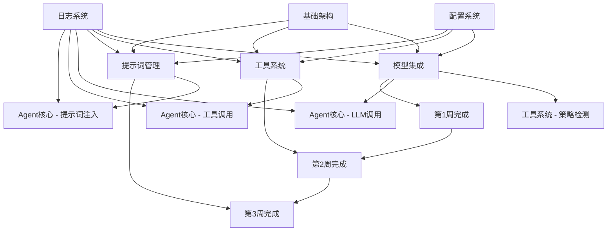

# 第二阶段时间安排与依赖关系

## 项目时间线总览

**总周期**：15天（3周）  
**开始日期**：2025-10-20  
**结束日期**：2025-11-03  

## 1. 详细时间安排

### 第1周：模型集成模块（6天）

#### 第1天（10月20日）：基础架构搭建
- **上午**：定义核心接口（ILLMClient、LLMFactory、ILLMCallHook）
- **下午**：创建基础数据模型和配置结构
- **交付物**：
  - `src/llm/interfaces.py`
  - `src/llm/config.py`
  - `src/llm/models.py`

#### 第2天（10月21日）：OpenAI客户端实现
- **上午**：实现OpenAIClient基础功能
- **下午**：添加HTTP标头控制和认证机制
- **交付物**：
  - `src/llm/clients/openai_client.py`
  - 相关单元测试

#### 第3天（10月22日）：Gemini和Anthropic客户端
- **上午**：实现GeminiClient
- **下午**：实现AnthropicClient
- **交付物**：
  - `src/llm/clients/gemini_client.py`
  - `src/llm/clients/anthropic_client.py`

#### 第4天（10月23日）：Mock客户端和工厂模式
- **上午**：实现MockLLMClient用于测试
- **下午**：实现LLMFactory和客户端缓存
- **交付物**：
  - `src/llm/clients/mock_client.py`
  - `src/llm/factory.py`

#### 第5天（10月24日）：钩子机制和降级策略
- **上午**：实现ILLMCallHook接口
- **下午**：实现模型降级机制
- **交付物**：
  - `src/llm/hooks.py`
  - 降级策略实现

#### 第6天（10月25日）：集成测试和文档
- **上午**：编写集成测试
- **下午**：创建使用示例和API文档
- **交付物**：
  - 完整的模型集成测试套件
  - 使用示例文档

### 第2周：工具系统模块（5天）

#### 第7天（10月27日）：工具基础架构
- **上午**：定义工具系统核心接口
- **下午**：实现BaseTool抽象类和工具类型
- **交付物**：
  - `src/tools/interfaces.py`
  - `src/tools/base.py`
  - `src/tools/types/` 目录结构

#### 第8天（10月28日）：工具管理器实现
- **上午**：实现ToolManager和工具加载逻辑
- **下午**：添加工具集管理功能
- **交付物**：
  - `src/tools/manager.py`
  - 工具配置模型

#### 第9天（10月29日）：输出格式化策略
- **上午**：实现Function Calling格式化
- **下午**：实现结构化输出格式化
- **交付物**：
  - `src/tools/formatter.py`
  - 策略检测机制

#### 第10天（10月30日）：工具执行器
- **上午**：实现ToolExecutor和异步执行
- **下午**：添加安全控制和错误处理
- **交付物**：
  - `src/tools/executor.py`
  - 并行执行功能

#### 第11天（10月31日）：集成测试和示例
- **上午**：编写工具系统集成测试
- **下午**：创建示例工具和配置
- **交付物**：
  - 完整的工具系统测试套件
  - 示例工具实现

### 第3周：提示词管理模块（4天）

#### 第12天（11月3日）：提示词基础架构
- **上午**：定义提示词管理接口
- **下午**：实现PromptRegistry注册表
- **交付物**：
  - `src/prompts/interfaces.py`
  - `src/prompts/registry.py`
  - 提示词资产结构

#### 第13天（11月4日）：提示词加载器
- **上午**：实现简单提示词加载
- **下午**：实现复合提示词合并逻辑
- **交付物**：
  - `src/prompts/loader.py`
  - 缓存机制实现

#### 第14天（11月5日）：提示词注入器
- **上午**：实现PromptInjector
- **下午**：集成LangGraph工作流
- **交付物**：
  - `src/prompts/injector.py`
  - LangGraph集成代码

#### 第15天（11月6日）：测试和优化
- **上午**：编写提示词管理测试
- **下午**：性能优化和文档完善
- **交付物**：
  - 完整的提示词管理测试套件
  - 最终文档和示例

## 2. 模块依赖关系图



## 3. 关键依赖关系

### 3.1 模块间依赖

#### 模型集成 → 工具系统
- **依赖点**：工具格式化策略检测
- **接口**：`ILLMClient.supports_function_calling()`
- **时机**：工具调用前检测模型能力
- **影响**：工具系统需要等待模型集成完成

#### 工具系统 → Agent核心
- **依赖点**：工具调用执行
- **接口**：`IToolExecutor.execute()`
- **时机**：Agent工作流中调用工具
- **影响**：Agent核心开发需要工具系统支持

#### 提示词管理 → Agent核心
- **依赖点**：提示词注入
- **接口**：`IPromptInjector.inject_prompts()`
- **时机**：工作流初始化阶段
- **影响**：Agent核心需要提示词管理完成

### 3.2 外部依赖

#### LangGraph集成
- **影响模块**：所有核心模块
- **集成点**：工作流定义、状态管理、可视化
- **迁移工作**：重写工作流定义为LangGraph格式

#### 配置系统依赖
- **已存在**：第一阶段已完成
- **使用方式**：所有模块通过`IConfigLoader`加载配置
- **验证**：配置验证和错误处理

## 4. 风险缓解策略

### 4.1 技术风险

#### LangGraph学习曲线
- **风险**：团队对LangGraph不熟悉
- **缓解**：
  - 提供详细的LangGraph学习材料
  - 创建示例工作流代码
  - 安排技术分享会议

#### 多模型兼容性
- **风险**：不同模型API差异
- **缓解**：
  - 充分的接口抽象
  - 详细的错误处理
  - 降级机制保障

### 4.2 集成风险

#### 模块间接口变更
- **风险**：接口设计不合理导致后期修改
- **缓解**：
  - 前期充分设计评审
  - 接口版本控制
  - 向后兼容性保证

#### 配置复杂性
- **风险**：配置项过多导致使用困难
- **缓解**：
  - 合理的默认配置
  - 配置验证和提示
  - 详细的配置文档

## 5. 质量保证措施

### 5.1 代码质量
- **代码审查**：每个PR必须经过至少2人审查
- **自动化测试**：单元测试覆盖率 ≥ 90%
- **类型检查**：使用mypy进行严格类型检查
- **代码格式化**：black和isort统一代码风格

### 5.2 测试策略

#### 单元测试
- **目标**：每个类和接口都有独立测试
- **工具**：pytest + pytest-asyncio
- **覆盖率**：≥ 90% 行覆盖率

#### 集成测试
- **目标**：模块间集成功能测试
- **工具**：pytest集成测试框架
- **覆盖率**：≥ 80% 集成路径覆盖

#### 端到端测试
- **目标**：完整工作流测试
- **工具**：pytest + 模拟环境
- **场景**：多模型调用、工具链、提示词注入

### 5.3 性能基准

#### 响应时间要求
- **模型调用**：≤ 500ms（Mock环境）
- **工具调用**：≤ 100ms
- **提示词加载**：≤ 50ms
- **工作流初始化**：≤ 1s

#### 资源使用
- **内存**：稳定使用，无内存泄漏
- **CPU**：合理使用，避免阻塞
- **网络**：连接复用，减少开销

## 6. 交付物清单

### 6.1 代码交付物
```
src/
├── llm/                    # 模型集成模块
│   ├── interfaces.py
│   ├── clients/
│   ├── factory.py
│   └── hooks.py
├── tools/                  # 工具系统模块
│   ├── interfaces.py
│   ├── types/
│   ├── manager.py
│   ├── formatter.py
│   └── executor.py
└── prompts/               # 提示词管理模块
    ├── interfaces.py
    ├── registry.py
    ├── loader.py
    └── injector.py
```

### 6.2 配置交付物
```
configs/
├── llms/                  # 模型配置
│   ├── openai-gpt4.yaml
│   ├── gemini-pro.yaml
│   └── anthropic-claude.yaml
├── tool-sets/            # 工具集配置
│   ├── data-analysis.yaml
│   └── code-generation.yaml
└── prompt_registry.yaml  # 提示词注册表
```

### 6.3 测试交付物
```
tests/
├── unit/
│   ├── llm/              # 模型集成测试
│   ├── tools/            # 工具系统测试
│   └── prompts/          # 提示词管理测试
└── integration/
    ├── test_llm_integration.py
    ├── test_tools_integration.py
    └── test_prompts_integration.py
```

### 6.4 文档交付物
```
docs/
├── plan/phase2/          # 实施计划文档
│   ├── implementation-plan.md
│   ├── tool-system-design.md
│   ├── prompt-management-design.md
│   └── timeline-dependencies.md
└── examples/             # 使用示例
    ├── llm-usage.md
    ├── tools-usage.md
    └── prompts-usage.md
```

## 7. 成功标准

### 7.1 功能完成度
- ✅ 三大模型客户端完整实现
- ✅ 三类工具支持（原生、MCP、内置）
- ✅ 简单和复合提示词管理
- ✅ LangGraph工作流集成

### 7.2 质量标准
- ✅ 单元测试覆盖率 ≥ 90%
- ✅ 集成测试覆盖率 ≥ 80%
- ✅ 代码通过mypy类型检查
- ✅ 性能指标达标

### 7.3 文档质量
- ✅ 完整的API文档
- ✅ 详细的使用示例
- ✅ 配置指南和故障排除
- ✅ 架构设计文档

---
*文档版本：V1.0*
*创建日期：2025-10-19*