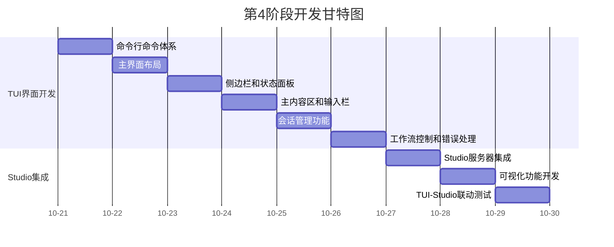

# 第4阶段开发时间安排

## 1. 总体时间分配 (9天)

| 模块 | 天数 | 占比 | 状态 |
|------|------|------|------|
| TUI界面开发 | 6天 | 67% | 待开始 |
| Studio集成 | 3天 | 33% | 待开始 |
| **总计** | **9天** | **100%** | |

## 2. 详细日计划

### 第1天：命令行命令体系开发
**目标**: 完成基于click的命令行系统

**任务分解**:
- [ ] 创建CLI命令框架 (`src/presentation/cli/commands.py`)
- [ ] 实现基础命令: run, session list, session restore, session destroy
- [ ] 实现辅助命令: config check, version
- [ ] 添加命令帮助文档和错误处理
- [ ] 单元测试覆盖

**交付物**:
- 完整的CLI命令系统
- 命令帮助文档
- 单元测试用例

### 第2天：主界面布局开发  
**目标**: 完成rich-based的TUI布局系统

**任务分解**:
- [ ] 设计响应式布局管理器 (`src/presentation/tui/layout.py`)
- [ ] 实现四个主要区域: 标题栏、侧边栏、主内容区、输入栏
- [ ] 添加终端尺寸适配逻辑
- [ ] 实现布局配置系统
- [ ] 测试不同终端尺寸的显示效果

**交付物**:
- 稳定的TUI布局系统
- 响应式布局适配
- 布局配置支持

### 第3天：侧边栏和状态面板开发
**目标**: 完成侧边栏和LangGraph状态面板

**任务分解**:
- [ ] 开发Agent信息显示组件
- [ ] 实现工作流状态监控组件
- [ ] 添加指标统计展示组件
- [ ] 开发LangGraph状态面板
- [ ] 集成实时状态更新机制

**交付物**:
- 功能完整的侧边栏
- LangGraph状态实时显示
- 指标统计面板

### 第4天：主内容区和输入栏开发
**目标**: 完成主内容区和输入交互系统

**任务分解**:
- [ ] 开发会话历史显示组件
- [ ] 实现流式输出渲染器
- [ ] 添加工具调用结果展示
- [ ] 开发多行输入支持
- [ ] 实现输入历史导航

**交付物**:
- 流畅的会话显示系统
- 实时的流式输出
- 完整的输入交互

### 第5天：会话管理功能开发
**目标**: 完成会话管理相关功能

**任务分解**:
- [ ] 集成会话创建/恢复/销毁功能
- [ ] 实现会话切换界面
- [ ] 开发Agent选择对话框
- [ ] 添加会话持久化支持
- [ ] 测试会话状态保持

**交付物**:
- 完整的会话管理系统
- Agent选择界面
- 会话状态持久化

### 第6天：工作流控制和错误处理
**目标**: 完成工作流控制和错误处理系统

**任务分解**:
- [ ] 实现工作流暂停/继续/终止功能
- [ ] 开发错误提示和反馈系统
- [ ] 添加加载状态显示
- [ ] 实现配置热重载支持
- [ ] 完善异常处理机制

**交付物**:
- 工作流控制功能
- 健壮的错误处理
- 用户友好的反馈系统

### 第7天：Studio服务器集成
**目标**: 完成LangGraph Studio服务器集成

**任务分解**:
- [ ] 开发Studio服务器管理器
- [ ] 实现端口配置管理
- [ ] 添加会话隔离机制
- [ ] 集成服务器状态监控
- [ ] 测试服务器启动/停止

**交付物**:
- Studio服务器集成
- 端口配置管理
- 服务器状态监控

### 第8天：可视化功能开发
**目标**: 完成可视化相关功能

**任务分解**:
- [ ] 开发实时工作流可视化
- [ ] 实现节点调试界面
- [ ] 添加历史回放功能
- [ ] 集成性能分析面板
- [ ] 测试可视化性能

**交付物**:
- 工作流可视化系统
- 节点调试功能
- 性能分析工具

### 第9天：TUI-Studio联动和测试
**目标**: 完成集成测试和优化

**任务分解**:
- [ ] 实现TUI-Studio双向联动
- [ ] 开发一键跳转功能
- [ ] 测试实时同步机制
- [ ] 进行集成测试
- [ ] 性能优化和bug修复

**交付物**:
- 完整的TUI-Studio集成
- 通过集成测试
- 优化后的用户体验

## 3. 依赖关系图

## 4. 关键里程碑

### 里程碑1: CLI命令完成 (第1天结束)
- ✅ 所有CLI命令实现
- ✅ 命令帮助文档
- ✅ 基础错误处理

### 里程碑2: TUI布局完成 (第2天结束)  
- ✅ 响应式布局系统
- ✅ 四区域界面结构
- ✅ 终端尺寸适配

### 里程碑3: 核心功能完成 (第6天结束)
- ✅ 会话管理功能
- ✅ 工作流控制
- ✅ 错误处理系统

### 里程碑4: Studio集成完成 (第9天结束)
- ✅ Studio服务器集成
- ✅ 可视化功能
- ✅ 双向联动机制

## 5. 风险评估与应对

### 技术风险
1. **rich布局兼容性问题**
   - 影响: 不同终端显示异常
   - 应对: 准备fallback布局方案，测试多种终端

2. **LangGraph Studio稳定性问题**
   - 影响: 可视化功能不可用
   - 应对: 准备自定义可视化备选方案

3. **异步处理复杂性**
   - 影响: 界面卡顿或响应延迟
   - 应对: 优化事件循环，添加性能监控

### 依赖风险
1. **LangGraph Studio版本兼容性**
   - 影响: 集成失败
   - 应对: 锁定版本依赖，准备降级方案

2. **外部接口变化**
   - 影响: 依赖的Agent核心接口变更
   - 应对: 定义稳定接口契约，添加接口版本控制

## 6. 质量保障措施

### 测试策略
- **单元测试**: 每个组件都有对应的单元测试
- **集成测试**: TUI-Studio联动测试
- **性能测试**: 响应时间、内存使用监控
- **兼容性测试**: 不同终端、不同Python版本

### 代码质量
- **类型注解**: 100%覆盖率，通过mypy检查
- **代码格式**: 使用black和isort统一格式
- **文档覆盖**: 所有公共方法和类都有文档注释
- **错误处理**: 完善的异常处理和用户反馈

## 7. 验收标准

### 功能验收
- [ ] CLI所有命令正常工作
- [ ] TUI界面布局正确显示
- [ ] 会话管理功能完整
- [ ] 工作流控制响应正确
- [ ] Studio服务器正常启动
- [ ] 可视化功能正常工作
- [ ] TUI-Studio联动正常

### 性能验收  
- [ ] 流式输出延迟 ≤100ms
- [ ] Studio响应时间 ≤500ms
- [ ] 内存使用 ≤100MB
- [ ] 启动时间 ≤3秒

### 质量验收
- [ ] 单元测试覆盖率 ≥90%
- [ ] 集成测试通过率 100%
- [ ] 代码规范检查通过
- [ ] 文档完整性 100%

## 8. 资源分配

### 开发资源
- **主要开发人员**: 2人
- **测试人员**: 1人
- **UI/UX设计**: 1人（兼职）

### 环境要求
- **开发环境**: Python 3.13+, 支持rich的终端
- **测试环境**: 多种终端模拟器
- **生产环境**: 标准Linux/Windows终端

---
*时间安排版本: V1.0*
*更新时间: 2025-10-20*