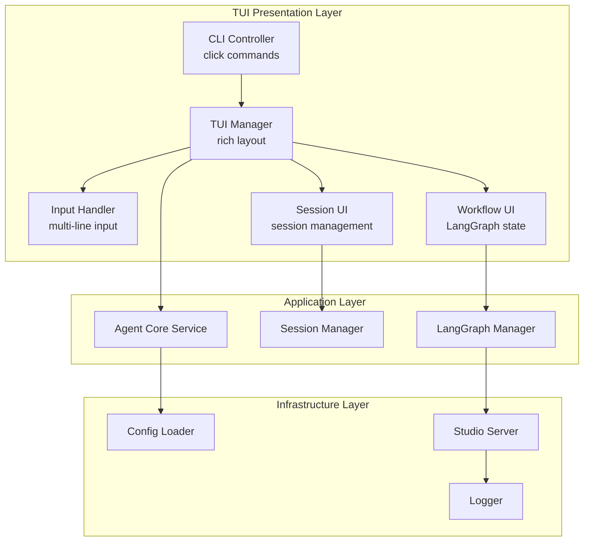

# 阶段4：交互界面实施计划

## 1. 概述

本阶段目标是在9天内完成TUI交互界面和LangGraph Studio集成的开发，提供完整的用户交互体验。

## 2. 技术栈分析

### 2.1 现有技术栈
- **TUI框架**: rich (已安装), click (已安装), blessed (已安装)
- **LangGraph**: langgraph (已安装)
- **配置管理**: pydantic, pyyaml (已安装)

### 2.2 需要新增的依赖
需要添加LangGraph Studio依赖：
```toml
"langgraph-studio >= 0.1.0"
```

## 3. 架构设计

### 3.1 TUI界面架构



### 3.2 文件结构规划
```
src/presentation/
├── cli/
│   ├── __init__.py
│   ├── commands.py          # click命令实现
│   ├── tui_manager.py       # TUI主管理器
│   └── main.py              # CLI入口点
├── tui/
│   ├── __init__.py
│   ├── layout.py            # rich布局管理
│   ├── components/
│   │   ├── sidebar.py       # 侧边栏组件
│   │   ├── main_content.py  # 主内容区组件
│   │   ├── input_panel.py   # 输入面板组件
│   │   └── langgraph_panel.py # LangGraph状态面板
│   ├── handlers/
│   │   ├── input_handler.py # 输入处理
│   │   ├── session_handler.py # 会话处理
│   │   └── workflow_handler.py # 工作流控制
│   └── utils/
│       ├── keybindings.py   # 快捷键绑定
│       └── styling.py       # 样式管理
└── studio/
    ├── __init__.py
    ├── server.py            # Studio服务器管理
    ├── integration.py      # TUI-Studio集成
    └── visualization.py   # 可视化功能
```

## 4. 详细实施计划

### 4.1 TUI界面开发 (6天)

#### 第1天：命令行命令体系 (1天)
- 实现基于click的命令体系
- 支持的命令：
  - `agent run` - 启动TUI
  - `agent session list` - 列出会话
  - `agent session restore <id>` - 恢复会话
  - `agent session destroy <id>` - 销毁会话
  - `agent studio` - 启动Studio
  - `agent config check` - 配置检查
  - `agent version` - 版本显示

#### 第2天：主界面布局 (1天)
- 使用rich.Layout实现界面分区
- 四个主要区域：
  - 标题栏 (5%)
  - 侧边栏 (25%)
  - 主内容区 (65%)
  - 输入栏 (5%)
- 响应式布局支持

#### 第3天：侧边栏和LangGraph状态面板 (1天)
- **侧边栏组件**：
  - Agent信息显示
  - 工作流状态监控
  - 指标统计展示
- **LangGraph状态面板**：
  - 当前节点显示
  - 执行路径追踪
  - 状态快照查看

#### 第4天：主内容区和输入栏 (1天)
- **主内容区**：
  - 会话历史显示
  - 流式输出渲染
  - 工具调用结果展示
- **输入栏**：
  - 多行输入支持
  - 历史记录导航
  - 命令识别处理

#### 第5天：会话管理功能 (1天)
- 会话创建/恢复/销毁
- 会话切换机制
- Agent选择界面
- 会话持久化集成

#### 第6天：工作流控制和错误处理 (1天)
- 工作流暂停/继续/终止
- 错误提示和反馈机制
- 加载状态显示
- 配置热重载支持

### 4.2 Studio集成开发 (3天)

#### 第7天：Studio服务器集成 (1天)
- LangGraph Studio服务器启动
- 端口配置管理 (默认8079)
- 会话隔离机制
- 服务器状态监控

#### 第8天：可视化功能开发 (1天)
- 实时工作流可视化
- 节点调试界面
- 历史回放功能
- 性能分析面板

#### 第9天：TUI-Studio联动和测试 (1天)
- TUI中Studio链接显示
- 一键跳转功能
- 实时同步机制
- 集成测试和优化

## 5. 配置需求

### 5.1 TUI配置 (添加到global.yaml)
```yaml
tui:
  show_thought: true
  show_langgraph_panel: true
  studio_port: 8079
  color_scheme: "default"
  min_width: 80
  min_height: 24
```

### 5.2 Studio配置
```yaml
studio:
  enabled: true
  host: "localhost"
  port: 8079
  auto_start: false
  session_timeout: 3600
```

## 6. 接口依赖

### 6.1 需要实现的接口
```python
# src/presentation/types.py
class ITUIManager:
    async def start_tui(self) -> None: ...
    async def stop_tui(self) -> None: ...
    async def refresh_layout(self) -> None: ...
    
class IStudioManager:
    async def start_studio(self, port: int = 8079) -> None: ...
    async def stop_studio(self) -> None: ...
    def get_studio_url(self) -> str: ...
```

### 6.2 依赖的外部接口
- `IAgentCore` - Agent核心运行
- `ISessionManager` - 会话管理
- `ILangGraphManager` - 工作流状态
- `ILogger` - 日志和指标

## 7. 测试策略

### 7.1 单元测试
- CLI命令测试
- TUI组件测试
- Studio集成测试

### 7.2 集成测试
- 界面布局适配测试
- 交互功能测试
- Studio联动测试

### 7.3 性能测试
- 流式输出延迟 ≤100ms
- Studio响应流畅性
- 内存使用监控

## 8. 风险与缓解

### 8.1 技术风险
- **rich布局兼容性**: 测试不同终端尺寸
- **LangGraph Studio稳定性**: 准备fallback方案
- **异步处理复杂性**: 完善的错误处理

### 8.2 依赖风险
- 确保LangGraph Studio版本兼容
- 备份自定义可视化方案

## 9. 交付物清单

1. ✅ 完整的TUI交互界面
2. ✅ Studio可视化集成  
3. ✅ 用户体验优化
4. ✅ 配置系统扩展
5. ✅ 测试覆盖
6. ✅ 文档更新

---
*计划版本: V1.0*
*更新时间: 2025-10-20*