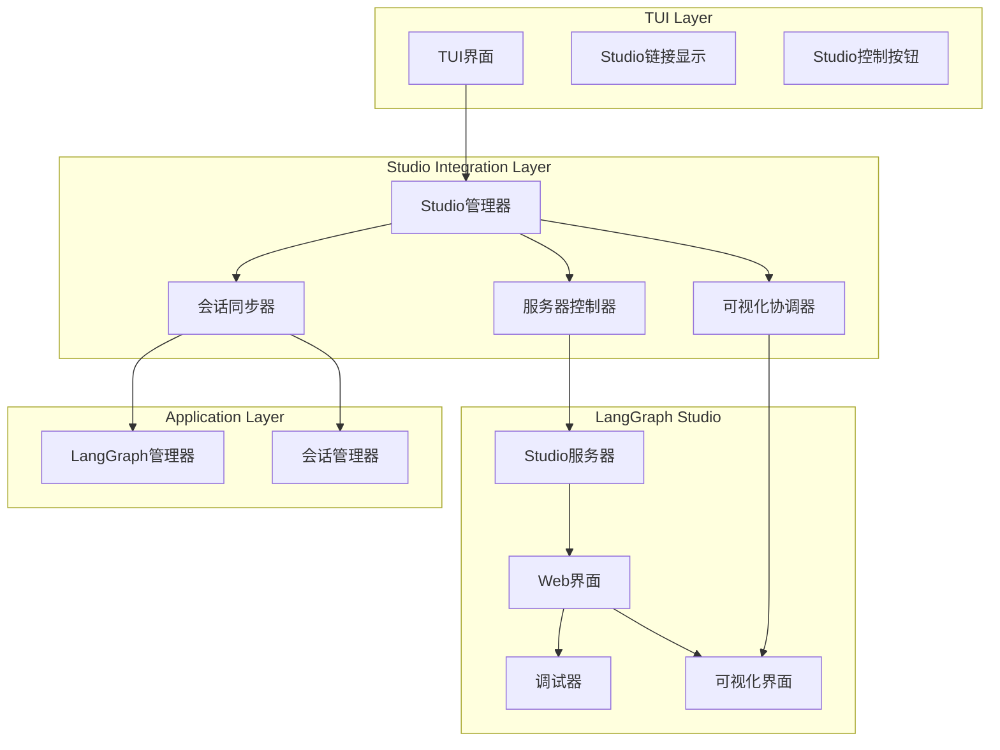

# LangGraph Studio集成方案

## 1. 集成概述

LangGraph Studio提供专业的工作流可视化调试能力，本方案详细规划TUI与Studio的无缝集成。

## 2. 架构设计

### 2.1 集成架构图



## 3. 核心组件设计

### 3.1 Studio管理器 (`src/presentation/studio/manager.py`)
```python
class StudioManager:
    def __init__(self):
        self.server = StudioServer()
        self.sync_manager = SessionSyncManager()
        self.visualizer = Visualizer()
        self.is_running = False
    
    async def start_server(self, port: int = 8079) -> None:
        """启动Studio服务器"""
        if self.is_running:
            raise StudioError("Studio服务器已在运行")
        
        try:
            await self.server.start(port)
            self.is_running = True
            logger.info(f"Studio服务器已启动: http://localhost:{port}")
        except Exception as e:
            raise StudioError(f"启动Studio服务器失败: {e}")
    
    async def stop_server(self) -> None:
        """停止Studio服务器"""
        if not self.is_running:
            return
        
        await self.server.stop()
        self.is_running = False
        logger.info("Studio服务器已停止")
    
    def get_server_url(self) -> str:
        """获取服务器URL"""
        if not self.is_running:
            return ""
        return f"http://localhost:{self.server.port}"
    
    async def sync_session(self, session_id: str) -> None:
        """同步会话到Studio"""
        session = await session_manager.get_session(session_id)
        await self.sync_manager.sync(session)
    
    async def open_in_browser(self) -> None:
        """在浏览器中打开Studio"""
        if not self.is_running:
            raise StudioError("Studio服务器未运行")
        
        import webbrowser
        webbrowser.open(self.get_server_url())
```

### 3.2 服务器控制器 (`src/presentation/studio/server.py`)
```python
class StudioServer:
    def __init__(self):
        self.process = None
        self.port = 8079
    
    async def start(self, port: int = 8079) -> None:
        """启动Studio服务器进程"""
        self.port = port
        
        # 使用subprocess启动LangGraph Studio
        self.process = await asyncio.create_subprocess_exec(
            "langgraph", "studio", "start",
            "--port", str(port),
            "--reload",  # 开发环境热重载
            stdout=asyncio.subprocess.PIPE,
            stderr=asyncio.subprocess.PIPE
        )
        
        # 等待服务器启动完成
        await self._wait_for_startup()
    
    async def _wait_for_startup(self, timeout: int = 10) -> None:
        """等待服务器启动完成"""
        start_time = time.time()
        while time.time() - start_time < timeout:
            if await self._check_server_ready():
                return
            await asyncio.sleep(0.5)
        raise StudioError("Studio服务器启动超时")
    
    async def _check_server_ready(self) -> bool:
        """检查服务器是否就绪"""
        try:
            async with aiohttp.ClientSession() as session:
                async with session.get(f"http://localhost:{self.port}/health") as resp:
                    return resp.status == 200
        except:
            return False
    
    async def stop(self) -> None:
        """停止服务器"""
        if self.process:
            self.process.terminate()
            try:
                await asyncio.wait_for(self.process.wait(), timeout=5)
            except asyncio.TimeoutError:
                self.process.kill()
            self.process = None
```

### 3.3 会话同步器 (`src/presentation/studio/session_sync.py`)
```python
class SessionSyncManager:
    async def sync(self, session: Session) -> None:
        """同步会话数据到Studio"""
        # 1. 导出会话数据
        session_data = await self._export_session_data(session)
        
        # 2. 发送到Studio API
        await self._send_to_studio(session_data)
        
        # 3. 更新同步状态
        session.metadata["studio_synced"] = True
        session.metadata["studio_sync_time"] = datetime.now().isoformat()
    
    async def _export_session_data(self, session: Session) -> Dict:
        """导出会话数据"""
        return {
            "session_id": session.id,
            "agent_config": session.agent_config,
            "workflow_state": await self._export_workflow_state(session),
            "conversation_history": await self._export_conversation(session),
            "tool_calls": await self._export_tool_calls(session),
            "timestamps": {
                "created": session.created_at.isoformat(),
                "last_activity": session.last_activity.isoformat()
            }
        }
    
    async def _send_to_studio(self, data: Dict) -> None:
        """发送数据到Studio"""
        async with aiohttp.ClientSession() as session:
            async with session.post(
                f"http://localhost:{studio_port}/api/sessions",
                json=data,
                headers={"Content-Type": "application/json"}
            ) as resp:
                if resp.status != 200:
                    raise StudioError(f"同步到Studio失败: {await resp.text()}")
```

### 3.4 可视化协调器 (`src/presentation/studio/visualization.py`)
```python
class Visualizer:
    async def show_workflow(self, session_id: str) -> None:
        """显示工作流可视化"""
        session = await session_manager.get_session(session_id)
        workflow_graph = await self._generate_workflow_graph(session)
        
        # 在TUI中显示简化的工作流视图
        self._display_in_tui(workflow_graph)
        
        # 提供跳转到完整Studio的链接
        self._show_studio_link()
    
    async def _generate_workflow_graph(self, session: Session) -> Dict:
        """生成工作流图数据"""
        workflow_state = session.workflow_state
        return {
            "nodes": self._extract_nodes(workflow_state),
            "edges": self._extract_edges(workflow_state),
            "current_node": workflow_state.current_node,
            "execution_path": workflow_state.execution_path
        }
    
    def _display_in_tui(self, graph_data: Dict) -> None:
        """在TUI中显示工作流图"""
        # 简化的文本模式可视化
        display_text = Text()
        display_text.append("工作流状态:\n", style="bold")
        
        for node in graph_data["nodes"]:
            if node == graph_data["current_node"]:
                display_text.append(f"→ {node}", style="green bold")
            else:
                display_text.append(f"  {node}")
            display_text.append("\n")
        
        tui_manager.update_langgraph_panel(display_text)
    
    def _show_studio_link(self) -> None:
        """显示Studio链接"""
        if studio_manager.is_running:
            link_text = Text()
            link_text.append("查看完整工作流: ", style="dim")
            link_text.append(studio_manager.get_server_url(), style="underline blue")
            tui_manager.show_info("Studio可用", link_text)
```

## 4. TUI-Studio联动功能

### 4.1 实时状态同步
```python
class RealTimeSync:
    def __init__(self):
        self.watcher = FileWatcher()
        self.websocket = WebSocketClient()
    
    async def start_sync(self, session_id: str) -> None:
        """启动实时同步"""
        # 监听工作流状态变化
        self.watcher.watch(session_id, self._on_state_change)
        
        # 建立WebSocket连接
        await self.websocket.connect(
            f"ws://localhost:{studio_port}/ws/sessions/{session_id}"
        )
        self.websocket.on_message(self._on_studio_message)
    
    async def _on_state_change(self, new_state: Dict) -> None:
        """工作流状态变化回调"""
        # 发送状态更新到Studio
        await self.websocket.send({
            "type": "state_update",
            "data": new_state
        })
    
    async def _on_studio_message(self, message: Dict) -> None:
        """接收Studio消息"""
        if message["type"] == "workflow_control":
            await self._handle_workflow_control(message)
        elif message["type"] == "debug_command":
            await self._handle_debug_command(message)
```

### 4.2 双向控制机制
```python
class BidirectionalControl:
    async def handle_tui_command(self, command: str) -> None:
        """处理TUI发出的控制命令"""
        if command == "open_studio":
            await studio_manager.open_in_browser()
        elif command == "sync_session":
            await studio_manager.sync_session(current_session.id)
        elif command == "show_workflow":
            await visualizer.show_workflow(current_session.id)
    
    async def handle_studio_command(self, command: Dict) -> None:
        """处理Studio发出的控制命令"""
        if command["action"] == "pause":
            await workflow_handler.pause_workflow()
        elif command["action"] == "resume":
            await workflow_handler.resume_workflow()
        elif command["action"] == "inject_state":
            await self._inject_state(command["state"])
```

## 5. 配置管理

### 5.1 Studio配置模型
```python
# src/presentation/studio/config.py
class StudioConfig(BaseModel):
    enabled: bool = True
    host: str = "localhost"
    port: int = 8079
    auto_start: bool = False
    session_timeout: int = 3600
    sync_interval: int = 5
    max_sessions: int = 10
    
    @validator('port')
    def validate_port(cls, v):
        if not 1024 <= v <= 65535:
            raise ValueError("端口必须在1024-65535之间")
        return v
    
    @classmethod
    def from_global_config(cls) -> "StudioConfig":
        config = config_loader.get_global_config()
        studio_config = config.get("studio", {})
        return cls(**studio_config)
```

### 5.2 全局配置集成
```yaml
# configs/global.yaml 新增配置
studio:
  enabled: true
  host: "localhost"
  port: 8079
  auto_start: false
  session_timeout: 3600
  sync_interval: 5
  max_sessions: 10

tui:
  show_langgraph_panel: true
  studio_port: 8079
  studio_auto_open: false
```

## 6. 错误处理与恢复

### 6.1 Studio错误处理
```python
class StudioErrorHandler:
    async def handle_error(self, error: Exception) -> None:
        """处理Studio相关错误"""
        if isinstance(error, StudioServerError):
            await self._handle_server_error(error)
        elif isinstance(error, SyncError):
            await self._handle_sync_error(error)
        elif isinstance(error, ConnectionError):
            await self._handle_connection_error(error)
        else:
            await self._handle_generic_error(error)
    
    async def _handle_server_error(self, error: StudioServerError) -> None:
        """处理服务器错误"""
        logger.error(f"Studio服务器错误: {error}")
        tui_manager.show_error(
            "Studio错误",
            f"服务器运行异常: {error}\n请检查端口{studio_config.port}是否被占用"
        )
        
        # 尝试重启服务器
        if auto_recover:
            await self._restart_server()
    
    async def _restart_server(self) -> None:
        """重启服务器"""
        try:
            await studio_manager.stop_server()
            await asyncio.sleep(1)
            await studio_manager.start_server(studio_config.port)
            tui_manager.show_success("Studio已恢复", "服务器重启成功")
        except Exception as e:
            logger.error(f"重启Studio服务器失败: {e}")
```

## 7. 测试策略

### 7.1 集成测试用例
```python
# tests/integration/test_studio_integration.py
class TestStudioIntegration:
    async def test_studio_server_start_stop(self):
        """测试Studio服务器启动停止"""
        manager = StudioManager()
        await manager.start_server(8080)
        assert manager.is_running
        assert manager.get_server_url() == "http://localhost:8080"
        
        await manager.stop_server()
        assert not manager.is_running
    
    async def test_session_sync(self):
        """测试会话同步"""
        session = create_test_session()
        await sync_manager.sync(session)
        
        # 验证同步结果
        assert session.metadata["studio_synced"] == True
        assert "studio_sync_time" in session.metadata
    
    async def test_bidirectional_control(self):
        """测试双向控制"""
        # TUI -> Studio 控制
        await control.handle_tui_command("open_studio")
        
        # Studio -> TUI 控制
        await control.handle_studio_command({
            "action": "pause",
            "session_id": "test_session"
        })
        assert workflow_handler.workflow_status == "paused"
```

## 8. 性能考虑

### 8.1 优化措施
- **增量同步**: 只同步变化的状态数据
- **连接池**: 复用HTTP连接减少开销
- **批量处理**: 合并多个状态更新请求
- **缓存机制**: 缓存频繁访问的数据

### 8.2 性能指标
- 服务器启动时间: < 3秒
- 会话同步延迟: < 100ms
- WebSocket消息延迟: < 50ms
- 内存使用: < 50MB (Studio进程)

---
*集成方案版本: V1.0*
*更新时间: 2025-10-20*