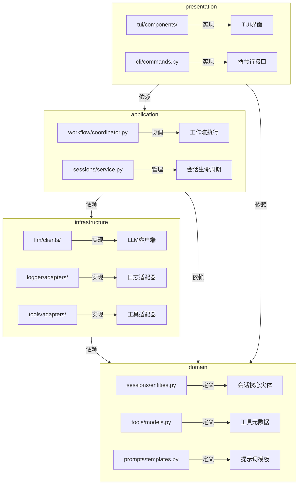

# Domain-Infrastructure-Application 架构重构方案

## 1. 重构目标
- 将现有模块统一到标准分层架构
- 明确各层职责边界与依赖关系
- 提高代码可维护性、可测试性和扩展性
- 为后续多模型LLM集成和工具扩展奠定基础

## 2. 现有目录与目标架构映射

| 现有目录 | 目标层 | 说明 |
|----------|--------|------|
| src/llm | infrastructure | LLM客户端实现，依赖外部API |
| src/logger | infrastructure | 日志系统，技术实现细节 |
| src/prompts | domain | 提示词模板属于核心业务逻辑 |
| src/sessions | domain + application | 会话实体在domain，管理逻辑在application |
| src/tools | domain + infrastructure | 工具定义在domain，实现放在infrastructure |
| src/workflow | application | 工作流协调属于用例实现 |
| src/presentation | presentation | UI和API接口层 |

## 3. 完整文件迁移映射表

### 3.1 Domain层迁移

| 源路径 | 目标路径 | 说明 |
|--------|----------|------|
| src/prompts/__init__.py | src/domain/prompts/__init__.py | 提示词核心接口 |
| src/prompts/agent_state.py | src/domain/prompts/agent_state.py | 代理状态提示词 |
| src/prompts/injector.py | src/domain/prompts/injector.py | 提示词注入逻辑 |
| src/prompts/interfaces.py | src/domain/prompts/interfaces.py | 提示词接口定义 |
| src/prompts/langgraph_integration.py | src/domain/prompts/langgraph_integration.py | 工作流集成 |
| src/prompts/loader.py | src/domain/prompts/loader.py | 提示词加载器 |
| src/prompts/models.py | src/domain/prompts/models.py | 提示词数据模型 |
| src/prompts/registry.py | src/domain/prompts/registry.py | 提示词注册中心 |
| src/sessions/__init__.py | src/domain/sessions/__init__.py | 会话核心接口 |
| src/sessions/store.py | src/domain/sessions/store.py | 会话存储模型 |
| src/tools/__init__.py | src/domain/tools/__init__.py | 工具核心接口 |
| src/tools/base.py | src/domain/tools/base.py | 工具基础抽象 |
| src/tools/interfaces.py | src/domain/tools/interfaces.py | 工具接口定义 |
| src/tools/types/builtin_tool.py | src/domain/tools/types/builtin_tool.py | 内置工具类型 |
| src/tools/types/mcp_tool.py | src/domain/tools/types/mcp_tool.py | MCP工具类型 |
| src/tools/types/native_tool.py | src/domain/tools/types/native_tool.py | 本地工具类型 |
| src/workflow/config.py | src/domain/workflow/config.py | 工作流配置模型 |

### 3.2 Infrastructure层迁移

| 源路径 | 目标路径 | 说明 |
|--------|----------|------|
| src/llm/__init__.py | src/infrastructure/llm/__init__.py | LLM客户端接口 |
| src/llm/config_manager.py | src/infrastructure/llm/config_manager.py | 配置管理 |
| src/llm/config.py | src/infrastructure/llm/config.py | LLM配置 |
| src/llm/error_handler.py | src/infrastructure/llm/error_handler.py | 错误处理 |
| src/llm/exceptions.py | src/infrastructure/llm/exceptions.py | 异常定义 |
| src/llm/factory.py | src/infrastructure/llm/factory.py | 客户端工厂 |
| src/llm/fallback_client.py | src/infrastructure/llm/fallback_client.py | 降级客户端 |
| src/llm/fallback.py | src/infrastructure/llm/fallback.py | 降级策略 |
| src/llm/header_validator.py | src/infrastructure/llm/header_validator.py | 头部验证 |
| src/llm/hooks.py | src/infrastructure/llm/hooks.py | 请求钩子 |
| src/llm/models.py | src/infrastructure/llm/models.py | LLM数据模型 |
| src/llm/token_counter.py | src/infrastructure/llm/token_counter.py | Token计数器 |
| src/llm/clients/__init__.py | src/infrastructure/llm/clients/__init__.py | 客户端接口 |
| src/llm/clients/anthropic_client.py | src/infrastructure/llm/clients/anthropic.py | Anthropic客户端 |
| src/llm/clients/base.py | src/infrastructure/llm/clients/base.py | 客户端基类 |
| src/llm/clients/gemini_client.py | src/infrastructure/llm/clients/gemini.py | Gemini客户端 |
| src/llm/clients/mock_client.py | src/infrastructure/llm/clients/mock.py | Mock客户端 |
| src/llm/clients/openai/__init__.py | src/infrastructure/llm/clients/openai/__init__.py | OpenAI接口 |
| src/llm/clients/openai/config.py | src/infrastructure/llm/clients/openai/config.py | OpenAI配置 |
| src/llm/clients/openai/native_client.py | src/infrastructure/llm/clients/openai/native_client.py | 原生客户端 |
| src/llm/clients/openai/unified_client.py | src/infrastructure/llm/clients/openai/unified_client.py | 统一客户端 |
| src/llm/clients/openai/adapters/__init__.py | src/infrastructure/llm/clients/openai/adapters/__init__.py | 适配器接口 |
| src/llm/clients/openai/adapters/base.py | src/infrastructure/llm/clients/openai/adapters/base.py | 适配器基类 |
| src/llm/clients/openai/adapters/chat_completion.py | src/infrastructure/llm/clients/openai/adapters/chat_completion.py | 聊天适配器 |
| src/llm/clients/openai/adapters/responses_api.py | src/infrastructure/llm/clients/openai/adapters/responses_api.py | 响应适配器 |
| src/llm/clients/openai/converters/__init__.py | src/infrastructure/llm/clients/openai/converters/__init__.py | 转换器接口 |
| src/llm/clients/openai/converters/base.py | src/infrastructure/llm/clients/openai/converters/base.py | 转换器基类 |
| src/llm/clients/openai/converters/chat_completion_converter.py | src/infrastructure/llm/clients/openai/converters/chat_completion_converter.py | 消息转换器 |
| src/llm/clients/openai/converters/responses_converter.py | src/infrastructure/llm/clients/openai/converters/responses_converter.py | 响应转换器 |
| src/llm/token_calculators/__init__.py | src/infrastructure/llm/token_calculators/__init__.py | 计算器接口 |
| src/llm/token_calculators/api_calculator.py | src/infrastructure/llm/token_calculators/api_calculator.py | API计算器 |
| src/llm/token_calculators/base.py | src/infrastructure/llm/token_calculators/base.py | 计算器基类 |
| src/llm/token_calculators/conversation_tracker.py | src/infrastructure/llm/token_calculators/conversation_tracker.py | 会话跟踪器 |
| src/llm/token_calculators/hybrid_calculator.py | src/infrastructure/llm/token_calculators/hybrid_calculator.py | 混合计数器 |
| src/llm/token_calculators/local_calculator.py | src/infrastructure/llm/token_calculators/local_calculator.py | 本地计数器 |
| src/llm/token_parsers/__init__.py | src/infrastructure/llm/token_parsers/__init__.py | 解析器接口 |
| src/llm/token_parsers/anthropic_parser.py | src/infrastructure/llm/token_parsers/anthropic_parser.py | Anthropic解析器 |
| src/llm/token_parsers/base.py | src/infrastructure/llm/token_parsers/base.py | 解析器基类 |
| src/llm/token_parsers/gemini_parser.py | src/infrastructure/llm/token_parsers/gemini_parser.py | Gemini解析器 |
| src/llm/token_parsers/openai_parser.py | src/infrastructure/llm/token_parsers/openai_parser.py | OpenAI解析器 |
| src/llm/utils/encodingProtocol.py | src/infrastructure/llm/utils/encoding_protocol.py | 编码工具 |
| src/logger/__init__.py | src/infrastructure/logger/__init__.py | 日志接口 |
| src/logger/config_integration.py | src/infrastructure/logger/config_integration.py | 配置集成 |
| src/logger/error_handler.py | src/infrastructure/logger/error_handler.py | 错误处理 |
| src/logger/log_level.py | src/infrastructure/logger/log_level.py | 日志级别 |
| src/logger/logger.py | src/infrastructure/logger/logger.py | 日志核心 |
| src/logger/metrics.py | src/infrastructure/logger/metrics.py | 指标收集 |
| src/logger/redactor.py | src/infrastructure/logger/redactor.py | 日志脱敏 |
| src/logger/formatters/__init__.py | src/infrastructure/logger/formatters/__init__.py | 格式化接口 |
| src/logger/formatters/base_formatter.py | src/infrastructure/logger/formatters/base_formatter.py | 基础格式化 |
| src/logger/formatters/color_formatter.py | src/infrastructure/logger/formatters/color_formatter.py | 彩色格式化 |
| src/logger/formatters/json_formatter.py | src/infrastructure/logger/formatters/json_formatter.py | JSON格式化 |
| src/logger/formatters/text_formatter.py | src/infrastructure/logger/formatters/text_formatter.py | 文本格式化 |
| src/logger/handlers/__init__.py | src/infrastructure/logger/handlers/__init__.py | 处理器接口 |
| src/logger/handlers/base_handler.py | src/infrastructure/logger/handlers/base_handler.py | 基础处理器 |
| src/logger/handlers/console_handler.py | src/infrastructure/logger/handlers/console_handler.py | 控制台处理器 |
| src/logger/handlers/file_handler.py | src/infrastructure/logger/handlers/file_handler.py | 文件处理器 |
| src/logger/handlers/json_handler.py | src/infrastructure/logger/handlers/json_handler.py | JSON处理器 |
| src/tools/config.py | src/infrastructure/tools/config.py | 工具配置 |
| src/tools/executor.py | src/infrastructure/tools/executor.py | 工具执行器 |
| src/tools/formatter.py | src/infrastructure/tools/formatter.py | 工具格式化 |
| src/tools/manager.py | src/infrastructure/tools/manager.py | 工具管理器 |
| src/tools/utils/__init__.py | src/infrastructure/tools/utils/__init__.py | 工具工具集 |
| src/tools/utils/schema_generator.py | src/infrastructure/tools/utils/schema_generator.py | 模式生成器 |
| src/tools/utils/validator.py | src/infrastructure/tools/utils/validator.py | 验证器 |

### 3.3 Application层迁移

| 源路径 | 目标路径 | 说明 |
|--------|----------|------|
| src/sessions/event_collector.py | src/application/sessions/event_collector.py | 事件收集器 |
| src/sessions/git_manager.py | src/application/sessions/git_manager.py | Git管理器 |
| src/sessions/manager.py | src/application/sessions/manager.py | 会话管理器 |
| src/sessions/player.py | src/application/sessions/player.py | 会话播放器 |
| src/workflow/__init__.py | src/application/workflow/__init__.py | 工作流接口 |
| src/workflow/auto_discovery.py | src/application/workflow/auto_discovery.py | 自动发现 |
| src/workflow/builder.py | src/application/workflow/builder.py | 工作流构建器 |
| src/workflow/manager.py | src/application/workflow/manager.py | 工作流管理器 |
| src/workflow/edges/__init__.py | src/application/workflow/edges/__init__.py | 边缘接口 |
| src/workflow/edges/conditional_edge.py | src/application/workflow/edges/conditional_edge.py | 条件边 |
| src/workflow/edges/simple_edge.py | src/application/workflow/edges/simple_edge.py | 简单边 |
| src/workflow/nodes/__init__.py | src/application/workflow/nodes/__init__.py | 节点接口 |
| src/workflow/nodes/analysis_node.py | src/application/workflow/nodes/analysis_node.py | 分析节点 |
| src/workflow/nodes/condition_node.py | src/application/workflow/nodes/condition_node.py | 条件节点 |
| src/workflow/nodes/llm_node.py | src/application/workflow/nodes/llm_node.py | LLM节点 |

### 3.4 Presentation层迁移

| 源路径 | 目标路径 | 说明 |
|--------|----------|------|
| src/presentation/api/.gitkeep | src/presentation/api/.gitkeep | API占位符 |
| src/presentation/cli/__init__.py | src/presentation/cli/__init__.py | CLI接口 |
| src/presentation/cli/commands.py | src/presentation/cli/commands.py | CLI命令 |
| src/presentation/cli/error_handler.py | src/presentation/cli/error_handler.py | CLI错误处理 |
| src/presentation/cli/help.py | src/presentation/cli/help.py | CLI帮助 |
| src/presentation/cli/main.py | src/presentation/cli/main.py | CLI入口 |
| src/presentation/cli/run_command.py | src/presentation/cli/run_command.py | CLI运行命令 |
| src/presentation/tui/__init__.py | src/presentation/tui/__init__.py | TUI接口 |
| src/presentation/tui/app.py | src/presentation/tui/app.py | TUI应用 |
| src/presentation/tui/callback_manager.py | src/presentation/tui/callback_manager.py | 回调管理 |
| src/presentation/tui/command_processor.py | src/presentation/tui/command_processor.py | 命令处理 |
| src/presentation/tui/config.py | src/presentation/tui/config.py | TUI配置 |
| src/presentation/tui/event_engine.py | src/presentation/tui/event_engine.py | 事件引擎 |
| src/presentation/tui/layout.py | src/presentation/tui/layout.py | 布局管理 |
| src/presentation/tui/render_controller.py | src/presentation/tui/render_controller.py | 渲染控制 |
| src/presentation/tui/session_handler.py | src/presentation/tui/session_handler.py | 会话处理 |
| src/presentation/tui/state_manager.py | src/presentation/tui/state_manager.py | 状态管理 |
| src/presentation/tui/subview_controller.py | src/presentation/tui/subview_controller.py | 子视图控制 |
| src/presentation/tui/test_callback_chain.py | src/presentation/tui/test_callback_chain.py | 回调测试 |
| src/presentation/tui/test_components.py | src/presentation/tui/test_components.py | 组件测试 |
| src/presentation/tui/test_flicker_fix.py | src/presentation/tui/test_flicker_fix.py | 闪烁修复测试 |
| src/presentation/tui/test_full_integration.py | src/presentation/tui/test_full_integration.py | 集成测试 |
| src/presentation/tui/test_layout_optimization.py | src/presentation/tui/test_layout_optimization.py | 布局优化测试 |
| src/presentation/tui/test_layout.py | src/presentation/tui/test_layout.py | 布局测试 |
| src/presentation/tui/components/__init__.py | src/presentation/tui/components/__init__.py | 组件接口 |
| src/presentation/tui/components/agent_dialog.py | src/presentation/tui/components/agent_dialog.py | 代理对话框 |
| src/presentation/tui/components/config_reload.py | src/presentation/tui/components/config_reload.py | 配置重载 |
| src/presentation/tui/components/error_feedback.py | src/presentation/tui/components/error_feedback.py | 错误反馈 |
| src/presentation/tui/components/history_replay.py | src/presentation/tui/components/history_replay.py | 历史回放 |
| src/presentation/tui/components/input_panel.py | src/presentation/tui/components/input_panel.py | 输入面板 |
| src/presentation/tui/components/langgraph_panel.py | src/presentation/tui/components/langgraph_panel.py | 工作流面板 |
| src/presentation/tui/components/main_content.py | src/presentation/tui/components/main_content.py | 主内容区 |
| src/presentation/tui/components/node_debugger.py | src/presentation/tui/components/node_debugger.py | 节点调试器 |
| src/presentation/tui/components/performance_analyzer.py | src/presentation/tui/components/performance_analyzer.py | 性能分析 |
| src/presentation/tui/components/port_manager.py | src/presentation/tui/components/port_manager.py | 端口管理 |
| src/presentation/tui/components/session_dialog.py | src/presentation/tui/components/session_dialog.py | 会话对话框 |
| src/presentation/tui/components/sidebar.py | src/presentation/tui/components/sidebar.py | 侧边栏 |
| src/presentation/tui/components/studio_integration.py | src/presentation/tui/components/studio_integration.py | Studio集成 |
| src/presentation/tui/components/studio_manager.py | src/presentation/tui/components/studio_manager.py | Studio管理 |
| src/presentation/tui/components/workflow_control.py | src/presentation/tui/components/workflow_control.py | 工作流控制 |
| src/presentation/tui/components/workflow_visualizer.py | src/presentation/tui/components/workflow_visualizer.py | 工作流可视化 |
| src/presentation/tui/components/input_panel_component/__init__.py | src/presentation/tui/components/input_panel_component/__init__.py | 输入组件接口 |
| src/presentation/tui/components/input_panel_component/base_command_processor.py | src/presentation/tui/components/input_panel_component/base_command_processor.py | 基础命令处理器 |
| src/presentation/tui/components/input_panel_component/file_selector_processor.py | src/presentation/tui/components/input_panel_component/file_selector_processor.py | 文件选择处理器 |
| src/presentation/tui/components/input_panel_component/input_buffer.py | src/presentation/tui/components/input_panel_component/input_buffer.py | 输入缓冲区 |
| src/presentation/tui/components/input_panel_component/input_history.py | src/presentation/tui/components/input_panel_component/input_history.py | 输入历史 |
| src/presentation/tui/components/input_panel_component/slash_command_processor.py | src/presentation/tui/components/input_panel_component/slash_command_processor.py | 斜杠命令处理器 |
| src/presentation/tui/components/input_panel_component/workflow_selector_processor.py | src/presentation/tui/components/input_panel_component/workflow_selector_processor.py | 工作流选择处理器 |
| src/presentation/tui/logger/__init__.py | src/presentation/tui/logger/__init__.py | TUI日志接口 |
| src/presentation/tui/logger/tui_logger_manager.py | src/presentation/tui/logger/tui_logger_manager.py | TUI日志管理 |
| src/presentation/tui/logger/tui_logger_silent.py | src/presentation/tui/logger/tui_logger_silent.py | 静默日志 |
| src/presentation/tui/logger/tui_logger.py | src/presentation/tui/logger/tui_logger.py | TUI日志核心 |
| src/presentation/tui/subviews/__init__.py | src/presentation/tui/subviews/__init__.py | 子视图接口 |
| src/presentation/tui/subviews/analytics.py | src/presentation/tui/subviews/analytics.py | 分析视图 |
| src/presentation/tui/subviews/base.py | src/presentation/tui/subviews/base.py | 基础视图 |
| src/presentation/tui/subviews/errors.py | src/presentation/tui/subviews/errors.py | 错误视图 |
| src/presentation/tui/subviews/system.py | src/presentation/tui/subviews/system.py | 系统视图 |
| src/presentation/tui/subviews/visualization.py | src/presentation/tui/subviews/visualization.py | 可视化视图 |

## 4. 新目录结构设计



## 5. 分阶段实施计划

### 阶段1：目录结构调整
1. **创建基础目录结构**
   ```bash
   mkdir -p src/{domain,infrastructure,application,presentation}
   mkdir -p src/domain/{sessions,tools,prompts,workflow}
   mkdir -p src/infrastructure/{llm,logger,tools}
   mkdir -p src/application/{workflow,sessions}
   mkdir -p src/presentation/{api,cli,tui}
   ```

2. **文件迁移策略**
   - 按照[3. 完整文件迁移映射表]执行迁移
   - 保留原文件的`__init__.py`并调整导入路径
   - 使用`2to3`工具自动修复导入语句

### 阶段2：依赖关系验证
1. **实施架构检查**
   ```python
   # 使用ArchitectureChecker验证
   from src.infrastructure import ArchitectureChecker
   
   checker = ArchitectureChecker("src")
   violations = checker.check_dependencies()
   ```

2. **关键验证规则**
   - domain层：禁止导入infrastructure/application/presentation
   - infrastructure层：仅允许导入domain
   - application层：允许导入domain和infrastructure
   - presentation层：允许导入application和domain
   - 所有层：禁止循环依赖

### 阶段3：代码重构
1. **接口抽象化**
   ```python
   # domain/tools/base.py
   from abc import ABC, abstractmethod
   
   class Tool(ABC):
       @abstractmethod
       def execute(self, *args, **kwargs) -> dict:
           pass
   ```

2. **依赖注入适配**
   ```python
   # infrastructure/tools/adapters/calculator.py
   from domain.tools import Tool
   from infrastructure.container import register
   
   @register(Tool, name="calculator")
   class CalculatorAdapter(Tool):
       def execute(self, expression: str) -> dict:
           # 实现细节
   ```

### 阶段4：配置系统整合
1. **配置目录优化**
   ```
   configs/
   ├── llms/
   │   └── provider/  # 保持现有provider结构
   ├── tools/
   │   ├── _group.yaml
   │   └── calculator.yaml
   └── application/
       └── workflow.yaml
   ```

2. **配置加载流程**
   ```python
   # application/workflow/coordinator.py
   from infrastructure import container
   
   config = container.get_config("workflow")
   llm_client = container.get_service(LLMClient)
   ```

## 6. 验证标准
- **架构合规性**：通过ArchitectureChecker验证（0违规）
- **测试覆盖率**：
  - domain层：≥95%单元测试覆盖率
  - infrastructure层：≥90%单元测试覆盖率
  - application层：≥85%集成测试覆盖率
  - presentation层：≥80%UI测试覆盖率
- **性能指标**：
  - 服务初始化时间 ≤ 100ms
  - 配置加载时间 ≤ 50ms

## 7. 回滚方案
1. **版本控制标记**
   ```bash
   git tag refactor/architecture-v1-before
   ```

2. **关键检查点**
   - 完成domain层迁移后创建检查点
   - 完成infrastructure层重构后创建检查点
   - 每个应用服务重构完成创建检查点

## 8. 影响评估
| 模块 | 影响范围 | 风险等级 | 缓解措施 |
|------|----------|----------|----------|
| LLM集成 | 所有AI功能 | 高 | 保留旧客户端作为备选 |
| 会话管理 | 用户交互流程 | 中 | 双写模式过渡 |
| 工具系统 | 扩展功能 | 低 | 逐步替换适配器 |
| TUI界面 | 用户体验 | 中 | 保留旧UI并行运行 |

## 9. 后续优化方向
1. 实现Presentation层与Application层的完全解耦
2. 添加领域事件机制实现跨层通信
3. 构建跨层测试框架确保架构合规性
4. 实现配置热重载支持提升开发体验