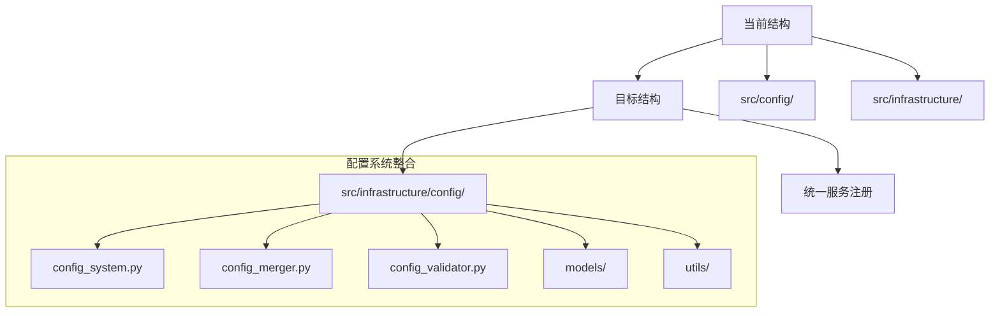

现在让我为您制定详细的整合计划。基于推荐方案1（完全整合到Infrastructure层），以下是具体的实施计划：

## 详细整合计划

### 阶段1: 架构设计和准备

### 阶段2: 具体实施步骤

1. **目录结构调整**
   - 将 `src/config/` 移动到 `src/infrastructure/config/`
   - 更新所有相关的导入路径

2. **服务注册统一化**
   - 在 [`src/infrastructure/__init__.py`](src/infrastructure/__init__.py) 中添加配置相关服务的导出
   - 统一依赖注入容器的服务注册逻辑

3. **依赖关系清理**
   - 消除config模块对infrastructure的反向依赖
   - 确保单向依赖：application → infrastructure → config

4. **测试代码迁移**
   - 将config相关的测试移动到 `tests/unit/infrastructure/config/`
   - 更新测试导入路径

### 阶段3: 验证和测试

1. **架构验证**
   - 使用ArchitectureChecker验证新的依赖关系
   - 确保没有循环依赖

2. **功能测试**
   - 运行所有配置相关的测试
   - 验证服务注册和获取功能

3. **集成测试**
   - 测试TUI和CLI应用的启动
   - 验证配置加载和热重载功能

## 风险评估和缓解措施

| 风险 | 影响 | 缓解措施 |
|------|------|----------|
| 导入路径错误 | 高 | 使用IDE的重构工具，逐步验证 |
| 测试失败 | 中 | 先迁移测试，再迁移代码 |
| 服务注册冲突 | 低 | 统一的服务注册管理 |
| 循环依赖 | 中 | 使用ArchitectureChecker验证 |

## 实施时间预估

- **阶段1**: 1-2天（设计和准备）
- **阶段2**: 3-5天（代码迁移和重构）  
- **阶段3**: 2-3天（测试和验证）

这个计划确保了架构的清晰性和可维护性，同时最小化了对现有功能的影响。