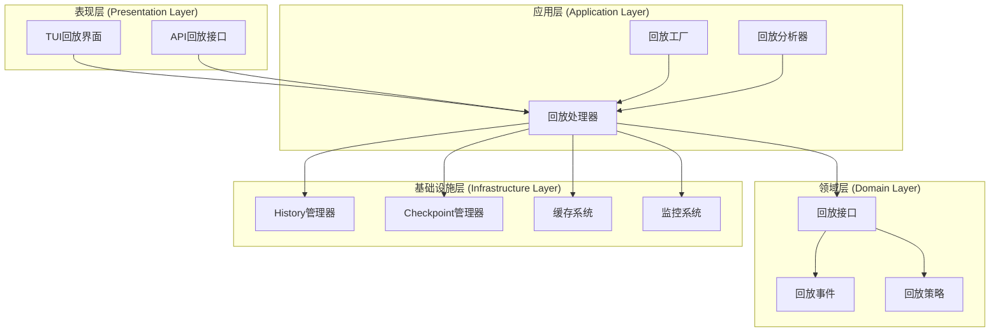
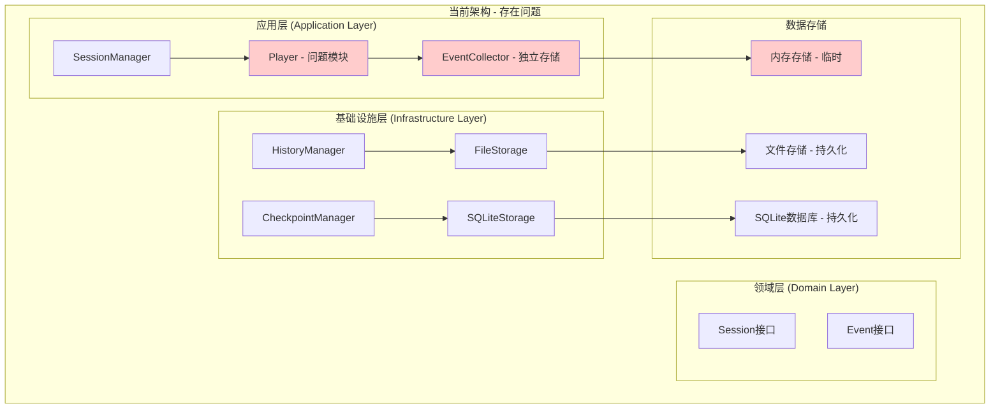
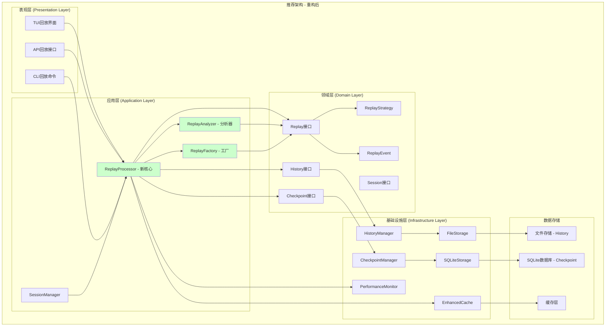
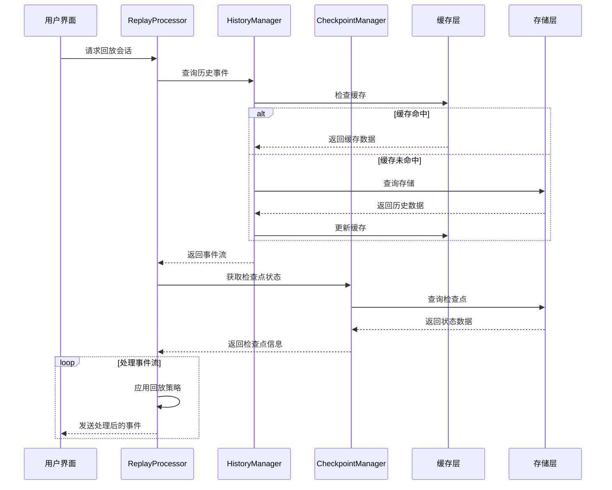

# src/application/sessions/player.py 模块分析报告

## 分析结论

经过全面分析，`src/application/sessions/player.py` 模块的实现存在明显问题，**应该完全重构并复用 history 与 checkpoint 的功能**。

## 主要问题

### 1. 功能重叠严重
- **事件存储**: [`EventCollector`](src/application/sessions/event_collector.py:97) 与 [`HistoryManager`](src/application/history/manager.py:21) 都存储事件数据
- **时间查询**: 两者都提供基于时间范围的数据查询功能
- **会话分析**: [`analyze_session()`](src/application/sessions/player.py:207) 与 history 的统计功能重叠

### 2. 架构设计不合理
- **职责混乱**: Player 既负责回放逻辑又负责数据存储，违反单一职责原则
- **层级错误**: 存储功能应该在基础设施层，而非应用层
- **数据孤岛**: 独立于 history/checkpoint 系统，无法利用成熟的存储机制

### 3. 技术实现落后
- **存储方式**: 使用内存存储，数据易丢失
- **性能问题**: 无缓存机制，无性能监控，同步操作限制并发
- **数据模型**: 使用简单字典，缺乏类型安全

## 重构建议

### 推荐方案：完全重构，删除现有 player.py

基于用户明确表示"不需要任何向后兼容的考虑"，建议采用彻底重构方案：

#### 新架构设计
1. **应用层**: 创建新的 `ReplayProcessor` 专注回放逻辑
2. **领域层**: 定义 `IReplayEngine`、`IReplayStrategy` 等核心接口
3. **基础设施层**: 复用 `HistoryManager` 和 `CheckpointManager` 提供数据

#### 核心组件
- **ReplayProcessor**: 新的回放处理器，支持多种回放模式
- **ReplayAnalyzer**: 专业分析器，利用 history 的统计功能
- **ReplayFactory**: 工厂模式，支持不同回放策略

#### 数据流
```
用户界面 → ReplayProcessor → HistoryManager/CheckpointManager → 存储层
```

## 实施计划

### 第一阶段（1-2周）：核心重构
1. 创建领域层接口和模型
2. 实现基础的 ReplayProcessor
3. 集成 history/checkpoint 数据源
4. 删除旧的 player.py

### 第二阶段（2-3周）：功能完善
1. 实现 ReplayAnalyzer
2. 添加多种回放模式（实时、快进、逐步、分析）
3. 实现交互式控制功能
4. 性能优化和缓存

### 第三阶段（1-2周）：界面集成
1. TUI 界面集成
2. API 接口实现
3. 文档和测试

## 预期收益

### 技术收益
- **代码质量**: 消除重复代码，提高可维护性
- **性能提升**: 利用缓存和异步操作，提升响应速度
- **数据一致性**: 统一数据源，避免数据不一致问题
- **扩展性**: 清晰的接口设计，便于未来功能扩展

### 业务收益
- **功能完善**: 专业的回放分析功能
- **用户体验**: 更流畅的回放体验
- **数据价值**: 充分利用历史数据价值
- **运维效率**: 统一的监控和日志

## 结论

当前的 `player.py` 模块实现不合理，存在严重的功能重叠和架构问题。考虑到用户明确表示不需要向后兼容，建议完全删除现有实现，重新设计一个基于 history/checkpoint 的专业回放系统。这不仅能解决现有问题，还能提供更强大、更专业的回放功能。

---

感谢用户的补充说明，这让我可以更直接地提出重构方案。既然不需要考虑向后兼容，我可以提出一个更彻底的重构建议。

## 5. 重放功能层级分析与重构建议

### 重放功能层级分析

#### 当前实现问题
1. **层级混乱**: [`player.py`](src/application/sessions/player.py:1) 位于应用层，但实现了基础设施层的存储功能
2. **功能半成品**: 交互式回放功能简陋，缺乏专业的时间控制和分析能力
3. **数据孤岛**: 独立于history/checkpoint系统，无法利用现有的成熟存储和分析功能

#### 重放功能应该在哪一层实现？

**推荐：应用层 (Application Layer)**
- **理由**: 重放是业务逻辑功能，应该位于应用层
- **依赖**: 依赖基础设施层的history/checkpoint提供数据
- **职责**: 专注于回放逻辑、时间控制、用户交互

### 全新重构方案

#### 方案概述
完全重新设计重放系统，删除现有 [`player.py`](src/application/sessions/player.py:1)，创建新的专业回放系统。

#### 新架构设计



#### 核心组件设计

##### 1. 领域层 - 回放核心接口

```python
# src/domain/replay/interfaces.py
from abc import ABC, abstractmethod
from typing import Dict, Any, List, Optional, AsyncIterator
from datetime import datetime
from enum import Enum

class ReplayMode(Enum):
    """回放模式"""
    REAL_TIME = "real_time"        # 实时回放
    FAST_FORWARD = "fast_forward"  # 快进
    STEP_BY_STEP = "step_by_step"  # 逐步
    ANALYSIS = "analysis"          # 分析模式

class IReplaySource(ABC):
    """回放数据源接口"""
    
    @abstractmethod
    async def get_events(self, session_id: str, filters: Optional[Dict[str, Any]] = None) -> AsyncIterator[Dict[str, Any]]:
        """获取事件流"""
        pass
    
    @abstractmethod
    async def get_checkpoints(self, session_id: str) -> List[Dict[str, Any]]:
        """获取检查点列表"""
        pass

class IReplayStrategy(ABC):
    """回放策略接口"""
    
    @abstractmethod
    async def should_pause(self, event: Dict[str, Any], context: Dict[str, Any]) -> bool:
        """判断是否应该暂停"""
        pass
    
    @abstractmethod
    async def get_delay(self, event: Dict[str, Any], context: Dict[str, Any]) -> float:
        """获取延迟时间"""
        pass

class IReplayEngine(ABC):
    """回放引擎接口"""
    
    @abstractmethod
    async def start_replay(self, session_id: str, mode: ReplayMode, config: Dict[str, Any]) -> AsyncIterator[Dict[str, Any]]:
        """开始回放"""
        pass
    
    @abstractmethod
    async def pause_replay(self, replay_id: str) -> bool:
        """暂停回放"""
        pass
    
    @abstractmethod
    async def resume_replay(self, replay_id: str) -> bool:
        """恢复回放"""
        pass
    
    @abstractmethod
    async def stop_replay(self, replay_id: str) -> bool:
        """停止回放"""
        pass
```

##### 2. 应用层 - 回放处理器

```python
# src/application/replay/replay_processor.py
from typing import Dict, Any, Optional, AsyncIterator, List
from datetime import datetime
import asyncio

from src.domain.replay.interfaces import IReplayEngine, IReplaySource, ReplayMode
from src.domain.history.interfaces import IHistoryManager
from src.domain.checkpoint.interfaces import ICheckpointManager
from src.infrastructure.common.monitoring.performance_monitor import PerformanceMonitor

class ReplayProcessor(IReplayEngine):
    """回放处理器实现"""
    
    def __init__(
        self,
        history_manager: IHistoryManager,
        checkpoint_manager: ICheckpointManager,
        performance_monitor: Optional[PerformanceMonitor] = None
    ):
        self.history_manager = history_manager
        self.checkpoint_manager = checkpoint_manager
        self.monitor = performance_monitor or PerformanceMonitor()
        self.active_replays: Dict[str, Dict[str, Any]] = {}
    
    async def start_replay(
        self, 
        session_id: str, 
        mode: ReplayMode, 
        config: Dict[str, Any]
    ) -> AsyncIterator[Dict[str, Any]]:
        """开始回放"""
        replay_id = f"replay_{session_id}_{datetime.now().timestamp()}"
        
        # 注册回放会话
        self.active_replays[replay_id] = {
            "session_id": session_id,
            "mode": mode,
            "config": config,
            "status": "running",
            "start_time": datetime.now()
        }
        
        try:
            # 获取历史事件
            async for event in self._get_event_stream(session_id, config):
                if self.active_replays[replay_id]["status"] != "running":
                    break
                
                # 应用回放策略
                processed_event = await self._process_event(event, mode, config)
                yield processed_event
                
        finally:
            # 清理回放会话
            self.active_replays.pop(replay_id, None)
    
    async def _get_event_stream(self, session_id: str, config: Dict[str, Any]) -> AsyncIterator[Dict[str, Any]]:
        """获取事件流"""
        # 从History管理器获取事件
        query = HistoryQuery(
            session_id=session_id,
            start_time=config.get("start_time"),
            end_time=config.get("end_time"),
            record_types=config.get("event_types"),
            limit=config.get("limit")
        )
        
        result = self.history_manager.query_history(query)
        
        for record in result.records:
            # 转换为统一事件格式
            event = self._convert_record_to_event(record)
            yield event
    
    def _convert_record_to_event(self, record) -> Dict[str, Any]:
        """将历史记录转换为事件格式"""
        # 根据记录类型转换为统一事件格式
        if hasattr(record, 'record_type'):
            if record.record_type == 'message':
                return {
                    "type": "user_message",
                    "timestamp": record.timestamp,
                    "data": {
                        "content": record.content,
                        "message_type": record.message_type.value
                    }
                }
            elif record.record_type == 'tool_call':
                return {
                    "type": "tool_call",
                    "timestamp": record.timestamp,
                    "data": {
                        "tool_name": record.tool_name,
                        "tool_input": record.tool_input,
                        "tool_output": record.tool_output
                    }
                }
            # ... 其他记录类型转换
        
        return {"type": "unknown", "timestamp": datetime.now(), "data": {}}
    
    async def _process_event(self, event: Dict[str, Any], mode: ReplayMode, config: Dict[str, Any]) -> Dict[str, Any]:
        """处理事件"""
        if mode == ReplayMode.REAL_TIME:
            # 实时回放：根据事件时间间隔延迟
            await self._apply_real_time_delay(event)
        elif mode == ReplayMode.ANALYSIS:
            # 分析模式：添加分析信息
            event = await self._enrich_with_analysis(event)
        
        return event
    
    async def _apply_real_time_delay(self, event: Dict[str, Any]) -> None:
        """应用实时延迟"""
        # 实现基于事件时间间隔的延迟逻辑
        pass
    
    async def _enrich_with_analysis(self, event: Dict[str, Any]) -> Dict[str, Any]:
        """丰富分析信息"""
        # 添加分析数据
        event["analysis"] = {
            "processing_time": 0.1,
            "complexity_score": 0.5
        }
        return event
```

##### 3. 应用层 - 回放分析器

```python
# src/application/replay/replay_analyzer.py
from typing import Dict, Any, List
from datetime import datetime

class ReplayAnalyzer:
    """回放分析器"""
    
    def __init__(self, history_manager: IHistoryManager):
        self.history_manager = history_manager
    
    async def analyze_session(self, session_id: str) -> Dict[str, Any]:
        """分析会话"""
        # 获取各种统计数据
        token_stats = self.history_manager.get_token_statistics(session_id)
        cost_stats = self.history_manager.get_cost_statistics(session_id)
        llm_stats = self.history_manager.get_llm_statistics(session_id)
        
        # 获取事件时间线
        timeline = await self._build_timeline(session_id)
        
        # 性能分析
        performance = await self._analyze_performance(session_id)
        
        return {
            "session_id": session_id,
            "token_statistics": token_stats,
            "cost_statistics": cost_stats,
            "llm_statistics": llm_stats,
            "timeline": timeline,
            "performance": performance,
            "recommendations": await self._generate_recommendations(session_id)
        }
    
    async def _build_timeline(self, session_id: str) -> List[Dict[str, Any]]:
        """构建时间线"""
        # 构建详细的事件时间线
        pass
    
    async def _analyze_performance(self, session_id: str) -> Dict[str, Any]:
        """分析性能"""
        # 分析会话性能指标
        pass
    
    async def _generate_recommendations(self, session_id: str) -> List[str]:
        """生成优化建议"""
        # 基于分析结果生成建议
        pass
```

##### 4. 依赖注入配置

```python
# src/application/replay/di_config.py
from src.infrastructure.container import Container
from src.application.replay.replay_processor import ReplayProcessor
from src.application.replay.replay_analyzer import ReplayAnalyzer

def register_replay_services(container: Container) -> None:
    """注册回放服务"""
    
    # 回放处理器
    container.register(
        ReplayProcessor,
        lifetime="singleton",
        dependencies={
            "history_manager": "IHistoryManager",
            "checkpoint_manager": "ICheckpointManager",
            "performance_monitor": "PerformanceMonitor"
        }
    )
    
    # 回放分析器
    container.register(
        ReplayAnalyzer,
        lifetime="singleton",
        dependencies={
            "history_manager": "IHistoryManager"
        }
    )
```

### 实施计划

#### 第一阶段：核心重构（1-2周）
1. 创建领域层接口和模型
2. 实现基础的回放处理器
3. 集成history/checkpoint数据源
4. 删除旧的player.py

#### 第二阶段：功能完善（2-3周）
1. 实现回放分析器
2. 添加多种回放模式
3. 实现交互式控制功能
4. 性能优化和缓存

#### 第三阶段：界面集成（1-2周）
1. TUI界面集成
2. API接口实现
3. 文档和测试
4. 部署和监控

## 6. 架构图展示当前和推荐的结构

### 当前架构图



### 推荐架构图



### 架构对比分析

#### 当前架构问题

1. **功能重叠**：
   - [`EventCollector`](src/application/sessions/event_collector.py:97) 和 [`HistoryManager`](src/application/history/manager.py:21) 都存储事件数据
   - 数据模型不一致，转换复杂

2. **存储混乱**：
   - Player使用内存存储，数据易丢失
   - History和Checkpoint有成熟的持久化机制但未被利用

3. **职责不清**：
   - Player既负责回放逻辑又负责数据存储
   - 违反单一职责原则

4. **性能问题**：
   - 无缓存机制
   - 无性能监控
   - 同步操作限制并发

#### 推荐架构优势

1. **职责清晰**：
   - **ReplayProcessor**: 专注回放逻辑
   - **HistoryManager**: 专注历史数据存储
   - **CheckpointManager**: 专注状态快照

2. **数据统一**：
   - 统一使用History作为事件数据源
   - Checkpoint提供状态恢复能力
   - 消除数据孤岛

3. **性能优化**：
   - 集成缓存层
   - 异步操作支持
   - 性能监控集成

4. **扩展性强**：
   - 策略模式支持多种回放模式
   - 工厂模式便于扩展
   - 接口设计支持不同实现

### 数据流图



### 重构收益评估

#### 技术收益
1. **代码质量**: 消除重复代码，提高可维护性
2. **性能提升**: 利用缓存和异步操作，提升响应速度
3. **数据一致性**: 统一数据源，避免数据不一致问题
4. **扩展性**: 清晰的接口设计，便于未来功能扩展

#### 业务收益
1. **功能完善**: 专业的回放分析功能
2. **用户体验**: 更流畅的回放体验
3. **数据价值**: 充分利用历史数据价值
4. **运维效率**: 统一的监控和日志
