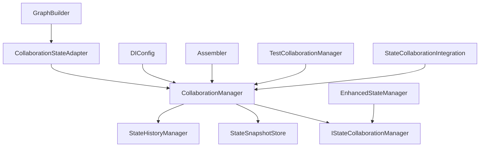

# CollaborationManager 重构相关模块修改分析

## 概述
本文档详细分析了实现 `CollaborationManager` 重构需要修改的相关模块，包括依赖关系、接口变更和集成点。

## 核心依赖关系图



## 需要修改的模块分析

### 1. 核心模块：CollaborationManager
**文件路径**: `src/domain/state/collaboration_manager.py`

**修改内容**:
- 完全重构类结构，添加内存管理功能
- 实现完整的 `execute_with_state_management` 方法
- 完善 `record_state_change` 方法，集成历史管理器
- 添加内存限制和清理机制
- 支持多种存储后端配置

**新增依赖**:
- `threading` - 用于内存管理的线程锁
- `logging` - 用于日志记录
- `StateHistoryManager` - 历史管理器集成

### 2. 依赖注入配置：DIConfig
**文件路径**: `src/infrastructure/di_config.py`

**当前状态**: 第252-256行注册了 `EnhancedStateManager` 作为 `IStateCollaborationManager` 的实现

**修改内容**:
```python
# 需要修改注册逻辑，支持CollaborationManager
def create_simple_collaboration_manager() -> CollaborationManager:
    snapshot_store = self.container.get(StateSnapshotStore)
    history_manager = self.container.get(StateHistoryManager)
    return CollaborationManager(
        snapshot_store=snapshot_store,
        history_manager=history_manager,
        max_memory_usage=50 * 1024 * 1024,  # 50MB
        max_snapshots_per_agent=20,
        max_history_per_agent=100,
        storage_backend="memory"
    )

self.container.register_factory(
    IStateCollaborationManager,
    create_simple_collaboration_manager,
    lifetime=ServiceLifetime.SINGLETON
)
```

**影响范围**:
- 需要添加配置参数支持（内存限制、存储后端等）
- 可能需要从配置文件读取这些参数

### 3. 协作状态适配器：CollaborationStateAdapter
**文件路径**: `src/infrastructure/graph/adapters/collaboration_adapter.py`

**当前状态**: 已经实现了与 `IStateCollaborationManager` 的集成

**修改内容**:
- 可能需要适配新的 `CollaborationManager` 的接口变化
- 添加对新功能的支持（如内存监控、性能统计等）

**潜在修改点**:
```python
# 可能需要添加的方法
def get_memory_usage(self) -> int:
    """获取当前内存使用量"""
    return self.collaboration_manager.get_memory_usage()

def get_performance_stats(self) -> Dict[str, Any]:
    """获取性能统计信息"""
    return self.collaboration_manager.get_performance_stats()
```

### 4. 图构建器：GraphBuilder
**文件路径**: `src/infrastructure/graph/builder.py`

**当前状态**: 第300-320行已经支持状态管理器包装

**修改内容**:
- 可能需要添加对新的配置参数的支持
- 添加性能监控和内存使用监控

**影响范围**:
- `_wrap_node_function` 方法可能需要适配
- 可能需要添加内存使用检查逻辑

### 5. 快照存储：StateSnapshotStore
**文件路径**: `src/infrastructure/state/snapshot_store.py`

**当前状态**: 第32-40行有SQLite和文件系统的占位实现

**修改内容**:
- 完善SQLite存储后端实现
- 完善文件系统存储后端实现
- 添加内存使用统计功能
- 添加存储后端切换逻辑

**具体实现**:
```python
def _setup_sqlite_storage(self):
    """设置SQLite存储"""
    import sqlite3
    import os
    
    # 创建数据库目录
    db_path = os.path.join(os.getcwd(), "data", "snapshots.db")
    os.makedirs(os.path.dirname(db_path), exist_ok=True)
    
    # 初始化数据库
    self.db_connection = sqlite3.connect(db_path)
    self._init_sqlite_tables()

def _setup_file_storage(self):
    """设置文件存储"""
    import os
    import json
    
    # 创建存储目录
    storage_path = os.path.join(os.getcwd(), "data", "snapshots")
    os.makedirs(storage_path, exist_ok=True)
    
    self.storage_path = storage_path
```

### 6. 历史管理器：StateHistoryManager
**文件路径**: `src/infrastructure/state/history_manager.py`

**当前状态**: 只支持内存存储

**修改内容**:
- 添加SQLite存储后端支持
- 添加文件系统存储后端支持
- 添加内存使用统计功能
- 优化历史记录清理逻辑

### 7. 单元测试：TestCollaborationManager
**文件路径**: `tests/unit/domain/state/test_collaboration_manager.py`

**修改内容**:
- 更新测试用例以适配新的接口
- 添加内存管理测试
- 添加存储后端测试
- 添加性能测试

**新增测试用例**:
```python
def test_memory_limit_enforcement(self):
    """测试内存限制强制执行"""
    pass

def test_storage_backend_switching(self):
    """测试存储后端切换"""
    pass

def test_performance_optimization(self):
    """测试性能优化"""
    pass
```

### 8. 集成测试：StateCollaborationIntegration
**文件路径**: `tests/integration/test_state_collaboration_integration.py`

**修改内容**:
- 更新集成测试以使用新的 `CollaborationManager`
- 添加内存使用集成测试
- 添加多存储后端集成测试

### 9. 配置系统：全局配置
**文件路径**: `configs/global.yaml` 或相关配置文件

**新增配置项**:
```yaml
state_collaboration:
  max_memory_usage: 52428800  # 50MB
  max_snapshots_per_agent: 20
  max_history_per_agent: 100
  storage_backend: "memory"  # memory, sqlite, file
  enable_compression: true
  cache_size_limit: 100
  cleanup_interval: 300  # 5分钟
```

### 10. 接口定义：IStateCollaborationManager
**文件路径**: `src/domain/state/interfaces.py`

**修改内容**:
- 可能需要添加新的接口方法以支持内存管理和性能监控

**新增接口方法**:
```python
@abstractmethod
def get_memory_usage(self) -> int:
    """获取当前内存使用量"""
    pass

@abstractmethod
def get_performance_stats(self) -> Dict[str, Any]:
    """获取性能统计信息"""
    pass

@abstractmethod
def cleanup_memory(self) -> None:
    """手动清理内存"""
    pass
```

## 修改优先级分析

### 高优先级（必须修改）
1. **CollaborationManager** - 核心实现
2. **DIConfig** - 依赖注入配置
3. **StateSnapshotStore** - 存储后端实现
4. **StateHistoryManager** - 历史管理器实现

### 中优先级（建议修改）
1. **CollaborationStateAdapter** - 适配器更新
2. **GraphBuilder** - 图构建器适配
3. **配置系统** - 新增配置项
4. **单元测试** - 测试用例更新

### 低优先级（可选修改）
1. **接口定义** - 新增接口方法
2. **集成测试** - 集成测试更新
3. **性能监控** - 性能统计功能

## 修改风险评估

### 高风险项
1. **DIConfig修改** - 可能影响整个系统的依赖注入
2. **存储后端实现** - SQLite和文件系统实现可能引入新的依赖
3. **内存管理** - 线程安全和内存泄漏风险

### 中风险项
1. **接口变更** - 可能影响现有代码的兼容性
2. **配置系统** - 配置项变更可能影响部署

### 低风险项
1. **测试用例** - 只影响测试，不影响生产代码
2. **文档更新** - 纯文档修改，无代码风险

## 修改顺序建议

### 第一阶段：核心实现
1. 实现 `CollaborationManager` 的核心功能
2. 完善 `StateSnapshotStore` 的存储后端
3. 完善 `StateHistoryManager` 的存储后端

### 第二阶段：系统集成
1. 修改 `DIConfig` 配置
2. 更新 `CollaborationStateAdapter`
3. 适配 `GraphBuilder`

### 第三阶段：测试验证
1. 更新单元测试
2. 更新集成测试
3. 添加性能测试

### 第四阶段：配置优化
1. 添加配置项
2. 更新文档
3. 性能调优

## 兼容性考虑

### 向后兼容性
- 保持现有接口的基本签名不变
- 新增功能通过可选参数提供
- 提供配置选项控制新功能的启用

### 迁移策略
- 提供配置选项在 `CollaborationManager` 和 `EnhancedStateManager` 之间切换
- 逐步迁移现有代码到新的实现
- 保持测试用例的兼容性

## 测试策略

### 单元测试
- 测试所有新增功能
- 测试内存管理逻辑
- 测试存储后端切换

### 集成测试
- 测试与现有系统的集成
- 测试依赖注入配置
- 测试端到端的工作流

### 性能测试
- 测试内存使用限制
- 测试响应时间
- 测试并发性能

## 总结

通过以上分析，我们可以看到 `CollaborationManager` 的重构涉及多个模块的修改。关键是要确保：

1. **核心功能完整实现** - 内存管理、存储后端、性能优化
2. **系统集成无缝** - 依赖注入、适配器、配置系统
3. **测试覆盖全面** - 单元测试、集成测试、性能测试
4. **兼容性保证** - 向后兼容、平滑迁移

建议按照优先级和修改顺序逐步实施，确保每个阶段都有充分的测试验证。