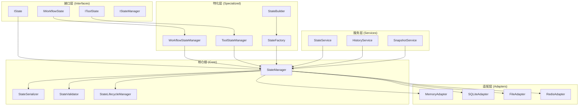

# 统一状态管理架构设计方案

## 1. 架构概述

### 1.1 设计目标

- **统一性**：提供统一的状态管理接口和实现
- **模块化**：保持各业务领域的特化功能
- **扩展性**：支持未来新功能的无缝扩展
- **性能**：优化内存使用和访问性能
- **兼容性**：保持向后兼容，平滑迁移

### 1.2 核心设计原则

1. **分层架构**：接口层 → 核心层 → 特化层 → 适配层
2. **依赖注入**：通过DI容器管理组件生命周期
3. **策略模式**：支持不同的状态管理策略
4. **工厂模式**：统一的对象创建机制
5. **观察者模式**：支持状态变更通知

## 2. 架构设计

### 2.1 整体架构图



### 2.2 目录结构设计

```
src/core/state/
├── __init__.py                 # 统一导出
├── interfaces/                 # 接口定义
│   ├── __init__.py
│   ├── core.py                # 核心状态接口
│   ├── workflow.py            # 工作流状态接口
│   ├── tools.py               # 工具状态接口
│   └── manager.py             # 状态管理器接口
├── core/                      # 核心实现
│   ├── __init__.py
│   ├── state_manager.py       # 统一状态管理器
│   ├── serializer.py          # 状态序列化器
│   ├── validator.py           # 状态验证器
│   ├── lifecycle.py           # 生命周期管理
│   └── cache.py               # 缓存管理
├── specialized/               # 特化实现
│   ├── __init__.py
│   ├── workflow/              # 工作流特化
│   │   ├── __init__.py
│   │   ├── workflow_state.py
│   │   ├── workflow_manager.py
│   │   ├── message_manager.py
│   │   └── builder.py
│   ├── tools/                 # 工具特化
│   │   ├── __init__.py
│   │   ├── tool_state.py
│   │   ├── tool_manager.py
│   │   └── context_manager.py
│   └── factory/               # 工厂实现
│       ├── __init__.py
│       ├── state_factory.py
│       └── manager_factory.py
├── adapters/                  # 存储适配器
│   ├── __init__.py
│   ├── memory.py
│   ├── sqlite.py
│   ├── file.py
│   └── redis.py
├── entities/                  # 实体定义
│   ├── __init__.py
│   ├── base_state.py
│   ├── workflow_state.py
│   ├── tool_state.py
│   └── metadata.py
├── utils/                     # 工具类
│   ├── __init__.py
│   ├── converters.py
│   ├── helpers.py
│   └── constants.py
└── config/                    # 配置管理
    ├── __init__.py
    ├── settings.py
    └── defaults.py
```

## 3. 核心组件设计

### 3.1 统一状态接口设计

```python
# src/core/state/interfaces/core.py
from abc import ABC, abstractmethod
from typing import Any, Dict, List, Optional, Union
from datetime import datetime

class IState(ABC):
    """统一状态接口"""
    
    # 基础状态操作
    @abstractmethod
    def get_data(self, key: str, default: Any = None) -> Any:
        """获取状态数据"""
        pass
    
    @abstractmethod
    def set_data(self, key: str, value: Any) -> None:
        """设置状态数据"""
        pass
    
    @abstractmethod
    def get_metadata(self, key: str, default: Any = None) -> Any:
        """获取元数据"""
        pass
    
    @abstractmethod
    def set_metadata(self, key: str, value: Any) -> None:
        """设置元数据"""
        pass
    
    # 生命周期管理
    @abstractmethod
    def get_id(self) -> Optional[str]:
        """获取状态ID"""
        pass
    
    @abstractmethod
    def get_created_at(self) -> datetime:
        """获取创建时间"""
        pass
    
    @abstractmethod
    def get_updated_at(self) -> datetime:
        """获取更新时间"""
        pass
    
    @abstractmethod
    def is_complete(self) -> bool:
        """检查是否完成"""
        pass
    
    # 序列化支持
    @abstractmethod
    def to_dict(self) -> Dict[str, Any]:
        """转换为字典"""
        pass
    
    @classmethod
    @abstractmethod
    def from_dict(cls, data: Dict[str, Any]) -> 'IState':
        """从字典创建状态"""
        pass

class IStateManager(ABC):
    """统一状态管理器接口"""
    
    @abstractmethod
    def create_state(self, state_type: str, **kwargs) -> IState:
        """创建状态"""
        pass
    
    @abstractmethod
    def get_state(self, state_id: str) -> Optional[IState]:
        """获取状态"""
        pass
    
    @abstractmethod
    def save_state(self, state: IState) -> bool:
        """保存状态"""
        pass
    
    @abstractmethod
    def delete_state(self, state_id: str) -> bool:
        """删除状态"""
        pass
    
    @abstractmethod
    def list_states(self, filters: Optional[Dict[str, Any]] = None) -> List[str]:
        """列出状态ID"""
        pass
```

### 3.2 工作流状态特化接口

```python
# src/core/state/interfaces/workflow.py
from .core import IState
from typing import Any, Dict, List, Optional

class IWorkflowState(IState):
    """工作流状态接口"""
    
    # 工作流特定属性
    @property
    @abstractmethod
    def messages(self) -> List[Any]:
        """消息列表"""
        pass
    
    @property
    @abstractmethod
    def fields(self) -> Dict[str, Any]:
        """工作流字段"""
        pass
    
    @property
    @abstractmethod
    def values(self) -> Dict[str, Any]:
        """所有状态值"""
        pass
    
    # 工作流特定方法
    @abstractmethod
    def get_field(self, key: str, default: Any = None) -> Any:
        """获取字段值"""
        pass
    
    @abstractmethod
    def set_field(self, key: str, value: Any) -> 'IWorkflowState':
        """设置字段值"""
        pass
    
    @abstractmethod
    def add_message(self, message: Any) -> None:
        """添加消息"""
        pass
    
    @abstractmethod
    def get_messages(self) -> List[Any]:
        """获取消息列表"""
        pass
    
    @abstractmethod
    def with_messages(self, messages: List[Any]) -> 'IWorkflowState':
        """创建包含新消息的状态"""
        pass
```

### 3.3 工具状态特化接口

```python
# src/core/state/interfaces/tools.py
from .core import IState
from typing import Any, Dict, List, Optional
from enum import Enum

class StateType(Enum):
    """状态类型枚举"""
    CONNECTION = "connection"
    SESSION = "session"
    BUSINESS = "business"
    CACHE = "cache"

class IToolState(IState):
    """工具状态接口"""
    
    @abstractmethod
    def get_context_id(self) -> str:
        """获取上下文ID"""
        pass
    
    @abstractmethod
    def get_state_type(self) -> StateType:
        """获取状态类型"""
        pass
    
    @abstractmethod
    def is_expired(self) -> bool:
        """检查是否过期"""
        pass
    
    @abstractmethod
    def set_ttl(self, ttl: int) -> None:
        """设置TTL"""
        pass
    
    @abstractmethod
    def get_tool_type(self) -> str:
        """获取工具类型"""
        pass
```

### 3.4 统一状态管理器实现

```python
# src/core/state/core/state_manager.py
from typing import Any, Dict, List, Optional, Type
from datetime import datetime
import threading
from ..interfaces.core import IState, IStateManager
from ..interfaces.workflow import IWorkflowState
from ..interfaces.tools import IToolState
from .serializer import StateSerializer
from .validator import StateValidator
from .lifecycle import StateLifecycleManager
from .cache import StateCache
from ..adapters.memory import MemoryAdapter

class UnifiedStateManager(IStateManager):
    """统一状态管理器"""
    
    def __init__(self, config: Dict[str, Any]):
        """初始化状态管理器"""
        self.config = config
        self._serializer = StateSerializer(config.get('serializer', {}))
        self._validator = StateValidator(config.get('validation', {}))
        self._lifecycle = StateLifecycleManager(config.get('lifecycle', {}))
        self._cache = StateCache(config.get('cache', {}))
        self._adapter = MemoryAdapter(config.get('storage', {}))
        self._lock = threading.RLock()
        
        # 状态类型注册表
        self._state_types: Dict[str, Type[IState]] = {}
        self._register_default_state_types()
    
    def _register_default_state_types(self):
        """注册默认状态类型"""
        from ..specialized.workflow.workflow_state import WorkflowState
        from ..specialized.tools.tool_state import ToolState
        
        self.register_state_type('workflow', WorkflowState)
        self.register_state_type('tool', ToolState)
        self.register_state_type('base', IState)
    
    def register_state_type(self, state_type: str, state_class: Type[IState]):
        """注册状态类型"""
        with self._lock:
            self._state_types[state_type] = state_class
    
    def create_state(self, state_type: str, **kwargs) -> IState:
        """创建状态"""
        with self._lock:
            if state_type not in self._state_types:
                raise ValueError(f"未知状态类型: {state_type}")
            
            state_class = self._state_types[state_type]
            state = state_class(**kwargs)
            
            # 验证状态
            self._validator.validate_state(state)
            
            # 注册生命周期管理
            self._lifecycle.register_state(state)
            
            return state
    
    def get_state(self, state_id: str) -> Optional[IState]:
        """获取状态"""
        with self._lock:
            # 先从缓存获取
            cached_state = self._cache.get(state_id)
            if cached_state:
                return cached_state
            
            # 从存储获取
            state_data = self._adapter.get(state_id)
            if not state_data:
                return None
            
            # 反序列化
            state = self._serializer.deserialize(state_data)
            
            # 缓存状态
            self._cache.put(state_id, state)
            
            return state
    
    def save_state(self, state: IState) -> bool:
        """保存状态"""
        with self._lock:
            try:
                # 验证状态
                self._validator.validate_state(state)
                
                # 序列化状态
                serialized_data = self._serializer.serialize(state)
                
                # 保存到存储
                success = self._adapter.save(state.get_id(), serialized_data)
                
                if success:
                    # 更新缓存
                    self._cache.put(state.get_id(), state)
                    
                    # 触发生命周期事件
                    self._lifecycle.on_state_saved(state)
                
                return success
            except Exception as e:
                self._lifecycle.on_state_error(state, e)
                raise
    
    def delete_state(self, state_id: str) -> bool:
        """删除状态"""
        with self._lock:
            # 从存储删除
            success = self._adapter.delete(state_id)
            
            if success:
                # 从缓存删除
                self._cache.delete(state_id)
                
                # 触发生命周期事件
                self._lifecycle.on_state_deleted(state_id)
            
            return success
    
    def list_states(self, filters: Optional[Dict[str, Any]] = None) -> List[str]:
        """列出状态ID"""
        with self._lock:
            return self._adapter.list(filters)
```

### 3.5 工作流状态特化实现

```python
# src/core/state/specialized/workflow/workflow_state.py
from typing import Any, Dict, List, Optional, Union
from datetime import datetime
from ...interfaces.workflow import IWorkflowState
from ...interfaces.core import IState
from ...entities.base_state import BaseState

class WorkflowState(BaseState, IWorkflowState):
    """工作流状态实现"""
    
    def __init__(self, **kwargs):
        """初始化工作流状态"""
        super().__init__(**kwargs)
        
        # 工作流特定字段
        self._messages: List[Any] = kwargs.get('messages', [])
        self._current_node: Optional[str] = kwargs.get('current_node')
        self._iteration_count: int = kwargs.get('iteration_count', 0)
        self._thread_id: Optional[str] = kwargs.get('thread_id')
        self._session_id: Optional[str] = kwargs.get('session_id')
        self._execution_history: List[Dict[str, Any]] = kwargs.get('execution_history', [])
        self._errors: List[str] = kwargs.get('errors', [])
        self._max_iterations: int = kwargs.get('max_iterations', 10)
    
    @property
    def messages(self) -> List[Any]:
        """消息列表"""
        return self._messages.copy()
    
    @property
    def fields(self) -> Dict[str, Any]:
        """工作流字段"""
        return {
            'current_node': self._current_node,
            'iteration_count': self._iteration_count,
            'thread_id': self._thread_id,
            'session_id': self._session_id,
            'execution_history': self._execution_history,
            'errors': self._errors,
            'max_iterations': self._max_iterations
        }
    
    @property
    def values(self) -> Dict[str, Any]:
        """所有状态值"""
        return {**self._data, **self.fields}
    
    def get_field(self, key: str, default: Any = None) -> Any:
        """获取字段值"""
        return self.fields.get(key, default)
    
    def set_field(self, key: str, value: Any) -> 'IWorkflowState':
        """设置字段值"""
        new_state = self.copy()
        if hasattr(new_state, f'_{key}'):
            setattr(new_state, f'_{key}', value)
        else:
            new_state._data[key] = value
        new_state._updated_at = datetime.now()
        return new_state
    
    def add_message(self, message: Any) -> None:
        """添加消息"""
        self._messages.append(message)
        self._updated_at = datetime.now()
    
    def get_messages(self) -> List[Any]:
        """获取消息列表"""
        return self.messages
    
    def with_messages(self, messages: List[Any]) -> 'IWorkflowState':
        """创建包含新消息的状态"""
        new_state = self.copy()
        new_state._messages = messages.copy()
        new_state._updated_at = datetime.now()
        return new_state
    
    def copy(self) -> 'WorkflowState':
        """创建状态副本"""
        return WorkflowState(
            id=self._id,
            data=self._data.copy(),
            metadata=self._metadata.copy(),
            created_at=self._created_at,
            updated_at=self._updated_at,
            complete=self._complete,
            messages=self._messages.copy(),
            current_node=self._current_node,
            iteration_count=self._iteration_count,
            thread_id=self._thread_id,
            session_id=self._session_id,
            execution_history=self._execution_history.copy(),
            errors=self._errors.copy(),
            max_iterations=self._max_iterations
        )
    
    def to_dict(self) -> Dict[str, Any]:
        """转换为字典"""
        base_dict = super().to_dict()
        base_dict.update({
            'messages': [self._serialize_message(msg) for msg in self._messages],
            'current_node': self._current_node,
            'iteration_count': self._iteration_count,
            'thread_id': self._thread_id,
            'session_id': self._session_id,
            'execution_history': self._execution_history,
            'errors': self._errors,
            'max_iterations': self._max_iterations
        })
        return base_dict
    
    def _serialize_message(self, message: Any) -> Dict[str, Any]:
        """序列化消息"""
        if hasattr(message, 'to_dict'):
            return message.to_dict()
        elif hasattr(message, 'content'):
            return {
                'content': message.content,
                'type': getattr(message, 'type', 'unknown')
            }
        else:
            return {'content': str(message), 'type': 'text'}
```

### 3.6 工具状态特化实现

```python
# src/core/state/specialized/tools/tool_state.py
from typing import Any, Dict, Optional
from datetime import datetime
import time
from ...interfaces.tools import IToolState, StateType
from ...entities.base_state import BaseState

class ToolState(BaseState, IToolState):
    """工具状态实现"""
    
    def __init__(self, **kwargs):
        """初始化工具状态"""
        super().__init__(**kwargs)
        
        # 工具特定字段
        self._context_id: str = kwargs.get('context_id', '')
        self._state_type: StateType = kwargs.get('state_type', StateType.BUSINESS)
        self._tool_type: str = kwargs.get('tool_type', '')
        self._expires_at: Optional[float] = kwargs.get('expires_at')
        self._version: int = kwargs.get('version', 1)
    
    def get_context_id(self) -> str:
        """获取上下文ID"""
        return self._context_id
    
    def get_state_type(self) -> StateType:
        """获取状态类型"""
        return self._state_type
    
    def is_expired(self) -> bool:
        """检查是否过期"""
        if self._expires_at is None:
            return False
        return time.time() > self._expires_at
    
    def set_ttl(self, ttl: int) -> None:
        """设置TTL"""
        self._expires_at = time.time() + ttl
        self._updated_at = datetime.now()
    
    def get_tool_type(self) -> str:
        """获取工具类型"""
        return self._tool_type
    
    def to_dict(self) -> Dict[str, Any]:
        """转换为字典"""
        base_dict = super().to_dict()
        base_dict.update({
            'context_id': self._context_id,
            'state_type': self._state_type.value,
            'tool_type': self._tool_type,
            'expires_at': self._expires_at,
            'version': self._version
        })
        return base_dict
```

## 4. 配置管理设计

### 4.1 统一配置结构

```yaml
# configs/state_management.yaml
state_management:
  # 核心配置
  core:
    default_ttl: 3600
    max_states: 10000
    cleanup_interval: 300
  
  # 序列化配置
  serializer:
    format: "json"  # json, pickle, msgpack
    compression: true
    compression_threshold: 1024
  
  # 缓存配置
  cache:
    enabled: true
    max_size: 1000
    ttl: 300
    eviction_policy: "lru"  # lru, lfu, fifo
  
  # 存储配置
  storage:
    default_backend: "memory"
    backends:
      memory:
        max_size: 10000
      sqlite:
        database_path: "data/states.db"
        connection_pool_size: 10
      file:
        base_path: "data/states"
        format: "json"
      redis:
        host: "localhost"
        port: 6379
        db: 0
        password: null
  
  # 验证配置
  validation:
    enabled: true
    strict_mode: false
    custom_validators: []
  
  # 生命周期配置
  lifecycle:
    auto_cleanup: true
    cleanup_interval: 300
    event_handlers: []
  
  # 特化配置
  specialized:
    workflow:
      max_iterations: 100
      message_history_limit: 1000
      auto_save: true
    
    tools:
      context_isolation: true
      auto_expiration: true
      default_ttl: 1800
```

### 4.2 配置加载器

```python
# src/core/state/config/settings.py
from typing import Any, Dict, Optional
import yaml
import os
from pathlib import Path

class StateManagementSettings:
    """状态管理配置"""
    
    def __init__(self, config_path: Optional[str] = None):
        """初始化配置"""
        self.config_path = config_path or self._get_default_config_path()
        self._config = self._load_config()
    
    def _get_default_config_path(self) -> str:
        """获取默认配置路径"""
        return str(Path(__file__).parent.parent.parent.parent.parent / 
                   "configs" / "state_management.yaml")
    
    def _load_config(self) -> Dict[str, Any]:
        """加载配置"""
        try:
            with open(self.config_path, 'r', encoding='utf-8') as f:
                config = yaml.safe_load(f)
            return config.get('state_management', {})
        except FileNotFoundError:
            return self._get_default_config()
    
    def _get_default_config(self) -> Dict[str, Any]:
        """获取默认配置"""
        return {
            'core': {
                'default_ttl': 3600,
                'max_states': 10000,
                'cleanup_interval': 300
            },
            'serializer': {
                'format': 'json',
                'compression': True,
                'compression_threshold': 1024
            },
            'cache': {
                'enabled': True,
                'max_size': 1000,
                'ttl': 300,
                'eviction_policy': 'lru'
            },
            'storage': {
                'default_backend': 'memory',
                'backends': {
                    'memory': {'max_size': 10000}
                }
            }
        }
    
    def get(self, key: str, default: Any = None) -> Any:
        """获取配置值"""
        keys = key.split('.')
        value = self._config
        for k in keys:
            if isinstance(value, dict) and k in value:
                value = value[k]
            else:
                return default
        return value
    
    def get_core_config(self) -> Dict[str, Any]:
        """获取核心配置"""
        return self._config.get('core', {})
    
    def get_serializer_config(self) -> Dict[str, Any]:
        """获取序列化配置"""
        return self._config.get('serializer', {})
    
    def get_cache_config(self) -> Dict[str, Any]:
        """获取缓存配置"""
        return self._config.get('cache', {})
    
    def get_storage_config(self) -> Dict[str, Any]:
        """获取存储配置"""
        return self._config.get('storage', {})
```

## 5. 依赖注入设计

### 5.1 DI容器配置

```python
# src/core/state/di_config.py
from typing import Dict, Any
from ..services.container import DIContainer
from .core.state_manager import UnifiedStateManager
from .config.settings import StateManagementSettings

def configure_state_management(container: DIContainer, config: Dict[str, Any]):
    """配置状态管理依赖注入"""
    
    # 注册配置
    settings = StateManagementSettings()
    container.register_instance(StateManagementSettings, settings)
    
    # 注册状态管理器
    container.register_singleton(
        IStateManager,
        UnifiedStateManager,
        config=settings.get_storage_config()
    )
    
    # 注册特化管理器
    container.register_singleton(
        IWorkflowStateManager,
        WorkflowStateManager,
        state_manager=container.resolve(IStateManager)
    )
    
    container.register_singleton(
        IToolStateManager,
        ToolStateManager,
        state_manager=container.resolve(IStateManager)
    )
```

## 6. 性能优化设计

### 6.1 缓存策略

```python
# src/core/state/core/cache.py
from typing import Any, Optional, Dict
from datetime import datetime, timedelta
import threading
from collections import OrderedDict

class StateCache:
    """状态缓存管理器"""
    
    def __init__(self, config: Dict[str, Any]):
        """初始化缓存"""
        self.max_size = config.get('max_size', 1000)
        self.ttl = config.get('ttl', 300)
        self.eviction_policy = config.get('eviction_policy', 'lru')
        
        self._cache: OrderedDict[str, Dict[str, Any]] = OrderedDict()
        self._lock = threading.RLock()
    
    def get(self, key: str) -> Optional[Any]:
        """获取缓存值"""
        with self._lock:
            if key not in self._cache:
                return None
            
            entry = self._cache[key]
            
            # 检查TTL
            if self._is_expired(entry):
                del self._cache[key]
                return None
            
            # 更新访问时间（LRU）
            if self.eviction_policy == 'lru':
                self._cache.move_to_end(key)
            
            return entry['value']
    
    def put(self, key: str, value: Any) -> None:
        """设置缓存值"""
        with self._lock:
            # 检查容量
            if len(self._cache) >= self.max_size and key not in self._cache:
                self._evict()
            
            entry = {
                'value': value,
                'created_at': datetime.now(),
                'access_count': 1
            }
            
            self._cache[key] = entry
            
            # 移动到末尾（最新）
            self._cache.move_to_end(key)
    
    def delete(self, key: str) -> bool:
        """删除缓存值"""
        with self._lock:
            if key in self._cache:
                del self._cache[key]
                return True
            return False
    
    def clear(self) -> None:
        """清空缓存"""
        with self._lock:
            self._cache.clear()
    
    def _is_expired(self, entry: Dict[str, Any]) -> bool:
        """检查是否过期"""
        if self.ttl <= 0:
            return False
        
        age = datetime.now() - entry['created_at']
        return age.total_seconds() > self.ttl
    
    def _evict(self) -> None:
        """驱逐缓存项"""
        if not self._cache:
            return
        
        if self.eviction_policy == 'lru':
            # 删除最久未访问的项
            self._cache.popitem(last=False)
        elif self.eviction_policy == 'lfu':
            # 删除访问次数最少的项
            min_key = min(self._cache.keys(), 
                         key=lambda k: self._cache[k]['access_count'])
            del self._cache[min_key]
        elif self.eviction_policy == 'fifo':
            # 删除最早插入的项
            self._cache.popitem(last=False)
```

## 7. 监控和诊断设计

### 7.1 性能监控

```python
# src/core/state/monitoring.py
from typing import Dict, Any, List
from datetime import datetime
import time
import threading

class StateMonitoringMetrics:
    """状态管理监控指标"""
    
    def __init__(self):
        """初始化监控指标"""
        self._lock = threading.Lock()
        self._metrics = {
            'state_operations': {
                'create_count': 0,
                'read_count': 0,
                'update_count': 0,
                'delete_count': 0
            },
            'performance': {
                'avg_create_time': 0.0,
                'avg_read_time': 0.0,
                'avg_update_time': 0.0,
                'avg_delete_time': 0.0
            },
            'cache': {
                'hit_count': 0,
                'miss_count': 0,
                'hit_rate': 0.0
            },
            'storage': {
                'total_states': 0,
                'storage_size': 0,
                'compression_ratio': 0.0
            }
        }
        self._operation_times = {
            'create': [],
            'read': [],
            'update': [],
            'delete': []
        }
    
    def record_operation(self, operation: str, duration: float):
        """记录操作"""
        with self._lock:
            # 更新计数
            key = f"{operation}_count"
            if key in self._metrics['state_operations']:
                self._metrics['state_operations'][key] += 1
            
            # 记录时间
            if operation in self._operation_times:
                times = self._operation_times[operation]
                times.append(duration)
                
                # 保持最近100次记录
                if len(times) > 100:
                    times.pop(0)
                
                # 更新平均时间
                avg_key = f"avg_{operation}_time"
                self._metrics['performance'][avg_key] = sum(times) / len(times)
    
    def record_cache_hit(self):
        """记录缓存命中"""
        with self._lock:
            self._metrics['cache']['hit_count'] += 1
            self._update_hit_rate()
    
    def record_cache_miss(self):
        """记录缓存未命中"""
        with self._lock:
            self._metrics['cache']['miss_count'] += 1
            self._update_hit_rate()
    
    def _update_hit_rate(self):
        """更新缓存命中率"""
        hits = self._metrics['cache']['hit_count']
        misses = self._metrics['cache']['miss_count']
        total = hits + misses
        
        if total > 0:
            self._metrics['cache']['hit_rate'] = hits / total
    
    def get_metrics(self) -> Dict[str, Any]:
        """获取监控指标"""
        with self._lock:
            return self._metrics.copy()
```

## 8. 总结

本架构设计方案提供了：

1. **统一的状态管理框架**：整合了工具状态、工作流状态和通用状态管理
2. **模块化设计**：保持各业务领域的特化功能，同时提供统一的基础设施
3. **高性能实现**：通过缓存、序列化优化和并发控制提升性能
4. **可扩展架构**：支持新的状态类型和存储后端的无缝扩展
5. **完善的监控**：提供全面的性能监控和诊断能力

这个设计方案为状态管理集中化提供了坚实的技术基础，确保了系统的可维护性、可扩展性和高性能。

---

**文档版本**：1.0  
**创建日期**：2025-01-24  
**作者**：架构设计团队  
**审核状态**：待审核