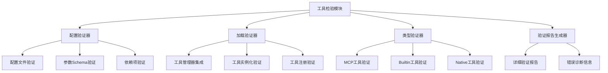

# 工具检验模块设计与实现

## 概述

本模块旨在创建一个专门的工具检验系统，用于验证定义的工具是否可以被工具管理器正确加载。该模块专注于验证加载过程，不涉及工具功能本身的单元测试。

## 设计目标

1. **专注加载验证**：仅验证工具配置、加载过程是否成功
2. **支持多种工具类型**：MCP、Builtin、Native工具
3. **配置驱动**：基于现有配置系统进行验证
4. **易于扩展**：支持新工具类型的验证
5. **详细报告**：提供清晰的验证结果和错误信息

## 核心设计原则

### 1. 专注加载验证
- **仅验证加载过程**：专注于工具配置、实例化、注册过程的验证
- **不涉及功能测试**：工具功能测试在 `examples/tools_test` 目录中完成
- **配置驱动**：基于现有配置系统进行验证

### 2. 支持多种工具类型
- **Builtin工具**：验证函数路径、模块导入、可调用性
- **Native工具**：验证API配置、认证方法、URL格式
- **MCP工具**：验证MCP服务器配置、连接参数

### 3. 模块化架构
- **可扩展验证器**：支持新工具类型的验证器注册
- **插件化报告器**：支持多种输出格式（文本、JSON）
- **依赖注入集成**：与现有依赖注入系统无缝集成

## 架构设计



## 项目结构

```
src/infrastructure/tools/validation/
├── __init__.py                          # 模块导出
├── interfaces.py                        # 验证器接口定义
├── models.py                           # 数据模型（ValidationResult等）
├── manager.py                          # 工具检验管理器
├── validators/                         # 验证器实现
│   ├── __init__.py
│   ├── base_validator.py               # 基础验证器
│   ├── config_validator.py             # 配置验证器
│   ├── loading_validator.py            # 加载验证器
│   ├── builtin_validator.py            # Builtin工具验证器
│   ├── native_validator.py             # Native工具验证器
│   └── mcp_validator.py                # MCP工具验证器
├── reporters/                          # 报告生成器
│   ├── __init__.py
│   ├── base_reporter.py                # 基础报告器
│   ├── text_reporter.py                # 文本报告器
│   └── json_reporter.py                # JSON报告器
└── cli/                                # 命令行工具
    ├── __init__.py
    └── validation_cli.py               # 命令行入口
```

## 核心组件设计

### 1. 工具检验器接口 (IToolValidator)

```python
from typing import Dict, List, Any, Optional
from abc import ABC, abstractmethod
from src.domain.tools.interfaces import ITool

class IToolValidator(ABC):
    """工具检验器接口"""
    
    @abstractmethod
    def validate_config(self, config_path: str) -> 'ValidationResult':
        """验证工具配置文件"""
        pass
    
    @abstractmethod
    def validate_loading(self, tool_name: str) -> 'ValidationResult':
        """验证工具加载过程"""
        pass
    
    @abstractmethod
    def validate_tool_type(self, tool_type: str, config: Dict[str, Any]) -> 'ValidationResult':
        """验证特定工具类型"""
        pass
    
    @abstractmethod
    def get_supported_tool_types(self) -> List[str]:
        """获取支持的工具类型列表"""
        pass
```

### 2. 验证结果类 (ValidationResult)

```python
from dataclasses import dataclass, field
from typing import List, Dict, Any, Optional
from enum import Enum
from datetime import datetime

class ValidationStatus(Enum):
    """验证状态枚举"""
    SUCCESS = "success"
    WARNING = "warning"
    ERROR = "error"

@dataclass
class ValidationIssue:
    """验证问题"""
    level: ValidationStatus
    message: str
    details: Dict[str, Any] = field(default_factory=dict)
    suggestion: Optional[str] = None
    timestamp: datetime = field(default_factory=datetime.now)

@dataclass
class ValidationResult:
    """验证结果"""
    tool_name: str
    tool_type: str
    status: ValidationStatus
    issues: List[ValidationIssue] = field(default_factory=list)
    metadata: Dict[str, Any] = field(default_factory=dict)
    timestamp: datetime = field(default_factory=datetime.now)
    
    def add_issue(self, level: ValidationStatus, message: str, **kwargs):
        """添加验证问题"""
        suggestion = kwargs.pop('suggestion', None)
        details = kwargs.copy()
        self.issues.append(ValidationIssue(level, message, details, suggestion))
        # 更新总体状态（取最严重的状态）
        if level == ValidationStatus.ERROR:
            self.status = ValidationStatus.ERROR
        elif level == ValidationStatus.WARNING and self.status != ValidationStatus.ERROR:
            self.status = ValidationStatus.WARNING
    
    def is_successful(self) -> bool:
        """检查验证是否成功"""
        return self.status == ValidationStatus.SUCCESS
```

### 3. 工具检验管理器 (ToolValidationManager)

```python
from typing import List, Dict, Any
from src.infrastructure.config_loader import IConfigLoader
from src.infrastructure.logger.logger import ILogger
from src.infrastructure.tools.manager import ToolManager

class ToolValidationManager:
    """工具检验管理器"""
    
    def __init__(
        self, 
        config_loader: IConfigLoader,
        logger: ILogger,
        tool_manager: Optional[ToolManager] = None
    ):
        self.config_loader = config_loader
        self.logger = logger
        self.tool_manager = tool_manager
        self.validators: Dict[str, IToolValidator] = {}
        self._register_validators()
    
    def _register_validators(self) -> None:
        """注册验证器"""
        from .validators import (
            ConfigValidator,
            LoadingValidator,
            BuiltinToolValidator,
            NativeToolValidator,
            MCPToolValidator
        )
        
        self.validators["config"] = ConfigValidator(self.config_loader, self.logger)
        self.validators["loading"] = LoadingValidator(self.tool_manager, self.logger)
        self.validators["builtin"] = BuiltinToolValidator(self.logger)
        self.validators["native"] = NativeToolValidator(self.logger)
        self.validators["mcp"] = MCPToolValidator(self.logger)
    
    def validate_tool(self, tool_name: str, config_path: str) -> Dict[str, ValidationResult]:
        """全面验证工具"""
        results = {}
        
        # 1. 配置验证
        config_result = self.validators["config"].validate_config(config_path)
        results["config"] = config_result
        
        # 2. 类型特定验证
        if config_result.is_successful():
            tool_type = config_result.metadata.get("tool_type")
            if tool_type in self.validators:
                type_result = self.validators[tool_type].validate_tool_type(
                    tool_type, config_result.metadata.get("config_data", {})
                )
                results["type"] = type_result
        
        # 3. 加载验证
        if self.tool_manager:
            loading_result = self.validators["loading"].validate_loading(tool_name)
            results["loading"] = loading_result
        
        return results
    
    def validate_all_tools(self, config_dir: str = "configs/tools") -> Dict[str, Dict[str, ValidationResult]]:
        """验证所有工具"""
        all_results = {}
        
        try:
            # 获取所有工具配置文件
            config_files = self._get_tool_config_files(config_dir)
            
            for config_file in config_files:
                tool_name = config_file.stem
                results = self.validate_tool(tool_name, str(config_file))
                all_results[tool_name] = results
        
        except Exception as e:
            self.logger.error(f"验证所有工具时出错: {e}")
        
        return all_results
```

## 具体验证器实现

### 1. 配置验证器 (ConfigValidator)

```python
class ConfigValidator(IToolValidator):
    """配置验证器"""
    
    def validate_config(self, config_path: str) -> ValidationResult:
        """验证工具配置文件"""
        result = ValidationResult("unknown", "unknown", ValidationStatus.SUCCESS)
        
        try:
            # 加载配置
            config_data = self.config_loader.load(config_path)
            result.metadata["config_data"] = config_data
            
            # 验证必需字段
            required_fields = ["name", "tool_type", "description", "parameters_schema"]
            for field in required_fields:
                if field not in config_data:
                    result.add_issue(
                        ValidationStatus.ERROR,
                        f"缺少必需字段: {field}",
                        field=field
                    )
            
            # 验证工具类型
            tool_type = config_data.get("tool_type")
            if tool_type not in ["builtin", "native", "mcp"]:
                result.add_issue(
                    ValidationStatus.ERROR,
                    f"无效的工具类型: {tool_type}",
                    tool_type=tool_type
                )
            
            # 验证参数Schema
            if "parameters_schema" in config_data:
                schema_errors = self._validate_schema(config_data["parameters_schema"])
                for error in schema_errors:
                    result.add_issue(ValidationStatus.ERROR, error)
            
            # 更新结果元数据
            result.tool_name = config_data.get("name", "unknown")
            result.tool_type = tool_type or "unknown"
            
        except Exception as e:
            result.add_issue(ValidationStatus.ERROR, f"配置文件加载失败: {e}")
        
        return result
    
    def _validate_schema(self, schema: Dict[str, Any]) -> List[str]:
        """验证参数Schema"""
        errors = []
        # Schema验证逻辑
        return errors
```

### 2. 加载验证器 (LoadingValidator)

```python
class LoadingValidator(IToolValidator):
    """加载验证器"""
    
    def validate_loading(self, tool_name: str) -> ValidationResult:
        """验证工具加载过程"""
        result = ValidationResult(tool_name, "unknown", ValidationStatus.SUCCESS)
        
        try:
            # 尝试加载工具
            tool = self.tool_manager.get_tool(tool_name)
            result.tool_type = getattr(tool, 'tool_type', 'unknown')
            
            # 验证工具属性
            required_attrs = ["name", "description", "get_schema"]
            for attr in required_attrs:
                if not hasattr(tool, attr):
                    result.add_issue(
                        ValidationStatus.ERROR,
                        f"工具缺少必需属性: {attr}"
                    )
            
            # 验证Schema获取
            try:
                schema = tool.get_schema()
                if not isinstance(schema, dict):
                    result.add_issue(
                        ValidationStatus.ERROR,
                        "工具Schema格式不正确"
                    )
            except Exception as e:
                result.add_issue(
                    ValidationStatus.ERROR,
                    f"获取工具Schema失败: {e}"
                )
        
        except Exception as e:
            result.add_issue(
                ValidationStatus.ERROR,
                f"工具加载失败: {e}"
            )
        
        return result
```

### 3. 类型特定验证器

#### Builtin工具验证器
```python
class BuiltinToolValidator(IToolValidator):
    """Builtin工具验证器"""
    
    def validate_tool_type(self, tool_type: str, config: Dict[str, Any]) -> ValidationResult:
        """验证Builtin工具类型"""
        result = ValidationResult(config.get("name", "unknown"), tool_type, ValidationStatus.SUCCESS)
        
        # 验证函数路径
        function_path = config.get("function_path")
        if not function_path:
            result.add_issue(ValidationStatus.ERROR, "Builtin工具缺少function_path")
        elif not self._validate_function_path(function_path):
            result.add_issue(ValidationStatus.ERROR, f"无效的函数路径: {function_path}")
        
        return result
    
    def _validate_function_path(self, path: str) -> bool:
        """验证函数路径格式"""
        # 验证路径格式：module.submodule:function_name
        import re
        pattern = r"^[a-zA-Z_][a-zA-Z0-9_]*(\.[a-zA-Z_][a-zA-Z0-9_]*)*:[a-zA-Z_][a-zA-Z0-9_]*$"
        return bool(re.match(pattern, path))
```

#### Native工具验证器
```python
class NativeToolValidator(IToolValidator):
    """Native工具验证器"""
    
    def validate_tool_type(self, tool_type: str, config: Dict[str, Any]) -> ValidationResult:
        """验证Native工具类型"""
        result = ValidationResult(config.get("name", "unknown"), tool_type, ValidationStatus.SUCCESS)
        
        # 验证API配置
        api_url = config.get("api_url")
        if not api_url:
            result.add_issue(ValidationStatus.ERROR, "Native工具缺少api_url")
        
        # 验证认证配置
        auth_method = config.get("auth_method")
        if auth_method in ["api_key", "api_key_header"] and not config.get("api_key"):
            result.add_issue(ValidationStatus.WARNING, "API密钥认证方法缺少api_key")
        
        return result
```

#### MCP工具验证器
```python
class MCPToolValidator(IToolValidator):
    """MCP工具验证器"""
    
    def validate_tool_type(self, tool_type: str, config: Dict[str, Any]) -> ValidationResult:
        """验证MCP工具类型"""
        result = ValidationResult(config.get("name", "unknown"), tool_type, ValidationStatus.SUCCESS)
        
        # 验证MCP服务器配置
        mcp_server_url = config.get("mcp_server_url")
        if not mcp_server_url:
            result.add_issue(ValidationStatus.ERROR, "MCP工具缺少mcp_server_url")
        
        return result
```

## 使用示例

### 基本使用
```python
from src.infrastructure.tools.validation import ToolValidationManager

# 创建检验管理器
validation_manager = ToolValidationManager(config_loader, logger, tool_manager)

# 验证单个工具
results = validation_manager.validate_tool("hash_convert", "configs/tools/hash_convert.yaml")

# 验证所有工具
all_results = validation_manager.validate_all_tools()

# 生成报告
report = validation_manager.generate_report(all_results)
```

### 命令行使用
```bash
# 验证所有工具
python -m src.infrastructure.tools.validation.cli.validation_cli

# 验证单个工具
python -m src.infrastructure.tools.validation.cli.validation_cli --tool hash_convert

# 使用JSON格式输出
python -m src.infrastructure.tools.validation.cli.validation_cli --format json

# 详细输出模式
python -m src.infrastructure.tools.validation.cli.validation_cli --verbose
```

## 快速开始

### 1. 基本验证示例

```python
# 基本验证示例
from src.infrastructure.container import DependencyContainer
from src.infrastructure.tools.validation import ToolValidationManager

def validate_single_tool():
    """验证单个工具"""
    # 创建依赖容器
    container = DependencyContainer()
    
    # 获取服务
    config_loader = container.get_config_loader()
    logger = container.get_logger()
    tool_manager = container.get_tool_manager()
    
    # 创建检验管理器
    validation_manager = ToolValidationManager(config_loader, logger, tool_manager)
    
    # 验证Hash转换工具
    results = validation_manager.validate_tool(
        "hash_convert", 
        "configs/tools/hash_convert.yaml"
    )
    
    # 生成报告
    report = validation_manager.generate_report(
        {"hash_convert": results}, 
        format="text"
    )
    print(report)

def validate_all_tools():
    """验证所有工具"""
    container = DependencyContainer()
    config_loader = container.get_config_loader()
    logger = container.get_logger()
    tool_manager = container.get_tool_manager()
    
    # 验证所有工具
    all_results = validation_manager.validate_all_tools()
    
    # 生成详细报告
    report = validation_manager.generate_report(all_results, format="text")
    print(report)

if __name__ == "__main__":
    validate_single_tool()
    validate_all_tools()
```

### 2. 命令行使用示例

```bash
# 验证所有工具（默认）
python -m src.infrastructure.tools.validation.cli.validation_cli

# 验证单个工具
python -m src.infrastructure.tools.validation.cli.validation_cli --tool hash_convert

# 使用JSON格式输出
python -m src.infrastructure.tools.validation.cli.validation_cli --format json

# 详细输出模式
python -m src.infrastructure.tools.validation.cli.validation_cli --verbose

# 指定配置目录
python -m src.infrastructure.tools.validation.cli.validation_cli --config-dir configs/tools

# 验证特定工具类型
python -m src.infrastructure.tools.validation.cli.validation_cli --tool weather --format text
```

## 测试用例

### 1. 配置验证测试用例

```python
# tests/unit/tools/validation/test_config_validator.py
"""
配置验证器测试用例
"""

import pytest
from unittest.mock import Mock, patch, MagicMock
from pathlib import Path

from src.infrastructure.tools.validation.validators.config_validator import ConfigValidator
from src.infrastructure.tools.config import (
    NativeToolConfig,
    MCPToolConfig,
    BuiltinToolConfig
)

class TestConfigValidator:
    """配置验证器测试类"""
    
    def setup_method(self):
        """测试前设置"""
        self.mock_config_loader = Mock()
        self.mock_logger = Mock()
        self.validator = ConfigValidator(self.mock_config_loader, self.mock_logger)
    
    def test_validate_config_success(self):
        """测试配置验证成功"""
        # 模拟配置数据
        config_data = {
            "name": "test_tool",
            "tool_type": "builtin",
            "description": "测试工具",
            "function_path": "test.module:test_function",
            "parameters_schema": {
                "type": "object",
                "properties": {
                    "text": {"type": "string"}
                },
                "required": ["text"]
            }
        }
        
        # 模拟配置文件存在
        with patch.object(Path, "exists", return_value=True):
            with patch.object(self.validator.config_loader, "load", return_value=config_data):
                result = self.validator.validate_config("configs/tools/test_tool.yaml")
        
        assert result.is_successful()
        assert result.tool_name == "test_tool"
        assert result.tool_type == "builtin"
    
    def test_validate_config_missing_required_fields(self):
        """测试配置缺少必需字段"""
        # 模拟配置数据缺少必需字段
        invalid_config_data = {
            "name": "test_tool",
            # 缺少tool_type字段
            "description": "测试工具",
            "function_path": "test.module:test_function"
        }
        
        with patch.object(Path, "exists", return_value=True):
            with patch.object(self.validator.config_loader, "load", return_value=invalid_config_data):
                result = self.validator.validate_config("configs/tools/invalid.yaml")
        
        assert not result.is_successful()
        assert result.has_errors()
```

### 2. 集成测试用例

```python
# tests/integration/tools/test_validation_integration.py
"""
工具检验模块集成测试
"""

import pytest
from unittest.mock import Mock, patch, MagicMock
from pathlib import Path

from src.infrastructure.tools.validation import ToolValidationManager

class TestValidationIntegration:
    """集成测试类"""
    
    def test_validate_hash_convert_tool(self):
        """测试Hash转换工具完整验证流程"""
    
    def setup_method(self):
        """测试前设置"""
        self.mock_config_loader = Mock()
        self.mock_logger = Mock()
        self.mock_tool_manager = Mock()
    
    def test_complete_validation_workflow(self):
        """测试完整验证工作流"""
        # 创建检验管理器
        validation_manager = ToolValidationManager(
            self.mock_config_loader,
            self.mock_logger,
            self.mock_tool_manager
        )
    
    def test_validate_all_tools_in_real_config_dir(self):
        """测试在真实配置目录中验证所有工具"""
        # 模拟真实配置目录结构
        with tempfile.TemporaryDirectory() as temp_dir:
            # 创建配置目录
            config_dir = Path(temp_dir) / "configs" / "tools"
            config_dir.mkdir(parents=True)
            
            # 复制真实配置文件到临时目录
            for config_file in Path("configs/tools").glob("*.yaml"):
                shutil.copy(config_file, config_dir)
            
            # 执行验证
            results = validation_manager.validate_all_tools(str(config_dir)))
            
            # 验证结果
            assert len(results) > 0
            
            for tool_name, tool_results in results.items():
                assert "config" in tool_results
                assert "loading" in tool_results
                assert "type" in tool_results
            
            # 生成报告
            report = validation_manager.generate_report(results, format="text")
            
            # 检查报告内容
            assert "hash_convert" in results
            assert "calculator" in results
            assert "weather" in results
            
            # 验证Hash转换工具
            hash_convert_results = results["hash_convert"]
            
            assert hash_convert_results["config"].is_successful()
            assert hash_convert_results["loading"].is_successful()
```

## 实际应用场景

### 1. 开发环境工具验证

```python
# development_validation.py
"""
开发环境工具验证脚本
"""

import sys
from pathlib import Path

# 添加项目根目录
project_root = Path(__file__).parent.parent
sys.path.insert(0, str(project_root))

from src.infrastructure.container import DependencyContainer
from src.infrastructure.tools.validation import ToolValidationManager

def validate_development_tools():
    """验证开发环境中的所有工具"""
    print("开始验证开发环境工具...")
    
    container = DependencyContainer()
    config_loader = container.get_config_loader()
    logger = container.get_logger()
    tool_manager = container.get_tool_manager()
    
    validation_manager = ToolValidationManager(config_loader, logger, tool_manager)
    
    # 验证所有工具
    all_results = validation_manager.validate_all_tools()
    
    # 生成详细报告
    report = validation_manager.generate_report(all_results, format="text")
    
    # 保存报告到文件
    report_file = Path("validation_report.txt")
    with open(report_file, 'w', encoding='utf-8') as f:
        f.write(report)
    
    print(f"验证报告已保存到: {report_file}")
    
    # 检查验证结果
    success_count = 0
    error_count = 0
        
    for tool_name, tool_results in all_results.items():
        if all(result.is_successful() for result in tool_results.values()):
            success_count += 1
        else:
            error_count += 1
    
    print(f"验证完成:")
    print(f"  成功工具: {success_count}")
    print(f"  失败工具: {error_count}")
    
    if error_count > 0:
        print(f"警告: 发现 {error_count} 个工具验证失败")
    
    return success_count, error_count

if __name__ == "__main__":
    success, errors = validate_development_tools()
    
    if errors == 0:
        print("✓ 所有工具验证通过")
    else:
        print(f"✗ 有 {errors} 个工具需要修复")
```

### 2. CI/CD 集成
暂时跳过

## 集成到现有系统

### 1. 依赖注入注册
```python
# src/infrastructure/tools/di_config.py
class ToolValidationModule:
    """工具检验模块依赖注入配置"""
    
    @staticmethod
    def register_services(container: IDependencyContainer) -> None:
        """注册工具检验服务"""
        container.register_singleton(IToolValidator, ToolValidationManager)
        container.register_singleton(ConfigValidator)
        container.register_singleton(LoadingValidator)
        # ... 其他验证器
```

### 2. 测试集成
```python
# tests/unit/tools/test_validation.py
class TestToolValidation:
    """工具检验测试"""
    
    def test_hash_convert_validation(self):
        """测试Hash转换工具验证"""
        validation_manager = ToolValidationManager(...)
        results = validation_manager.validate_tool("hash_convert", "configs/tools/hash_convert.yaml")
        
        assert results["config"].is_successful()
        assert results["loading"].is_successful()
```

## 主要特性

### 1. 全面的验证覆盖

| 验证类型 | 验证内容 | 适用工具类型 |
|---------|---------|-------------|
| 配置验证 | 配置文件格式、必需字段、参数Schema | 所有类型 |
| 类型验证 | 工具特定配置、依赖项验证 | 按类型区分 |
| 加载验证 | 工具实例化、属性检查、Schema获取 | 所有类型 |

### 2. 详细的错误报告

- **多级别问题**：错误、警告、信息
- **修复建议**：针对具体问题提供解决方案
- **诊断信息**：详细的错误上下文和元数据

### 3. 多种输出格式

- **文本格式**：人类可读的报告，适合开发调试
- **JSON格式**：机器可读的报告

## 实施计划

### 阶段1：核心功能（1-2周）
- [ ] 实现基础验证器接口和模型
- [ ] 实现配置验证器
- [ ] 实现加载验证器
- [ ] 实现类型特定验证器

### 阶段2：报告和工具（1周）
- [ ] 实现文本报告器
- [ ] 实现JSON报告器
- [ ] 实现命令行工具
- [ ] 编写单元测试

### 阶段3：集成和优化（1周）
- [ ] 集成到依赖注入系统
- [ ] 优化错误处理和日志记录
- [ ] 编写集成测试
- [ ] 编写使用文档

## 优势

### 1. 提高开发效率
- **快速发现问题**：在开发阶段发现配置错误
- **减少调试时间**：提供详细的错误信息和修复建议
- **自动化验证**：集成到开发流程中

### 2. 提高代码质量
- **标准化验证**：统一的验证标准和流程
- **质量保证**：确保所有工具都能正确加载

### 3. 易于维护
- **模块化设计**：易于扩展新验证器
- **清晰接口**：易于理解和维护
- **详细文档**：完整的API文档和使用示例

## 总结

这个工具检验模块为Modular Agent Framework提供了一个强大、灵活的工具验证系统，具有以下特点：

1. **专注加载验证**：严格遵循需求，专注于工具加载过程的验证
2. **全面覆盖**：支持所有工具类型（Builtin、Native、MCP）的验证
3. **详细报告**：提供清晰的错误信息和修复建议
4. **易于使用**：简单的API和命令行工具
5. **易于扩展**：模块化设计支持新验证器和报告器

该模块将显著提高工具开发的可靠性和效率，确保所有工具都能在系统中正确加载和运行。