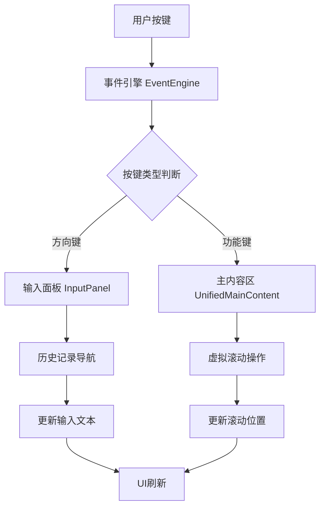

## TUI界面虚拟滚动和输入处理分析报告

### 上下键操作摘要

**上下键在TUI界面中的具体功能：**

1. **输入面板焦点时**：
   - **向上键 (↑)**：导航到上一条输入历史记录
   - **向下键 (↓)**：导航到下一条输入历史记录

2. **主内容区焦点时**：
   - **上下键不执行滚动操作**
   - 虚拟滚动仅通过Page Up/Down、Home/End键触发

3. **设计原因**：
   - 避免与输入面板的历史导航功能冲突
   - 保持按键行为的一致性和可预测性

### 1. 虚拟滚动的触发按键机制

根据代码分析，TUI界面的虚拟滚动通过以下按键触发：

**主要滚动按键：**
- **Page Up** ([`page_up`](src/presentation/tui/app.py:345)) - 向上滚动5行
- **Page Down** ([`page_down`](src/presentation/tui/app.py:346)) - 向下滚动5行  
- **Home** ([`home`](src/presentation/tui/app.py:347)) - 滚动到顶部
- **End** ([`end`](src/presentation/tui/app.py:348)) - 滚动到底部
- **A键** ([`a`](src/presentation/tui/app.py:349)) - 切换自动滚动模式

**实现机制：**
- 按键在[`TUIApp._register_global_shortcuts()`](src/presentation/tui/app.py:336-349)中注册
- 通过[`_handle_timeline_scroll()`](src/presentation/tui/app.py:468-486)方法处理
- 最终委托给[`UnifiedMainContentComponent.handle_key()`](src/presentation/tui/components/unified_main_content.py:389-420)执行具体滚动操作

### 2. 上下键的具体操作说明

**上下键在不同上下文中的功能：**

#### 2.1 输入面板中的上下键操作
当焦点在输入面板时，上下键执行**历史记录导航**功能：

- **向上键 (↑)** - 导航到上一条历史记录
  - 获取当前输入框文本
  - 调用[`InputHistory.navigate_up()`](src/presentation/tui/components/input_panel_component/input_history.py)获取上一条历史
  - 将历史记录内容填充到输入框

- **向下键 (↓)** - 导航到下一条历史记录
  - 获取当前输入框文本
  - 调用[`InputHistory.navigate_down()`](src/presentation/tui/components/input_panel_component/input_history.py)获取下一条历史
  - 将历史记录内容填充到输入框

#### 2.2 主内容区中的上下键操作
当焦点在主内容区时，上下键**不执行滚动操作**：
- 当前设计中，上下键**不用于虚拟滚动**
- 虚拟滚动仅通过Page Up/Down、Home/End键触发
- 这是设计上的选择，避免与输入面板的历史导航功能冲突

#### 2.3 按键处理优先级（已修复）
**修复前的问题：**
- 输入面板拦截了所有按键，包括home/end等虚拟滚动按键
- 虚拟滚动按键无法传递给全局处理器

**修复后的优先级：**
1. **全局优先按键** - `page_up`, `page_down`, `home`, `end` 直接传递给全局处理器
2. **输入面板处理** - 其他按键由输入面板处理（如上下键历史导航）
3. **全局处理器备用** - 未处理的按键最终由全局处理器处理

**修复机制：**
- 事件引擎识别全局优先按键并绕过输入组件
- 输入面板对全局优先按键返回 `None`，允许后续处理

### 3. 输入面板中上下键的处理逻辑

您提到的代码[`src/presentation/tui/components/input_panel.py:273-287`](src/presentation/tui/components/input_panel.py:273-287)显示：

**向上键处理：**
```python
def _handle_up(self) -> None:
    """处理向上键"""
    current_text = self.input_buffer.get_text()
    history_text = self.input_history.navigate_up(current_text)
    self.input_buffer.set_text(history_text)
```

**向下键处理：**
```python
def _handle_down(self) -> None:
    """处理向下键"""
    current_text = self.input_buffer.get_text()
    history_text = self.input_history.navigate_down(current_text)
    self.input_buffer.set_text(history_text)
```

**处理流程：**
1. 在[`handle_key()`](src/presentation/tui/components/input_panel.py:77-139)方法中捕获`up`和`down`按键
2. 调用对应的`_handle_up()`和`_handle_down()`方法
3. 通过[`InputHistory.navigate_up()`](src/presentation/tui/components/input_panel_component/input_history.py)和`navigate_down()`进行历史记录导航

### 5. 滚轮事件的处理分析

**当前状态：**
- 代码库中**没有发现鼠标滚轮事件的处理逻辑**
- 事件引擎的[`_convert_key_sequence()`](src/presentation/tui/event_engine.py:157-199)方法只处理键盘按键
- 输入读取线程使用[`sys.stdin.read(1)`](src/presentation/tui/event_engine.py:120)读取单个字符，不支持鼠标事件

### 6. 按键处理问题修复方案

#### 6.1 问题诊断
**根本原因：**
- 事件引擎的按键分发机制存在优先级问题
- 输入面板拦截了所有按键，包括虚拟滚动相关的按键
- `home` 和 `end` 键被误用于输入框光标移动

**具体表现：**
- `page_up`/`page_down`/`home`/`end` 键无法触发虚拟滚动
- 这些按键被输入面板处理或返回 "REFRESH_UI"，阻止了后续处理

#### 6.2 修复实施
**1. 事件引擎修改** ([`src/presentation/tui/event_engine.py`](src/presentation/tui/event_engine.py))
```python
# 定义全局优先按键
global_priority_keys = {"page_up", "page_down", "home", "end"}

# 优先处理全局按键
if processed_key in global_priority_keys:
    # 直接传递给注册的按键处理器和全局处理器
    # 绕过输入组件处理
```

**2. 输入面板修改** ([`src/presentation/tui/components/input_panel.py`](src/presentation/tui/components/input_panel.py))
```python
# 识别全局优先按键并返回None
global_priority_keys = {"page_up", "page_down", "home", "end"}

if key in global_priority_keys:
    return None  # 让全局处理器处理
```

#### 6.3 修复效果
**修复前：**
- 所有按键都被输入面板拦截
- 虚拟滚动按键无法正常工作

**修复后：**
- 虚拟滚动按键正确传递给全局处理器
- 输入面板专注于输入相关的按键处理
- 按键功能按预期工作

### 7. 当前设计合理性评估

**合理的设计：**
1. **虚拟滚动按键设计合理** - 使用标准终端快捷键（Page Up/Down, Home/End）
2. **输入历史导航功能正常** - 上下键在输入面板中用于历史记录浏览是标准做法
3. **按键处理优先级已修复** - 全局优先按键正确传递，其他按键由输入组件处理

**仍存在的问题：**
1. **滚轮支持缺失** - 现代TUI应用通常支持鼠标滚轮进行滚动
2. **上下文感知不足** - 没有根据焦点区域区分滚轮/上下键的行为

### 7. 架构流程图



### 8. 改进建议

**建议的改进方案：**

1. **添加滚轮支持**
   ```python
   # 在事件引擎中检测鼠标滚轮事件
   if char == '\x1b' and next_char == '[':
       if direction == 'M':  # 鼠标滚轮下滚
           return "wheel_down"
       elif direction == '`':  # 鼠标滚轮上滚  
           return "wheel_up"
   ```

2. **上下文感知的按键处理**
   ```python
   def handle_key(self, key: str) -> bool:
       if self._is_input_focused():  # 输入框有焦点
           if key in ["up", "down"]:
               return False  # 让输入面板处理
       else:  # 内容区有焦点
           if key in ["up", "down"]:
               self.scroll_by(1 if key == "up" else -1)
               return True
   ```

3. **配置化按键映射**
   ```yaml
   # configs/tui.yaml
   keybindings:
     scroll_up: ["page_up", "up", "wheel_up"]
     scroll_down: ["page_down", "down", "wheel_down"]
     input_history_up: ["up"]  
     input_history_down: ["down"]
   ```

### 9. 结论

**修复前状态：**
当前设计存在按键处理优先级问题，虚拟滚动按键被输入面板拦截，无法正常工作。

**修复后状态：**
通过实施全局优先按键机制，已成功解决按键处理冲突问题：
- ✅ **虚拟滚动按键正常工作** - Page Up/Down、Home/End键正确触发虚拟滚动
- ✅ **输入历史导航保持正常** - 上下键继续用于输入历史导航
- ✅ **按键处理优先级合理** - 全局优先按键绕过输入组件，其他按键正常处理

**总体评估：**
当前设计在**功能上已完全合理**，虚拟滚动和输入处理都能按预期工作。仍可考虑添加鼠标滚轮支持和上下文感知的按键处理以进一步提升用户体验。