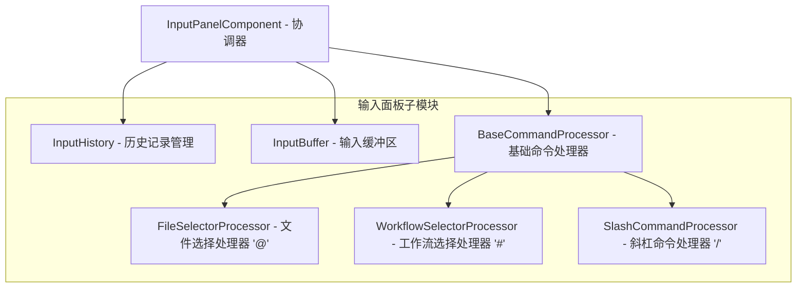

# InputPanelComponent 重构方案

## 1. 当前问题分析

当前 `InputPanelComponent` 模块过于复杂，包含多个职责：
- 输入历史管理 (InputHistory)
- 命令处理 (CommandProcessor) 
- 输入缓冲区管理 (InputBuffer)
- 键盘事件处理
- 渲染逻辑

## 2. 重构目标

1. **职责分离**: 将不同功能的类拆分到独立文件中
2. **命令处理细化**: 将命令处理器细分为三个专门处理器
3. **目录结构优化**: 创建专门的 `input_panel/` 子目录
4. **扩展性**: 便于后续添加新的命令类型和功能

## 3. 新的模块结构



## 4. 文件拆分方案

### 4.1 核心组件文件

| 文件名 | 类名 | 职责描述 |
|--------|------|----------|
| `input_history.py` | `InputHistory` | 输入历史记录管理和导航 |
| `input_buffer.py` | `InputBuffer` | 输入缓冲区管理和多行模式 |
| `base_command_processor.py` | `BaseCommandProcessor` | 基础命令处理框架 |

### 4.2 命令处理器文件

| 文件名 | 类名 | 触发字符 | 职责描述 |
|--------|------|----------|----------|
| `file_selector_processor.py` | `FileSelectorProcessor` | `@` | 文件选择和自动补全 |
| `workflow_selector_processor.py` | `WorkflowSelectorProcessor` | `#` | 工作流选择和自动补全 |
| `slash_command_processor.py` | `SlashCommandProcessor` | `/` | 斜杠命令执行和管理 |

### 4.3 协调器文件

| 文件名 | 类名 | 职责描述 |
|--------|------|----------|
| `input_panel.py` | `InputPanelComponent` | 顶层协调器，整合所有子组件 |

## 5. 接口设计

### 5.1 BaseCommandProcessor 接口

```python
class BaseCommandProcessor:
    def is_command(self, input_text: str) -> bool:
        """检查输入是否是该类型的命令"""
        pass
        
    def parse_command(self, input_text: str) -> Tuple[str, List[str]]:
        """解析命令和参数"""
        pass
        
    def execute_command(self, input_text: str, context: Dict[str, Any]) -> Optional[str]:
        """执行命令"""
        pass
        
    def get_suggestions(self, partial_input: str) -> List[str]:
        """获取命令补全建议"""
        pass
```

### 5.2 协调器接口

```python
class InputPanelComponent:
    def __init__(self, config: Optional[TUIConfig] = None):
        self.input_buffer = InputBuffer()
        self.input_history = InputHistory()
        self.command_processors = {
            '@': FileSelectorProcessor(),
            '#': WorkflowSelectorProcessor(), 
            '/': SlashCommandProcessor()
        }
```

## 6. 实现步骤

1. **创建基础组件**: 先迁移 `InputHistory` 和 `InputBuffer`
2. **实现命令处理器**: 逐个实现三个命令处理器
3. **重构协调器**: 修改 `InputPanelComponent` 使用新的处理器
4. **更新导出**: 修改 `__init__.py` 文件
5. **测试验证**: 确保所有功能正常工作

## 7. 扩展性考虑

- 新的命令类型可以通过实现 `BaseCommandProcessor` 轻松添加
- 每个处理器可以独立扩展和测试
- 支持插件式的命令处理器注册机制

## 8. 预期收益

1. **代码可维护性**: 每个模块职责单一，便于理解和修改
2. **扩展性**: 新的命令类型可以轻松添加
3. **测试便利性**: 每个组件可以独立测试
4. **团队协作**: 不同开发者可以并行开发不同组件