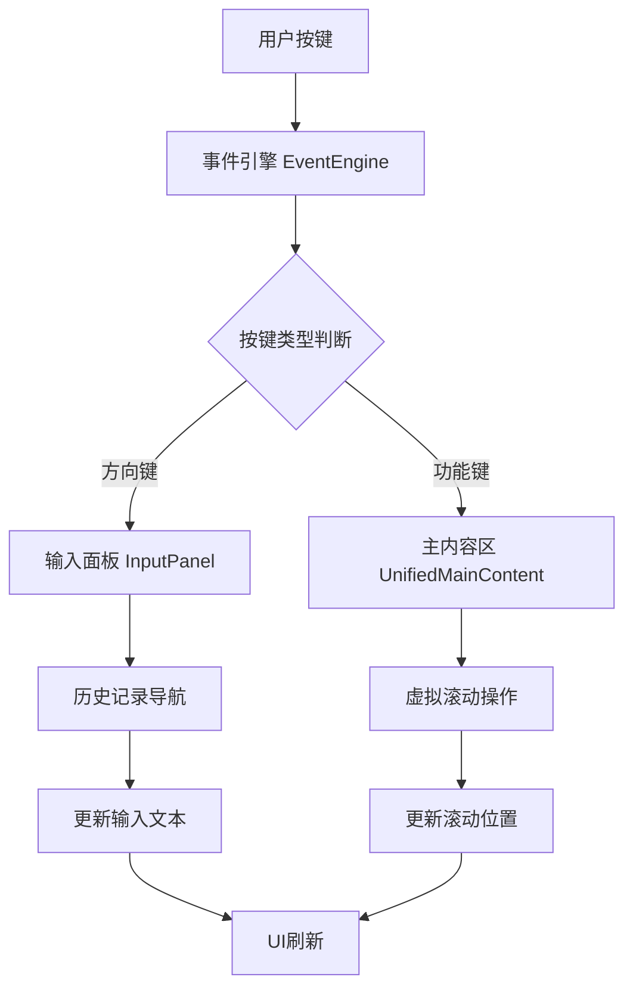

## TUI界面虚拟滚动和输入处理分析报告

### 1. 虚拟滚动的触发按键机制

根据代码分析，TUI界面的虚拟滚动通过以下按键触发：

**主要滚动按键：**
- **Page Up** ([`page_up`](src/presentation/tui/app.py:345)) - 向上滚动5行
- **Page Down** ([`page_down`](src/presentation/tui/app.py:346)) - 向下滚动5行  
- **Home** ([`home`](src/presentation/tui/app.py:347)) - 滚动到顶部
- **End** ([`end`](src/presentation/tui/app.py:348)) - 滚动到底部
- **A键** ([`a`](src/presentation/tui/app.py:349)) - 切换自动滚动模式

**实现机制：**
- 按键在[`TUIApp._register_global_shortcuts()`](src/presentation/tui/app.py:336-349)中注册
- 通过[`_handle_timeline_scroll()`](src/presentation/tui/app.py:468-486)方法处理
- 最终委托给[`UnifiedMainContentComponent.handle_key()`](src/presentation/tui/components/unified_main_content.py:389-420)执行具体滚动操作

### 2. 输入面板中上下键的处理逻辑

您提到的代码[`src/presentation/tui/components/input_panel.py:273-287`](src/presentation/tui/components/input_panel.py:273-287)显示：

**向上键处理：**
```python
def _handle_up(self) -> None:
    """处理向上键"""
    current_text = self.input_buffer.get_text()
    history_text = self.input_history.navigate_up(current_text)
    self.input_buffer.set_text(history_text)
```

**向下键处理：**
```python
def _handle_down(self) -> None:
    """处理向下键"""
    current_text = self.input_buffer.get_text()
    history_text = self.input_history.navigate_down(current_text)
    self.input_buffer.set_text(history_text)
```

**处理流程：**
1. 在[`handle_key()`](src/presentation/tui/components/input_panel.py:77-139)方法中捕获`up`和`down`按键
2. 调用对应的`_handle_up()`和`_handle_down()`方法
3. 通过[`InputHistory.navigate_up()`](src/presentation/tui/components/input_panel_component/input_history.py)和`navigate_down()`进行历史记录导航

### 3. 滚轮事件的处理分析

**当前状态：**
- 代码库中**没有发现鼠标滚轮事件的处理逻辑**
- 事件引擎的[`_convert_key_sequence()`](src/presentation/tui/event_engine.py:157-199)方法只处理键盘按键
- 输入读取线程使用[`sys.stdin.read(1)`](src/presentation/tui/event_engine.py:120)读取单个字符，不支持鼠标事件

### 4. 当前设计合理性评估

**合理的设计：**
1. **虚拟滚动按键设计合理** - 使用标准终端快捷键（Page Up/Down, Home/End）
2. **输入历史导航功能正常** - 上下键在输入面板中用于历史记录浏览是标准做法
3. **按键处理优先级正确** - 输入组件优先处理，然后是全局处理器

**存在的问题：**
1. **滚轮支持缺失** - 现代TUI应用通常支持鼠标滚轮进行滚动
2. **上下文感知不足** - 没有根据焦点区域区分滚轮/上下键的行为
3. **功能冲突** - 上下键在输入面板和历史面板中有不同语义

### 5. 架构流程图



### 6. 改进建议

**建议的改进方案：**

1. **添加滚轮支持**
   ```python
   # 在事件引擎中检测鼠标滚轮事件
   if char == '\x1b' and next_char == '[':
       if direction == 'M':  # 鼠标滚轮下滚
           return "wheel_down"
       elif direction == '`':  # 鼠标滚轮上滚  
           return "wheel_up"
   ```

2. **上下文感知的按键处理**
   ```python
   def handle_key(self, key: str) -> bool:
       if self._is_input_focused():  # 输入框有焦点
           if key in ["up", "down"]:
               return False  # 让输入面板处理
       else:  # 内容区有焦点
           if key in ["up", "down"]:
               self.scroll_by(1 if key == "up" else -1)
               return True
   ```

3. **配置化按键映射**
   ```yaml
   # configs/tui.yaml
   keybindings:
     scroll_up: ["page_up", "up", "wheel_up"]
     scroll_down: ["page_down", "down", "wheel_down"]
     input_history_up: ["up"]  
     input_history_down: ["down"]
   ```

### 结论

当前设计在**基本功能上是合理的**，但缺乏现代TUI应用应有的完整输入设备支持。建议添加鼠标滚轮支持和上下文感知的按键处理，以提供更流畅的用户体验。