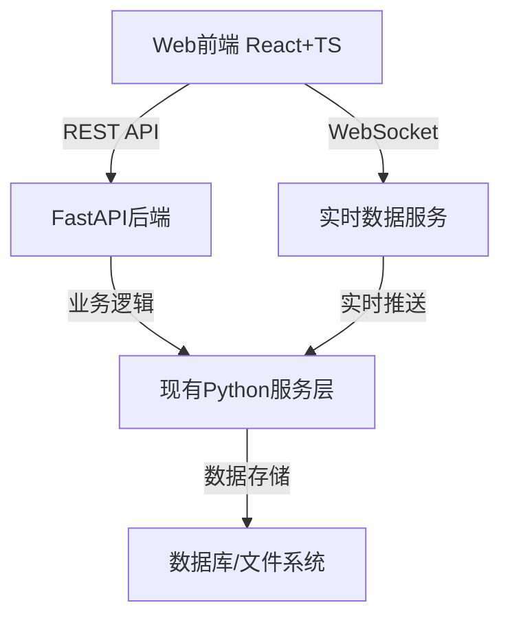

# 模块化代理框架 - Web前端实现方案

## 📋 项目概述

本项目旨在为模块化代理框架（MAAF）构建现代化的Web前端界面，与现有的TUI（终端用户界面）形成互补，提供更丰富的可视化、分析和管理功能。

## 🎯 核心目标

1. **功能互补**：Web前端专注于TUI难以实现的可视化功能
2. **无缝集成**：与现有TUI系统数据和配置完全兼容
3. **现代化体验**：提供直观、响应式的用户界面
4. **性能优化**：确保流畅的用户体验和高效的资源利用

## 📁 文档结构

```
docs/plan/web/
├── architecture.md           # 整体架构设计
├── TUI-web.md               # TUI功能迁移分析
├── URL-design.md            # URL设计方案
├── project-setup.md         # 项目配置和依赖管理
├── workflow-visualization.md # 工作流可视化详细方案
└── implementation-guide.md  # 完整实施指南
```

## 🚀 技术栈

### 前端技术
- **React 18** + **TypeScript** - 现代化前端开发
- **Ant Design 5.x** - 企业级UI组件库
- **React Router 6** - 路由管理
- **Zustand** + **React Query** - 状态管理和数据获取
- **React Flow** - 工作流可视化
- **ECharts** - 数据图表
- **Socket.io** - 实时通信

### 后端技术
- **FastAPI** - 高性能Python Web框架
- **WebSocket** - 实时数据推送
- **Pydantic** - 数据验证

## 🏗️ 架构设计

### 整体架构


### 模块划分
- **仪表板模块** (`/dashboard`) - 核心指标概览
- **工作流模块** (`/workflows`) - 图形化工作流编辑器
- **分析模块** (`/analytics`) - 性能分析和监控
- **错误模块** (`/errors`) - 错误管理和调试
- **历史模块** (`/history`) - 会话历史浏览
- **配置模块** (`/config`) - 配置管理和编辑

## 📊 功能对比

| 功能 | TUI实现 | Web前端增强 |
|------|---------|-------------|
| 工作流展示 | 文本树形结构 | 图形化拖拽编辑器 |
| 性能监控 | 表格数据 | 交互式图表分析 |
| 错误管理 | 简单列表 | 分类统计+调试工具 |
| 历史浏览 | 50条限制 | 分页+搜索+过滤 |
| 配置管理 | 只读表格 | 可视化编辑器 |

## 🎯 核心功能亮点

### 1. 工作流可视化编辑器
- **拖拽式节点编辑**：支持开始、处理、决策、工具、结束节点
- **实时执行路径**：动画展示工作流执行过程
- **节点属性配置**：丰富的属性编辑面板
- **自动布局算法**：层次布局和力导向布局

### 2. 性能分析仪表板
- **实时指标监控**：响应时间、成功率、错误率
- **历史趋势分析**：多维度数据可视化
- **成本统计分析**：资源使用和成本估算
- **性能瓶颈识别**：智能分析和优化建议

### 3. 错误管理系统
- **错误分类聚合**：按类型、时间、严重程度分类
- **堆栈跟踪可视化**：结构化的错误详情展示
- **错误趋势分析**：历史错误数据统计
- **自动错误报告**：一键生成错误报告

### 4. 历史数据管理
- **高级搜索功能**：多条件组合搜索
- **会话导出分享**：支持多种格式导出
- **书签管理**：快速标记重要会话
- **时间范围筛选**：灵活的时间选择器

## 🔄 与TUI集成方案

### 双向集成
1. **配置共享**：统一配置文件管理
2. **数据同步**：实时双向数据同步
3. **功能互补**：Web侧重可视化，TUI侧重快速交互
4. **统一入口**：TUI中提供Web界面快速访问

### 快速访问
```typescript
// TUI中集成Web访问
const WEB_URLS = {
  "dashboard": "http://localhost:3000/maaf/web/dashboard/",
  "workflows": "http://localhost:3000/maaf/web/workflows/",
  "analytics": "http://localhost:3000/maaf/web/analytics/",
  "errors": "http://localhost:3000/maaf/web/errors/",
  "history": "http://localhost:3000/maaf/web/history/",
  "config": "http://localhost:3000/maaf/web/config/"
}
```

## 📈 性能优化

### 前端优化
- **代码分割**：按需加载，减少初始包大小
- **虚拟滚动**：大数据列表性能优化
- **图片压缩**：自动压缩和格式优化
- **缓存策略**：智能缓存和更新机制

### 后端优化
- **API响应缓存**：减少重复计算
- **WebSocket连接池**：连接复用和管理
- **数据库查询优化**：索引和查询优化
- **实时数据压缩**：减少网络传输量

## 🧪 测试策略

### 测试覆盖
- **单元测试**：核心组件和服务 ≥90%
- **集成测试**：模块间交互 ≥80%
- **E2E测试**：关键用户流程 ≥70%
- **性能测试**：响应时间 ≤500ms

### 测试工具
- **Vitest** - 单元测试框架
- **React Testing Library** - 组件测试
- **Playwright** - E2E测试
- **Lighthouse** - 性能测试

## 🚀 开发路线图

### 第一阶段：基础架构 (Week 1-2)
- ✅ 项目初始化和环境搭建
- ✅ 核心依赖安装和配置
- ✅ 基础组件和布局实现
- ✅ API服务和WebSocket连接

### 第二阶段：核心界面 (Week 3-4)
- ✅ 仪表板模块开发
- ✅ 会话管理功能
- ✅ 基础工作流展示
- ✅ 实时数据展示

### 第三阶段：高级功能 (Week 5-7)
- ✅ 工作流图形化编辑器
- ✅ 高级分析图表
- ✅ 错误管理和调试
- ✅ 配置管理系统

### 第四阶段：集成优化 (Week 8-10)
- ✅ 与TUI系统集成
- ✅ 性能优化和测试
- ✅ 文档和部署配置
- ✅ 用户验收和反馈

## 📋 部署方案

### 环境要求
- **Node.js**: 18+
- **npm**: 9+
- **Python**: 3.13+ (后端)
- **Docker**: 20+ (容器化部署)

### 部署选项
1. **Docker容器化** - 推荐方案
2. **传统服务器部署** - 备用方案
3. **云原生部署** - 扩展方案

### 监控和维护
- **性能监控**：实时性能指标收集
- **错误监控**：自动错误报告和告警
- **日志管理**：结构化日志和审计
- **健康检查**：自动健康检查和恢复

## 🔧 开发规范

### 代码规范
- **TypeScript严格模式**：强制类型检查
- **ESLint配置**：统一代码风格
- **Prettier格式化**：自动代码格式化
- **Git提交规范**：语义化提交信息

### 文件命名
- **组件文件**：PascalCase (e.g., `Dashboard.tsx`)
- **工具函数**：camelCase (e.g., `formatDate.ts`)
- **常量定义**：UPPER_SNAKE_CASE (e.g., `API_ENDPOINTS.ts`)
- **类型定义**：PascalCase (e.g., `User.types.ts`)

### 组件设计
- **函数组件优先**：使用React Hooks
- **单一职责原则**：每个组件只做一件事
- **Props接口定义**：明确的Props类型
- **错误边界处理**：完善的错误处理

## 📚 相关文档

1. **[架构设计](architecture.md)** - 整体技术架构和设计方案
2. **[TUI功能迁移](TUI-web.md)** - 功能迁移优先级分析
3. **[URL设计](URL-design.md)** - RESTful API和路由设计
4. **[项目配置](project-setup.md)** - 详细的项目配置和依赖管理
5. **[工作流可视化](workflow-visualization.md)** - 工作流编辑器详细实现
6. **[实施指南](implementation-guide.md)** - 完整的开发实施指南

## 🤝 贡献指南

### 开发流程
1. **Fork项目** - 创建个人分支
2. **功能开发** - 遵循代码规范
3. **编写测试** - 确保测试覆盖
4. **提交PR** - 详细描述变更
5. **代码审查** - 团队审查通过
6. **合并发布** - 合并到主分支

### 提交规范
```
feat: 新功能
fix: 修复bug
docs: 文档更新
style: 代码格式
refactor: 重构
test: 测试相关
chore: 构建/工具
```

## 📞 支持和联系

- **技术问题**：提交GitHub Issue
- **功能建议**：创建Feature Request
- **文档改进**：直接提交PR
- **紧急支持**：联系项目维护者

---

## 🎉 总结

这个Web前端实现方案为模块化代理框架提供了现代化的用户界面，通过图形化工作流编辑器、实时性能分析、智能错误管理等功能，大大提升了用户体验和工作效率。同时保持了与现有TUI系统的完全兼容，形成了完整的多界面解决方案。

方案采用现代化的技术栈，注重性能优化和用户体验，提供了详细的实施指南和完整的开发路线图，确保项目能够顺利实施并达到预期目标。