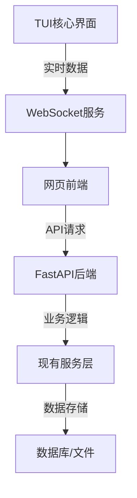

## 网页界面架构设计

### 1. 整体架构方案

采用**前后端分离**架构：
- **前端**：React + TypeScript + Ant Design
- **后端**：FastAPI + Python（复用现有业务逻辑）
- **通信**：WebSocket（实时数据）+ REST API（配置管理）

### 2. 功能模块划分

#### 仪表板模块 (`/dashboard`)
- 核心指标概览
- 实时状态监控
- 快速操作入口

#### 工作流可视化模块 (`/workflows`)
- 工作流图形化编辑器
- 节点属性配置面板
- 执行路径追踪
- 节点调试界面

#### 性能分析模块 (`/analytics`)
- 性能指标图表
- 历史趋势分析
- 成本统计分析
- 响应时间监控

#### 错误管理模块 (`/errors`)
- 错误列表和详情
- 堆栈跟踪查看
- 错误统计分析
- 错误报告导出

#### 历史数据模块 (`/history`)
- 会话历史浏览
- 消息搜索和过滤
- 会话导出和分享
- 书签管理

#### 配置管理模块 (`/config`)
- 配置编辑器
- 配置验证
- 版本管理
- 导入导出

### 3. 数据流设计

### 4. 界面布局设计

采用**响应式布局**：
- **顶部导航栏**：模块切换、用户设置
- **左侧边栏**：功能菜单、快速过滤
- **主内容区**：核心功能展示
- **右侧边栏**：详情面板、操作工具

### 5. 技术选型理由

**React + TypeScript**
- 组件化开发，易于维护
- 类型安全，减少运行时错误
- 丰富的生态系统和组件库

**Ant Design**
- 企业级UI组件库
- 良好的中文支持
- 丰富的数据展示组件

**WebSocket**
- 实时数据推送
- 低延迟通信
- 支持双向通信