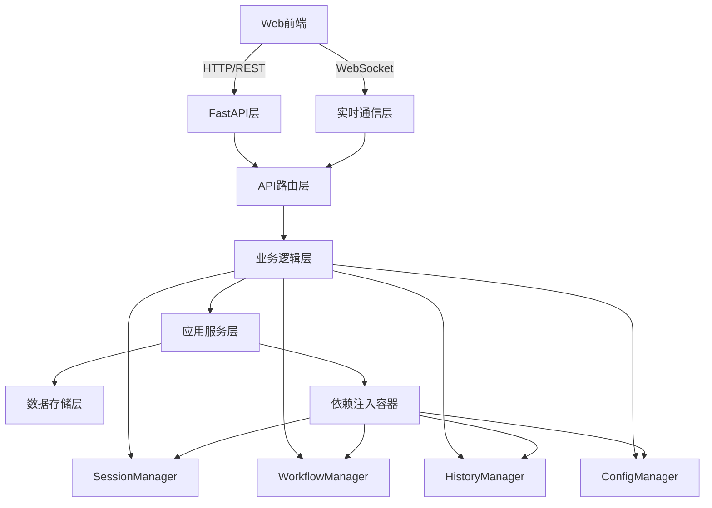

# 后端API层设计文档

## 1. 设计概述

### 1.1 设计目标
- **复用现有业务逻辑**：充分利用现有的应用服务层（SessionManager, WorkflowManager, HistoryManager等）
- **RESTful API设计**：遵循RESTful设计原则，提供清晰的资源接口
- **WebSocket实时通信**：支持实时数据推送和状态更新
- **前后端分离**：API层独立于前端实现，支持多种客户端
- **性能优化**：缓存、分页、异步处理等优化策略

### 1.2 技术选型
- **FastAPI**：高性能Python Web框架，原生支持异步处理
- **Pydantic**：数据验证和序列化
- **SQLAlchemy**：ORM框架（如果需要数据库支持）
- **WebSocket**：实时通信支持
- **Redis**：缓存和会话存储（可选）

## 2. API架构设计

### 2.1 整体架构


### 2.2 目录结构
```
src/presentation/api/
├── __init__.py
├── main.py                    # FastAPI应用入口
├── config.py                  # API配置
├── dependencies.py            # 依赖注入配置
├── middleware.py              # 中间件配置
├── routers/                   # API路由
│   ├── __init__.py
│   ├── sessions.py           # 会话管理API
│   ├── workflows.py          # 工作流管理API
│   ├── analytics.py          # 分析统计API
│   ├── errors.py             # 错误管理API
│   ├── history.py            # 历史数据API
│   ├── config.py             # 配置管理API
│   └── websocket.py          # WebSocket API
├── models/                    # Pydantic模型
│   ├── __init__.py
│   ├── requests.py           # 请求模型
│   ├── responses.py          # 响应模型
│   └── websocket.py          # WebSocket消息模型
├── services/                  # API服务层
│   ├── __init__.py
│   ├── session_service.py    # 会话服务
│   ├── workflow_service.py   # 工作流服务
│   ├── analytics_service.py  # 分析服务
│   └── websocket_service.py  # WebSocket服务
└── utils/                     # 工具函数
    ├── __init__.py
    ├── pagination.py         # 分页工具
    ├── serialization.py      # 序列化工具
    └── validation.py         # 验证工具
```

## 3. 核心API设计

### 3.1 会话管理API

#### 3.1.1 接口定义
```python
# src/presentation/api/routers/sessions.py
from fastapi import APIRouter, Depends, HTTPException, Query
from typing import List, Optional
from pydantic import BaseModel
from datetime import datetime

from ..models.requests import SessionCreateRequest, SessionUpdateRequest
from ..models.responses import SessionResponse, SessionListResponse
from ..services.session_service import SessionService
from ..dependencies import get_session_service

router = APIRouter(prefix="/sessions", tags=["sessions"])

@router.get("/", response_model=SessionListResponse)
async def list_sessions(
    page: int = Query(1, ge=1),
    page_size: int = Query(20, ge=1, le=100),
    status: Optional[str] = Query(None),
    search: Optional[str] = Query(None),
    sort_by: str = Query("created_at"),
    sort_order: str = Query("desc"),
    session_service: SessionService = Depends(get_session_service)
) -> SessionListResponse:
    """获取会话列表"""
    return await session_service.list_sessions(
        page=page,
        page_size=page_size,
        status=status,
        search=search,
        sort_by=sort_by,
        sort_order=sort_order
    )

@router.get("/{session_id}", response_model=SessionResponse)
async def get_session(
    session_id: str,
    session_service: SessionService = Depends(get_session_service)
) -> SessionResponse:
    """获取特定会话详情"""
    session = await session_service.get_session(session_id)
    if not session:
        raise HTTPException(status_code=404, detail="会话不存在")
    return session

@router.post("/", response_model=SessionResponse)
async def create_session(
    request: SessionCreateRequest,
    session_service: SessionService = Depends(get_session_service)
) -> SessionResponse:
    """创建新会话"""
    try:
        return await session_service.create_session(request)
    except ValueError as e:
        raise HTTPException(status_code=400, detail=str(e))

@router.put("/{session_id}", response_model=SessionResponse)
async def update_session(
    session_id: str,
    request: SessionUpdateRequest,
    session_service: SessionService = Depends(get_session_service)
) -> SessionResponse:
    """更新会话"""
    session = await session_service.update_session(session_id, request)
    if not session:
        raise HTTPException(status_code=404, detail="会话不存在")
    return session

@router.delete("/{session_id}")
async def delete_session(
    session_id: str,
    session_service: SessionService = Depends(get_session_service)
) -> dict:
    """删除会话"""
    success = await session_service.delete_session(session_id)
    if not success:
        raise HTTPException(status_code=404, detail="会话不存在")
    return {"message": "会话已删除"}

@router.get("/{session_id}/history", response_model=SessionHistoryResponse)
async def get_session_history(
    session_id: str,
    limit: int = Query(50, ge=1, le=500),
    session_service: SessionService = Depends(get_session_service)
) -> SessionHistoryResponse:
    """获取会话历史"""
    history = await session_service.get_session_history(session_id, limit)
    return SessionHistoryResponse(history=history)

@router.post("/{session_id}/save")
async def save_session_state(
    session_id: str,
    session_service: SessionService = Depends(get_session_service)
) -> dict:
    """保存会话状态"""
    success = await session_service.save_session_state(session_id)
    if not success:
        raise HTTPException(status_code=404, detail="会话不存在")
    return {"message": "会话状态已保存"}

@router.post("/{session_id}/restore")
async def restore_session(
    session_id: str,
    session_service: SessionService = Depends(get_session_service)
) -> SessionResponse:
    """恢复会话"""
    session = await session_service.restore_session(session_id)
    if not session:
        raise HTTPException(status_code=404, detail="会话不存在或无法恢复")
    return session
```

#### 3.1.2 数据模型
```python
# src/presentation/api/models/requests.py
from pydantic import BaseModel, Field
from typing import Optional, Dict, Any
from datetime import datetime

class SessionCreateRequest(BaseModel):
    """创建会话请求"""
    workflow_config_path: str = Field(..., description="工作流配置文件路径")
    agent_config: Optional[Dict[str, Any]] = Field(None, description="Agent配置")
    initial_state: Optional[Dict[str, Any]] = Field(None, description="初始状态")
    
    class Config:
        json_schema_extra = {
            "example": {
                "workflow_config_path": "configs/workflows/example.yaml",
                "agent_config": {
                    "model": "gpt-3.5-turbo",
                    "temperature": 0.7
                },
                "initial_state": {
                    "messages": [],
                    "tool_results": []
                }
            }
        }

class SessionUpdateRequest(BaseModel):
    """更新会话请求"""
    status: Optional[str] = Field(None, description="会话状态")
    metadata: Optional[Dict[str, Any]] = Field(None, description="元数据")
    
    class Config:
        json_schema_extra = {
            "example": {
                "status": "paused",
                "metadata": {
                    "notes": "用户暂停的会话"
                }
            }
        }

# src/presentation/api/models/responses.py
from pydantic import BaseModel, Field
from typing import List, Optional, Dict, Any
from datetime import datetime

class SessionResponse(BaseModel):
    """会话响应"""
    session_id: str = Field(..., description="会话ID")
    workflow_config_path: str = Field(..., description="工作流配置文件路径")
    workflow_id: str = Field(..., description="工作流ID")
    status: str = Field(..., description="会话状态")
    created_at: datetime = Field(..., description="创建时间")
    updated_at: datetime = Field(..., description="更新时间")
    agent_config: Optional[Dict[str, Any]] = Field(None, description="Agent配置")
    metadata: Optional[Dict[str, Any]] = Field(None, description="元数据")
    
    class Config:
        json_schema_extra = {
            "example": {
                "session_id": "react-251022-174800-1f73e8",
                "workflow_config_path": "configs/workflows/react.yaml",
                "workflow_id": "react_20241022_174800_1f73e8",
                "status": "active",
                "created_at": "2024-10-22T17:48:00Z",
                "updated_at": "2024-10-22T17:48:30Z",
                "agent_config": {
                    "model": "gpt-3.5-turbo",
                    "temperature": 0.7
                },
                "metadata": {
                    "notes": "测试会话"
                }
            }
        }

class SessionListResponse(BaseModel):
    """会话列表响应"""
    sessions: List[SessionResponse] = Field(..., description="会话列表")
    total: int = Field(..., description="总数")
    page: int = Field(..., description="当前页码")
    page_size: int = Field(..., description="每页大小")
    has_next: bool = Field(..., description="是否有下一页")
    
    class Config:
        json_schema_extra = {
            "example": {
                "sessions": [
                    {
                        "session_id": "react-251022-174800-1f73e8",
                        "workflow_config_path": "configs/workflows/react.yaml",
                        "workflow_id": "react_20241022_174800_1f73e8",
                        "status": "active",
                        "created_at": "2024-10-22T17:48:00Z",
                        "updated_at": "2024-10-22T17:48:30Z"
                    }
                ],
                "total": 1,
                "page": 1,
                "page_size": 20,
                "has_next": false
            }
        }
```

### 3.2 工作流管理API

#### 3.2.1 接口定义
```python
# src/presentation/api/routers/workflows.py
from fastapi import APIRouter, Depends, HTTPException, Query
from typing import List, Optional
from pydantic import BaseModel

from ..models.requests import WorkflowCreateRequest, WorkflowUpdateRequest
from ..models.responses import WorkflowResponse, WorkflowListResponse, WorkflowExecutionResponse
from ..services.workflow_service import WorkflowService
from ..dependencies import get_workflow_service

router = APIRouter(prefix="/workflows", tags=["workflows"])

@router.get("/", response_model=WorkflowListResponse)
async def list_workflows(
    page: int = Query(1, ge=1),
    page_size: int = Query(20, ge=1, le=100),
    search: Optional[str] = Query(None),
    workflow_service: WorkflowService = Depends(get_workflow_service)
) -> WorkflowListResponse:
    """获取工作流列表"""
    return await workflow_service.list_workflows(page=page, page_size=page_size, search=search)

@router.get("/{workflow_id}", response_model=WorkflowResponse)
async def get_workflow(
    workflow_id: str,
    workflow_service: WorkflowService = Depends(get_workflow_service)
) -> WorkflowResponse:
    """获取特定工作流详情"""
    workflow = await workflow_service.get_workflow(workflow_id)
    if not workflow:
        raise HTTPException(status_code=404, detail="工作流不存在")
    return workflow

@router.post("/", response_model=WorkflowResponse)
async def create_workflow(
    request: WorkflowCreateRequest,
    workflow_service: WorkflowService = Depends(get_workflow_service)
) -> WorkflowResponse:
    """创建新工作流"""
    try:
        return await workflow_service.create_workflow(request)
    except ValueError as e:
        raise HTTPException(status_code=400, detail=str(e))

@router.post("/{workflow_id}/load")
async def load_workflow(
    workflow_id: str,
    config_path: str = Query(..., description="配置文件路径"),
    workflow_service: WorkflowService = Depends(get_workflow_service)
) -> dict:
    """加载工作流配置"""
    try:
        workflow_id = await workflow_service.load_workflow(config_path)
        return {"workflow_id": workflow_id, "message": "工作流加载成功"}
    except Exception as e:
        raise HTTPException(status_code=400, detail=f"加载工作流失败: {str(e)}")

@router.post("/{workflow_id}/run", response_model=WorkflowExecutionResponse)
async def run_workflow(
    workflow_id: str,
    initial_state: Optional[dict] = None,
    workflow_service: WorkflowService = Depends(get_workflow_service)
) -> WorkflowExecutionResponse:
    """运行工作流"""
    try:
        return await workflow_service.run_workflow(workflow_id, initial_state)
    except Exception as e:
        raise HTTPException(status_code=500, detail=f"运行工作流失败: {str(e)}")

@router.post("/{workflow_id}/stream")
async def stream_workflow(
    workflow_id: str,
    initial_state: Optional[dict] = None,
    workflow_service: WorkflowService = Depends(get_workflow_service)
):
    """流式运行工作流"""
    try:
        async for state in workflow_service.stream_workflow(workflow_id, initial_state):
            yield {"type": "state_update", "data": state}
    except Exception as e:
        yield {"type": "error", "error": str(e)}

@router.get("/{workflow_id}/visualization")
async def get_workflow_visualization(
    workflow_id: str,
    workflow_service: WorkflowService = Depends(get_workflow_service)
) -> dict:
    """获取工作流可视化数据"""
    visualization = await workflow_service.get_workflow_visualization(workflow_id)
    if not visualization:
        raise HTTPException(status_code=404, detail="工作流不存在")
    return visualization

@router.delete("/{workflow_id}")
async def unload_workflow(
    workflow_id: str,
    workflow_service: WorkflowService = Depends(get_workflow_service)
) -> dict:
    """卸载工作流"""
    success = await workflow_service.unload_workflow(workflow_id)
    if not success:
        raise HTTPException(status_code=404, detail="工作流不存在")
    return {"message": "工作流已卸载"}
```

### 3.3 分析统计API

#### 3.3.1 接口定义
```python
# src/presentation/api/routers/analytics.py
from fastapi import APIRouter, Depends, HTTPException, Query
from typing import Optional
from datetime import datetime, timedelta
from pydantic import BaseModel

from ..models.responses import (
    PerformanceMetricsResponse,
    TokenStatisticsResponse,
    CostStatisticsResponse,
    ErrorStatisticsResponse
)
from ..services.analytics_service import AnalyticsService
from ..dependencies import get_analytics_service

router = APIRouter(prefix="/analytics", tags=["analytics"])

@router.get("/performance", response_model=PerformanceMetricsResponse)
async def get_performance_metrics(
    session_id: Optional[str] = Query(None, description="会话ID"),
    start_time: Optional[datetime] = Query(None),
    end_time: Optional[datetime] = Query(None),
    analytics_service: AnalyticsService = Depends(get_analytics_service)
) -> PerformanceMetricsResponse:
    """获取性能指标"""
    return await analytics_service.get_performance_metrics(
        session_id=session_id,
        start_time=start_time,
        end_time=end_time
    )

@router.get("/tokens/{session_id}", response_model=TokenStatisticsResponse)
async def get_token_statistics(
    session_id: str,
    analytics_service: AnalyticsService = Depends(get_analytics_service)
) -> TokenStatisticsResponse:
    """获取Token使用统计"""
    return await analytics_service.get_token_statistics(session_id)

@router.get("/cost/{session_id}", response_model=CostStatisticsResponse)
async def get_cost_statistics(
    session_id: str,
    analytics_service: AnalyticsService = Depends(get_analytics_service)
) -> CostStatisticsResponse:
    """获取成本统计"""
    return await analytics_service.get_cost_statistics(session_id)

@router.get("/errors", response_model=ErrorStatisticsResponse)
async def get_error_statistics(
    session_id: Optional[str] = Query(None),
    start_time: Optional[datetime] = Query(None),
    end_time: Optional[datetime] = Query(None),
    analytics_service: AnalyticsService = Depends(get_analytics_service)
) -> ErrorStatisticsResponse:
    """获取错误统计"""
    return await analytics_service.get_error_statistics(
        session_id=session_id,
        start_time=start_time,
        end_time=end_time
    )

@router.get("/trends")
async def get_analytics_trends(
    metric: str = Query(..., description="指标类型"),
    time_range: str = Query("7d", description="时间范围"),
    session_id: Optional[str] = Query(None),
    analytics_service: AnalyticsService = Depends(get_analytics_service)
) -> dict:
    """获取分析趋势数据"""
    return await analytics_service.get_trends(
        metric=metric,
        time_range=time_range,
        session_id=session_id
    )
```

### 3.4 历史数据API

#### 3.4.1 接口定义
```python
# src/presentation/api/routers/history.py
from fastapi import APIRouter, Depends, HTTPException, Query
from typing import Optional, List
from datetime import datetime
from pydantic import BaseModel

from ..models.responses import HistoryResponse, MessageResponse, SearchResponse
from ..services.history_service import HistoryService
from ..dependencies import get_history_service

router = APIRouter(prefix="/history", tags=["history"])

@router.get("/sessions/{session_id}/messages", response_model=HistoryResponse)
async def get_session_messages(
    session_id: str,
    limit: int = Query(50, ge=1, le=500),
    offset: int = Query(0, ge=0),
    start_time: Optional[datetime] = Query(None),
    end_time: Optional[datetime] = Query(None),
    message_types: Optional[List[str]] = Query(None),
    history_service: HistoryService = Depends(get_history_service)
) -> HistoryResponse:
    """获取会话消息历史"""
    return await history_service.get_session_messages(
        session_id=session_id,
        limit=limit,
        offset=offset,
        start_time=start_time,
        end_time=end_time,
        message_types=message_types
    )

@router.get("/sessions/{session_id}/search", response_model=SearchResponse)
async def search_session_messages(
    session_id: str,
    query: str = Query(..., description="搜索关键词"),
    limit: int = Query(20, ge=1, le=100),
    history_service: HistoryService = Depends(get_history_service)
) -> SearchResponse:
    """搜索会话消息"""
    return await history_service.search_session_messages(
        session_id=session_id,
        query=query,
        limit=limit
    )

@router.get("/sessions/{session_id}/export")
async def export_session_data(
    session_id: str,
    format: str = Query("json", description="导出格式: json, csv"),
    history_service: HistoryService = Depends(get_history_service)
):
    """导出会话数据"""
    export_data = await history_service.export_session_data(session_id, format)
    
    if format == "json":
        return export_data
    elif format == "csv":
        # 返回CSV文件下载
        from fastapi.responses import StreamingResponse
        import io
        
        csv_content = export_data["content"]
        return StreamingResponse(
            io.BytesIO(csv_content.encode()),
            media_type="text/csv",
            headers={"Content-Disposition": f"attachment; filename=session_{session_id}.csv"}
        )
    else:
        raise HTTPException(status_code=400, detail="不支持的导出格式")

@router.post("/sessions/{session_id}/bookmarks")
async def bookmark_message(
    session_id: str,
    message_id: str,
    note: Optional[str] = None,
    history_service: HistoryService = Depends(get_history_service)
) -> dict:
    """添加消息书签"""
    success = await history_service.bookmark_message(session_id, message_id, note)
    if not success:
        raise HTTPException(status_code=404, detail="消息不存在")
    return {"message": "书签已添加"}

@router.get("/bookmarks", response_model=List[BookmarkResponse])
async def get_bookmarks(
    session_id: Optional[str] = Query(None),
    history_service: HistoryService = Depends(get_history_service)
) -> List[BookmarkResponse]:
    """获取书签列表"""
    return await history_service.get_bookmarks(session_id=session_id)
```

## 4. WebSocket实时通信

### 4.1 WebSocket服务设计
```python
# src/presentation/api/routers/websocket.py
from fastapi import APIRouter, WebSocket, WebSocketDisconnect, Depends
from typing import Dict, Set
import json
import asyncio
from datetime import datetime

from ..services.websocket_service import WebSocketService
from ..dependencies import get_websocket_service

router = APIRouter()

class ConnectionManager:
    """WebSocket连接管理器"""
    
    def __init__(self):
        self.active_connections: Dict[str, WebSocket] = {}
        self.subscriptions: Dict[str, Set[str]] = {}  # session_id -> set of connection_ids
    
    async def connect(self, websocket: WebSocket, client_id: str):
        """建立WebSocket连接"""
        await websocket.accept()
        self.active_connections[client_id] = websocket
        
    def disconnect(self, client_id: str):
        """断开WebSocket连接"""
        if client_id in self.active_connections:
            del self.active_connections[client_id]
        
        # 清理订阅
        for session_id, subscribers in self.subscriptions.items():
            if client_id in subscribers:
                subscribers.remove(client_id)
    
    async def send_message(self, client_id: str, message: dict):
        """向特定客户端发送消息"""
        if client_id in self.active_connections:
            await self.active_connections[client_id].send_text(json.dumps(message))
    
    async def broadcast_to_session(self, session_id: str, message: dict):
        """向会话的所有订阅者广播消息"""
        if session_id in self.subscriptions:
            for client_id in self.subscriptions[session_id]:
                await self.send_message(client_id, message)
    
    def subscribe_to_session(self, client_id: str, session_id: str):
        """订阅会话更新"""
        if session_id not in self.subscriptions:
            self.subscriptions[session_id] = set()
        self.subscriptions[session_id].add(client_id)
    
    def unsubscribe_from_session(self, client_id: str, session_id: str):
        """取消会话订阅"""
        if session_id in self.subscriptions and client_id in self.subscriptions[session_id]:
            self.subscriptions[session_id].remove(client_id)

# 全局连接管理器
connection_manager = ConnectionManager()

@router.websocket("/ws/{client_id}")
async def websocket_endpoint(
    websocket: WebSocket,
    client_id: str,
    websocket_service: WebSocketService = Depends(get_websocket_service)
):
    """WebSocket连接端点"""
    await connection_manager.connect(websocket, client_id)
    
    try:
        while True:
            # 接收客户端消息
            data = await websocket.receive_text()
            message = json.loads(data)
            
            # 处理不同类型的消息
            message_type = message.get("type")
            
            if message_type == "subscribe":
                # 订阅会话更新
                session_id = message.get("session_id")
                if session_id:
                    connection_manager.subscribe_to_session(client_id, session_id)
                    await connection_manager.send_message(client_id, {
                        "type": "subscribed",
                        "session_id": session_id
                    })
            
            elif message_type == "unsubscribe":
                # 取消会话订阅
                session_id = message.get("session_id")
                if session_id:
                    connection_manager.unsubscribe_from_session(client_id, session_id)
                    await connection_manager.send_message(client_id, {
                        "type": "unsubscribed",
                        "session_id": session_id
                    })
            
            elif message_type == "ping":
                # 心跳响应
                await connection_manager.send_message(client_id, {
                    "type": "pong",
                    "timestamp": datetime.now().isoformat()
                })
            
    except WebSocketDisconnect:
        connection_manager.disconnect(client_id)
    except Exception as e:
        await connection_manager.send_message(client_id, {
            "type": "error",
            "error": str(e)
        })

# 实时事件推送函数
async def push_session_update(session_id: str, update_data: dict):
    """推送会话更新"""
    message = {
        "type": "session_update",
        "session_id": session_id,
        "data": update_data,
        "timestamp": datetime.now().isoformat()
    }
    await connection_manager.broadcast_to_session(session_id, message)

async def push_workflow_state(session_id: str, state_data: dict):
    """推送工作流状态更新"""
    message = {
        "type": "workflow_state",
        "session_id": session_id,
        "data": state_data,
        "timestamp": datetime.now().isoformat()
    }
    await connection_manager.broadcast_to_session(session_id, message)

async def push_performance_metrics(metrics_data: dict):
    """推送性能指标"""
    message = {
        "type": "performance_metrics",
        "data": metrics_data,
        "timestamp": datetime.now().isoformat()
    }
    # 广播给所有连接
    for client_id in connection_manager.active_connections:
        await connection_manager.send_message(client_id, message)

async def push_error_event(error_data: dict):
    """推送错误事件"""
    message = {
        "type": "error_event",
        "data": error_data,
        "timestamp": datetime.now().isoformat()
    }
    # 广播给所有连接
    for client_id in connection_manager.active_connections:
        await connection_manager.send_message(client_id, message)
```

### 4.2 实时事件集成
```python
# src/presentation/api/services/websocket_service.py
from typing import Dict, Any, Optional
import asyncio
from datetime import datetime

from ...routers.websocket import (
    push_session_update,
    push_workflow_state,
    push_performance_metrics,
    push_error_event
)

class WebSocketService:
    """WebSocket服务"""
    
    def __init__(self):
        self._event_handlers = {
            "session_update": self._handle_session_update,
            "workflow_state": self._handle_workflow_state,
            "performance_metrics": self._handle_performance_metrics,
            "error_event": self._handle_error_event
        }
    
    async def broadcast_event(self, event_type: str, data: dict, session_id: Optional[str] = None):
        """广播事件"""
        if event_type in self._event_handlers:
            await self._event_handlers[event_type](data, session_id)
    
    async def _handle_session_update(self, data: dict, session_id: Optional[str]):
        """处理会话更新"""
        if session_id:
            await push_session_update(session_id, data)
    
    async def _handle_workflow_state(self, data: dict, session_id: Optional[str]):
        """处理工作流状态更新"""
        if session_id:
            await push_workflow_state(session_id, data)
    
    async def _handle_performance_metrics(self, data: dict, session_id: Optional[str]):
        """处理性能指标更新"""
        await push_performance_metrics(data)
    
    async def _handle_error_event(self, data: dict, session_id: Optional[str]):
        """处理错误事件"""
        await push_error_event(data)

# 集成到业务服务中
class SessionService:
    """会话服务 - 集成WebSocket推送"""
    
    def __init__(self, session_manager: ISessionManager, websocket_service: WebSocketService):
        self.session_manager = session_manager
        self.websocket_service = websocket_service
    
    async def update_session_status(self, session_id: str, status: str):
        """更新会话状态并推送更新"""
        # 更新会话状态
        success = await self.session_manager.update_session_status(session_id, status)
        
        if success:
            # 推送状态更新
            await self.websocket_service.broadcast_event(
                "session_update",
                {
                    "session_id": session_id,
                    "status": status,
                    "updated_at": datetime.now().isoformat()
                },
                session_id
            )
        
        return success
```

## 5. 服务层实现

### 5.1 会话服务
```python
# src/presentation/api/services/session_service.py
from typing import Optional, Dict, Any, List
from datetime import datetime

from ...domain.sessions.manager import ISessionManager
from ...models.responses import SessionResponse, SessionListResponse
from ...utils.pagination import paginate_list
from ...utils.serialization import serialize_session_data

class SessionService:
    """会话服务"""
    
    def __init__(self, session_manager: ISessionManager):
        self.session_manager = session_manager
    
    async def list_sessions(
        self,
        page: int = 1,
        page_size: int = 20,
        status: Optional[str] = None,
        search: Optional[str] = None,
        sort_by: str = "created_at",
        sort_order: str = "desc"
    ) -> SessionListResponse:
        """获取会话列表"""
        # 获取所有会话
        sessions = self.session_manager.list_sessions()
        
        # 应用过滤条件
        if status:
            sessions = [s for s in sessions if s.get("status") == status]
        
        if search:
            sessions = [
                s for s in sessions 
                if search.lower() in s.get("session_id", "").lower() or
                   search.lower() in s.get("workflow_config_path", "").lower()
            ]
        
        # 排序
        reverse = sort_order == "desc"
        sessions.sort(key=lambda x: x.get(sort_by, ""), reverse=reverse)
        
        # 分页
        total = len(sessions)
        paginated_sessions = paginate_list(sessions, page, page_size)
        
        # 转换为响应模型
        session_responses = [
            SessionResponse(**serialize_session_data(session))
            for session in paginated_sessions
        ]
        
        return SessionListResponse(
            sessions=session_responses,
            total=total,
            page=page,
            page_size=page_size,
            has_next=page * page_size < total
        )
    
    async def get_session(self, session_id: str) -> Optional[SessionResponse]:
        """获取特定会话"""
        session_data = self.session_manager.get_session(session_id)
        if not session_data:
            return None
        
        return SessionResponse(**serialize_session_data(session_data))
    
    async def create_session(self, request_data: dict) -> SessionResponse:
        """创建新会话"""
        session_id = self.session_manager.create_session(
            workflow_config_path=request_data["workflow_config_path"],
            agent_config=request_data.get("agent_config"),
            initial_state=request_data.get("initial_state")
        )
        
        # 获取创建的会话
        session_data = self.session_manager.get_session(session_id)
        return SessionResponse(**serialize_session_data(session_data))
    
    async def update_session(self, session_id: str, update_data: dict) -> Optional[SessionResponse]:
        """更新会话"""
        # 获取现有会话
        session_data = self.session_manager.get_session(session_id)
        if not session_data:
            return None
        
        # 更新数据
        if "status" in update_data:
            session_data["metadata"]["status"] = update_data["status"]
        
        if "metadata" in update_data:
            session_data["metadata"].update(update_data["metadata"])
        
        session_data["metadata"]["updated_at"] = datetime.now().isoformat()
        
        # 保存更新
        self.session_manager.save_session(
            session_id,
            session_data.get("workflow"),
            session_data.get("state")
        )
        
        return SessionResponse(**serialize_session_data(session_data))
    
    async def delete_session(self, session_id: str) -> bool:
        """删除会话"""
        return self.session_manager.delete_session(session_id)
    
    async def get_session_history(self, session_id: str, limit: int = 50) -> List[Dict[str, Any]]:
        """获取会话历史"""
        return self.session_manager.get_session_history(session_id)
    
    async def save_session_state(self, session_id: str) -> bool:
        """保存会话状态"""
        # 获取当前会话
        session_data = self.session_manager.get_session(session_id)
        if not session_data:
            return False
        
        # 保存状态
        return self.session_manager.save_session(
            session_id,
            session_data.get("workflow"),
            session_data.get("state")
        )
    
    async def restore_session(self, session_id: str) -> Optional[SessionResponse]:
        """恢复会话"""
        try:
            workflow, state = self.session_manager.restore_session(session_id)
            # 返回恢复后的会话信息
            session_data = self.session_manager.get_session(session_id)
            return SessionResponse(**serialize_session_data(session_data))
        except Exception:
            return None
```

### 5.2 工作流服务
```python
# src/presentation/api/services/workflow_service.py
from typing import Optional, Dict, Any, List, AsyncGenerator
import asyncio

from ...domain.workflow.manager import IWorkflowManager
from ...models.responses import WorkflowResponse, WorkflowListResponse, WorkflowExecutionResponse
from ...utils.serialization import serialize_workflow_data

class WorkflowService:
    """工作流服务"""
    
    def __init__(self, workflow_manager: IWorkflowManager):
        self.workflow_manager = workflow_manager
    
    async def list_workflows(
        self,
        page: int = 1,
        page_size: int = 20,
        search: Optional[str] = None
    ) -> WorkflowListResponse:
        """获取工作流列表"""
        workflows = self.workflow_manager.list_workflows()
        
        # 获取详细的工作流信息
        workflow_list = []
        for workflow_id in workflows:
            config = self.workflow_manager.get_workflow_config(workflow_id)
            metadata = self.workflow_manager.get_workflow_metadata(workflow_id)
            
            if config and metadata:
                workflow_data = {
                    "workflow_id": workflow_id,
                    "name": config.name,
                    "description": config.description,
                    "version": config.version,
                    "loaded_at": metadata.get("loaded_at"),
                    "last_used": metadata.get("last_used"),
                    "usage_count": metadata.get("usage_count", 0)
                }
                
                # 应用搜索过滤
                if search:
                    search_lower = search.lower()
                    if (search_lower in workflow_data["name"].lower() or
                        search_lower in workflow_data["description"].lower()):
                        workflow_list.append(workflow_data)
                else:
                    workflow_list.append(workflow_data)
        
        # 分页处理
        total = len(workflow_list)
        start = (page - 1) * page_size
        end = start + page_size
        paginated_workflows = workflow_list[start:end]
        
        # 转换为响应模型
        workflow_responses = [
            WorkflowResponse(**workflow_data)
            for workflow_data in paginated_workflows
        ]
        
        return WorkflowListResponse(
            workflows=workflow_responses,
            total=total,
            page=page,
            page_size=page_size,
            has_next=end < total
        )
    
    async def get_workflow(self, workflow_id: str) -> Optional[WorkflowResponse]:
        """获取特定工作流"""
        config = self.workflow_manager.get_workflow_config(workflow_id)
        metadata = self.workflow_manager.get_workflow_metadata(workflow_id)
        
        if not config or not metadata:
            return None
        
        workflow_data = {
            "workflow_id": workflow_id,
            "name": config.name,
            "description": config.description,
            "version": config.version,
            "config_path": metadata.get("config_path"),
            "loaded_at": metadata.get("loaded_at"),
            "last_used": metadata.get("last_used"),
            "usage_count": metadata.get("usage_count", 0),
            "nodes": self._extract_workflow_nodes(config),
            "edges": self._extract_workflow_edges(config)
        }
        
        return WorkflowResponse(**workflow_data)
    
    async def create_workflow(self, request_data: dict) -> WorkflowResponse:
        """创建新工作流"""
        # 这里可以实现动态创建工作流的逻辑
        # 暂时返回错误，因为创建工作流需要配置文件
        raise ValueError("创建工作流需要通过配置文件加载")
    
    async def load_workflow(self, config_path: str) -> str:
        """加载工作流配置"""
        return self.workflow_manager.load_workflow(config_path)
    
    async def run_workflow(self, workflow_id: str, initial_state: Optional[