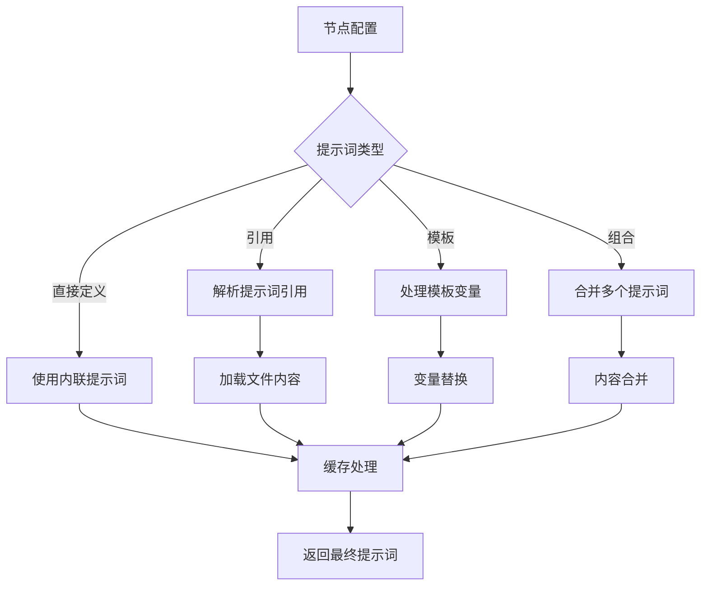

# 工作流提示词管理策略规划

## 概述

本文档规划了工作流系统中提示词管理的优化策略，旨在解决当前提示词主要与节点绑定导致的复用性差、管理分散等问题，同时保持节点级提示词的灵活性。

## 当前问题分析

### 1. 现状
- 提示词主要内联在节点配置中
- 相同功能节点重复定义相似提示词
- 缺乏统一的提示词版本管理
- 提示词变更需要修改多个工作流配置

### 2. 核心矛盾
- **灵活性需求**：节点需要专业化、上下文特定的提示词
- **复用性需求**：避免重复定义，统一管理提示词资源
- **管理效率**：集中化的提示词版本控制和更新

## 设计原则

1. **向后兼容**：不破坏现有节点配置
2. **渐进式改进**：分阶段实施，降低风险
3. **灵活性优先**：保持节点级提示词的定制能力
4. **缓存优化**：利用现有状态管理系统实现高效复用

## 解决方案架构

### 三层提示词管理架构

```
┌─────────────────┐
│   提示词定义层    │ ← 文件化提示词库 + 节点配置
├─────────────────┤
│   提示词缓存层    │ ← 状态缓存 + 线程缓存 + 会话缓存
├─────────────────┤
│   节点执行层      │ ← 增强的节点实现
└─────────────────┘
```

### 1. 提示词定义层

#### 文件化提示词库
```
configs/prompts/
├── system/
│   ├── coordinator.md
│   ├── researcher.md
│   └── analyst.md
├── templates/
│   ├── analysis_template.md
│   └── execution_template.md
└── variables/
    └── common_vars.yaml
```

#### 扩展配置格式
```yaml
# 支持多种提示词定义方式
nodes:
  coordinator:
    config:
      # 1. 直接定义（向后兼容）
      system_prompt: "直接的提示词内容"
      
      # 2. 引用文件化提示词
      system_prompt_ref: "system.coordinator"
      
      # 3. 模板化提示词
      system_prompt_template: "你是{role}，负责{task}"
      
      # 4. 组合式提示词
      system_prompt_parts:
        - "system.base"
        - "system.coordinator_specific"
      
      # 5. 缓存配置
      prompt_cache_scope: "session"  # state/thread/session
      prompt_cache_ttl: 3600
      
      # 6. 提示词变量
      prompt_variables:
        role: "协调员"
        team_size: 4
```

### 2. 提示词缓存层

#### 缓存管理器设计
```python
class PromptCacheManager:
    """提示词缓存管理器"""
    
    def __init__(self):
        self._state_cache = StateCacheAdapter("prompts")
        self._thread_cache = {}
        self._session_cache = {}
    
    async def get_cached_prompt(
        self, 
        prompt_ref: str,
        state: WorkflowState,
        cache_scope: str = "state"
    ) -> Optional[str]:
        """获取缓存的提示词"""
        
    async def cache_prompt(
        self,
        prompt_ref: str,
        content: str,
        state: WorkflowState,
        cache_scope: str = "state",
        ttl: int = 3600
    ):
        """缓存提示词"""
```

#### 缓存策略
- **状态级缓存**：当前工作流执行期间有效
- **线程级缓存**：当前线程/会话期间有效
- **会话级缓存**：跨工作流执行保持

### 3. 节点执行层

#### 增强现有llm节点实现
```python
class LLMNode(LLMNode):
    """增强的LLM节点，支持提示词缓存"""
    
    async def _prepare_messages_with_prompts(
        self, 
        state: WorkflowState, 
        config: Dict[str, Any]
    ) -> List[Any]:
        """准备消息，支持提示词缓存"""
        
        # 1. 生成缓存键
        cache_key = self._generate_prompt_cache_key(config)
        
        # 2. 尝试从缓存获取
        cached_messages = await self._get_cached_messages(state, cache_key)
        if cached_messages:
            return cached_messages
        
        # 3. 解析和处理提示词
        messages = await self._resolve_and_process_prompts(state, config)
        
        # 4. 缓存处理结果
        await self._cache_processed_messages(state, cache_key, messages)
        
        return messages
```

## 实施计划

### 阶段1：基础增强（1-2周）

#### 目标
- 增强现有WorkflowPromptService
- 添加基础缓存支持
- 扩展配置格式

#### 任务清单
- [ ] 实现PromptCacheManager
- [ ] 扩展WorkflowPromptService支持缓存
- [ ] 添加提示词引用解析功能
- [ ] 更新配置格式支持

#### 验收标准
- 现有节点配置向后兼容
- 基础缓存功能正常工作
- 提示词引用解析正确

### 阶段2：状态集成（2-3周）

#### 目标
- 集成状态管理系统
- 实现多级缓存
- 优化性能

#### 任务清单
- [ ] 集成WorkflowState缓存支持
- [ ] 实现线程级和会话级缓存
- [ ] 添加缓存统计和监控
- [ ] 性能优化和测试

#### 验收标准
- 多级缓存正常工作
- 性能指标达标
- 监控功能完善

### 阶段3：高级功能（3-4周）

#### 目标
- 完善提示词库
- 添加高级功能
- 文档和工具

#### 任务清单
- [ ] 建立完整提示词库
- [ ] 实现提示词版本管理
- [ ] 添加A/B测试支持
- [ ] 完善文档和开发工具

#### 验收标准
- 提示词库完整可用
- 版本管理功能正常
- 文档和工具完善

## 技术细节

### 1. 缓存键生成策略

```python
def _generate_cache_key(
    prompt_ref: str,
    variables: Dict[str, Any],
    context: Dict[str, Any]
) -> str:
    """生成提示词缓存键"""
    
    # 组合提示词引用、变量和上下文
    cache_data = {
        "ref": prompt_ref,
        "vars": sorted(variables.items()),
        "context_hash": hashlib.md5(
            str(sorted(context.items())).encode()
        ).hexdigest()[:8]
    }
    
    return hashlib.md5(
        str(cache_data).encode()
    ).hexdigest()
```

### 2. 提示词解析流程



### 3. 性能优化策略

#### 缓存预热
```python
async def preload_common_prompts(
    prompt_refs: List[str],
    cache_scope: str = "session"
):
    """预加载常用提示词"""
    
    for ref in prompt_refs:
        await self._prompt_cache.cache_prompt(
            ref, 
            await self._resolve_prompt_ref(ref),
            cache_scope=cache_scope
        )
```

#### 智能缓存失效
```python
async def invalidate_related_caches(
    prompt_ref: str,
    cache_scope: str = "all"
):
    """失效相关缓存"""
    
    if cache_scope == "all":
        await self._state_cache.clear()
        self._thread_cache.clear()
        self._session_cache.clear()
    else:
        # 针对性失效
        pass
```

## 风险评估

### 1. 技术风险
- **缓存一致性**：多级缓存可能导致数据不一致
- **性能影响**：缓存管理可能增加执行开销
- **内存使用**：缓存可能占用大量内存

#### 缓解措施
- 实现缓存版本控制
- 添加缓存大小限制和LRU淘汰
- 监控内存使用情况

### 2. 兼容性风险
- **配置变更**：新配置格式可能影响现有工作流
- **API变更**：服务接口变更可能影响现有代码

#### 缓解措施
- 保持向后兼容
- 提供迁移工具
- 充分的测试覆盖

### 3. 运维风险
- **缓存管理**：缓存可能需要运维干预
- **故障排查**：缓存问题可能难以排查

#### 缓解措施
- 提供缓存管理工具
- 添加详细的日志和监控
- 建立故障排查手册

## 成功指标

### 1. 性能指标
- 提示词加载时间减少50%
- 缓存命中率达到80%以上
- 内存使用增长控制在20%以内

### 2. 功能指标
- 100%向后兼容
- 支持所有现有提示词格式
- 新功能覆盖率90%以上

### 3. 质量指标
- 代码覆盖率95%以上
- 文档完整性100%
- 用户满意度90%以上

## 总结

本规划通过三层架构设计，在保持节点级提示词灵活性的同时，通过缓存机制实现了高效的提示词复用。渐进式的实施策略确保了系统的稳定性和可维护性，为工作流系统的提示词管理提供了可持续的解决方案。