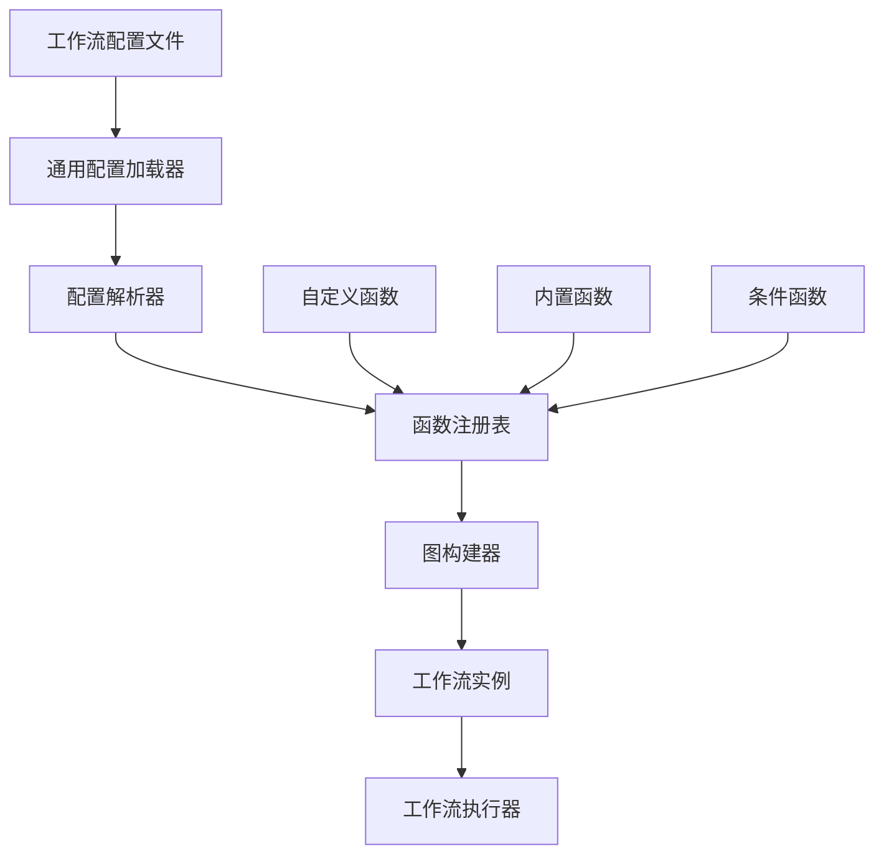

# 通用工作流配置加载器设计文档

## 问题分析

### 当前问题

从 [`examples/run_workflow_from_config.py`](examples/run_workflow_from_config.py:1) 可以看出当前工作流配置加载存在以下核心问题：

1. **硬编码的条件函数**：需要手动创建 [`CustomGraphBuilder`](examples/run_workflow_from_config.py:38) 子类来添加自定义条件函数
2. **状态初始化复杂**：需要手动创建复杂的初始状态字典（[第71-85行](examples/run_workflow_from_config.py:71-85)）
3. **缺乏通用性**：每个工作流都需要编写特定的运行代码
4. **配置解析不统一**：YAML配置和代码实现之间存在耦合
5. **函数发现机制缺失**：无法动态发现和注册节点函数和条件函数

### 现有架构分析

当前系统已经具备良好的基础架构：
- [`GraphBuilder`](src/infrastructure/graph/builder.py:156)：核心图构建器
- [`GraphConfig`](src/infrastructure/graph/config.py:155)：配置模型
- [`NodeRegistry`](src/infrastructure/graph/registry.py:96)：节点注册系统
- [`WorkflowManager`](src/application/workflow/manager.py:24)：工作流管理器
- [`WorkflowFactory`](src/application/workflow/factory.py:119)：工作流工厂

## 设计方案

### 架构概览



### 核心组件设计

#### 1. 通用配置加载器 (`UniversalWorkflowLoader`)

**位置**: `src/application/workflow/universal_loader.py`

**职责**：
- 统一加载和解析工作流配置
- 管理函数注册表
- 创建完整的工作流实例
- 提供简化的API接口

**接口设计**：
```python
class UniversalWorkflowLoader:
    def __init__(self, config_loader: Optional[IConfigLoader] = None):
        self.config_loader = config_loader
        self.function_registry = FunctionRegistry()
        self.graph_builder = GraphBuilder()
        
    def load_from_file(self, config_path: str) -> WorkflowInstance:
        """从文件加载工作流"""
        
    def load_from_dict(self, config_dict: Dict[str, Any]) -> WorkflowInstance:
        """从字典加载工作流"""
        
    def register_function(self, name: str, function: Callable, function_type: FunctionType) -> None:
        """注册函数（节点函数或条件函数）"""
        
    def get_registered_functions(self) -> Dict[str, List[str]]:
        """获取已注册的函数列表"""
```

#### 2. 函数注册表 (`FunctionRegistry`)

**位置**: `src/infrastructure/graph/function_registry.py`

**职责**：
- 统一管理节点函数和条件函数
- 支持内置函数和自定义函数
- 提供函数发现和解析机制

**接口设计**：
```python
class FunctionType(Enum):
    NODE_FUNCTION = "node_function"
    CONDITION_FUNCTION = "condition_function"

class FunctionRegistry:
    def __init__(self):
        self._node_functions: Dict[str, Callable] = {}
        self._condition_functions: Dict[str, Callable] = {}
        
    def register(self, name: str, function: Callable, function_type: FunctionType) -> None:
        """注册函数"""
        
    def get_node_function(self, name: str) -> Optional[Callable]:
        """获取节点函数"""
        
    def get_condition_function(self, name: str) -> Optional[Callable]:
        """获取条件函数"""
        
    def discover_functions(self, module_path: str) -> None:
        """自动发现并注册函数"""
```

#### 3. 增强的图构建器 (`EnhancedGraphBuilder`)

**位置**: `src/infrastructure/graph/enhanced_builder.py`

**职责**：
- 扩展现有的 [`GraphBuilder`](src/infrastructure/graph/builder.py:156)
- 集成函数注册表
- 支持动态函数解析

**主要改进**：
```python
class EnhancedGraphBuilder(GraphBuilder):
    def __init__(self, function_registry: FunctionRegistry, node_registry: Optional[NodeRegistry] = None):
        super().__init__(node_registry)
        self.function_registry = function_registry
        
    def _get_node_function(self, node_config: NodeConfig, state_manager: Optional[IStateCollaborationManager] = None) -> Optional[Callable]:
        """重写节点函数获取逻辑，优先使用函数注册表"""
        
    def _get_condition_function(self, condition_name: str) -> Optional[Callable]:
        """重写条件函数获取逻辑，优先使用函数注册表"""
```

#### 4. 工作流运行器 (`WorkflowRunner`)

**位置**: `src/application/workflow/runner.py`

**职责**：
- 提供简化的执行接口
- 自动状态初始化
- 错误处理和重试机制

**接口设计**：
```python
class WorkflowRunner:
    def __init__(self, loader: UniversalWorkflowLoader):
        self.loader = loader
        
    def run_workflow(self, config_path: str, initial_data: Dict[str, Any] = None) -> WorkflowState:
        """运行工作流"""
        
    def run_workflow_async(self, config_path: str, initial_data: Dict[str, Any] = None) -> Awaitable[WorkflowState]:
        """异步运行工作流"""
        
    def create_initial_state(self, config: GraphConfig, initial_data: Dict[str, Any] = None) -> WorkflowState:
        """根据配置自动创建初始状态"""
```

### 配置格式增强

#### 支持函数注册配置

```yaml
# 在配置文件中添加函数注册部分
function_registrations:
  nodes:
    plan_execute_agent_node: "src.workflow.nodes.plan_execute_agent_node"
    custom_analysis_node: "src.custom.nodes.analysis_node"
  conditions:
    plan_execute_router: "src.workflow.conditions.plan_execute_router"
    custom_condition: "src.custom.conditions.my_condition"
```

#### 支持状态模板

```yaml
# 在配置文件中定义状态模板
state_templates:
  plan_execute_state:
    workflow_messages: []
    workflow_tool_calls: []
    workflow_tool_results: []
    workflow_iteration_count: 0
    workflow_max_iterations: 10
    task_history: []
    workflow_errors: []
    context:
      current_plan: []
      current_step_index: 0
      plan_completed: false
    current_task: ""
```

### 文件创建和修改计划

#### 新文件创建

1. **`src/application/workflow/universal_loader.py`**
   - 通用工作流加载器主类
   - 整合配置解析和函数注册

2. **`src/infrastructure/graph/function_registry.py`**
   - 函数注册表实现
   - 支持节点函数和条件函数

3. **`src/infrastructure/graph/enhanced_builder.py`**
   - 增强的图构建器
   - 集成函数注册表

4. **`src/application/workflow/runner.py`**
   - 工作流运行器
   - 简化执行接口

5. **`src/application/workflow/state_templates.py`**
   - 状态模板管理
   - 自动状态初始化

#### 现有文件修改

1. **`src/infrastructure/graph/builder.py`**
   - 添加函数注册表支持
   - 改进函数发现机制

2. **`src/application/workflow/factory.py`**
   - 集成通用加载器
   - 支持状态模板

3. **`src/application/workflow/manager.py`**
   - 添加通用加载器支持
   - 简化工作流创建流程

4. **`examples/run_workflow_from_config.py`**
   - 重写为使用通用加载器
   - 简化代码结构

### 实现优先级

#### 第一阶段：核心功能
1. 实现 `FunctionRegistry` 和 `EnhancedGraphBuilder`
2. 创建 `UniversalWorkflowLoader` 基础版本
3. 修改现有构建器支持函数注册表

#### 第二阶段：增强功能
1. 实现 `WorkflowRunner` 简化接口
2. 添加状态模板支持
3. 实现配置验证和错误处理

#### 第三阶段：高级功能
1. 实现函数自动发现
2. 添加热重载支持
3. 完善监控和调试功能

### 预期效果

#### 改进前（当前代码）
```python
# examples/run_workflow_from_config.py
class CustomGraphBuilder(GraphBuilder):
    def _get_builtin_condition(self, condition_name: str):
        if condition_name == "plan_execute_router":
            return plan_execute_router
        return super()._get_builtin_condition(condition_name)

def run_workflow_from_config(config_path: str):
    builder = CustomGraphBuilder()
    graph = builder.build_from_yaml(config_path)
    
    # 手动创建复杂状态
    initial_state = {
        "workflow_messages": [],
        "workflow_tool_calls": [],
        # ... 更多字段
    }
    
    result = graph.invoke(initial_state)
```

#### 改进后（使用通用加载器）
```python
# examples/run_workflow_from_config.py
from src.application.workflow.universal_loader import UniversalWorkflowLoader

def run_workflow_from_config(config_path: str):
    loader = UniversalWorkflowLoader()
    
    # 自动注册函数（可选）
    loader.register_function("plan_execute_router", plan_execute_router, FunctionType.CONDITION_FUNCTION)
    
    # 一键加载和执行
    workflow = loader.load_from_file(config_path)
    result = workflow.run({"current_task": "分析用户行为数据"})
```

### 配置验证和错误处理

#### 配置验证规则
1. **函数存在性验证**：确保配置中引用的函数已注册
2. **状态模式验证**：验证状态字段类型和默认值
3. **图结构验证**：验证节点和边的连接关系
4. **依赖关系验证**：验证函数依赖的服务可用性

#### 错误处理策略
1. **配置加载错误**：提供详细的错误信息和修复建议
2. **函数解析错误**：支持函数自动发现和回退机制
3. **状态初始化错误**：提供状态模板和默认值
4. **执行时错误**：完善的异常处理和重试机制

### 性能考虑

1. **懒加载**：函数按需加载，减少启动时间
2. **缓存机制**：缓存已解析的配置和函数
3. **预编译**：预编译常用工作流配置
4. **内存优化**：合理管理函数注册表内存使用

### 向后兼容性

1. **现有API保持**：不破坏现有的 [`GraphBuilder`](src/infrastructure/graph/builder.py:156) 和 [`WorkflowManager`](src/application/workflow/manager.py:24) API
2. **渐进式迁移**：支持逐步迁移到新系统
3. **配置兼容**：保持现有YAML配置格式兼容
4. **函数注册兼容**：支持现有节点注册系统

这个设计方案将显著简化工作流配置的使用，提供更好的开发体验和更高的代码复用性。