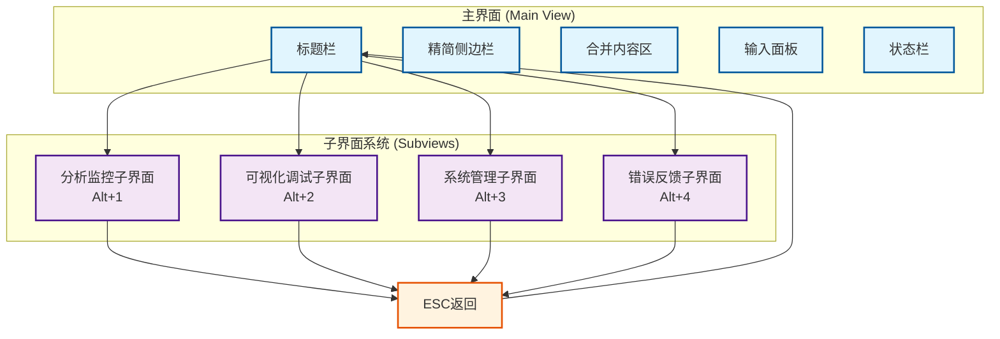
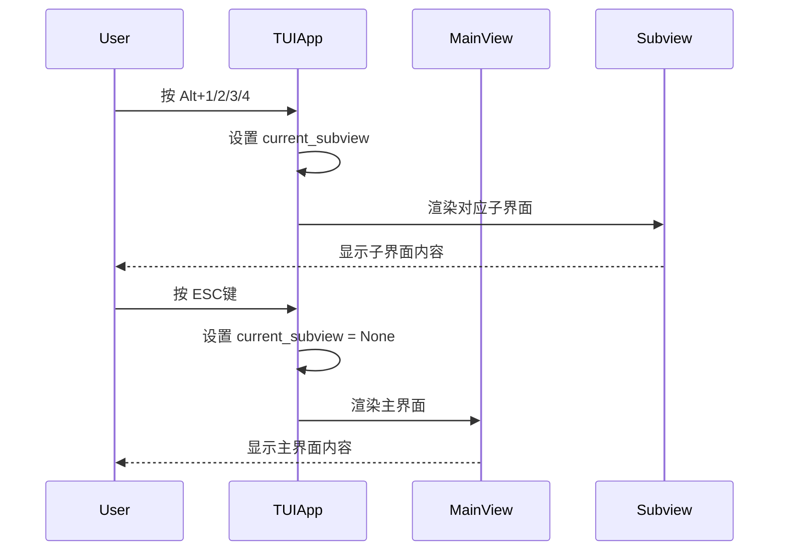

# TUI界面架构图

## 新的界面架构设计



## 组件详细说明

### 主界面组件
- **标题栏**: 显示应用名称和当前会话状态
- **精简侧边栏**: Agent基本信息 + 工作流状态 + 核心指标
- **合并内容区**: 会话历史和流式输出合并显示
- **输入面板**: 多行输入支持和命令处理
- **状态栏**: 显示快捷键提示和当前模式

### 子界面组件
- **分析监控子界面 (Alt+1)**: 性能分析、详细指标、执行历史
- **可视化调试子界面 (Alt+2)**: 工作流可视化、节点调试
- **系统管理子界面 (Alt+3)**: Studio管理、端口配置、配置重载
- **错误反馈子界面 (Alt+4)**: 错误信息查看和反馈

## 导航流程



## 界面布局变化

### 当前布局
```
+---------------------------------------+
|               标题栏                  |
+-------------------+-------------------+
|    侧边栏         |     主内容区       |
| (Agent信息)       | (会话历史)        |
| (工作流状态)       +-------------------+
| (指标统计)        |     流式输出       |
+-------------------+-------------------+
|     LangGraph面板  |     输入面板       |
+-------------------+-------------------+
```

### 优化后布局
```
+---------------------------------------+
|               标题栏                  |
+-------------------+-------------------+
|  精简侧边栏       |    合并内容区       |
| (基本信息)        | (会话+输出)        |
| (核心状态)        |                   |
| (关键指标)        |                   |
+-------------------+-------------------+
|               输入面板                |
+---------------------------------------+
|               状态栏                  |
+---------------------------------------+
```

## 快捷键映射表

| 快捷键 | 功能 | 说明 |
|--------|------|------|
| Alt+1 | 分析监控子界面 | 性能分析、指标统计、历史数据 |
| Alt+2 | 可视化调试子界面 | 工作流可视化、节点调试 |
| Alt+3 | 系统管理子界面 | Studio管理、端口配置 |
| Alt+4 | 错误反馈子界面 | 错误信息查看和反馈 |
| ESC | 返回主界面 | 从任何子界面返回 |

## 实施优先级

1. **高优先级**: 主界面精简 + 子界面导航框架
2. **中优先级**: 分析监控子界面实现
3. **中优先级**: 可视化调试子界面实现  
4. **低优先级**: 系统管理和错误反馈子界面

---

*架构图版本: V1.0*
*更新时间: 2025-10-21*