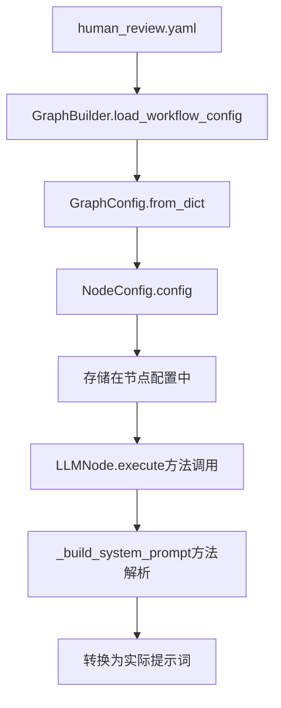
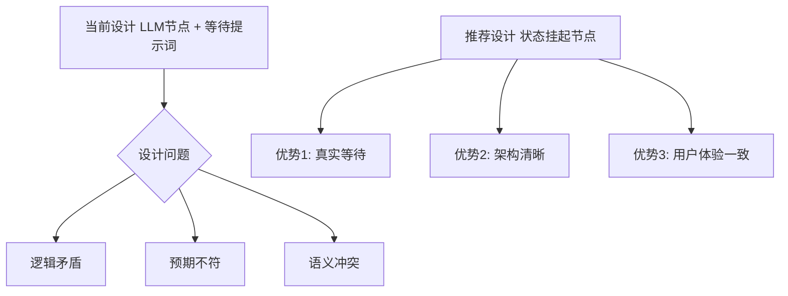

基于我对代码库的深入分析，我现在可以清楚地解释人工审核节点的系统提示词注入机制。

## 分析人工审核节点的系统提示词注入机制

### 1. 配置加载流程分析

从配置文件 `configs/workflows/human_review.yaml:56-68` 中的系统提示词是通过以下流程注入的：

**配置文件的加载流程：**
```
配置文件 (YAML) → GraphBuilder.load_workflow_config() → GraphConfig.from_dict() → WorkflowManager.load_workflow() → WorkflowFactory.create_workflow() → GraphBuilder.build_graph()
```

具体步骤：



### 2. 系统提示词注入的具体实现

**[`src/infrastructure/graph/nodes/llm_node.py:215-239`](src/infrastructure/graph/nodes/llm_node.py:215-239)** 中的 `[_build_system_prompt()`](src/infrastructure/graph/nodes/llm_node.py:215) 方法是关键：

```python
def _build_system_prompt(self, state: AgentState, config: Dict[str, Any]) -> str:
    """构建系统提示词"""
    # 获取基础提示词
    if "system_prompt" in config:
        base_prompt = config["system_prompt"]  # ← 这里从配置中获取提示词
    elif "system_prompt_template" in config:
        # 使用模板
        base_prompt = self._process_prompt_template(config["system_prompt_template"], state, config)
    else:
        base_prompt = self._get_default_system_prompt()
    
    # 添加工具结果（如果配置了）
    if config.get("include_tool_results", True) and state.tool_results:
        tool_results_text = self._format_tool_results(state.tool_results)
        base_prompt += f"\n\n工具执行结果：\n{tool_results_text}"
    
    return base_prompt
```

### 3. 配置文件的具体注入点

在 **[`configs/workflows/human_review.yaml:56-68`](configs/workflows/human_review.yaml:56)** 中的配置：

```yaml
human_review:
  type: llm_node
  config:
    llm_client: openai-gpt4
    system_prompt: |  # ← 系统提示词在这里定义
      这是一个人工审核节点。系统已经标记此步骤需要人工审核。
      
      请等待人工审核员提供反馈。审核员将：
      1. 审查当前的处理结果
      2. 提供批准或拒绝的决定
      3. 添加必要的评论和建议
      
      人工审核完成后，系统将根据审核结果继续执行。
```

### 4. 人工审核节点是否需要提示词的分析

**当前设计的合理性分析：**

**✅ 支持注入提示词的理由：**
1. **一致性设计**：所有LLM节点都遵循相同的配置模式
2. **可定制性**：允许针对人工审核场景优化提示词
3. **用户体验**：明确的提示词让LLM理解当前处于审核等待状态

**❌ 存在的问题：**
1. **逻辑矛盾**：提示词让LLM"等待人工审核"，但实际上LLM仍会生成响应
2. **语义冲突**：真正的"等待"应该暂停执行，而不是让LLM继续对话
3. **预期不符**：用户可能期望真正的暂停，而非LLM模拟等待

### 5. 架构设计建议



### 6. 推荐的重构方案

**方案一：保持现有设计但优化提示词**
```yaml
human_review:
  type: llm_node
  config:
    system_prompt: |
      【人工审核中】请保持当前回答状态，等待人工审核反馈。
```

**方案二：创建专用的等待节点**
```yaml
human_review_wait:
  type: wait_node
  config:
    timeout: 300
    message: "等待人工审核中..."
```

### 7. 结论

**当前系统的提示词注入机制是有效的，但人工审核节点的设计需要重新考虑。**

- **注入机制**：通过配置文件加载 → 解析 → LLM节点构建 → 执行时的完整链路
- **设计问题**：使用LLM节点处理人工审核在逻辑上存在问题
- **优化方向**：建议实现专门的等待/挂起节点，而非依赖LLM模拟等待