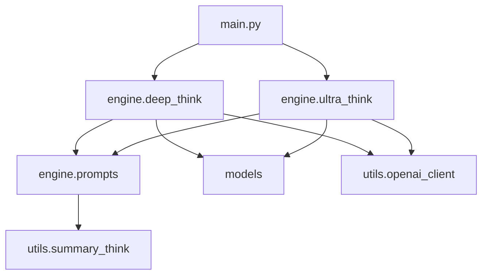

# DeepAPI Engine 架构设计文档

## 1. 整体架构概述

DeepAPI Engine 采用分层架构设计，包含三个核心层次：

```
┌─────────────────────────────────────────────┐
│             应用层 (Application)             │
├─────────────────────────────────────────────┤
│             引擎层 (Engine)                 │
├─────────────────────────────────────────────┤
│             基础层 (Foundation)             │
└─────────────────────────────────────────────┘
```

## 2. 模块依赖关系

### 2.1 模块依赖图



### 2.2 详细依赖说明

**Deep Think Engine 依赖：**
- `engine.prompts`: 提示词管理
- `models`: 数据模型定义
- `utils.openai_client`: OpenAI API 客户端

**Ultra Think Engine 依赖：**
- `engine.deep_think`: 基础引擎功能
- `engine.prompts`: 提示词管理
- `models`: 数据模型定义
- `utils.openai_client`: OpenAI API 客户端

## 3. 核心类设计

### 3.1 DeepThinkEngine 类设计

```python
class DeepThinkEngine:
    # 核心属性
    client: OpenAIClient              # API 客户端
    model: str                        # 基础模型
    problem_statement: MessageContent # 问题陈述
    conversation_history: List[Dict]  # 对话历史
    
    # 配置参数
    max_iterations: int               # 最大迭代次数
    required_verifications: int      # 所需验证次数
    max_errors: int                  # 最大错误次数
    
    # 功能开关
    enable_planning: bool            # 计划功能
    enable_parallel_check: bool      # 并行验证
    
    # 核心方法
    async def run() -> DeepThinkResult  # 主执行方法
    async def _initial_exploration()    # 初始探索
    async def _verify_solution()        # 验证解决方案
    async def _verify_solution_parallel() # 并行验证
```

### 3.2 UltraThinkEngine 类设计

```python
class UltraThinkEngine:
    # 继承自 DeepThinkEngine 的功能
    client: OpenAIClient
    model: str
    problem_statement: MessageContent
    
    # 特有属性
    num_agents: Optional[int]        # Agent 数量
    parallel_run_agent: int         # 并行 Agent 数
    on_agent_update: Callable        # Agent 更新回调
    
    # 核心方法
    async def run() -> UltraThinkResult     # 主执行方法
    async def _generate_plan()              # 生成分析计划
    async def _generate_agent_configs()    # 生成 Agent 配置
    async def _run_agent()                 # 运行单个 Agent
```

## 4. 数据流设计

### 4.1 Deep Think Engine 数据流

```
输入问题 → 计划阶段(可选) → 初始探索 → 验证 → [修正] → 最终摘要
                    ↓              ↓       ↓         ↓
                计划结果        思考结果  验证结果  最终结果
```

**详细流程：**
1. **输入处理**: 接收多模态问题陈述和对话历史
2. **计划生成** (可选): 生成思考计划并添加到上下文
3. **初始探索**: 
   - 第一次思考生成
   - 自我改进
   - 初始验证
4. **迭代循环**:
   - 验证当前解决方案
   - 如果失败: 修正解决方案
   - 如果通过: 增加通过计数
   - 达到阈值: 生成最终摘要

### 4.2 Ultra Think Engine 数据流

```
输入问题 → 计划生成 → Agent配置 → 并行Agent执行 → 结果综合 → 最终摘要
     ↓          ↓           ↓            ↓           ↓         ↓
  问题文本    分析计划    Agent配置    Agent结果   综合结果  用户响应
```

**详细流程：**
1. **计划生成**: 创建多角度分析计划
2. **Agent 配置**: 基于计划生成 Agent 特定指令
3. **并行执行**: 
   - 使用信号量控制并发
   - 每个 Agent 运行独立的 Deep Think 引擎
   - 实时状态监控
4. **结果综合**: 
   - 使用 Deep Think 引擎分析所有结果
   - 识别最佳见解
   - 解决矛盾
5. **最终处理**: 生成用户友好的摘要

## 5. 事件系统设计

### 5.1 ProgressEvent 结构

```python
@dataclass
class ProgressEvent:
    type: str                    # 事件类型
    data: Dict[str, Any]         # 事件数据
    timestamp: float = None     # 时间戳
```

### 5.2 事件类型定义

**通用事件:**
- `init`: 引擎初始化
- `progress`: 进度更新
- `success`: 成功完成
- `failure`: 失败事件

**Deep Think 特有事件:**
- `thinking`: 思考阶段
- `verification`: 验证阶段
- `correction`: 修正阶段
- `summarizing`: 摘要生成

**Ultra Think 特有事件:**
- `planning`: 计划生成
- `agent_update`: Agent 状态更新

### 5.3 事件处理流程

```
引擎执行 → 生成事件 → 回调函数处理 → 用户界面更新
                    ↓
                日志记录
```

## 6. 配置系统设计

### 6.1 模型阶段配置

```python
# 默认配置
DEFAULT_MODEL_STAGES = {
    "initial": "gpt-4",
    "improvement": "gpt-4", 
    "verification": "gpt-4",
    "correction": "gpt-4",
    "summary": "gpt-4",
    "planning": "gpt-4",
    "agent_config": "gpt-4",
    "agent_thinking": "gpt-4",
    "synthesis": "gpt-4"
}
```

### 6.2 性能参数配置

**Deep Think 参数:**
- `max_iterations`: 20-30 (平衡质量与性能)
- `required_verifications`: 3 (确保可靠性)
- `max_errors`: 10 (防止无限循环)

**Ultra Think 参数:**
- `parallel_run_agent`: 3 (平衡并发与资源)
- `num_agents`: None (使用所有生成的 Agent)

## 7. 错误处理设计

### 7.1 异常分类

**可恢复异常:**
- API 调用超时
- 网络连接问题
- 模型响应格式错误

**不可恢复异常:**
- 配置错误
- 内存不足
- 关键依赖缺失

### 7.2 重试机制

```python
async def with_retry(operation, max_retries=3, delay=1):
    """带重试的执行包装器"""
    for attempt in range(max_retries):
        try:
            return await operation()
        except TemporaryError as e:
            if attempt == max_retries - 1:
                raise
            await asyncio.sleep(delay * (2 ** attempt))
```

### 7.3 优雅降级

- 并行验证失败时回退到串行验证
- Agent 配置生成失败时使用默认配置
- 计划生成失败时跳过计划阶段

## 8. 性能优化设计

### 8.1 并发控制

**信号量机制:**
```python
semaphore = asyncio.Semaphore(parallel_run_agent)
async with semaphore:
    result = await operation()
```

**批量处理:**
- 并行验证时批量发送请求
- Agent 执行时批量处理结果

### 8.2 缓存策略

**对话历史缓存:**
- 缓存已处理的对话历史
- 避免重复处理相同内容

**验证结果缓存:**
- 缓存已验证的解决方案
- 减少重复验证开销

### 8.3 资源监控

- 内存使用监控
- API 调用频率限制
- 执行时间统计

## 9. 扩展性设计

### 9.1 插件架构

**引擎扩展接口:**
```python
class EnginePlugin:
    async def before_run(self, engine, problem):
        """运行前钩子"""
        
    async def after_run(self, engine, result):
        """运行后钩子"""
        
    async def on_progress(self, event):
        """进度事件处理"""
```

### 9.2 自定义提示词

**提示词模板系统:**
```python
class CustomPromptTemplate:
    def render(self, context: Dict) -> str:
        """渲染提示词模板"""
```

### 9.3 模型适配器

**多模型支持:**
```python
class ModelAdapter:
    async def generate_text(self, prompt: str) -> str:
        """生成文本"""
        
    async def generate_object(self, prompt: str, schema: Dict) -> Any:
        """生成结构化对象"""
```

## 10. 测试策略

### 10.1 单元测试

**引擎核心功能测试:**
- 验证逻辑测试
- 修正机制测试
- 事件系统测试

**集成测试:**
- 完整流程测试
- 错误处理测试
- 性能测试

### 10.2 模拟测试

**API 模拟:**
```python
class MockOpenAIClient:
    async def generate_text(self, **kwargs):
        return "模拟响应"
```

**进度事件模拟:**
```python
class MockProgressHandler:
    def __init__(self):
        self.events = []
        
    def __call__(self, event):
        self.events.append(event)
```

## 总结

DeepAPI Engine 架构设计注重模块化、可扩展性和性能优化。通过清晰的分层设计和事件驱动架构，实现了灵活且高效的推理引擎框架。